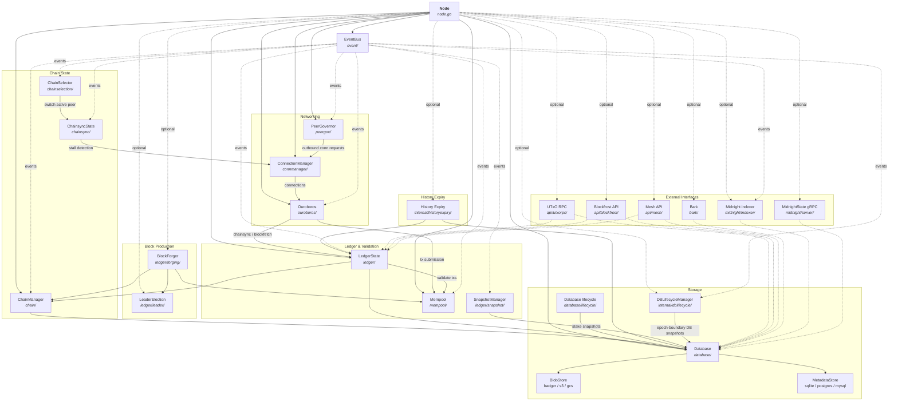
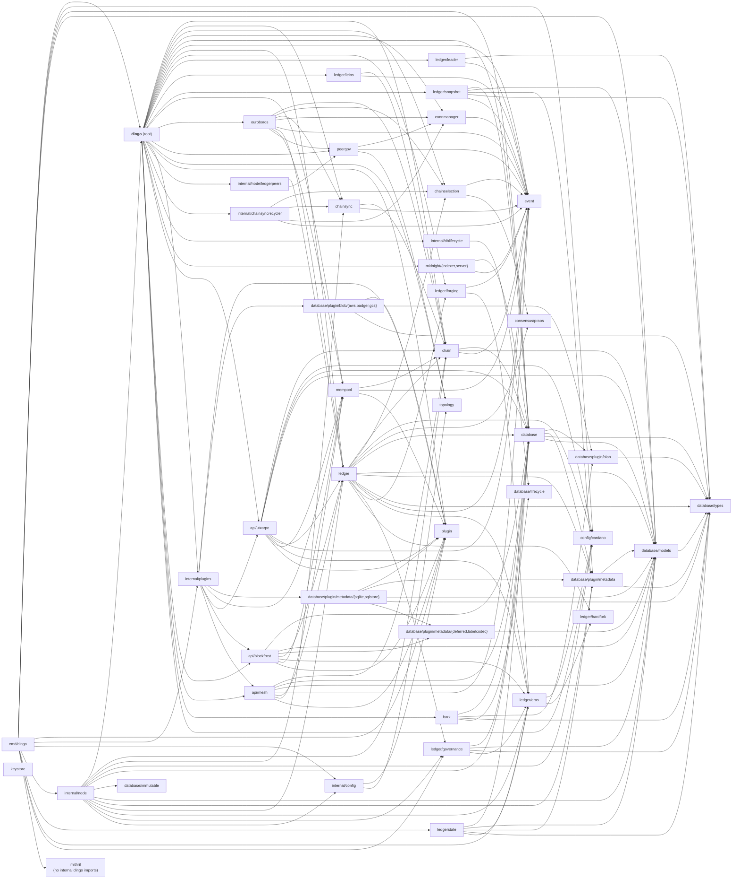
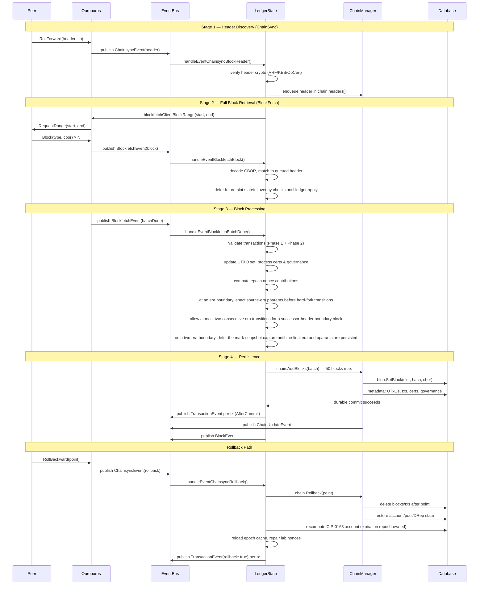
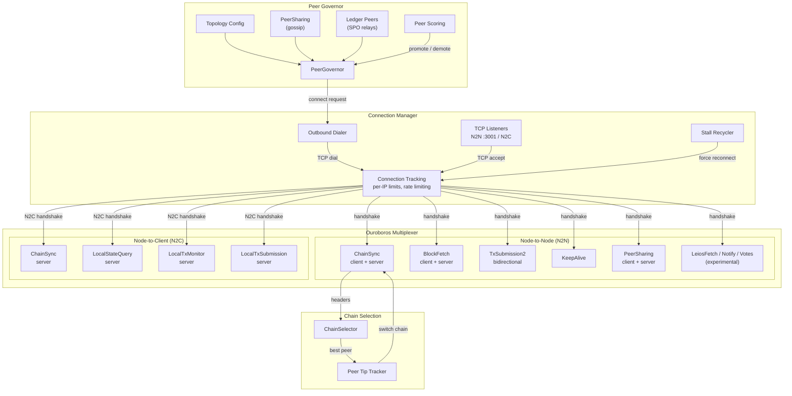
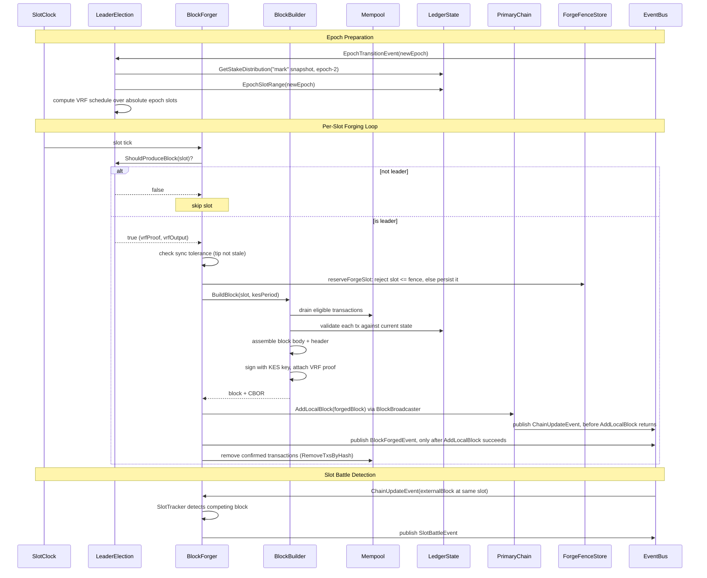

# Architecture

## In-process plugin host

Dingo composition owns one `plugin.Host`. Providers are registered explicitly;
domain packages do not self-register during package initialization. The host
erases types only at its registry boundary while typed factories retain their
provider configuration, service, and dependency bundles.

Startup resolves storage, constructs database and ledger, resolves mempool,
then resolves the enabled API capabilities. Each API provider (Blockfrost,
Mesh, UTxO RPC) is resolved only in API storage mode and only when its
configured port is nonzero, so core-mode nodes and disabled ports resolve
none of them. Failures unwind providers in reverse order. Normal shutdown
orders APIs, mempool, ledger/database, then storage.
Database receives provider-owned stores through `database.Stores`.
Storage lifecycle contexts cross the provider boundary. In particular, Badger
stops scheduling value-log GC before close and prevents a successful rewrite
from chaining another pass. Because Badger cannot cancel a rewrite already in
flight, an expired stop context bounds the host's wait while the one-time close
continues after that rewrite drains; direct close calls join the same cleanup.
Live restore and truncate classify that deadline as an unconfirmed storage
drain and request a supervised restart; they never resolve a replacement store
against the same data directory while the prior close may still own it.
`LedgerState.Close` retains the first close result until all later callers have
observed it, so the normal shutdown triggered by that cancellation cannot
mistake an earlier unconfirmed drain for a successful second close and close
the database underneath the outstanding worker.
API providers are resolved for lifecycle only because node composition has no
in-process consumer of their concrete server values. Each API provider's
TLS/authentication policy goes through a merged-config handoff, not a
pre-resolved one: node composition merges the shared `api.tls`/`api.auth`
default into that provider's own `config.tls`/`config.auth` fields, field by
field, before the provider ever decodes its config (see "API security" under
External Interfaces) — so from a provider's point of view an inherited
field and an inline one are indistinguishable — but the merged result is
still the raw, tri-state `TLSPolicy`/`AuthPolicy` shape. Each provider's own
`RegisterProvider` factory decodes that merged config and calls
`Resolve` itself during construction, producing the concrete
`EffectiveTLS`/`EffectiveAuth` its listener acts on. `Node.New` separately
runs the same merge-and-resolve as an early validation pass against every
configured API capability, so an invalid effective policy is rejected at
construction time rather than deferred to listener startup — but that pass
exists for fail-fast validation, not to hand a provider an already-resolved
policy in place of provider-side resolution.

Command and bootstrap composition that opens a standalone database uses
`internal/plugins.OpenDatabase`. Its return contract keeps ownership
unambiguous: a non-nil error never accompanies a live runtime, while a
recoverable commit-timestamp mismatch is available from
`DatabaseRuntime.RecoveryError()` on the successfully returned runtime. The
caller must close every returned runtime, and `DatabaseRuntime.Close` preserves
database-before-provider shutdown order.

Composition injects the application `databasePath` into both storage provider
dependency bundles, preserving `CARDANO_DATABASE_PATH` and `--data-dir` as a
shortcut for both stores. Local providers can independently override that
fallback through their typed `dataDir` configuration.

### Shared metadata SQL store

The shared `database/plugin/metadata/sqlstore` package is the composition
boundary for relational metadata. It owns
`database/sql` pools, store-owned transactions, savepoints, readiness, and
business orchestration. A small dialect capability handles placeholder
rebinding, identifier quoting, parameter limits, read-only isolation, bulk
session tuning, and planner statistics. Generated query packages remain
internal so generated row types cannot leak into ledger or API packages.

The SQLite provider is a thin factory around the pure-Go driver. It configures
one WAL writer, a separate read pool, pragmas, disk-size accounting, migration
locking, query tracing, and daily `VACUUM`. The tagged PostgreSQL/MySQL
factories configure their direct drivers, pools, advisory migration locks, and
repeatable-read snapshots. All three return `*sqlstore.Store`; metadata
business behavior is implemented once in `sqlstore` and dialect translation is
limited to SQL mechanics.

The public compatibility interface is decomposing into narrow capabilities so
components need not inherit the full historical metadata surface. Three are
cross-cutting -- `LifecycleStore`, `SettingsStore`, and `TxnStore` (which
creates the `database/types.Txn` handles), plus `SlotRangeStore` for the API
adapters. Six are storage domains: `CertificateStore`, `EpochStore`,
`GovernanceStore`, `StakeSnapshotStore`, `TransactionStore` (chain
transactions, not to be confused with `TxnStore`), and `UtxoStore`.

Each domain is drawn to match an implementation file in `sqlstore` rather
than to a judgement call, so the boundary is checkable: `UtxoStore` is
`utxo.go`, `TransactionStore` is `transaction_read.go` plus
`transaction_write.go`, and so on. `EpochStore` is the exception and is
defined by its table, because `operational.go` holds tip, nonces, datums,
scripts, protocol parameters, network state, and sync state alongside the
epoch methods.

`Database` exposes one unexported accessor per domain (`utxoStore()`,
`governanceStore()`, ...) and its facade methods go through the accessor for
the domain they touch, so the compiler holds each method inside its domain
and a method that genuinely spans two domains says so at the call site.
`d.metadata` remains for the domains not yet extracted (accounts, pools,
rewards, protocol parameters, block nonces, assets, Midnight, sync state).
Treasury and reserves stay there too -- they are ledger economics read by
reward calculation, not governance state. Concrete SQL handles are not exposed; repository tests use internal
fixtures when schema seeding or assertions require raw SQL.

Startup reserves the write connection, acquires the backend migration lock,
rejects unversioned metadata tables (users must delete the data directory,
including metadata and blob stores, and resync), and validates/resumes versioned expand/backfill/contract work before
advertising readiness. The current registry has migrations 1 through 10:
`v1alpha1`, `leios-key-registration`, `token-registry-metadata`,
`account-import-baseline`, `leios-snapshot-keys`,
`governance-ratification-history`, `account-import-deposit`,
`committee-credential-tags`, `committee-term-start-presence`, and
`reward-seed-failure`. `DATABASE.md` is the source of truth for their schema
changes and upgrade behavior. It then checks the read pool. File-backed
SQLite uses a
cross-process lock file; isolated in-memory databases use a process lock. A
failed or interrupted phase leaves readiness false and carries the migration
version and phase in the returned error. Backfill data and its opaque cursor
checkpoint commit atomically in one transaction. Shutdown serializes with
startup and passes its lifecycle context through maintenance cancellation;
bulk-load tuning is scoped to a dedicated write connection and restored before
the connection is released.

**Context propagation and cancellation**: `TxnStore.Transaction(ctx)`/
`ReadTransaction(ctx)` are `sqlstore`'s propagation boundary. The `ctx` passed
there governs the whole transaction, not just the `BeginTx` call: `sqlTxn`
stores it alongside its `*sql.Tx`, and `dbFromTxn`/`readDBFromTxn` hand it
back next to the transaction's `queryer` so every statement a domain method
(`CreateAccount(txn, ...)` and the like) issues through that `txn` is bound to
it -- without adding a `ctx` parameter to any of those ~40 domain methods,
which instead pick the caller's `ctx` up locally from the `txn` they already
take. Canceling or timing out that `ctx` while `BeginTx` is blocked waiting
for a pooled connection aborts the wait rather than stalling for whoever
holds the connection; canceling it mid-transaction triggers `database/sql`'s
documented auto-rollback of the underlying `*sql.Tx`, which is asynchronous
to the `cancel()` call and (for `database/sql`'s pooling) discards rather
than idles the aborted connection. `cancellation_test.go` covers both.

Two gaps in that propagation are deliberate:
- The nil-`txn` "autocommit" path (`dbFromTxn(nil)`/`readDBFromTxn(nil)`, used
  when a domain method is called with no open transaction) still issues its
  one-off statement against `context.Background()`: there is no caller
  transaction to carry a `ctx` on. Exposure there is bounded server-side
  instead, by the PostgreSQL/MySQL providers' statement/lock timeout
  configuration (`StatementTimeout`/`LockTimeout` in
  `database/plugin/metadata/{postgres,mysql}/provider.go`).
- A handful of methods that take no `txn` parameter at all -- the
  `SettingsStore` family, `HasDeferredIndexesPending`,
  `FindUnspentMidnightAssetCreates`/`FindUnspentMidnightRegistrations` --
  remain on `context.Background()`. Giving them a `ctx` means changing their
  exported signatures and every external caller (`node.go`,
  `internal/settingsresolve`, `database/commit_timestamp.go`,
  `database/lifecycle/snapshot.go`, `bark/blob.go`,
  `midnight/indexer/indexer.go`), which reaches outside `sqlstore`'s own
  package boundary.

`database/txn.go`'s `NewTxn`/`NewMetadataOnlyTxn` are, today, where that
propagation stops short of `database.Database`'s own callers: both still pass
`context.Background()` into `Transaction`/`ReadTransaction` rather than a
caller-supplied `ctx`, so a `ctx` cancellation reaching `database.Database`'s
facade methods does not yet cancel the metadata-store transaction underneath
them. Threading a `ctx` through `database.Database`'s own public API and its
~100 call sites is tracked separately (issue #3377); `golangci-lint`'s
`contextcheck` is disabled repo-wide until then, since it reports at each of
those callers, not at this boundary itself.

Dingo is a high-performance Cardano blockchain node implementation in Go. This document describes its architecture, core components, and design patterns.

## Table of Contents

- [Overview](#overview)
- [Architecture Diagrams](#architecture-diagrams)
  - [Component Interactions](#component-interactions)
  - [Package Dependency Tree](#package-dependency-tree)
  - [Data Flow](#data-flow)
  - [Peer-to-Peer Networking](#peer-to-peer-networking)
  - [Block Forging](#block-forging)
- [Directory Structure](#directory-structure)
- [Core Node Structure](#core-node-structure)
- [Event-Driven Communication](#event-driven-communication)
- [Storage Architecture](#storage-architecture)
- [Blockchain State Management](#blockchain-state-management)
- [Chain Management](#chain-management)
- [Network and Protocol Handling](#network-and-protocol-handling)
- [Peer Governance](#peer-governance)
- [Transaction Mempool](#transaction-mempool)
- [Block Production](#block-production)
- [Mithril Bootstrap](#mithril-bootstrap)
- [External Interfaces](#external-interfaces)
- [Architectural Boundaries](#architectural-boundaries)
- [Design Patterns](#design-patterns)
- [Threading and Concurrency](#threading-and-concurrency)
- [Configuration](#configuration)
  - [Musashi prototype profile boundary](#musashi-prototype-profile-boundary)
- [Stake Snapshots](#stake-snapshots)

## Overview

Dingo's architecture is built on several key principles:

1. Modular component design using dependency injection and composition
2. Event-driven async notifications via EventBus, with synchronous queries
   passed through explicit constructor-injected dependencies or narrow
   interfaces
3. Pluggable storage backends with a dual-layer database architecture (blob + metadata)
4. Full Ouroboros protocol support for Node-to-Node and Node-to-Client
5. Multi-peer chain synchronization with Ouroboros Praos chain selection
6. Block production with VRF leader election and stake snapshots
7. Graceful shutdown with phased resource cleanup

The root `dingo` package, `cmd/dingo`, and `internal/node` are the composition
layers. Domain packages should not reach upward into node startup, CLI, or
operator policy; when cross-component behavior is required, the node should
wire it through a narrow interface, callback, or EventBus subscription.

## Architecture Diagrams

### Component Interactions

How the Node orchestrator wires components together. Solid arrows are direct method calls; dashed arrows are asynchronous EventBus messages.



### Package Dependency Tree

Selected internal import relationships between production Dingo packages.
External dependencies and tests are omitted; the source tree remains the
authoritative import graph.



### Data Flow

How blocks flow from the network through validation and into storage.



`ledger.tx` is published with `PublishOrdered`, not `PublishAsync`, so a
subscriber deriving state from it sees a block's transactions in index order
and sees a rollback's undo events (`Rollback: true`) before any transaction
event the ledger emits afterwards.

Two producers feed that lane, on different goroutines: `LedgerDelta.apply`
(`ledger/delta.go`) registers forward events on the database transaction's
`AfterCommit` drain from the `ledgerProcessBlocks` goroutine, and the rollback
path publishes undo events from whichever goroutine performs the rollback.
`AfterCommit` runs callbacks in registration order only after durable commit;
an apply error, rollback, or failed commit discards them. The database commit
becomes visible before its `AfterCommit` callbacks finish, so the two producer
goroutines share `transactionEventMutex`: `submitBlockApplyDBTxn` holds it from
the stale-tip recheck through commit and Apply enqueue, while primary-chain
rollback paths hold it across rollback validation, Undo enqueue, and chain
truncation. If Apply wins, its events reach the ordered lane before an Undo can
be read from the committed state. If rollback wins, truncation and the ledger
rewind make the waiting block batch stale, and the tip recheck rejects it
instead of publishing Apply after Undo.

`LedgerState.rollback` will not accept a target that shares the applied tip's
slot with a different hash. The UTxO and transaction predicates in
`database.TruncateAfterSlot` are slot-only (`added_slot > slot`,
`deleted_slot > slot`), unlike the block-nonce delete beside them, so such a
target truncates nothing at the contested slot: the abandoned same-slot block's
outputs stay live and the UTxOs it consumed stay soft-deleted with no row left
to restore them, while the tip is reported as repaired. The next block that
spends one of those inputs cannot resolve it, which Conway reports as bad
inputs and, because value conservation sums consumed over only the inputs that
resolved, as value not conserved in the same pass. `rollback` therefore
redirects to the newest applied primary-chain ancestor strictly below the
contested slot, so the existing predicates truncate that slot whole and the
block at the target is re-applied; when no such ancestor exists it fails with
`ErrNoAppliedAncestorBelowContestedSlot` rather than reporting the repair
(issue #3678). `enforceDurableTipFloor` is the path that produces such a
target.

Getting this wrong is subtle, so the constraint is worth stating plainly:
**the undo events must be emitted before the truncation, by the rollback
path.** `handleEventChainUpdate` deliberately does *not* emit them, even
though it receives `ChainRollbackEvent` with the rolled-back blocks. It is a
`SubscribeFunc` dispatch reached only after `chain.Rollback` has published and
returned, by which point the apply goroutine is already free to publish
forward events — emitting there loses the race reproducibly. It still emits
the `ledger.block` undo events, which are a different event type and so a
different lane. Before #2287 the undo events were emitted from a `go`
statement onto the reordering shared pool, which lost the same race twice
over.

The forward path keeps async semantics deliberately: its after-commit callback
only enqueues onto the ordered lane, so subscribers cannot observe an Apply
before storage is durable and their work never runs inline in `Commit`.
`ledger.block` remains `PublishBlocking` on the handler's own goroutine.

An ordinary stalled subscriber detaches after its delivery timeout; a lossless
subscriber deliberately remains attached until it drains or is stopped, closed,
or unsubscribed. A live restore/truncate closes the `LedgerState` while keeping
the bus running, so ledger publishes go through `PublishOrderedContext` with a
context `LedgerState.Close` cancels first thing. That cancellation releases a
full ordered lane regardless of whether a subscriber later drains or its
lifecycle removes it.

This is also the one deliberate exception to the publish-under-lock rule
above. `rollbackChainAndStateDeferred` runs under `chainsyncMutex` — it is reached
through the `pendingPublishes` call chain — and emits undo events from there,
because the ordering requires them to be enqueued before the truncation and
the truncation happens under that same lock; deferring them to
`pendingPublishes`' post-unlock flush would put them after it and lose the
guarantee. What makes it safe is narrower than the general rule: the emit only
*enqueues* onto a 10000-entry lane and never runs a subscriber callback
inline, so it can block only if a `ledger.tx` subscriber stops draining long
enough to fill the lane. **A `ledger.tx` subscriber must therefore not call
back into `LedgerState` methods that take `chainsyncMutex`** (in practice
`RecoverAfterLocalRollback` and anything reaching it). Subscribers that need
to do real work should hand off to their own goroutine, which
`event/doc.go` already requires of every subscriber callback.

The BlockFetch server path mirrors the retrieval flow for downstream peers:
when a peer requests a range, `ouroboros/blockfetch.go` validates the bounds,
opens a chain iterator at the requested start point, sends `StartBatch`, then
streams `Block` messages until the requested end or local tip before
`BatchDone`. The range sender is asynchronous so the mini-protocol callback can
return promptly, but it applies backpressure between messages by waiting for
the underlying gouroboros protocol send queue to drain. This keeps large Leios
catch-up ranges from filling the mux pending-message queue and turning a slow
consumer into a connection-level protocol violation.

On the client path, BlockFetch events carry fully decoded blocks. The ledger
subscriber therefore buffers one eight-block chain-store commit batch; when it
fills, lossless EventBus delivery backpressures the protocol receive loop
instead of retaining the rest of a large decoded range. The subsequent chain
reader likewise decodes at most one 50-block metadata transaction batch at a
time. These bounds matter for Dijkstra bodies, whose nested canonical-CBOR
views make a live decoded block substantially larger than its wire bytes.

Opening that iterator is also what decides whether the range is servable at
all, so `chain`'s forward and reverse iterator constructors require the start
point to be a block the chain still holds at that block index, not merely one
that resolves by point. The distinction matters because a rolled-back block
stays resolvable: `ChainManager.removeBlockByIndex` deletes the block row but
retains the block in the manager's LRU cache so non-primary chains can
reconcile against it, and `blockByPoint` answers from that cache. Without the
index check the server opened an iterator positioned outside its own chain,
promised a batch with `StartBatch`, found nothing to stream, and closed it with
`BatchDone` — a response the requesting peer cannot distinguish from a served
range, so it re-requested the same range indefinitely instead of failing over.
Rejecting the point instead makes the request take the existing
start-point-not-found branch: the server answers `NoBlocks` (which surfaces on
the client as a `GetBlockRange` error, driving peer failover) and repeated
NoBlocks for the same point closes the stuck peer. This condition is normal
during a tip slot battle, where two nodes each roll back their own block in
favor of the other's and are then asked for a body neither still has.
For an in-memory ephemeral fork, the common-prefix portion of that index
check and iterator lookup is resolved against the primary chain's active
in-memory points and cache; the fork's divergent tail is resolved from its own
in-memory points. If the primary has since rolled the common point back, it is
not considered held even though the retained cache can still resolve it by
point. Rolling an ephemeral fork back draws the same boundary: a block at or
below the fork point is a common-prefix block with no entry in the fork's own
buffer, so the rollback deletes nothing there, and once the rollback point
lands below the fork point the fork re-anchors its common prefix to that point
rather than leaving it above the new tip.

### Peer-to-Peer Networking

Connection lifecycle, protocol multiplexing, and peer governance.

The connection manager wraps TCP bearers with an idle-aware write deadline at
both accept and dial boundaries, for NtC and N2N alike. Each write refreshes the
two-minute deadline just before the syscall, so a peer that stops reading cannot
hold a protocol goroutine in `Write` forever while healthy long-lived Ouroboros
sessions are unaffected. Accepted connections perform their potentially blocking
handshake in a tracked per-connection goroutine, so a silent peer cannot serialize
the listener's accept loop. During that unauthenticated window, a generic
connection wrapper caps the muxer's per-segment read deadline at the listener's
10-second handshake deadline. The wrapper clears the absolute deadline after
negotiation, returning read-deadline ownership to the muxer for the normal
long-lived session. Helpers needing the concrete socket type (SO_LINGER, Unix
peer credentials) unwrap through the wrapper, so wrapping an accepted connection
never silently disables them. Cancellation closes an in-flight bearer, and failed
setup releases its reserved inbound and per-IP slots.



### Block Forging

The block production pipeline from leader election through broadcast.

Two invariants keep the forger from advertising or repeating a block it has
not durably adopted:

- **Publish after acceptance.** `BlockForgedEvent` and the Leios
  announcement enqueued alongside it (`node_forging.go`) run only after
  `AddBlock` accepts the block. A rejected block is never advertised, so
  peers cannot fetch a block this node does not have. Build-versus-adopt
  stays observable through the `Forge_forged_int` and
  `Forge_could_not_forge_int` counters. `Forge_could_not_forge_int` also
  counts leader slots declined because a rival block already occupies the
  slot, so it no longer means "local build or sign failure" alone. Its
  rate only *partially* overlaps `dingo_metrics_slotBattlesTotal_int`,
  which `ledger/chainsync.go` raises for battles detected outside the
  forge path as well, so the two are not a clean decomposition of one
  another: inspect `dingo_metrics_slotBattlesTotal_int` alongside when
  alerting rather than subtracting it exactly.
- **Duplicate-slot fence.** The chain-tip check (`currentSlot < tipSlot`)
  cannot see a slot whose block was signed and diffused but never adopted,
  and it forgets slots entirely when the tip rolls back or the process
  restarts. `ForgeFenceStore` (`ledger/forging/store.go`, persisted in
  `sync_state` under `forge_fence:<poolid>`) records the highest slot the
  node committed to *before* the header for that slot is signed, and the
  forger refuses any slot at or below it. Refusing a slot the node did not
  actually use costs one block; signing a second, different block for a
  slot whose first block may already have reached peers is equivocation.
  A fence that cannot be read fails forger construction, and one that
  cannot be written fails the forge, rather than signing unprotected.
  The `dingo_metrics_forgeFenceBlocked_int` counter is zero in normal
  operation: any increment points at a slot-clock regression or a
  rolled-back database. The fence lives in `sync_state`, so a Mithril
  import that ends in a full `ClearSyncState` drops it; a producer
  bootstrapped from a snapshot has only the chain-tip check until it
  next forges (issue #3736).



## Directory Structure

```
dingo/
├── cmd/dingo/           # CLI entry points
│   ├── main.go          # Cobra CLI setup, plugin management
│   ├── serve.go         # Node server command
│   ├── load.go          # Block loading from ImmutableDB/Mithril
│   ├── mithril.go       # Mithril bootstrap subcommand
│   └── version.go       # Version information
├── chain/               # Blockchain state and validation
│   ├── chain.go         # Chain struct, block management
│   ├── manager.go       # ChainManager, fork handling
│   ├── event.go         # Chain events (update, fork)
│   ├── iter.go          # ChainIterator for sequential block access
│   └── errors.go        # Chain-specific errors
├── chainselection/      # Multi-peer chain comparison
│   ├── selector.go      # ChainSelector struct
│   ├── comparison.go    # Ouroboros Praos chain selection rules
│   ├── event.go         # Selection events
│   ├── peer_tip.go      # Peer tip tracking
│   └── vrf.go           # VRF verification
├── consensus/praos/     # Praos comparison, snapshots, and ledger views
├── chainsync/           # Block synchronization protocol state
│   ├── chainsync.go     # Multi-client sync state, stall detection
│   └── strategy.go      # Configurable multi-active header-sync strategy
├── connmanager/         # Network connection lifecycle
│   ├── connection_manager.go
│   └── event.go         # Connection events
├── database/            # Storage abstraction layer
│   ├── database.go      # Database struct, dual-layer design
│   ├── cbor_cache.go    # TieredCborCache implementation
│   ├── cbor_offset.go   # Offset-based CBOR references
│   ├── hot_cache.go     # Hot cache for frequently accessed data
│   ├── block_lru_cache.go # Block-level LRU cache
│   ├── immutable/       # ImmutableDB chunk reader
│   ├── lifecycle/       # Snapshot, restore, and truncation library
│   ├── models/          # Database models
│   ├── types/           # Database types
│   ├── sops/            # Storage operations
│   └── plugin/          # Storage domain contracts and implementations
│       ├── blob/        # Blob contract and providers
│       │   ├── badger/  # Badger (default local storage)
│       │   ├── aws/     # AWS S3
│       │   └── gcs/     # Google Cloud Storage
│       └── metadata/    # Metadata contract and providers
│           ├── sqlite/  # SQLite (default)
│           ├── sqlstore/# Shared database/sql behavior and migrations
│           ├── postgres/# PostgreSQL adapter (tag-gated)
│           └── mysql/   # MySQL adapter (tag-gated)
├── plugin/              # Generic instance-owned provider host
├── internal/plugins/    # Explicit compiled-in provider composition
├── event/               # Event bus for decoupled communication
│   ├── event.go         # EventBus, async delivery
│   ├── epoch.go         # Epoch transition events
│   └── metrics.go       # Event metrics
├── ledger/              # Ledger state, validation, block production
│   ├── state.go         # LedgerState, UTXO tracking
│   ├── view.go          # Ledger view queries
│   ├── queries.go       # State queries
│   ├── validation.go    # Transaction validation (Phase 1 UTXO rules)
│   ├── verify_header.go # Block header validation (VRF/KES/OpCert)
│   ├── chainsync.go     # Epoch nonce calculation, rollback handling
│   ├── candidate_nonce.go # Candidate nonce computation
│   ├── certs.go         # Certificate processing
│   ├── governance.go    # Governance action processing
│   ├── delta.go         # State delta tracking
│   ├── block_event.go   # Block event processing
│   ├── slot_clock.go    # Wall-clock slot timing
│   ├── metrics.go       # Ledger metrics
│   ├── peer_provider.go # Ledger-based peer discovery
│   ├── era_summary.go   # Era transition handling
│   ├── eras/            # Era-specific validation rules
│   │   ├── byron.go     # Byron era
│   │   ├── shelley.go   # Shelley era
│   │   ├── allegra.go   # Allegra era
│   │   ├── mary.go      # Mary era
│   │   ├── alonzo.go    # Alonzo era
│   │   ├── babbage.go   # Babbage era
│   │   └── conway.go    # Conway era
│   ├── forging/         # Block production
│   │   ├── forger.go    # BlockForger, slot-based forging loop
│   │   ├── builder.go   # DefaultBlockBuilder, block assembly
│   │   ├── keys.go      # PoolCredentials (VRF/KES/OpCert)
│   │   ├── slot_tracker.go # Slot battle detection
│   │   ├── store.go     # Persisted last-forged-slot fence
│   │   ├── events.go    # Forging events
│   │   └── metrics.go   # Forging metrics
│   ├── leader/          # Leader election
│   │   ├── election.go  # Ouroboros Praos leader checks
│   │   └── schedule.go  # Epoch leader schedule computation
│   ├── leios/           # CIP-0164 Leios voting + pipeline (experimental)
│   │   ├── committee.go # Stake-truncated committee selection
│   │   ├── quorum.go    # Stake-quorum predicate
│   │   ├── bls.go       # BLS12-381 MinSig sign/verify/aggregate
│   │   ├── keys.go      # Vote signing key + voter pubkey registry
│   │   ├── certificate.go # EB certificate build/validate
│   │   ├── manager.go   # VoteManager: store, tally, serve, emit
│   │   └── pipeline.go  # PipelineManager: stage/timing, EB equivocation, inclusion eligibility
│   └── snapshot/        # Stake snapshot management
│       ├── manager.go   # Snapshot manager, event-driven capture
│       ├── calculator.go# Stake distribution calculation
│       └── rotation.go  # Mark/Set/Go rotation
├── ledgerstate/         # Low-level ledger state import
│   ├── cbor_decode.go   # CBOR decoding for large structures
│   ├── mempack.go       # Memory-packed state representation
│   ├── snapshot.go      # Snapshot parsing
│   ├── import.go        # Ledger state import
│   ├── utxo.go          # UTXO state handling
│   └── certstate.go     # Certificate state handling
├── mempool/             # Transaction pool
│   ├── backend.go       # FIFO/DAG backend contract and constructors
│   ├── dag.go           # Dependency graph and topological ordering
│   ├── mempool.go       # Shared validation, lifecycle, capacity, providers
│   └── consumer.go      # Per-consumer transaction tracking
├── ouroboros/            # Ouroboros protocol handlers
│   ├── ouroboros.go      # N2N and N2C protocol management
│   ├── chainsync.go      # Chain synchronization
│   ├── blockfetch.go     # Block fetching
│   ├── txsubmission.go   # TX submission (N2N)
│   ├── localtxsubmission.go # TX submission (N2C)
│   ├── localtxmonitor.go    # Mempool monitoring
│   ├── localstatequery.go   # Ledger queries
│   └── peersharing.go   # Peer discovery
├── peergov/             # Peer selection and governance
│   ├── peergov.go       # PeerGovernor
│   ├── churn.go         # Peer rotation
│   ├── quotas.go        # Per-source quotas
│   ├── score.go         # Peer scoring
│   ├── ledger.go        # Ledger-based peer discovery
│   └── event.go         # Peer events
├── topology/            # Network topology handling
│   └── topology.go      # Topology and peer-snapshot configuration
├── api/                     # Transport-facing API packages
│   ├── blockfrost/          # Blockfrost-compatible REST API
│   │   ├── blockfrost.go    # Server lifecycle
│   │   ├── adapter.go       # Node state adapter
│   │   ├── handlers.go      # HTTP handlers
│   │   ├── pagination.go    # Cursor-based pagination
│   │   └── types.go         # API response types
│   ├── mesh/                # Mesh (Rosetta) API
│   │   ├── mesh.go          # Server lifecycle
│   │   ├── network.go       # /network/* endpoints
│   │   ├── account.go       # /account/* endpoints
│   │   ├── block.go         # /block/* endpoints
│   │   ├── construction.go  # /construction/* endpoints
│   │   ├── mempool_api.go   # /mempool/* endpoints
│   │   ├── operations.go    # Cardano operation mapping
│   │   └── convert.go       # Type conversion utilities
│   └── utxorpc/             # UTxO RPC gRPC server
│       ├── utxorpc.go       # Server setup
│       ├── query.go         # Query service
│       ├── submit.go        # Submit service
│       ├── sync.go          # Sync service
│       └── watch.go         # Watch service
├── bark/                # Bark Dingo-to-Dingo C2 and archive protocol
│   ├── bark.go          # Bark server lifecycle and transport setup
│   ├── archive.go       # Archive service interface
│   └── blob.go          # Remote archive blob adapter
├── midnight/            # Midnight MidnightState gRPC compatibility surface
│   ├── midnight_state*.pb.go # Generated google.golang.org/grpc service stubs
│   ├── indexer/         # Block scanner indexing midnight_* metadata tables
│   └── server/          # Native gRPC server lifecycle (reflection, health, TLS)
│       ├── server.go    # Serves the MidnightState gRPC compatibility surface
│       ├── service.go   # Governance/parameters/block/epoch/stability RPC handlers
│       └── adapter.go   # *database.Database -> MidnightDatabase interface adapter
├── mithril/             # Mithril snapshot bootstrap
│   ├── bootstrap.go     # Bootstrap orchestration
│   ├── client.go        # Mithril aggregator client
│   └── download.go      # Snapshot download and extraction
├── keystore/            # Key management
│   ├── keystore.go      # Key store interface
│   ├── keyfile.go       # Key file parsing
│   ├── keyfile_unix.go  # Unix file permissions
│   ├── keyfile_windows.go # Windows ACL permissions
│   └── evolution.go     # KES key evolution
├── config/cardano/      # Embedded Cardano network configurations
├── internal/
│   ├── chainsyncrecycler/ # Chainsync stall/plateau recycler component
│   │   └── recycler.go  # Start/Stop loop, tick decision logic
│   ├── config/          # Configuration parsing
│   ├── dblifecycle/     # CLI and automatic snapshot orchestration
│   ├── integration/     # Integration tests
│   ├── node/            # Node orchestration (CLI wiring)
│   │   ├── node.go      # Run(), signal handling, metrics server
│   │   └── load.go      # Block loading implementation
│   ├── historyexpiry/   # Ledger-window-based local block history expiry
│   │   └── pruner.go    # Background expiry scanner
│   ├── test/            # Test utilities
│   │   ├── conformance/ # Amaru conformance tests
│   │   ├── devnet/      # DevNet end-to-end tests
│   │   └── testutil/    # Shared test helpers
│   └── version/         # Version information
├── node.go              # Node struct definition, Run(), shutdown
├── config.go            # Configuration management (functional options)
└── tracing.go           # OpenTelemetry tracing
```

## Core Node Structure

The `Node` struct (defined in `node.go`) orchestrates all major components:

```go
type Node struct {
    connManager    *connmanager.ConnectionManager  // Network connections
    peerGov        *peergov.PeerGovernor          // Peer selection/governance
    chainsyncState *chainsync.State               // Multi-peer sync state
    chainSelector  *chainselection.ChainSelector  // Chain comparison
    eventBus       *event.EventBus                // Event routing
    mempool        mempool.Service                // Selected transaction pool
    chainManager   *chain.ChainManager            // Blockchain state
    db             *database.Database             // Storage layer
    ledgerState    *ledger.LedgerState            // UTXO/state tracking
    snapshotMgr    *snapshot.Manager              // Stake snapshot capture
    dbLifecycleMgr *dblifecycle.Manager           // Automatic epoch-boundary DB snapshots
    utxorpc        *utxorpc.Utxorpc               // UTxO RPC server
    bark           *bark.Bark                     // Bark C2/archive server
    historyExpiry  *historyexpiry.Pruner          // Local block history expiry
    blockfrostAPI  *blockfrost.Blockfrost         // Blockfrost REST API
    meshAPI        *mesh.Server                   // Mesh (Rosetta) API
    midnightServer *midnightserver.Server         // Midnight MidnightState gRPC server
    offchainMetadataFetcher *offchainmetadata.Fetcher // Off-chain metadata
    tokenRegistrySync *offchainmetadata.TokenRegistrySync // CIP-26 token registry
    midnightIndexer *midnightindexer.Indexer      // Midnight cNIGHT/registration/governance/candidate scanner
    ouroboros      *ouroboros.Ouroboros            // Protocol handlers
    blockForger    *forging.BlockForger           // Block production
    leaderElection *leader.Election               // Slot leader checks
    rtsMetrics     *rtsMetrics                    // Runtime statistics metrics
}
```

### Initialization Flow

When `Node.Run()` is called, components are initialized in this order:

```
 1. EventBus creation in `New`, plus tracing/runtime metrics setup in `Run`
 2. Resolve blob and metadata providers, then inject both stores into Database
 3. ChainManager initialization and block-proposed event subscription
 4. (Ouroboros is NOT built here — see step 16. Components that consume its
    callbacks are given closures that resolve it when they fire.)
 5. LedgerState creation, followed by mempool provider resolution
 6. Bark remote archive adapter, then database recovery if startup detects a
    recoverable timestamp conflict
 7. History Expiry worker (if configured), after recovery has settled the
    ledger tip and blob contents
 8. Ledger startup epoch-cache preparation, then Midnight indexer creation +
    backfill + EventBus subscription (if `midnight.enabled` AND API storage
    mode; both are required).
    Indexes cNIGHT creates/spends, mapping-validator registrations/deregistrations,
    Technical Committee and Council governance datums, Ariadne permissioned-candidate
    parameters, and committee-candidate UTxO snapshots (taken at epoch boundaries via
    block-event epoch advancement, with EpochTransitionEvent as a secondary path).
    Runs synchronously before LedgerState starts so no
    BlockActionApply events are missed. The epoch cache is prepared first,
    inside a startup-only transaction, so backfill can resolve
    Ariadne/candidate epoch keys without falling back to epoch 0. Backfill
    iterates stored blocks from the last checkpoint slot through the applied
    ledger tip read from metadata (`Config.LedgerTipSlot`, wired to
    `database.Database.GetTip`; `LedgerState.Tip()` is not usable here because
    it is only loaded inside LedgerState.Start, which runs after this step).
    Blocks stored above that tip are deliberately left out of the sweep: a
    Mithril bootstrap imports raw blocks up to the certified immutable tip
    while leaving the ledger cursor at the earlier imported ledger state, and
    LedgerState.Start replays that whole suffix as ordinary BlockActionApply
    events, so the indexer sees those blocks once through the live path
    instead of scanning them here as well. A failure to resolve the tip aborts
    startup rather than falling back to an unbounded sweep. Inserts are
    idempotent (ON CONFLICT DO NOTHING) so a crash-restart replay is safe.
    Progress is observable through `dingo_midnight_indexer_checkpoint_slot`,
    `dingo_midnight_backfill_target_slot`, and
    `dingo_midnight_backfill_in_progress`; the first two also give the
    remaining catch-up gap, which is logged once when the sweep starts.
 9. LedgerState start. Loading the epoch cache (`loadEpochs`) also runs
    `healEmptyLabNonces`: in ascending epoch order over the most recent eight
    epochs plus one predecessor (or the full cache when shorter), it repairs
    records whose `last_epoch_block_nonce` was persisted empty or stale by
    pre-fix boundary bugs, re-deriving the lab from the active chain boundary
    block's `PrevHash` (nil for pre-Praos epochs and for the first Praos epoch,
    whose carried lab is NeutralNonce), and independently recomputes each
    scanned epoch's nonce as `candidate ⭒ previous epoch's carried lab` when
    that epoch has a stored `candidate_nonce` and the previous epoch's lab was
    verified — the same assembly the boundary rollover uses, so leader-VRF
    verification matches the network. The predecessor is included so the oldest
    in-window epoch can use a verified carried lab; older epochs are left as
    persisted because they no longer feed a runtime nonce. The lab repair itself
    does not need a candidate. If the candidate is missing, startup leaves the
    epoch's nonce unchanged rather than substituting Shelley genesis for a
    candidate that may have evolved. After the
    tip loads, `healMithrilGapBlockNonces` reconstructs the evolving-nonce fold
    across any Mithril "gap blocks" (see Mithril Bootstrap) before header
    verification computes an epoch nonce; only then does LedgerState subscribe
    to chainsync/blockfetch/chain-update EventBus events.
    Fresh genesis initialization persists both genesis UTxOs and the effective
    Shelley staking declarations, including network-specific `extraConfig`
    pools and delegations, before snapshot capture.
    For networks with a real Byron genesis, an empty database retains a Byron
    epoch cache until the on-chain Shelley boundary is observed. A configured
    experimental Shelley hard-fork epoch is the explicit exception used by
    Shelley-at-slot-zero test profiles; this keeps absolute slots aligned for
    genesis-overlay delegation on networks with a Byron prefix.
    This applies to the empty-database branch only, which is what keeps an
    already-synced node's data untouched. A database written before the Byron
    prefix was retained still has epoch 0 tagged with a post-Byron era and
    Shelley-relative slots, and is not repaired in place: startup logs
    `database predates Byron prefix preservation and cannot be repaired in
    place`, and the remedy is a resync from an empty database, which is the
    operator's decision.
10. Snapshot manager creation, then `LedgerState.SetEpochBoundarySnapshotHook`
    wiring (authoritative epoch-boundary capture), then genesis snapshot capture
    (or reuse of an existing post-Mithril Mark snapshot window), then manager
    start. The hook is installed before genesis capture and block sync so every
    subsequent epoch rollover stages its Mark snapshot inside the rollover
    transaction.
11. Database lifecycle manager creation and start (`internal/dblifecycle.Manager`,
    distinct from the stake-snapshot manager above): subscribes to
    `epoch.transition` on the EventBus — the same async, decoupled pattern the
    stake-snapshot manager uses, not the synchronous hook, since a
    multi-gigabyte database backup must never run inside the ledger's write
    transaction — and captures a point-in-time database snapshot
    (`database/lifecycle.Snapshot`) at epoch boundaries when
    `databaseLifecycle.snapshotEnabled` is configured.
12. Mempool setup and injection into LedgerState
13. ChainsyncState (multi-client tracking, stall detection)
14. ChainSelector (genesis/Praos comparison) start
15. ConnectionManager creation and event wiring
16. PeerGovernor creation, then `NewOuroboros` with every dependency
    (LedgerState, Mempool, ChainsyncState, ConnManager, PeerGov) supplied and
    validated up front, then PeerGovernor start. See Ouroboros Dependency
    Wiring below for how the apparent cycle is resolved.
17. ConnectionManager listener start
18. Chainsync stall recycler (`internal/chainsyncrecycler.Recycler.Start`)
19. UTxO RPC server (if API storage mode and port configured)
20. Bark C2/archive server (if port configured)
21. Midnight gRPC server (if API storage mode and
    `midnight.serverEnabled`, with a non-zero port)
22. Blockfrost API (if API storage mode and port configured)
23. Mesh API (if API storage mode and port configured)
24. Off-chain metadata fetcher (if API storage mode)
25. CIP-26 token registry sync (if API storage mode and tokenRegistry.enabled)
26. Block forger + leader election (if block producer mode)
27. Wait for shutdown signal
```

Mempool revalidation uses a private candidate overlay while admissions and
removals continue on the live pool. Mutations are recorded in an ordered
journal and replayed in bounded batches before the candidate is published. A
busy pass that cannot catch up leaves the live pool unchanged and is retried
after a later chain update; it is not a failed admission or a partial swap.

### Ouroboros Dependency Wiring

Three components consume callbacks from `ouroboros.Ouroboros`, which makes it
look like Ouroboros must exist before them and therefore cannot receive them as
constructor arguments:

| Component | Needs from Ouroboros |
| --- | --- |
| `ledger.NewLedgerState` | `EndorserBlockTxsByHash`, `FetchEndorserBlockByPoint`, `BlockfetchClientRequestRange` |
| `connmanager.NewConnectionManager` | `ConfigureListeners`, `OutboundConnOpts` |
| `peergov.NewPeerGovernor` | `RequestPeersFromPeer` |

The cycle is only apparent, because none of those callbacks runs at
construction time. The node breaks it two ways:

- **Closures, not method values.** Every callback the node hands to ledger and
  peergov is a closure that reads `n.ouroboros` when it fires. A method value
  would bind whatever `n.ouroboros` held at wiring time.
- **Lazy providers.** `ConnectionManagerConfig.ListenersProvider` and
  `OutboundConnOptsProvider` are invoked on first use (at `Start`, or the first
  outbound dial) rather than at construction.

So Ouroboros is constructed **last** (step 16), takes every dependency up
front, and validates them, returning an error naming the first missing one. Its
dependency fields are unexported and never reassigned, so an instance cannot be
observed partially wired. Accessors (`LedgerState()`, `Mempool()`,
`ChainsyncState()`, `ConnManager()`, `PeerGov()`, `EventBus()`) expose them
read-only. The optional Leios prototype handlers are set separately via
`SetLeiosVotes`/`SetLeiosPipeline`, since their managers start on their own
path.

**This makes Ouroboros immutable, so a live restore must replace it.** The
snapshot/restore path discards and rebuilds the ledger state, mempool,
chainsync state, connection manager and peer governor, so it discards and
rebuilds Ouroboros too, from the retained `n.ouroborosConfig`. The outgoing
instance must be `Close`d first, because it owns two things on registries that
outlive it:

- **Prometheus collectors.** Metrics go through `promauto`, which panics on
  duplicate registration. `Close` unregisters them. Collectors are tracked
  automatically as they are registered rather than by a hand-maintained list,
  so adding a metric cannot silently reintroduce the panic.
- **EventBus subscriptions.** `Close` removes the subscriptions Ouroboros makes
  on its own behalf. A leaked one would be handled once per restore cycle,
  forever.

`Close` is idempotent, so `Run`'s deferred shutdown and an explicit restore
teardown can both call it.

Because the node's callbacks and the connection manager's providers all resolve
the instance at call time, they follow the replacement automatically and are not
re-registered. That property is what the closure rule above protects: a method
value anywhere in either path would pin a component to the pre-restore instance,
and the node would keep running while silently failing to sync.

The instance is held in an `atomic.Pointer` and read through `Node.ouroboros()`,
because those callbacks run on other goroutines while a restore replaces it. The
optional Leios handlers are carried across explicitly: their managers restart on
a path that runs *before* the replacement, so they would otherwise be set on the
outgoing instance and silently lost.

### Shutdown Flow

Graceful shutdown proceeds in phases:

```
Phase 1: Stop accepting new work
  Chainsync stall recycler (`Recycler.Stop`; shutdown blocks until
  the recycler goroutine exits, so it cannot still be running once
  ledger/database teardown begins),
  Midnight indexer (unsubscribes from BlockEventType),
  Block forger, leader election, chain selector,
  peer governor, snapshot manager, database lifecycle manager, UTxO RPC,
  Bark C2/archive server, Midnight gRPC server,
  Blockfrost API, Mesh API, off-chain metadata fetcher,
  CIP-26 token registry sync

Phase 2: Drain and close connections
  Mempool, terminal EventBus close (concurrent with ConnectionManager),
  ConnectionManager

Phase 3: Flush state and close database
  LedgerState, Database

Phase 4: Cleanup resources
  Registered shutdown functions
```

`Node.Run` holds a startup lifecycle gate from entry until startup either
completes or has unwound its LIFO rollback stack. Normal shutdown takes the
same gate before its phase-ordered teardown begins. A SIGINT/SIGTERM received
while components are still starting can therefore cancel startup without
letting `Node.Stop` concurrently close a partially initialized component; the
normal shutdown waits until rollback has finished.

The node creates one shutdown context from the configured `shutdownTimeout`
and passes it through every phase. PeerGovernor shutdown cancels its internal
run context, which interrupts ledger-peer DNS discovery and outbound work,
then waits for its tracked workers until that deadline. Its connection-event
handlers are removed with `EventBus.UnsubscribeAndWaitContext`, so the
unsubscribe still happens unconditionally but an already-running handler is
waited for only until that same deadline. A deadline expiry is returned as a
shutdown error while the remaining teardown continues, so a slow peer-governor
operation cannot hold phase 1 indefinitely.

The terminal EventBus close occurs after mempool teardown and runs concurrently
with `ConnectionManager.Stop`. Lossless event delivery can backpressure a
network protocol callback on a full ledger subscriber, while a blockfetch
continuation can wait for a batch completion event that connection shutdown
releases; starting both operations together breaks that dependency cycle. The
node context is already cancelled, and later component teardown treats the
already-closed bus as idempotent. `EventBus.Close` discards queued in-memory
events after waiting for in-flight handlers; ordinary `Unsubscribe` and
reusable `EventBus.Stop` preserve queued events.

If `LedgerState.Close` cannot confirm that its block-processing and database
workers have drained, normal shutdown does not close the database or storage
providers afterward. The process may terminate with those resources still
open, but closing them while an unconfirmed ledger worker can still access
state risks a use-after-close and on-disk corruption. Live Restore/Truncate
uses the same fail-closed rule and escalates to a supervised restart.

## Event-Driven Communication

Components use the `EventBus` (`event/event.go`) for asynchronous
cross-component notifications. Synchronous state queries still use direct
method calls, callbacks, or narrow interfaces injected by the node composition
layer.

```
Publisher ---publish---> EventBus ---deliver---> Subscribers
                            |
                            | async
                            v
                       Worker Pool
                       (4 workers)
```

### Key Event Types

All event types follow the `subsystem.snake_case_name` convention.

| Event | Source | Purpose |
|-------|--------|---------|
| `chain.update` | ChainManager | Block added to chain, or chain rolled back (consumed by LedgerState, the Leios VoteManager for announcements, and the Leios PipelineManager for instance and ranking-block pruning) |
| `chain.fork_detected` | ChainManager | Fork detected |
| `chainselection.peer_tip_update` | ChainSelector | Peer tip updated |
| `chainselection.chain_switch` | ChainSelector | Active peer changed |
| `chainselection.selection` | ChainSelector | Chain selection made |
| `chainselection.peer_evicted` | ChainSelector | Peer evicted |
| `chainselection.genesis_corroboration_failed` | ChainSelector | Densest Genesis fast source lacked corroboration and was denied selection |
| `chainselection.genesis_mode_exited` | ChainSelector | Left Genesis mode for Praos after catching up to the best known tip |
| `chainselection.selected_none` | ChainSelector | Best-peer selection transitioned to none (selection stalled) |
| `chainselection.peer_rollback_handler_panic` | ChainSelector | The PeerRollbackEvent handler panicked; its subscription was torn down |
| `chainselection.evaluation_panic` | ChainSelector | A background evaluation tick or triggered evaluation panicked; the transition it would have produced was dropped |
| `chainsync.client_added` | ChainsyncState | Client tracking added |
| `chainsync.client_removed` | ChainsyncState | Client tracking removed |
| `chainsync.client_synced` | ChainsyncState | Client caught up |
| `chainsync.client_stalled` | ChainsyncState | Client stall detected |
| `chainsync.fork_detected` | ChainsyncState | Chainsync fork detected |
| `chainsync.client_remove_requested` | Node | Stalled client removal |
| `chainsync.resync` | LedgerState | Chainsync resync request |
| `connmanager.inbound_conn` | ConnManager | Inbound connection |
| `connmanager.conn_closed` | ConnManager | Node-to-node connection closed |
| `connmanager.connection_recycle_requested` | ConnManager | Connection recycling |
| `ledger.connection_recycle_requested` | Ouroboros | Unusable peer connection detected; node wiring translates the request to `connmanager.connection_recycle_requested` |
| `mempool.add_tx` | Mempool | Transaction added |
| `mempool.remove_tx` | Mempool | Transaction removed |
| `ledger.block` | LedgerState | Block applied or rolled back |
| `ledger.tx` | LedgerState | Transaction processed (ordered lane — see below) |
| `ledger.error` | LedgerState | Ledger error occurred |
| `ledger.blockfetch` | Ouroboros | Block fetch event received |
| `ledger.chainsync` | Ouroboros | Chainsync event received |
| `ledger.pool_restored` | LedgerState | Pool state restored after rollback |
| `epoch.transition` | LedgerState | Epoch boundary crossed |
| `hardfork.transition` | LedgerState | Hard fork transition |
| `block.forged` | BlockForger | Block forged and adopted onto the chain |
| `forging.slot_battle` | SlotTracker | Competing blocks at same slot |
| `leios.eb_quorum` | Leios VoteManager | Endorser block reached stake quorum; certificate built (consumed by the Leios PipelineManager for inclusion eligibility) |
| `leios.vote_emitted` | Leios VoteManager | Locally signed prototype vote ready for node wiring to enqueue on each peer's LeiosNotify stream |
| `leios.vote_received` | Leios VoteManager | Newly accepted prototype vote plus its origin connection key, re-queued for node wiring to enqueue on every other peer's LeiosNotify stream while excluding the connection that delivered it |
| `peergov.outbound_conn` | PeerGov | Outbound connection initiated |
| `peergov.peer_demoted` | PeerGov | Peer demoted |
| `peergov.peer_promoted` | PeerGov | Peer promoted |
| `peergov.peer_removed` | PeerGov | Peer removed |
| `peergov.peer_added` | PeerGov | Peer added |
| `peergov.peer_churn` | PeerGov | Peer rotation event |
| `peergov.quota_status` | PeerGov | Quota status update |
| `peergov.bootstrap_exited` | PeerGov | Exited bootstrap mode |
| `peergov.bootstrap_recovery` | PeerGov | Bootstrap recovery |

### EventBus Features

- Asynchronous delivery via worker pool (4 workers, 1000-entry async queue)
- **Ordering.** `Publish` and `PublishBlocking` deliver on the caller's
  goroutine, so one publisher's events reach a subscriber in call order.
  `PublishAsync` does **not** preserve order: the shared queue is drained by
  4 workers that race each other into `Publish`, so events enqueued in order
  can be delivered in either order. `PublishOrdered` (`event/ordered.go`) is
  the order-preserving async path — one FIFO per event type
  (`OrderedQueueSize`, 10000 entries) drained by exactly one worker, created
  lazily on first publish and torn down by `Stop`/`Close`. Its guarantee is
  per event type and covers only publishes that are themselves sequenced;
  concurrent publishers still race to enqueue. Per-type lanes also isolate a
  slow subscriber to its own event type, unlike the shared pool
- Default subscriber buffers of 1024 events, with opt-in 100000-entry burst
  buffers for high-volume ledger chainsync and chain-update paths. The
  payload-heavy ledger blockfetch path uses an eight-entry buffer and relies
  on lossless backpressure once one chain-store commit batch is queued
- Lossless delivery with bounded producer backpressure: when a subscriber buffer
  or the async queue is full, `Publish`, `PublishBlocking`, and `PublishAsync`
  wait for capacity instead of dropping an event for a live subscriber. An
  ordinary in-memory subscriber that cannot free capacity by the delivery
  timeout is detached; events already accepted into that subscriber retain
  their order, while the unaccepted event and later events continue to healthy
  subscribers. A lossless subscriber explicitly uses the blocking policy when
  detachment would make its component unable to recover safely. Waits also end
  on `Stop`, `Close`, or `Unsubscribe`. `PublishBlocking` reports the
  detachment error (or `ErrEventBusStopped` when shutdown wins).
- A slow subscriber can temporarily backpressure its publishers, but a stalled
  one cannot hold the topic indefinitely. Consumers of `Subscribe` channels
  must drain for the life of the subscription and `Unsubscribe` when they stop.
  The stalled-subscriber warning is rate-limited per subscriber, not per
  delivery, and reports how many publishers are parked on it — every parked
  publisher observes the same stall, so a per-delivery limit made the log
  volume scale with publisher count rather than with time
- **Never `Publish`, `PublishAsync`, `PublishOrdered`, or `PublishBlocking`
  while holding a lock that a subscriber of that event acquires.** All four can
  wait for capacity, and a subscriber that is merely slow is still allowed the
  whole delivery bound before detachment. Once its buffer fills, the subscriber
  waits for the lock the publisher holds while the publisher waits for the
  capacity the subscriber would free. `PublishAsync` is no exception — it waits
  for room in the shared async queue, which is drained by a worker pool running
  subscriber handlers, so a handler blocked on the publisher's lock closes the
  same cycle. Both
  `LedgerState.chainsyncMutex` and `chainsyncBlockfetchMutex` count:
  `RecoverAfterLocalRollback` takes the first and nests the second inside it,
  so holding either while publishing is enough to deadlock.
- `ledger` enforces this rule for both `chainsyncMutex` and
  `chainsyncBlockfetchMutex`. The chainsync and blockfetch call chains thread
  a `pendingPublishes` queue through every guarded helper and flush it after
  the outermost lock is released; a helper must not flush its own queue while
  a parent still holds either mutex. The invariant is checked by
  `TestNoEventBusPublishWhileHoldingChainsyncMutex` and
  `TestChainsyncResyncPublishPathsUnderLock` in
  `ledger/publish_under_lock_test.go`. The first test also treats a call to an
  inline-publishing `chain.Chain` method as a publish
  (`inlinePublishingChainMethods`: `AddBlock`, `AddLocalBlock`,
  `AddBlockWithPoint` and siblings, plus `Rollback`), because those publish
  `ChainUpdateEventType` / rollback events to the same bus from inside the
  chain package — an `ls.chain.*` call under a guarded mutex is the same
  deadlock as a direct `EventBus.Publish`. Register the flush with `defer`
  *before* taking the lock so LIFO order runs it last.
- `ledger` also must not invoke an external `BlockfetchRequestRangeFunc` while
  holding `chainsyncBlockfetchMutex`. The blockfetch client can wait in
  `acquireBusy` for the previous request's receive callback to return, while
  that callback is publishing `ledger.blockfetch` and its subscriber is
  waiting for the ledger mutex. `startQueuedBlockfetchLocked` reserves the
  batch and arms its timer under the mutex, releases the mutex for the primary
  and shadow requests, then reacquires it before inspecting state. If a
  callback completed or replaced the batch while the request was outside the
  lock, the stale request result is ignored. A prior-request drain also
  observes `LedgerState`'s shutdown context, so a chainsync subscriber already
  waiting for a reused connection can return before the terminal EventBus close
  waits for in-flight handlers.
- The blast radius of such a stall is not local. `LedgerState.handleConnectionClosedEvent`
  takes `chainsyncMutex`, so a stall there stops `ledger.conn_closed` draining;
  the `node.go` handler translating `connmanager.conn_closed` into
  `ledger.conn_closed` then blocks inside its own callback, which stops
  `connmanager.conn_closed` draining, and every subsequent connection close
  parks another publisher goroutine. Handlers that re-publish are therefore
  coupling two topics' backpressure and must not block
- `connmanager.conn_closed` is published for node-to-node connections only.
  Every subscriber uses it for NtN peer management (chain selection, peer
  governance, chainsync client state, the mempool consumer set) and the payload
  carries no way to recognise a node-to-client connection and skip it. A local
  client reconnecting in a tight loop would otherwise park publishers faster
  than they drain and wedge the subscriber permanently — via exactly the
  two-topic coupling above — which silently stops the node from following the
  chain while it continues to forge
- An NtC close still needs to release the chainsync server-side (N2C) client
  state `chainsyncServerFindIntersect`/`chainsyncServerRequestNext` register
  in `chainsync.State` via `AddClient` — most importantly, its live
  `chain.ChainIterator`. Since that release can't ride the suppressed
  `connmanager.conn_closed` event, `ConnectionManager` calls a separate,
  unconditional `ConnClosedFunc(connId, isNtC, err)` for every connection
  close (NtC and NtN alike) as a direct per-connection call rather than an
  EventBus fan-out, so a reconnect storm costs no subscriber buffer capacity.
  `Node.handleConnManagerClosed`, wired as `ConnClosedFunc`, calls
  `chainsyncState.RemoveClient` only when `isNtC` is true — the NtN half of
  cleanup still runs exactly once, through `Ouroboros.HandleConnClosedEvent`
  on the `connmanager.conn_closed` subscription above
- Prometheus metrics for event delivery tracking and latency, including
  `event_delivery_blocked_total{type,kind}` and
  `event_async_enqueue_blocked_total{type}` for backpressure
- `Unsubscribe` only stops *future* deliveries to a `SubscribeFunc`
  subscriber; a handler already dequeued before the call can still be
  executing concurrently after it returns. `UnsubscribeAndWait` additionally
  blocks until that subscriber's dispatch goroutine has fully exited — use
  it whenever teardown goes on to mutate or discard state the handler
  closure reads without its own synchronization (see the live restore/
  truncate section below for the concrete case this exists for). Never call
  it from within the subscriber's own handler.
- `SubscribeFuncStrict` is `SubscribeFuncWithBuffer` for handlers implementing
  state-machine logic where continuing past a failed event is unsafe (e.g. a
  handler mutating state derived from a monotonic chain-event stream). A
  handler panic is still recovered and logged so it cannot crash the node,
  but unlike a plain `SubscribeFunc` handler it is not silently followed by
  continued delivery: the caller's `onPanic` hook (if any) runs with the
  failing event and the recovered value, and the subscription is torn down
  immediately afterward. `chainselection.NewChainSelector` uses this for its
  `chainselection.peer_rollback` subscription, publishing
  `chainselection.peer_rollback_handler_panic` from its `onPanic` hook so a
  lost subscription has a durable signal beyond a log line. Plain
  `SubscribeFunc`/`SubscribeFuncWithBuffer` remain the right choice for
  handlers that are safe to keep retrying on the next event —
  `internal/dblifecycle.Manager`'s automatic-snapshot handler is the
  concrete case this distinction exists for: a panic in one epoch's snapshot
  attempt must not stop automatic snapshots for every later epoch.

## Storage Architecture

Dingo uses a dual-layer storage architecture with pluggable backends:

```
                         Database
    -------------------------------------------------
    |       Blob Store            |  Metadata Store  |
    |   (blocks, UTxOs, txs)     |  (indexes, state)|
    -------------------------------------------------
    | Plugins:                    | Plugins:          |
    |  - Badger (default)         |  - SQLite|
    |  - AWS S3 (tag-gated)       |            |
    |  - Google Cloud Storage (tag-gated)|     |
    -------------------------------------------------
```

Badger and SQLite are always compiled into Dingo. The non-default blob plugins
(`s3` and `gcs`) and PostgreSQL/MySQL metadata providers are compiled only when
the `dingo_extra_plugins` build tag is enabled; project builds and CI still
compile that boundary, while a plain `go build ./cmd/dingo` omits the cloud
SDKs and non-default SQL drivers. Every compiled metadata provider passes the
readiness gate after its dialect-specific migration completes.

### Cross-Store Commit Ordering

A transaction spanning both stores is coordinated by `database.Txn`, which
treats them as first-class siblings rather than nesting one inside the other.
`Txn.Commit` runs three steps in a fixed order: commit the blob transaction,
`BlobStore.Sync`, then commit the metadata transaction. The invariant it
maintains is that the blob store is never *behind* the metadata tip on disk,
only ever ahead.

That asymmetry is deliberate, because only one direction is recoverable.
A blob store ahead of the metadata tip holds orphaned blocks that startup
trims (`LedgerState.cleanupOrphanedBlobs`). A blob store behind the metadata tip
is missing blocks the ledger has already applied, and nothing local can rebuild
them, so `reconcilePrimaryChainTipWithLedgerTip` rolls the ledger back to the
blob tip — a rollback whose depth is set by however far the two stores drifted,
and which on a Mithril-bootstrapped node can reach the `mithril_ledger_slot`
trust boundary, past which rollback is refused outright and the database must be
discarded.

## Ledger/chain reconciliation

The divergence reconcilers decide whether a ledger point is on the current
primary chain through `primaryChainContainsPoint`. That check confirms the
authoritative block-index entry maps to the same hash; blob presence alone is
not sufficient because abandoned-fork blocks remain in append-only storage.

`LedgerState.rollback` and replay recovery also maintain the invariant that
`currentTip` does not lead durably applied state. The durable applied floor is
the highest-slot `block_nonce` row, written with the block's ledger effects and
tip. Rollback and held replay recovery use that floor when it is on the current
primary chain, while same-slot hash mismatches are repaired rather than treated
as already covered. A floor from an abandoned fork is ignored so chain
selection can recover the canonical branch.

Ordering the commits is not sufficient on its own: a commit is not durable.
SQLite fsyncs at WAL checkpoints while Badger buffers committed writes in a
128MiB memtable, so the durability order inverts on an unclean host shutdown
unless the blob store is explicitly flushed between the two commits. See
DATABASE.md, "Cross-Store Durability Contract", for the per-store settings and
the cost of the barrier. If either the metadata commit or the sync fails after
the blob commit succeeded, the result is a `PartialCommitError`, which
`SubmitAsyncDBTxn` answers by running `RecoverCommitTimestampConflict` once
(guarded against recursion) before failing the operation so the caller retries.

### Storage Modes

Dingo supports two storage modes, configured via `storageMode`:

- `core` (default): Minimal storage for chain following and block production.
- `api`: Extended storage with transaction indexes, address lookups, and asset tracking. Required when any client-facing API server (Blockfrost, Mesh, UTxO RPC) is enabled. Bark is a separate Dingo-to-Dingo protocol and is not part of that API surface.

In core mode, the ledger's background consumed-UTxO pruner is advisory: it
defers while the local tip is materially behind the known upstream tip, so its
potentially large SQLite write transaction cannot compete with blockfetch
state persistence during historical catch-up. The timer and epoch-boundary
triggers are single-flight; once the node is near the upstream tip, each run
deletes at most one bounded batch of eligible rows using the era's stability
window. Later runs continue the cleanup, keeping SQLite occupancy bounded.

`LedgerState.Close` stops that timer and waits for a run already in flight,
under a dedicated mutex rather than the `LedgerState` `RWMutex` (an in-flight
run still takes `RLock` to read the tip, so draining under the ledger lock
would deadlock). Both are required: the timer callback re-arms itself, so a
`Close` that only stopped it would let an in-flight run install a fresh timer
behind `Close`'s back, and `time.Timer.Stop` never waits for an `AfterFunc`
callback that has already fired. Both triggers also refuse to start once
`Close` has set the closed flag, which is what constrains the epoch
transition's own `go ls.cleanupConsumedUtxos()` — stopping the timer does not
reach that goroutine. `LedgerState` does not own the database, and its owner
closes it as soon as `Close` returns.

### Midnight gRPC Server

In `storageMode: api` with `midnight.serverEnabled: true` and a non-zero
`midnight.port`, `node.go` starts
`midnight/server.Server`, a native `google.golang.org/grpc` server (not
ConnectRPC, for byte-for-byte compatibility with the Acropolis tonic service)
on its own `midnight.host:midnight.port` listener. It registers the
`MidnightState` service and a `grpc_health_v1` health service reporting
`SERVING`; gRPC reflection is registered only when
`midnight.reflectionEnabled` is also true. The server flag is independent of
`midnight.enabled`, which controls the indexer: an operator may index without
serving or serve already-persisted rows without running the scanner. The
`MidnightState` service is backed by two
groups of injected dependencies, both wired in `node.go`. Per the
composition-boundary principle (domain packages depend on narrow,
constructor-injected interfaces, not concrete node/database types),
`midnight/server` declares its own narrow interfaces — `eventStore`,
`MidnightDatabase`, and `SlotTimer` — rather than importing the concrete
`*database.Database`/`*ledger.LedgerState`.

`Config.Metadata` (set to `n.db.Metadata()`, typed as a package-local
`eventStore` interface rather than the full `metadata.MetadataStore` so this
gRPC-query package doesn't carry unrelated write-path/lifecycle methods) backs
the five UTxO-event query RPCs — `GetAssetCreates`, `GetAssetSpends`,
`GetRegistrations`, `GetDeregistrations`, and `GetUtxoEvents` — implemented in
`midnight/server/midnight_state.go`; the first four page a single `midnight_*`
table forward from a `(start_block, start_tx_index)` cursor, and
`GetUtxoEvents` merge-sorts all four tables by
`(block_number, tx_index, kind_order)` and returns a `next_position` cursor
(see DATABASE.md's Midnight Indexer section for the merge algorithm,
including how page cutoffs extend to avoid splitting a transaction's rows,
and for how write-side atomicity in the indexer and the read-side
`ReadTransaction()` shared by `GetUtxoEvents`' four table reads together keep
that cursor from skipping rows while the live indexer is mid-block).
`Config.BlockNumberByHash` (set to a closure over `database.BlockByHash`)
resolves `GetUtxoEvents`' `end_block_hash` to a block number independent of
the fetched event rows, so the boundary is honored even for a block with no
Midnight events; `GetUtxoEvents` fails with `codes.FailedPrecondition` if
`end_block_hash` is set but no resolver was configured.
`utxo_capacity`/`tx_capacity` are clamped server-side (`effectivePageSize`)
to a bounded default/max instead of being forwarded to the store, since the
store's own pagination contract treats a non-positive limit as unbounded.

`Config.Database` (set to `midnightserver.NewDatabase(n.db)` — `adapter.go`'s
`databaseAdapter`, which bridges the package-level
`database.BlockByHash`/`BlocksRecent`/`BlockBeforeSlot` functions and the
0-based/1-based block-number translation into `MidnightDatabase` interface
methods, mirroring `api/mesh`'s `meshDatabaseAdapter`/`MeshDatabase`) and
`Config.SlotTimer` (set to `n.ledgerState`, satisfying `SlotToTime`/
`TimeToSlot`) back the governance/parameters/block/epoch/stability RPCs
implemented in `midnight/server/service.go`:

- `GetTechnicalCommitteeDatum` / `GetCouncilDatum` — latest
  `MidnightGovernanceDatum` at or before a block number.
- `GetAriadneParameters` — latest `MidnightAriadneParams` at or before an
  epoch.
- `GetBlockByHash` / `GetLatestBlock` — block metadata via
  `database.BlockByHash`/`BlocksRecent`, with epoch number resolved from the
  stored epoch cache (`Database.GetEpochBySlot`) and timestamp from
  `SlotTimer.SlotToTime`.
- `GetEpochNonce` — reads `Epoch.Nonce` via `Database.GetEpoch`.
- `GetEpochCandidates` — decodes `MidnightEpochCandidates.CandidatesCbor` via
  `midnight/indexer.DecodeEpochCandidatesCbor` for `(tx_hash, output_index,
  datum)` membership, batch-fetches
  `midnight_committee_candidate_registrations` rows for those tx hashes
  (`Database.GetMidnightCommitteeCandidateRegistrationsByTxHashes`, one query
  regardless of candidate count) to fill in each candidate's
  `block_number`/`slot_number`/`tx_index`/`tx_inputs` (the latter decoded via
  `midnight/indexer.DecodeCandidateInputsCbor`), and joins the `"mark"`
  `pool_stake_snapshot` rows for the epoch to build the stake distribution. A
  candidate with no matching registration row keeps those fields at their
  zero values rather than failing the response.
- `GetStableBlock` / `GetLatestStableBlock` — compare
  `chain_tip_block_number - block_number` against the requested stability
  offset; when `as_of_timestamp_unix_millis` is set, the "tip" is resolved to
  the latest block at or before that wall-clock time
  (`SlotTimer.TimeToSlot` + `database.BlockBeforeSlot`) instead of the live
  tip. `GetLatestStableBlock` looks the target block number up via
  `Database.BlockByIndex`, translating 0-based block number to the blob
  store's 1-based index the same way `api/blockfrost` does. A client-supplied
  `as_of_timestamp_unix_millis` above `int64` range (`resolveTipBlock`) is
  rejected with `codes.InvalidArgument` rather than being converted with
  `int64(v)`, which would silently wrap it into a negative timestamp and
  resolve against a bogus slot.

With both groups wired, every `MidnightState` RPC is implemented. A handler
whose backend is nil (e.g. a server started for lifecycle/health only)
returns a clean status rather than nil-panicking: the `Config.Database`/
`Config.SlotTimer`-backed RPCs (`checkDatabase`/`checkBlockBackends` in
service.go) return `codes.FailedPrecondition`, while the `Config.Metadata`-
backed UTxO-event RPCs return `codes.Unimplemented` when `Metadata` is nil
(`GetUtxoEvents` still returns `codes.FailedPrecondition` specifically for a
missing `BlockNumberByHash` resolver when `end_block_hash` is set).
Every narrowing conversion onto a wire field fixed at `uint32`/`int64`/
`uint64` (block numbers, timestamps, tx/epoch counts) is bounds-checked
before applying it; a stored value that doesn't fit fails the request with
`codes.Internal` instead of silently wrapping. Every `codes.Internal`
response is built by `internalError`, which logs the real error (which can
carry driver-specific SQL text, file paths, or CBOR diagnostics) server-side
and returns only a stable, generic message naming the failed operation, so
internal detail never reaches the client. TLS is
enabled when the shared `tlsCertFilePath`/`tlsKeyFilePath` are set. `Start`
binds the listener synchronously (so bind/cert errors surface immediately)
and serves in a goroutine; a context watcher performs a bounded
`GracefulStop`, escalating to a hard `Stop` on timeout. The listener defaults
to `127.0.0.1:50051`; an explicitly empty host is normalized to that loopback
default before validation. Without TLS, any wildcard, hostname other than
`localhost`, or concrete non-loopback host is rejected unless the operator
sets `midnight.allowInsecureRemote: true`; that override is intended only when
transport security and access control are supplied outside Dingo. Dingo does
not add authentication to this Acropolis-compatible native gRPC surface.
`Config.Validate` rejects `serverEnabled` outside API storage mode, a zero port
while enabled, and `reflectionEnabled` without the server. When the server is
disabled, its host and port are inactive and do not participate in port
validation or listener collision checks.

### Off-chain Metadata Fetching

In `storageMode: api`, `node.go` also starts `internal/offchainmetadata.Fetcher`
as a background worker. The worker asks the metadata store to discover on-chain
URL/hash pointers from pool registrations, DRep anchors, governance
proposal/vote anchors, constitutions, and committee resignations. It then fetches
due rows asynchronously into the `offchain_metadata` table.

Fetched content is never fed back into consensus or ledger validation. The
on-chain Blake2b-256 hash remains authoritative: fetched bytes are stored as
usable only when their Blake2b-256 digest matches the ledger-provided hash.
Failed, unsupported, or oversized fetches remain in the table with retry
metadata and diagnostic state. HTTP(S) pointers are fetched directly. `ipfs://`
pointers are translated to the fetcher's configured IPFS gateway URL, which
defaults to `https://gateway.pinata.cloud/ipfs/`, while the cache key remains
the original on-chain URL. Operators can override fetch interval, request
timeout, user agent, IPFS gateway URL, batch size, max response bytes, and
private-address allowance through the `offchainMetadata` YAML block, matching
`DINGO_OFFCHAIN_METADATA_*` environment variables, or
`--offchain-metadata-*` CLI flags.
If the worker context is canceled while a request is in flight, the worker drops
that in-memory result instead of recording a failed fetch, so shutdown does not
advance retry state. Metadata-store discovery, batch claim, and result update
calls receive the same worker context, and the worker returns before issuing new
store work after cancellation.
The default HTTP transport caps response bytes, follows a small redirect budget,
and refuses localhost, private, link-local, multicast, and other non-public
targets so arbitrary ledger URLs and gateway targets do not become unrestricted
node-side network access.

The worker is intentionally composed at the node boundary. Ledger and database
indexing code persist the URL/hash pointers; APIs read the local cache through
the metadata store when they need off-chain documents.

### CIP-26 Token Registry Sync

`internal/offchainmetadata.TokenRegistrySync` is a second, separately gated
API-mode worker in the same package. It shares the fetcher's hardened HTTP
client (`secureHTTPClient`, `validateURL`, and the restricted dialer), which is
why it lives beside the fetcher rather than in its own package: an
operator-supplied registry URL is exactly the kind of input the SSRF guard
exists for, and a second copy of that guard would be free to rot.

The two workers differ in shape. The fetcher resolves many small per-URL
documents discovered from on-chain pointers; the registry sync pulls one bulk
artifact that is identical for every node. That difference is what makes it
privacy-preserving: because a node downloads the whole registry rather than
querying per asset, the sync reveals nothing about which assets its users hold,
unlike a remote metadata server lookup.

The sync streams a gzipped tarball of the registry repository, parses each
`mappings/*.json` document with `ParseTokenRegistryEntry`, and upserts entries
into `token_registry_entry` in batches of 500. Nothing is written to disk and
no more than one mapping plus one batch is held at a time, so peak memory is
independent of registry size: the roughly 240MB compressed / 316MB uncompressed
mainnet registry, about 8,000 mappings, syncs within single-digit MB of heap
growth. A mapping that fails to parse is skipped and counted rather than
failing the snapshot, since one bad file out of thousands should not cost the
whole sync.

Re-downloading that artifact on every interval would be indefensible, so the
sync records the HTTP entity tag of the last successfully applied snapshot in
`sync_state` under `token_registry_etag` and sends it as `If-None-Match`. An
unchanged registry answers `304` and costs one request with no body. The tag is
written only after the whole snapshot has been applied, so an interrupted sync
retries in full rather than recording progress it did not make.

Upserting alone cannot retire anything, so each snapshot is also reconciled
against the table. Every row a snapshot carries is stamped with that snapshot's
timestamp in `updated_at`; once the snapshot has applied in full, rows older
than the stamp are deleted, because the snapshot did not carry them. That
retires a subject the registry has delisted, and a subject that remains in the
archive but has lost every property (which the parser yields as an empty entry
the sync skips). The prune runs only on a fully applied snapshot — never on a
`304`, which applies none, and never after a failed one, where it would delete
live subjects the failed run had not reached yet. Two further cases defer it:
an archive carrying no `mappings/*.json` files at all (what an upstream layout
change or a mirror serving the wrong repository looks like, as opposed to a
genuinely empty registry, which does carry mapping files), and a snapshot in
which any mapping was skipped as malformed or oversized — a skipped mapping
does not re-stamp its row, so reconciling would delete metadata that is still
good. Both log a warning rather than failing.

The recorded `sync_state` describes the snapshot **the table currently holds**,
not a per-source cache — there is one `token_registry_entry` table, so there is
one set of state, and all of it moves together on a successful apply. Three
keys: the entity tag, a fingerprint of the `(source URL, logo mode)` pair that
produced it, and the high-water snapshot stamp.

The fingerprint is what makes the tag safe to replay. A validator only
describes the table while the table still holds what that source served under
that logo mode, so the tag is sent only when the recorded fingerprint matches
the current one. That covers repointing `sourceUrl` or switching network, and
also the subtler case of switching *away and back*: the old tag would still
match upstream, but the table holds the intervening snapshot, so accepting a
`304` would leave the wrong metadata in place. The same applies to toggling
`storeLogos` off and on again.

The stamp is persisted for the same reason. The in-memory sequence resets on
restart, and a restart landing inside the same wall-clock second as the
previous snapshot would otherwise reuse its stamp — making the prune spare
exactly the subjects the new snapshot dropped. Each snapshot takes the later of
the wall clock and the recorded stamp, so the sequence stays strictly
increasing across process boundaries.

The three values are written with separate calls, so a crash can land between
them, and the write order is what makes the surviving state safe rather than a
transaction spanning it. The stamp goes first, *before* the rows it stamps, so
that "recorded stamp ≥ the table's highest stamp" holds at every instant: a
crash mid-apply leaves the stamp ahead of the table, and the next snapshot is
then guaranteed a strictly greater stamp and prunes what the interrupted one
left behind. Recording it afterwards would leave the table ahead of the stamp,
which is the unsafe direction. The tag then goes before the identity, because
the identity is the gate — the tag is replayed only when the recorded identity
matches — so a crash between them leaves the gate shut and the next run
re-applies in full, rather than leaving it open over a tag that was never
updated. The snapshot stamp is truncated to a
whole second, because MySQL's `datetime` column carries no fractional seconds:
an unrounded stamp would be stored rounded while the prune compared against
the original, deleting the very snapshot just written. Stamps are also forced
strictly upward, since two snapshots inside one wall-clock second — reachable
with a sub-second configured interval, or with a restart — would otherwise
share a stamp and the prune would preserve exactly the subjects the newer
snapshot dropped. Turning `storeLogos` off
needs no special handling: the upsert overwrites every property column, so the
next snapshot clears previously stored logos.

Batches are committed as they fill rather than as one transaction, so a
failure partway through a snapshot leaves earlier batches applied. That is a
deliberate trade: wrapping roughly 8,000 upserts in a single transaction would
hold the metadata store's write lock across the whole download and parse,
stalling block indexing on a node that is also following the chain, to buy
atomicity for a best-effort cache consensus never reads. The partial state is
safe and transient — every row written is the registry's current value for
that subject, so some subjects are fresher than others but none are wrong, and
because neither the prune nor the ETag advances on a failed snapshot, the next
run re-applies the whole thing and reconciles.

Snapshot application is serialized end to end. `SyncOnce` is exported and the
worker loop calls it, so two applications can overlap; interleaved snapshots
would let an older one finish last, overwrite the newer one's properties,
reintroduce subjects the newer registry dropped, and record its own stale ETag
as current. The slot is a buffered channel rather than a mutex so the wait
honors the caller's context: an external `SyncOnce` holds a context the node
cannot cancel, and a plain mutex would block the worker — and therefore `Stop`,
which waits for the worker — until that call's whole download finished.

The configured interval is floored at one minute. Polling a source that serves
a roughly 240MB artifact faster than that is abusive rather than useful, and a
sub-second interval is also the only way two snapshots can land in the same
wall-clock second — which is what would push stamps ahead of real time and let
rows outlive the stamp sequence's reset across a restart.

`Stop` waits for the worker to exit and does not abandon that wait when its
context expires — it downgrades to a warning and keeps waiting, the same
guarantee `koiosparity.Observer.Stop` makes for the same reason. Both teardown
paths release the metadata store immediately afterwards
(`node_shutdown.go` phase 3, `node_lifecycle.go`'s live storage swap), so a
context-bounded stop would hand the worker a closed database. Cancelling the
worker aborts any in-flight download, so the remaining wait is bounded by one
store write rather than by the registry transfer.

Logos are dropped before persisting unless `tokenRegistry.storeLogos` is set:
base64 logo payloads are roughly 90% of registry bytes and most consumers only
need name, ticker, and decimals. The whole sync is disabled by default, since
enabling it commits the node to that download.

Operators configure source URL, interval, request timeout, user agent, max
bytes, max entry bytes, logo storage, and private-address allowance through the
`tokenRegistry` YAML block, matching `DINGO_TOKEN_REGISTRY_*` environment
variables, or `--token-registry-*` CLI flags. An empty source URL selects by
network: the Cardano Foundation registry for mainnet, the IOG testnet registry
otherwise.

`node.go` composes the sync at the node boundary the same way it composes the
fetcher, through the shared `newTokenRegistrySync` helper that both the startup
path and the live storage-restart path in `node_lifecycle.go` call, so the two
cannot drift.

Pool-sourced (`source_type = "pool"`) documents get source-specific
enforcement inside the fetcher, ahead of every other source type: `fetchOne`
caps the read at 512 bytes rather than the generic `maxBytes`, and, once the
Blake2b-256 hash matches, decodes and validates the body with
`internal/offchainmetadata.ValidatePoolMetadata` before marking the row
fetched. That validator mirrors cardano-api's
`validateAndHashStakePoolMetadata` (`name` <=50 characters, `description`
<=255 characters, `ticker` 3-5 characters, `homepage` required) and the
Blockfrost `pool_metadata` schema. A hash-valid pool document that is
oversized or fails validation is recorded as a failed fetch, with `LastError`
prefixed the same way an oversized generic response or a hash mismatch is, so
the classification lives in one place (`api/blockfrost/adapter.go`'s
`offchainFetchError`) rather than being recomputed by every reader. This is a
deliberate fetch-vs-serve split: validation happens once, in the worker, at
fetch time, and `NodeAdapter.PoolMetadata` mostly reads the persisted
`Status`/`LastError` rather than re-validating on every request. The one
exception is a defensive read-time fallback for `status = "fetched"` rows
that predate this validation (there is no in-place migration of already-cached
rows): `PoolMetadata` re-runs `ValidatePoolMetadata` against `Content` before
returning it, so a stale cached document that would fail today's validation
does not keep serving as if it were valid, without writing back to the row.

`/pools/extended` needs the same classification for every active pool on a
page, not one pool at a time, so it does not call `PoolMetadata` per pool
(that would be one query per row). Instead `NodeAdapter.PoolsExtended`
resolves every active pool's registered metadata URL in a single
`MetadataStore.GetOffchainMetadataBatch` call, then applies the same
pending/failed/fetched classification (including the `offchainFetchError`
mapping and the read-time `ValidatePoolMetadata` fallback) as pure,
in-memory logic over the already-fetched rows. The classification itself is
intentionally duplicated rather than shared by refactoring `PoolMetadata`,
since the single-pool and batched-page code paths have different callers
and error-propagation needs.

### Archive And History Expiry Topology

Dingo's blob-store abstraction supports independent history expiry and archive
fallback:

- An archive node uses a signed-URL-capable object-storage blob plugin (`s3` or
  `gcs`) and enables the Bark server with `barkPort`. Bark's archive service
  maps a requested `(slot, hash)` to the blob store's `GetBlockURL`, returning
  a signed object URL plus compact block metadata.
- A node with `historyExpiry.enabled` keeps its local blob plugin and starts
  `internal/historyexpiry.Pruner`. The worker derives its safety window from
  `LedgerState.StabilityWindow()` and scans only blocks older than that window.
  `Database.PruneBlock` materializes any UTxO CBOR still stored as block
  offsets before replacing the block CBOR value with an expired-history marker,
  leaving block indexes and metadata intact.
- A node with `barkBaseUrl` is wired by `node.go` with a `bark.BlobStoreBark`
  wrapper. Normal block writes still go to the local blob plugin. Reads first
  check local storage; expired or missing historical blocks fall back to the
  remote Bark archive and download the signed URL response. Block download URLs
  are accepted only when they are HTTPS, credential-free, and hosted by the
  expected archive hostname or a configured `barkBlockDownloadHosts` allowlist
  entry; redirects are disabled and response bodies are capped before buffering.
  This wrapper can be used with or without local History Expiry. It is
  installed by replacing the database's blob-store reference
  (`Database.SetBlobStore`) after `database.New` has returned, on both the
  `Run()` startup path and `node_lifecycle.go`'s live reconfigure path where
  readers are already running — see "Blob-store replacement" under Threading
  and Concurrency for the rules that make that safe. The wrapper takes the
  store it replaces as its upstream and forwards `Close` to it, so the
  replaced store is kept alive rather than retired.

### Tiered CBOR Cache

Instead of storing full CBOR data redundantly, Dingo uses offset-based references with a tiered cache:

```
CBOR Data Request
       |
       v
Tier 1: Hot Cache (in-memory)
  - UTxO entries: configurable count (HotUtxoEntries)
  - Transaction entries: configurable count + byte limit
  - Sharded O(1) access, approximate LFU eviction
       | miss
       v
Tier 2: Block LRU Cache
  - Recently accessed blocks with pre-computed indexes
  - Fast extraction without blob store access
  - Lock-striped: blocks are routed by hash to one of N independent
    shards, each with its own mutex and LRU list, so concurrent lookups
    for different blocks rarely contend. Shard count is derived from the
    configured capacity (small caches use a single shard, preserving exact
    global-LRU behavior). Eviction is per-shard; total occupancy never
    exceeds the configured entry limit.
       | miss
       v
Tier 3: Cold Extraction
  - Fetch block from blob store
  - Extract CBOR at stored offset
```

Tier 1 (`HotCache`, `database/hot_cache.go`) uses 64 mutable shards. `Get`
locks only the shard selected by the key, copies the cached value for caller
isolation, and records access counts on one in four hits. A sampled count update
uses a bounded non-blocking shard-lock loop, so LFU accuracy remains
best-effort under contention without turning reads into cardinality-sized map
copies.

`Put` uses a bounded non-blocking update-lock loop. Routine insertion or
replacement changes only the selected shard; the update lock serializes every
membership change and the exact entry/byte counters. If an insert would cross
either configured limit, `Put`
examines at most 64 candidates from insertion/replacement order and evicts the
least frequently used entries in that fixed window. The insert is admitted
only when those bounded candidates restore both limits; otherwise the existing
cache is left intact and the best-effort insert is dropped. A failed window is
rotated behind the remaining entries so a later bounded attempt can inspect
different candidates instead of freezing admission behind one undersized
sample. Admission therefore never copies or sorts the full cache, and both its
synchronous work and its temporary allocation remain independent of configured
cardinality. Exhausting the update-lock retry budget also drops the cache
update; either outcome only causes a later miss to be recomputed from Tier 2/3.

Contention remains observable through the compatibility API
`HotCache.CASStats()` and the existing
`dingo_hot_cache_cas_attempts_total`,
`dingo_hot_cache_writers_aborted_after_budget_total`,
`dingo_hot_cache_successful_commits_after_backoff_total`, and
`dingo_hot_cache_successful_commit_backoff_seconds_total` metrics, labeled
`cache="utxo"|"tx"`. Their historical CAS names are retained for dashboard
compatibility; they now count non-blocking update-lock attempts. A configured
logger also receives rate-limited warnings when an update is dropped.

### CborOffset Structure

Each CBOR reference is a fixed 52-byte `CborOffset` struct with magic prefix:

| Field | Size | Purpose |
|-------|------|---------|
| Magic | 4 bytes | "DOFF" prefix to identify offset storage |
| BlockSlot | 8 bytes | Block slot number |
| BlockHash | 32 bytes | Block hash |
| ByteOffset | 4 bytes | Offset within block CBOR |
| ByteLength | 4 bytes | Length of CBOR data |

### Plugin System

Providers are registered explicitly on the application-owned host:

```go
plugin.Register() -> plugin.Resolve() -> domain service + lifecycle
```

Interfaces:
- `BlobStore` - Block/transaction storage operations
- `MetadataStore` - Index and query operations

### Database Lifecycle (Snapshot, Restore, Truncate)

`database/lifecycle/` implements point-in-time database snapshots, restore from a snapshot, and truncation to an earlier chain point (see `DATABASE.md` for the manifest format, plugin-interface, and cloud-destination details). It is a pure library over `*database.Database` with no node-composition knowledge; `internal/dblifecycle` supplies the node-facing orchestration. Every snapshot is always written locally; if `databaseLifecycle.snapshotCloudDestination` is set (an `s3://` or `gcs://` URI), `lifecycle.SnapshotToCloud` additionally mirrors it there via a build-tag-gated (`dingo_extra_plugins`) `CloudDestination` implementation, and `lifecycle.Restore` accepts that same URI as its source, downloading into a temp directory first — this is also how a snapshot taken on one node can be restored onto another without sharing a filesystem.

#### Recoverable remote live restore

Local Badger/SQLite restore remains isolated in a sibling directory until its
final atomic rename. PostgreSQL/MySQL and S3/GCS cannot use that directory as
an isolated target: their provider configuration points to the live external
database or object prefix. Before resetting either external store,
`RestoreValidated` checks manifest compatibility and `prepareRestore` validates
the metadata archive, reads the complete cloud-blob stream (all record framing,
terminator count, CRC32 checksum, and trailing-data check), and captures
provider-native rollback backups of both original stores. S3/GCS reset keys in
bounded provider-native batches (S3 `DeleteObjects`, direct GCS deletes with
per-operation provider timeouts) and
restart their listing after every successful batch, so iteration never depends
on objects deleted by an earlier batch and reset does not download the full
prefix again for per-transaction compensation.

Any reset/restore error, cancellation after mutation, or final cross-store
validation failure triggers compensation under `context.WithoutCancel`, first
restoring the original blob state and then the original metadata state. A
rollback failure is joined with, rather than substituted for, the initiating
restore error as `ErrRestoreRollbackPending`; its message names the retained
rollback directory, and recoverable callers retain a retry handle. A live node
stays stopped rather than reopening an uncertain provider pair. Ordinary restore
removes rollback files only after both incoming stores pass
`validateRestoredDatabase`. Live node restore uses
`RestoreRecoverable` to retain them through the local directory swap and node
reinitialization, then calls `Commit`; a later swap failure can still call
`Rollback` and restore the external pair before the node resumes.

- `dblifecycle.Service` is the single entry point the `dingo database snapshot|restore|truncate` CLI commands (`cmd/dingo/database.go`) call. By default it opens its own `*database.Database` against the configured data directory the same way `load`/`mithril` do (offline mode) — this must not run against a data directory a `dingo serve` process currently has open. `Service.SetLiveNode` (`internal/dblifecycle/service.go`) optionally binds it to a running `*dingo.Node` instead (see below), for restore/truncate against a live node.
- `dblifecycle.Manager` (constructed in `node.go` alongside, and distinct from, the stake-snapshot `snapshot.Manager`) captures automatic snapshots at epoch boundaries when `databaseLifecycle.snapshotEnabled` is configured. It subscribes to `epoch.transition` on the EventBus rather than the ledger's synchronous epoch-boundary hook, since a multi-gigabyte backup must never run inside the ledger's write transaction; both Badger's backup and SQLite's `VACUUM INTO` are non-blocking for concurrent writers, so no node quiesce is needed for a snapshot. The two backup calls are not, however, atomic with respect to each other: each is independently MVCC-consistent as of whenever it runs, but a commit landing between the blob backup and the metadata backup would write its commit timestamp to one store's backup and not the other's, and the restored copy would fail `Database.checkCommitTimestamp`'s cross-store validation. `lifecycle.Snapshot` runs the two backup calls concurrently (in separate goroutines, joined via a `sync.WaitGroup`), not sequentially, bounding the pause below by the slower call rather than their sum. `database.Database.PauseCommitsContext` closes the consistency window — every read-write `Txn` that opens a metadata write transaction holds the shared side from construction through `Commit`/`Rollback`/`Release` (not just around `Commit`: the metadata plugin's single-connection write pool means an open-but-uncommitted transaction already holds the resource `Snapshot`'s `VACUUM INTO` needs, so guarding only `Commit` could let `PauseCommitsContext` acquire its lock mid-transaction and deadlock), `Snapshot` takes the exclusive side around both concurrent backup calls — pausing new such read-write transactions (not reads, and not a quiesce: nothing is torn down or disconnected) for that span. A blob-only `Txn` (`NewBlobOnlyTxn`) deliberately does not participate: unlike SQLite, Badger natively supports concurrent read-write access, so a blob-only `Txn` never holds the single metadata connection the barrier protects and never writes the commit timestamp it keeps consistent, and it can still mutate the blob store while a `Snapshot`'s pause is in effect — safe because badger's own `Backup` is independently MVCC-consistent as of whenever it runs, so it does not depend on blob writes being paused the way the cross-store commit-timestamp check depends on metadata writes being paused. `PauseCommitsContext`, not the older non-cancellable `PauseCommits`, is what `Snapshot` calls, so a caller can give up on a snapshot stuck waiting behind a long-running write transaction instead of blocking indefinitely. S3 and GCS blob providers have no equivalent version-capture primitive: their backup path walks remote objects, so the manager rejects `snapshotEnabled` with either as the primary blob provider rather than allowing an automatic epoch transition to hold the commit barrier for an unbounded time. Badger's native backup API likewise has no public split between capturing an MVCC read version and streaming that version, so the manager rejects `snapshotEnabled` for a Badger primary provider too; manual CLI/Bark snapshots remain available for an operator who explicitly accepts the full backup duration. This does not change the manual CLI/Bark snapshot path, whose caller explicitly chooses that operation. `pruneOldSnapshots` checks `lifecycle.IsCloudMirroredTo` before deleting a local directory past retention when a cloud destination is configured: a snapshot whose upload never actually succeeded (no valid `.cloud-mirrored` marker for the currently configured destination) is left in place for a later retry scan to heal, rather than deleted alongside a same-named remote object that was never actually written — retention no longer strictly bounds local disk for a never-mirrored snapshot, a deliberate tradeoff against silently losing its only copy. `databaseLifecycle.snapshotCloudDestinationPrefix` (optional) is joined onto `snapshotCloudDestination` for every automatic-snapshot cloud operation via `Manager.effectiveCloudDestination`; it must be one safe path segment (not `.`, `..`, or a value containing `/` or `\`) so it cannot escape to a sibling location. Multiple nodes sharing one configured cloud destination without distinct prefixes would otherwise upload the same epoch-N object concurrently, risking one node's manifest paired with another's blob/metadata backup — `Start` logs a warning when a cloud destination is configured with no prefix set.

`Txn.Commit` owns its transaction lock and shared barrier hold through one
function-scope cleanup. A storage-provider panic releases both before `Txn.Do`
recovers, allowing its rollback to reacquire the transaction lock, finish the
underlying stores, and re-panic instead of self-deadlocking. Successful commits
also release both before `AfterCommit` callbacks run, while still draining those
callbacks before `Commit` returns; failed commits and rollbacks never dispatch
them.

Truncate reuses `database.TruncateAfterSlot`, the same metadata+blob-referenced-UTxO/tx sweep `ledger.LedgerState.rollback` uses for ordinary in-bounds rollback, extended with a bulk blob-block-delete path for ranges too large for the one-transaction-per-block pattern `Chain.Rollback` uses. Unlike `Chain.Rollback`, it does not reject a target beyond the configured security parameter, since an operator explicitly invoking it (the CIP-0135 disaster-recovery case) is the informed-consent replacement for that guard.

**Live restore/truncate** (`node_lifecycle.go`, root `dingo` package): `(*Node).Restore`/`(*Node).Truncate` let an already-running node's database be replaced/truncated in-process, without a full process restart. `Run()` itself is deliberately left unmodified (only five EventBus subscriptions there additionally capture their subscriber ID, for reasons below); `node_lifecycle.go` is genuinely separate, parallel code that necessarily duplicates parts of `Run()`'s construction order — with one deliberate exception, the `ledger.LedgerStateConfig` both paths pass to `ledger.NewLedgerState`, which is built once by `(*Node).ledgerStateConfig` (`node_ledger_config.go`) and shared, after hand-duplicating it dropped an operator-configured field three separate times (see "Live Restore/Truncate LedgerStateConfig Parity" below) — since a live restore/truncate must close `n.db`/`n.ledgerState` and every subsystem holding a *direct* (non-closure, non-late-binding-setter) reference to them — `chainManager`, `ledgerState`, `mempool`, `chainsyncState`, `peerGov`, `connManager`, the background managers, the optional API servers, and the block-producer path — then reconstruct all of them. `ouroboros`, `chainSelector`, the `EventBus`, and (deliberately, unlike the other API servers — see the Bark section above) `n.bark`'s own server are verified to hold no such stale reference and stay running throughout, with `ouroboros`'s exported dependency fields (`LedgerState`, `Mempool`, `ChainsyncState`, `ConnManager`, `PeerGov`) reassigned once their rebuilt counterparts exist. `n.ctx` is never cancelled or re-derived — every rebuilt component reuses the same, still-valid context `Run()` originally derived from the caller's context, so signal-driven shutdown keeps working across any number of live restore/truncate cycles. Because the EventBus has no general per-subscriber-unsubscribe usage anywhere in `Run()` (all other `SubscribeFunc` calls discard their returned ID), the five subscriptions whose handlers are bound to a rebuilt component (`chainManager`'s block-proposed handler, `chainsyncState`'s client-remove handler, `connManager`'s recycle handler, and — for a Dijkstra/Leios-enabled node — `initLeiosVoteManager`'s `leios.VoteEmittedEventType` and `leios.VoteReceivedEventType` handlers, both bound to the rebuilt `leiosVoteManager`/`ouroboros.LeiosVotes`) have their subscriber IDs captured in new `Node` fields so `node_lifecycle.go` can unsubscribe the stale handler before rebuilding, via `EventBus.UnsubscribeAndWait` rather than plain `Unsubscribe` — without this, since `initLeiosVoteManager` runs again on every reinit while the EventBus itself is retained, each live restore/truncate cycle left one more permanently active subscription behind, so a single emitted or relayed vote was enqueued (and diffused to peers) once per accumulated cycle instead of once. `closeStorageForLiveLifecycleOp` nils out `n.chainManager`/`n.chainsyncState` immediately afterward with no synchronization of its own, so a handler dispatch goroutine already in flight when the unsubscribe loop runs must be allowed to finish first, not merely be prevented from receiving further events. `LedgerState.Close()`'s own seven `Unsubscribe` calls (chainsync, chainsync-await-reply, blockfetch, chain-update, chain-switch, connection-closed, reward-precompute) use the same `UnsubscribeAndWait` for the identical reason, since several of those handlers also read `GetActiveConnectionFunc`'s closure over `n.chainsyncState` — every other subscription is either a closure over `n` itself (reads the current field value at call time) or bound to a component that live restore/truncate leaves untouched. `Close()` also stops `ls.Scheduler`, which owns the dev-mode fixed-interval block-forging task `initForge` registers (`ls.forgeBlock`, active whenever `LedgerStateConfig.ForgeBlocks` is set — i.e. any devnet running with dev-mode forging): that task writes directly to `ls.chain`/the database in its own transaction, entirely bypassing `ls.dbWorkerPool`, so stopping only `dbWorkerPool`/`slotClock` (as `Close()` already did) left it free to keep firing against a `LedgerState` being closed and replaced out from under it during a live restore/truncate — racing the operation's own storage mutations and the subsequently-constructed `LedgerState`'s own new `Scheduler`. A stray block landing in that window could leave the persistent block-ID index with a gap whose far side doesn't chain from the post-operation tip, surfacing later as a `"persistent chain index gap"` error from the chain iterator (`chain/chain.go`) and a permanently stalled tip — `Scheduler.Stop()` is synchronous (closes its ticker, drains its worker pool) so no such call can still be in flight once `Close()` returns. `ls.forgeBlock` itself has a related, independent gap this stop alone doesn't cover: `ls.chain.AddBlock` only updates `ls.chain`'s in-memory tip, unlike the normal chainsync/forged-block batch pipeline, which explicitly calls `db.SetTip` as part of its own transaction — without `forgeBlock`'s own call to `persistTipAfterForgedBlock` (which does that same `db.SetTip`), a dev-mode-forged block is written to the blob/metadata block tables but the *persisted* tip (what `database.GetTip` reports — dingoctl's `database info`, a live Truncate's deletion boundary, and `BlockForger`'s leader-election check via `slotClock` all read this) never advances for it, leaving it a permanent straggler no later Truncate's ID-range delete can ever reach, since that delete is bounded by the very same stale persisted tip — this alone reproduces the same `"persistent chain index gap"` symptom, independent of live-restore/truncate timing and independent of chain size (observed on a devnet with only a few thousand blocks, not just on a long-running one). A failure partway through reinitialization leaves the node unable to safely keep serving, so it triggers `n.cancel()` for a supervised restart rather than continuing in a half-rebuilt state. A failure in the quiesce or close-storage steps that precede reinitialization is handled differently: `quiesceForLiveLifecycleOp` attempts every one of its stop calls regardless of an earlier one failing, so a non-nil error from either step still means the node is already substantially quiesced, and the original data directory is still untouched — `Restore`/`Truncate` attempt `reinitializeAndResume` to bring the node back up on it rather than just returning the error and leaving the process running but silently unresponsive (no forging, mempool, or networking) with no indication a restart is needed; only if that resume itself fails does `n.cancel()` get called. `errStorageDrainUnconfirmed` is the one deliberate exception to that recovery path, raised by `closeStorageForLiveLifecycleOp`'s own `n.ledgerState.Close()` call, its `pluginHost.StopCapability` calls when those hit the context deadline, `quiesceForLiveLifecycleOp`'s call to `ouroboros.PauseLeiosPersistWriterForLiveLifecycleOp` (which wraps its own `ouroboros.ErrLeiosPersistDrainUnconfirmed`), and `quiesceForLiveLifecycleOp`'s own component stops. Those stops — the block forger, leader election, both Leios managers, the snapshot manager, and the database lifecycle manager, enumerated in one place by `quiesceComponentStops` so the set is visible and testable rather than spread across inline call sites — each cancel their own context and then wait on a `sync.WaitGroup` that has no deadline of its own, so `stopWithDeadline` gives each one the configured shutdown timeout (the same budget the koios parity observer alongside them already used); a goroutine that never observes its cancellation would otherwise wedge the whole restore or truncate past that timeout with no error the caller could act on. An unfinished wait escalates rather than being reported as an ordinary stop failure, because the distinction is what the caller does next: a component that *returns* an error has stopped, while one that never returned may still be reading or writing `n.db`. The abandoned goroutine is deliberately left running, since it cannot be interrupted from there and the escalation brings the process down anyway. The caller's context deliberately does not shorten these waits either — cancelling a restore must not escalate a component that would have stopped cleanly into a supervised restart. Both mean a background goroutine could not be confirmed to have exited before its bounded wait gave up — unlike every other error these steps can return, which mean some cleanup step failed on an already-unused resource, this means a goroutine may still be reading/writing `n.db`. For the Leios case specifically: the persist writer's `leiosPersistOnce`/`leiosPersistStopOnce`/`leiosPersistStarted` reset (letting a later `enqueueLeiosPersist` lazily relaunch a fresh writer against the reinitialized database) is skipped entirely on an unconfirmed drain, not just deferred — resetting them would let the very next enqueue start a second writer against a freshly reset pending map while the old writer might still be reading and deleting from that same map (now repointed) under the shared mutex, silently stealing jobs meant for the new database and writing them into the old one via its stale captured database reference. `reinitializeAndResume` would reopen that same data directory out from under either still-running goroutine, so both `closeStorageForLiveLifecycleOp` and `quiesceForLiveLifecycleOp` return immediately on this error without proceeding further, and `Restore`/`Truncate` skip `reinitializeAndResume` entirely and call `n.cancel()` directly, for either source.

Scheduler startup and shutdown share one lifecycle mutex, and a Stop request
is latched even before startup. A concurrent Start therefore cannot create a
ticker or worker pool after Stop has already returned.

Stopping a component during quiesce is not by itself enough — the caller (`quiesceForLiveLifecycleOp`) proceeds straight to `closeStorageForLiveLifecycleOp` right after, so a `Stop()` that only signals its background goroutines to exit and returns immediately (rather than waiting for them to actually finish) leaves a real window for one of them to still be reading `n.db`/`n.ledgerState`-backed state after it's closed and replaced. `peergov.PeerGovernor.Stop`, `leader.Election.Stop`, and `midnightindexer.Indexer.Stop` all wait for their own in-flight work before returning, for this reason: `PeerGovernor` and `Election` each track their background goroutines with a `sync.WaitGroup` (releasing their own mutex first, since those goroutines take it internally — waiting while still holding it would deadlock), and all three use `EventBus.UnsubscribeAndWait` rather than plain `Unsubscribe` for the same reason `node_lifecycle.go`'s own subscriptions do above. `Election`'s ctx-monitor goroutine is the one deliberate exception: it only forwards `ctx` cancellation into a `Stop()` call and never reads `ledgerState`-backed state itself, and tracking it in the same `WaitGroup` `Stop()` waits on would deadlock `Stop()` against itself when cancellation (not an external `Stop()` call) is what triggered it.

A handful of narrower gaps in this same quiesce/reinit path were found by a
follow-up audit and fixed the same way. `LedgerState.Close`'s two bounded
waits (in-flight rollback-event goroutines, 10s; `dbWorkerPool` shutdown,
15s) previously only logged a `Warn` and let `Close` return `nil` on
timeout — unlike this same function's other, unconditional waits (header
replay, reward precompute), which exist specifically because returning
early there would reintroduce the races they're meant to prevent. Both now
join a real error into `Close`'s return value on timeout — specifically
`errStorageDrainUnconfirmed` (see this section's own paragraph on it
above), since unlike `Close`'s other error sources this one means a
background goroutine may still be using `n.db`, and
`closeStorageForLiveLifecycleOp`/`Restore`/`Truncate` fail closed on it
rather than treating it like an ordinary close failure. `mempool.Stop` had
the same shape: if the caller's `ctx` fired
before `workerWG` drained, it returned `nil` regardless — now it records
the triggering `ctx.Err()` in a field (a local variable set inside
`stopOnce.Do`'s closure would be invisible to any later or concurrent
`Stop` call, since the closure only runs once) and returns it wrapped, so a
worker still touching mempool state when storage closes is no longer
reported as a successful stop. `DatabaseWorkerPool.Shutdown` had a related
gap one level lower: it took no timeout of its own, so `Close`'s bounded
wait around it (above) could return its timeout error while the goroutine
`Close` launched to call `Shutdown` kept running unbounded in the
background — observed in production as an hours-long abandoned goroutine
downstream of a slow query in `rewardActiveAccounts` (see
`GetAccountsByCredential` in DATABASE.md), well after `Close` itself had
already returned. `Shutdown` now takes a `drainTimeout time.Duration` and
bounds its own wait on in-flight operations, returning an error rather than
blocking past it; `Close`'s launching goroutine passes
`CloseDBWorkerPoolShutdownTimeout` as a function-literal argument rather
than closing over the package variable, since the goroutine argument is
evaluated synchronously in the calling goroutine before the new one starts —
closing over the variable instead raced a test's `t.Cleanup` restoring it
after the goroutine read it. The bound itself doesn't spawn a goroutine to
bridge a `sync.WaitGroup` to a timeout-selectable channel (that goroutine
would just relocate the same leak: `WaitGroup.Wait` can't be interrupted, so
it would keep blocking, with the worker still running the slow operation
under it, for the operation's full remaining duration after `Shutdown`
itself had already timed out and returned). Instead `DatabaseWorkerPool`
tracks in-flight operations as a mutex-guarded counter plus a `drained`
channel that whichever of `Shutdown` or the last operation to finish closes,
so `Shutdown` selects it directly with no goroutine of its own — timing out
leaves nothing extra running beyond the worker still executing the slow
operation, which was already going to keep running regardless. `Run()`'s own LIFO `started` stop for `n.ledgerState.Close()` used to
discard this return value entirely, unlike its neighboring stops (e.g. the
koios parity observer's), so a `Shutdown` timeout on the startup-failure
rollback path (`cleanupFailedStartup`, reached when a later component --
e.g. `dbLifecycleMgr.Start` -- fails to start) let the LIFO `n.db.Close()`
and `n.pluginHost.Stop()` stops registered earlier (so run later) close
storage a still-running background goroutine might be using, silently.
This path can't refuse to run those later stops the way
`closeStorageForLiveLifecycleOp` does on the live-restore/truncate path
(nothing keeps running afterward there to protect), but it now mirrors
`node_shutdown.go`'s `shutdown()` `ledgerStateDrainConfirmed` guard instead
of skipping the fix entirely: a `Run()`-scoped `ledgerStateDrainConfirmed`
flag, set false by the `ledgerState.Close` stop on a non-nil error, makes
the `db.Close`/`pluginHost.Stop` stops log and skip rather than run.
`handleChainSwitchEvent` is one of the
"closure over `n` itself, self-healing" handlers `Run()`'s subscriber-ID
doc comment describes as needing no tracked subscription — correct, since
it reads `n.chainsyncState` fresh each call rather than a bound method
value captured at subscribe time — but it was still missing the same
`n.liveLifecycleMu.TryLock`-and-nil-check guard
`nodeRecyclerComponents` uses for the identical field, so
`chainSelector`'s evaluation loop (never paused during quiesce) firing
this event mid-operation could call a method on a nil
`n.chainsyncState`; it now takes that guard, matching the recycler, and
drops the event exactly the same way (chain selection re-evaluates and
emits again once connections reattach after reinit, so this is safe to
lose). `ledger.PoolRelayProvider` — reconstructed fresh on every cycle by
`reinitializeNetworkingCore`/`node.go`'s `Run()`, and now tracked on `Node`
(`poolRelayProvider`) instead of being a throwaway local — gained a `Close`
that unsubscribes its `PoolStateRestoredEventType` cache-invalidation
handler, called in `quiesceForLiveLifecycleOp` right after `peerGov.Stop`;
without it, the EventBus accumulated one more permanently-active
subscription per cycle, each pointing at an otherwise-unreachable abandoned
provider. Separately, `api/utxorpc`'s `Utxorpc.Stop` was exactly
`http.Server.Shutdown(ctx)` with no fallback, unlike `midnight/server`'s
escalation to a forced `grpc.Server.Stop`; since `WatchTx`/`WatchMempool`
are unbounded streaming RPCs, a connected client could keep `Shutdown`
blocked indefinitely, and the `ctx` `node_lifecycle.go` passes through
carries no deadline of its own. `Stop` now mirrors `midnight/server`'s
`gracefulStop`: a `ShutdownTimeout` config default (or the caller `ctx`'s
own deadline, if sooner) bounds a plain timer racing `Shutdown` (run
against `context.Background()`, deliberately not `ctx` — racing the same
ctx twice would make it nondeterministic which timeout error won),
escalating to a hard `Close` on expiry. That timer alone still left a gap
for a cancellation-only `ctx` (no deadline, just cancelled early) — the
`ctx.Deadline()`-based timeout shrink only reacts to a deadline *value*,
not to the caller actually calling `cancel()` ahead of it — so `Stop`'s
`select` also races `ctx.Done()` directly as a third case, escalating to
the same hard `Close` immediately if the caller gives up before either the
timer or a graceful `Shutdown` completes; a live database restore/truncate
quiesce cancelling its own `ctx` to abandon a slow shutdown no longer
stalls for the rest of `ShutdownTimeout`. That escalation is now supplied to
the shared listener lifecycle as `api/utxorpc`'s own `ShutdownFunc` rather
than being `Stop`'s whole body — the surrounding protocol, including
releasing the listening socket before `Stop` returns so this same
reinitialization can rebind the port, is `internal/apilistener`'s; see "API
listener lifecycle" below.

A caller-supplied `connmanager.ListenerConfig.Listener` (a test harness binding an OS-assigned port up front and handing the listener object itself to the node, rather than an address string, so a peer can be told the exact port with no discovery race — see `node_lifecycle_multinode_integration_test.go`'s `newLoopbackListener`) needs its own handling across this quiesce/reinit cycle: `ConnectionManager.Stop`'s `stopListeners` closes every listener it is tracking unconditionally, with no way to distinguish one it created itself from one a caller handed it, and a closed `net.Listener` can never be reused. `reinitializeNetworkingCore` rebuilds `connManager` from `n.config.listeners` via `ouroboros.ConfigureListeners`, which only appends connection options and never touches `.Listener` — so without further handling, the same now-closed listener object would be fed straight back in, `connmanager.startListener` would skip rebinding (it only binds fresh when `.Listener == nil`), and the accept loop launched on it would exit immediately on `net.ErrClosed` while `connManager.Start` still returned successfully, silently leaving that listener permanently deaf to new inbound connections after the very first live Restore/Truncate. `ConnectionManager.ResolvedListeners` (called right after every successful `connManager.Start`, both at initial startup in `node.go` and after every reinit in `node_lifecycle.go`) closes this gap: for any listener config entry that came in with a caller-supplied `Listener`, it replaces that field with the concrete `ListenNetwork`/`ListenAddress` the listener actually resolved to (nil-ing `Listener` out), so the next reinit rebinds a fresh listener at that same address instead of trying to reuse the dead object — exactly the self-healing behavior an address-configured entry already had. Entries that started address-configured are left untouched entirely. A caller-supplied Windows named-pipe listener is a special case even though it does get its `Listener` field cleared here: `ListenNetwork` is deliberately *not* overwritten with the resolved listener's own `Addr().Network()` when it is already `"unix"`, because on Windows that value is a cross-platform sentinel meaning "reconstruct via `createPipeListener`" (checked by `startListener`'s pipe-creation branch), while the real `go-winio` pipe listener's `Addr().Network()` reports `"pipe"` — copying that raw value in would silently break the sentinel and make the next reinit's rebind fail.

`(*Node).Restore` quiesces storage-dependent components and closes the live handles first, because an external provider's configured target cannot be safely reset while the running node still has its connections open. `lifecycle.RestoreRecoverable` then checks the resolved manifest against the running node's configured network, storage mode, providers, and consensus gates, and performs archive validation, rollback capture, and replacement. That compatibility check still precedes every storage mutation, but follows the quiesce, so an incompatible snapshot costs a quiesce and reopen cycle rather than any data. Local Badger/SQLite data is restored in `<dataDir>.restore-staging`, opened again through the node's actual configuration, and atomically swapped by `swapInRestoredDataDir` (rename the current data directory to `<dataDir>.pre-restore`, then rename staging into place, rolling the first rename back if activation fails). Remote replacement failures compensate both external stores before `Restore` attempts `reinitializeAndResume`, so the node resumes on the exact original pair rather than stopping on a mixed metadata/blob state. `n.cancel()` remains reserved for an unconfirmed storage drain, an unrecoverable local directory swap, remote rollback failure, or reinitialization failure.

The swap is crash-recoverable, not just correct in the no-failure case. Both renames are followed by an `internal/fsyncdir.Sync` of `dataDir`'s parent directory: POSIX `rename()` is atomic the instant it returns, but that instant alone doesn't make the containing directory's updated entry durable — a crash or power failure immediately after a rename returns can still lose the directory-entry update, independently of the renamed data's own content already being on disk. And unlike the previous version of this swap, `swapInRestoredDataDir` on success deliberately does *not* remove `<dataDir>.pre-restore` — a completed rename only proves the two directories swapped names, not that the restored data actually starts, so the backup is retained until `reinitializeAndResume` (the same call that would otherwise leave the node not-yet-confirmed-working) actually proves that, and only then removed. Every one of the intermediate states either fsync gap could still leave behind — interrupted between the two renames (backup exists, no data directory at all), or interrupted after the swap completed but before this same process could confirm and remove the backup (both exist) — is reconciled by `reconcileInterruptedLiveRestoreSwap`, which `Run()` calls before anything else opens `n.config.dataDir`: the backup and staging directories' own presence or absence is the marker, needing no separate marker file. The former state is rolled back (rename the backup back into place); the latter is left as-is (the restored data is what `Run()` is about to start on) with the backup kept until `Run()` itself completes startup successfully, at which point `removeConfirmedRestoreBackup()` removes it — mirroring `reinitializeAndResume`'s role for the in-process path with a full restart's own successful startup as the equivalent proof. `Truncate` is unaffected by this staging — it has no separate snapshot to validate, so it still opens its resolution/mutation handle directly against the live data directory after quiesce/close, same as before. It does, however, make the equivalent distinction for its own failure modes: `dblifecycle.ResolveTarget` and `lifecycle.Truncate`'s own pre-delete validation (target ahead of tip, target before the Mithril trust boundary) are read-only and provably safe — a failure there (or a context cancellation caught before `DeleteBlocksAfter` starts) is wrapped in `lifecycle.ErrTruncateNotStarted`, and `Node.Truncate` resumes normally on it instead of calling `n.cancel()`. Before the first batched blob delete, truncate writes a durable `database_lifecycle_truncate_pending` `sync_state` marker containing its target and original tip. If a later batch fails, normal node startup detects the marker and refuses to serve the partially completed database; rerunning the offline truncate resumes the recorded ID range, then truncates metadata and clears the marker in that same metadata transaction. This turns the former undetectable intermediate state into an explicit, resumable recovery state.

`Service.SetLiveNode` lets a caller reach this path through the same `Snapshot`/`Restore`/`Truncate` call shapes as the offline path; `*dingo.Node` satisfies `dblifecycle.LiveNode` structurally (the interface is defined in `internal/dblifecycle`, not `dingo`, so the dependency only goes one way). `node.go`'s `Run()` is the one place that actually does this today: when bark is enabled with a snapshot directory configured, it builds a `dblifecycle.Service`, binds it via `SetLiveNode(n)`, and hands it to `bark.BarkConfig.Lifecycle` for `bark/database.go`'s `DatabaseService` handler to call.

Every rebuilt component (`database.New`'s cache metrics, `chain.NewManager`, `ledger.NewLedgerState`, the mempool/chainsync/connmanager/peerGov/snapshot managers, the block producer, the Midnight indexer and its gRPC server) registers Prometheus collectors under fixed names against `n.config.promRegistry` — re-registering the same names on a real (non-nil) registry panics. `New()` installs a `rebuildableRegisterer` (`metrics_registerer.go`) as `n.config.promRegistry` after the node's own one-time metrics (build info, RTS gauges, the EventBus's) are registered directly against the pre-wrap registerer, so those survive untouched; `closeStorageForLiveLifecycleOp` calls `n.rebuildableMetrics.unregisterAll()` before any rebuilt component (or `Truncate`'s own temporary target-resolution database) re-registers. `n.ouroboros` is a third case, distinct from both: it's built in `Run()` — *after* `n.config.promRegistry` has already become the wrapper — but, like `chainSelector`/`bark`, it is never reconstructed by a live restore/truncate. Registering its blockfetch/protocol/Leios collectors via `n.config.promRegistry` directly (the same call every genuinely rebuilt component makes) would make them indistinguishable from those components' collectors once tracked in `r.collectors`, so `unregisterAll` would wipe them right along with the components actually being rebuilt — and since nothing ever reconstructs `n.ouroboros` to re-register them, its metrics would permanently vanish from every scrape after the very first live restore/truncate. `retainedComponentPromRegistry()` is the one exception to "everything reads `n.config.promRegistry`": `n.ouroboros`'s construction call uses it instead, resolving to the real registry underneath `n.rebuildableMetrics` (`.inner`) rather than the wrapper itself, so its collectors are never tracked by the wrapper in the first place and `unregisterAll` cannot touch them. `Register` holds its lock for the whole call — the actual registration against the underlying registerer *and* recording the collector in its tracked list — not just the append: holding it only around the append would leave a window where a concurrent `unregisterAll`'s snapshot-and-clear could run between a `Register` call's underlying registration succeeding and it recording that collector, letting the collector "escape" that cleanup pass even though it's genuinely registered; the next rebuild cycle's attempt to register a fresh collector under the same name then hits a duplicate-registration error most callers don't handle gracefully. `Truncate`'s temporary target-resolution database (`tmpDB`) is deferred-closed as soon as `database.New` returns, before checking its error — `database.New` can return a non-nil `*Database` alongside a recoverable `CommitTimestampError`, and an early return on that error before the `defer` is registered would leak `tmpDB`'s open badger/sqlite handles, so `reinitializeAndResume`'s reopen of the same data directory a moment later could hit a lock-contention failure instead of gracefully recovering the same error.

### Database Models

Key models in `database/models/`:

| Model | Purpose |
|-------|---------|
| `Block` | Block metadata (slot, hash, height, era) |
| `Transaction` | Transaction records |
| `Utxo` | UTXO set entries |
| `Account` | Stake account registrations and delegations |
| `Pool` | Stake pool registrations |
| `Drep` | DRep registrations |
| `Epoch` | Epoch metadata and nonces |
| `PoolStakeSnapshot` | Per-pool stake at epoch boundary |
| `EpochSummary` | Network-wide aggregates per epoch |
| `BackfillCheckpoint` | Mithril backfill progress tracking |
| `NetworkState` | Network-wide treasury/reserves state; initialized from genesis circulation or imported Mithril account state, then updated at epoch boundaries by rewards, treasury withdrawals, donations, MIR, and unclaimed pool-retirement deposit refunds |
| `NetworkDonation` | Per-block treasury donations, applied to treasury at the epoch boundary |
| `GovernanceAction` | Governance proposals |
| `CommitteeMember` | Constitutional committee members |

## Blockchain State Management

The `LedgerState` (`ledger/state.go`) manages UTXO tracking and validation:

The boundaries into epochs 1 and 2 are bootstrap rounds. Cardano-ledger's Go
stake distribution is still empty at both, so monetary expansion and treasury
tax are applied but no pool or account rewards are distributed; the post-tax
amount returns to reserves. The epoch-1 round reads the slot-0 genesis ADA pots
(the epoch-0 row, whose fee pot is empty because no epoch precedes epoch 0);
the epoch-2 round uses epoch 0's block performance with the epoch-1 ADA pots.
Networks with a Byron prefix have no Shelley reward round at either boundary,
and `applyStakeRewards`' Byron performance-epoch guard suppresses both there;
networks that declare Shelley at genesis, such as preview, run both. Later
updates use the normal delayed E-3 snapshot, E-2 performance, and E-1 pots
mapping.

Within that mapping, every protocol-parameter input to the calculation — d,
rho, tau, and the pool-level parameters — is read from the **performance**
epoch, not the pots epoch. cardano-ledger's `startStep` binds
`pr = es ^. prevPParamsEpochStateL` and derives all of them from it, including
the parameter set it hands to `mkPoolRewardInfo`; `updateRewards` reads the
protocol version from the same place. `prevPParams` during the epoch that
computes the update is the set in force over the epoch whose blocks are
counted, which is the performance epoch. Only the epoch length comes from the
pots epoch, standing in for the `slotsPerEpoch` the RUPD rule passes for the
epoch it runs in. The two sources agree whenever the parameters did not change
across the boundary, so a network that never moves them cannot tell the
difference.

Both bootstrap rounds resolve against mark snapshot epoch 0, so that row must
exist even when it is empty. `snapshot.Manager.CaptureGenesisSnapshot` persists
it on a fresh sync whose genesis registers no pools — preview, whose pools
register on chain during epoch 0 — rather than treating an empty distribution
as nothing to record. An empty slot-0 distribution behind a later current epoch
still skips the capture: there it means the pool data predates a Mithril
import, not that the network had no stake.

CIP-0163 full-pot reward distribution is an operator-set, consensus-affecting
feature gate (`FullPotRewardsEnabled`, default off; see `WithFullPotRewards` and
`LedgerStateConfig`). When off, `rewards.Calculate` is byte-for-byte identical to
the pre-CIP-0163 calculation and the saturation, pledge-influence, and
performance residual returns to reserves as above. When on, `Calculate` runs two
passes: pass one computes each pool's base reward `B_i` in pool-ID order, and
`rewards.ApportionFullPot` scales the base rewards up with the largest-remainder
(Hamilton) method — all `big.Int`, tie-broken by pool ID — so the per-pool totals
sum to the entire available pot exactly; pass two re-derives each pool's leader
and member split from the scaled total using the same checked helpers as the
disabled path. This removes the pre-CIP-0163 saturation, pledge, and performance
residual, but it does not make the full pot spendable by reward accounts. Rewards
omitted by the pre-Babbage registration prefilter still return to reserves;
calculated rewards for accounts that fail the application-time registration or
eligibility check still route to treasury as unspendable; and per-delegator
member-reward flooring returns to reserves and can accumulate across many
delegators. The "few lovelace" bound applies only to the irreducible per-pool
leader/member split rounding that returns to reserves when all relevant rewards
pass those eligibility checks. The one
exception is when no pool earned a base reward (`W == 0`, e.g. every pool
disqualified): apportionment is skipped and the whole available pot returns to
reserves, identical to the disabled path. The gate is overlaid onto the
on-chain-derived reward parameters at a single chokepoint,
`rewardParameters` (`applyFullPotConfig`), which feeds both the epoch-boundary
apply and the async precompute path, so both compute identical rewards; the
precompute reuse verifier (`precomputedRewardPoolRewardsMatchInputs`) reproduces
the same apportionment before validating persisted pool totals. Because it
changes consensus, startup validation permits it only on devnet/custom networks
by default. Predefined standard networks reject it unless the operator also sets
the explicit unsafe override
(`UnsafeFullPotRewardsOnStandardNetworks` /
`WithUnsafeFullPotRewardsOnStandardNetworks`); enabling it off-consensus forks
the node off the network.

During from-genesis startup, the synthetic genesis block transaction creates
the combined Byron and Shelley genesis UTxOs and atomically writes the slot-0
`NetworkState`: treasury starts at zero and reserves start at
`maxLovelaceSupply - genesis circulation`. Epoch reward and pot transitions
therefore build from the same initial account state as cardano-ledger.
When a matching synthetic genesis block already exists, startup backfills this
baseline only if `network_state` is empty. A non-empty history is not rewritten,
because prior pot transitions cannot be repaired safely without replay.

```
                       LedgerState
    -------------------------------------------------
    | - UTXO tracking and lookup                     |
    | - Protocol parameter management                |
    | - Certificate processing (pools, stakes, DReps)|
    | - Transaction validation (Phase 1: UTXO rules) |
    | - Plutus script execution (Phase 2)            |
    | - Block header validation (VRF/KES/OpCert)     |
    | - Epoch nonce computation                      |
    | - Governance action processing                 |
    | - State restoration on rollback                |
    | - Ledger-based peer discovery                  |
    -------------------------------------------------
    |              Database Worker Pool              |
    | - Async database operations                    |
    | - Configurable pool size (default: 5 workers)  |
    | - Fire-and-forget or result-waiting            |
    -------------------------------------------------
```

### Era-Specific Validation

The `ledger/eras/` package provides era-specific validation rules for each Cardano era. The default active era table is Byron through Conway. Experimental Dijkstra support is added to the active table when Dingo starts on the `musashi` network (the IOG Leios prototype testnet, matched by network name or magic 164), with `runMode: "leios"`, or with `startEra: "dijkstra"` — see `Config.experimentalDijkstraEnabled`. Keying on the network lets `dingo -n musashi` follow the Musashi testnet past the Conway-to-Dijkstra hard fork without an explicit run mode. The Dijkstra descriptor uses `github.com/blinklabs-io/gouroboros/ledger/dijkstra`, including that release's generated CDDL shape for the nullable Leios/Peras certificate slots.

Several eras replace or drop an upstream `UtxoValidationRules` entry so Dingo
can run its own implementation — the reference-script-aware fee rule, local
Plutus execution, and the credential-tag-preserving committee and voter rules.
Each of those is located by the upstream rule's stable
`common.UtxoValidationRuleId`, read from the era's
`UtxoValidationRuleDescriptors()`, never by validation function identity or
runtime function name. gouroboros composes the Alonzo, Babbage, and Conway
lists with `common.ComposeUtxoValidationRules`, which replaces every
phase-2-gated entry with an anonymous wrapper, and it moves shared rules
between era packages across releases; both erase function identity while
leaving the Id intact. `resolveUtxoValidationSkipIndex` panics at package
initialization when an Id is absent, duplicated, or when the descriptor and
rule lists diverge in length, so an upstream change fails loudly instead of
silently leaving an upstream rule in place or removing the wrong one.

`common.UtxoValidateCurrentTreasuryValue` is not skipped: Conway and Dijkstra
validation enforces a declared `currentTreasuryValue` (transaction body key
21) against `LedgerState.TreasuryValue`. The rule returns early when no
transaction body declares the field, so it only reaches that provider for a
transaction that supplies one.

Validated Alonzo, Babbage, Conway, and Dijkstra block application runs phase 1
for every transaction. Their phase-2 validators evaluate scripts independently
of the declared validity flag, then reconcile the local execution result with
that declaration before applying the transaction delta. A transaction marked
valid must execute every Plutus script successfully; a transaction marked
invalid must produce a local script-execution failure. Either mismatch rejects
the block transaction before its regular-input or collateral effects can commit.
Historical blocks already at least `k` deep retain the explicit replay-only
phase-2 skip; their declared outcomes are trusted only inside that immutable
replay window.

Era transitions run the target era's `HardForkFunc` to translate protocol parameters before persisting the new pparams. At an epoch boundary, the rollover enacts pending protocol-parameter updates in the source era first and applies the successor transitions afterward. This is required because an update submitted in the source era can contain a field removed by the successor era (for example, Alonzo's decentralization field in the Babbage update shape). The boundary block body's era is authoritative for ordinary advancement: a source-era block can advertise the next protocol major in its header without activating that successor. Header elevation is used only after the body itself advances, where it can validate the exceptional two-consecutive-era boundary path. Transitions can also rewrite ratified-but-not-yet-enacted governance action payloads into the target era's CBOR shape; the Conway to Dijkstra path translates parameter-change proposals so the Dijkstra enactment update function receives `DijkstraProtocolParameterUpdate` rather than a stale Conway update.

An empty from-genesis database therefore does not infer a hard-fork epoch from
the Shelley protocol version alone. The version identifies the target era, but
the absolute Byron-to-Shelley boundary is part of the observed chain unless a
test profile explicitly configures it.

Byron epochs carry no protocol-parameter CBOR or Shelley reward schedule;
their rollovers preserve timing and nonce state, and delayed rewards skip a
Byron performance epoch until Shelley parameters exist. So
`GetCurrentPParams` returns nil for the whole Byron prefix: 4 epochs on
preprod, 208 on mainnet. Any consumer that reads protocol parameters during a
from-genesis replay must tolerate that, and the eras that follow are unaffected
because the transition installs Shelley parameters before the first
post-Byron block is validated.

That ordering is what lets the block-size envelope check stay strict. The first
block of the fork epoch is a Shelley block on both networks that have a Byron
prefix, so `ledgerProcessBlocksFromSource` ends its batch at that block, reads
Shelley from its era, and runs the transition before the block is processed. A
Byron epoch boundary block would not do this — it carries the Byron era and its
parent's block number — but no EBB sits at either fork boundary: preprod block
45 at slot 84242 is followed directly by Shelley block 46 at slot 86400, and
mainnet block 4490510 at slot 4492799 by Shelley block 4490511 at slot
4492800. `TestByronShelleyBoundaryHasNoEpochBoundaryBlock` pins both from the
on-chain bytes in `ledger/testdata/`.

Consequently `validateInboundBlockEnvelope` requires protocol parameters for
every non-Byron block, including the first Shelley one. Exempting it would drop
`maxBlockHeaderSize` and `maxBlockBodySize` for a real Shelley block, and the
Haskell ledger has the Shelley ledger view available before that block is
applied.

Both validation steps in `ledgerProcessBlock` key that decision on the block or
header in hand rather than on the ledger's era plus a nil check, so the two stay
consistent as the boundary is crossed:

- `validateInboundBlockEnvelope` returns before the size checks when
  `block.Era().Id` is Byron.
- `validateBlockHeaderProtocolVersion` returns before reading pparams when
  `HeaderProtocolMajor` reports no version, which is Byron -- headers there have
  no `ProtVer` field. This matters because the Byron prefix is the one era
  validated while pparams is legitimately nil; reading them first rejects every
  block of the prefix under `ValidateHistorical`.

Byron's own transaction rules need no parameters either: `eras.ValidateTxByron`
runs `byronValidateBadInputs`, `byronValidateValueConserved` and
`byronValidateWitnesses`, each of which discards the argument.

The Byron start applies to an empty database only. `setEpochCache` returns as
soon as `epochCache` is populated, which is what keeps an already-synced node
untouched — and equally what means a database created by an earlier binary keeps
epoch 0 tagged with a post-Byron era at slot 0. Upgrading does not repair it:
its Shelley-relative slots stay shifted, and it fails with the same
genesis-overlay rejection as before.

`warnOnPreByronPrefixEpochCache` detects that shape at startup and logs a
warning naming the epoch, the era found, the era expected, and that a resync
from an empty database is the remedy. It does not act on the data. The condition
is the same one that chooses a Byron start — a Byron genesis is configured, the
network does not declare Shelley at genesis, and Dijkstra was not forced — so
the detection cannot disagree with the startup path it reports on.

The Musashi prototype (prototype-2026w29) tags its early chain as Conway (NtN block type 7) but its block headers carry a Leios-extended header body — the 10 standard Babbage fields plus `leios_certified` and `leios_announcement` — that gouroboros' strict Conway decoder rejects. Rather than loosen the shared gouroboros Conway decoder that every real Conway network relies on, dingo decodes these blocks itself, scoped to the Musashi network magic (164) and block type 7, at three entry points:

- Chain-sync headers: `ouroboros/chainsync.go` takes the raw RollForward callback (`chainsyncClientRollForwardRaw`), and `decodeChainsyncHeader` routes Musashi Conway-tagged headers through the Dijkstra header decoder (`gdijkstra.NewDijkstraBlockHeaderFromCbor`), which accepts the trailing extension. Taking the raw callback is required because the decoded callback would let gouroboros' strict Conway decode fail before dingo can intervene.
- Block-fetch bodies: `ouroboros/blockfetch.go` takes the raw block callback (`blockfetchClientBlockRaw`) so `decodeBlockfetchBlock` can call `models.DecodeConwayBlock`, which reconstructs the Conway block from the extended header.
- Ledger re-decode: `database/models` `Block.Decode` (used when reading blocks back from storage) is likewise Leios-aware for Conway blocks, calling `DecodeConwayBlock`.

`DecodeConwayBlock` (`database/models/leios_block.go`) tries the strict Conway decoder first and only falls back to the Leios-extended reconstruct when strict decode fails, so real Conway networks (mainnet/preprod/preview) pay no cost. The reconstruct drops the two extra header fields solely to satisfy the strict decoder, then restores the original header, header-body, and block CBOR, so `block.Hash()` equals the real 12-field header hash chain-sync computed, KES verification runs against the untouched header body, and `block.Cbor()` (and the `DOFF` offsets recorded against it) resolve against the verbatim block. Forged Dijkstra blocks use the same 12-field header shape: plain and announcing RBs set `leios_certified=false`, while CertRBs set it true and carry the prototype body certificate.

Announcement and certification are independent prototype surfaces. An RB names a same-slot endorser block through the header's `leios_announcement`; a later CertRB carries the body `leios_certificate` and certifies the endorser block announced by its parent. Since prototype-2026w29, that CertRB may simultaneously announce a new EB of its own.

Prototype-2026w30 adds an optional Leios BLS key to Dijkstra stake-pool
registration certificates, between the VRF key hash and pledge. The shared
gouroboros certificate decoder accepts both the legacy 10-field registration
and the new 11-field form, validates the 96-byte public key and 48-byte proof
of possession length (not the proof itself), and preserves the original CBOR.
As of prototype-2026w32 (issue #3148), Dingo persists this on-chain key into
its pool metadata schema (`leios_key_public`/`leios_key_possession_proof` on
`pool`/`pool_registration`, migration `v2`) from live registration certs,
genesis import, and ledger-state snapshot restore alike, and resolves it
automatically per epoch for committee/vote verification (see "Leios Voting")
-- an operator supplies only the matching local vote signing key; the
PoP-verified on-chain registration remains the authorization source. The
ledger-state snapshot importer recognizes the
matching Dijkstra `StakePoolState` field
(both a valid key and explicit null) so it locates pledge and all later pool
fields correctly, and carries the key itself through to the same columns;
malformed key/proof lengths reject that pool state. The same
prototype release also changes `MsgLeiosBlockAnnouncement` from a null
placeholder to the full ranking-block header. The LeiosNotify client accepts
that header. In prototype-2026w31, `ouroboros/` decodes the Dijkstra header,
requires a valid `leios_announcement`, rejects future or more-than-ten-minute-
old announcements, and rejects a repeated endorser-block hash whose size
differs from an earlier observation. A valid announcement is relayed only
while it is at most five minutes old; older-but-still-valid announcements are
consumed without further propagation. Accepted headers retain their original
CBOR; headers within the relay-age bound enter the same per-connection delivery
log as locally forged announcements, so followers consume them and relays
diffuse them without
changing the block wire format. Duplicate observations and a third distinct
announcement for one election are suppressed, and accepted traces log the
observed slot and lateness. Before an announcement can affect the cross-peer
EB-size invariant, the decoded ranking header is verified against the current
ledger state, including VRF/KES and leader eligibility. Announcements are
rejected when ledger state is unavailable, and slot/freshness and structural
checks run before cryptographic validation. Header-only validation does not
advance the shared epoch cache. If the required epoch data is not cached yet,
the announcement is retained in a bounded pending set and retried after chain
updates or epoch transitions; it is never relayed until validation succeeds.
Deduplication state is
pruned when its announced slot leaves the ten-minute acceptance window,
including the EB-size and per-election indexes. The Go dependency has no
separate Lookahead state type; its bounded pipelined request window is configured to the protocol
maximum, providing the w31 request-window behavior while remaining compatible
with w30 peers that accept and ignore the announcement payload. Full consensus
validation of the announced endorser block remains outside LeiosNotify and is
intentionally handled by the existing leios-fetch/ledger paths.
Dijkstra blocks and transactions retain their original wire CBOR when
re-encoded, avoiding the definite/indefinite-list rewrite that
prototype-2026w30 exposed in the Haskell ledger bridge.

For non-certifying ranking blocks the body Leios certificate slot remains nil/placeholder, so announcement-driven fetch and application continue to key off the header extension. CertRBs populate the prototype body certificate and set `leios_certified=true`; their optional current announcement remains independent from the certified parent announcement. Locally forged EBs revalidate their ordered mempool snapshot with an intra-EB UTxO overlay. An announcing slot carries the EB or ranking-block transactions, never both: the ledger applies the announced EB before its ranking block, so mixing both transaction sets would apply two transaction sets at the same slot.

With the Leios mini-protocols active (below), the node fetches a referenced endorser block's manifest and its transactions. Whether those transactions are then applied to the ledger is a two-path choice selected by `LedgerStateConfig.LeiosApplyEndorserBlockTxs` (wired from the network in `node.go`: false on the Musashi prototype, true elsewhere). On the CIP-conformant path (every network except Musashi) the endorser transactions are applied to the UTxO ahead of the ranking block's own, so the endorser-resident outputs the ranking block spends are present; on the Haskell-conformant path (Musashi prototype-2026w29) they are applied to the ledger with their full effects but without validation or consumed-input recovery, matching the reference node's `applyLeiosClosure` (`ruleApplyTxValidation` `ValidateNone`), so the UTxO set — and the stake distribution derived from it — stays complete (an earlier prototype left its Dijkstra `SUBUTXO` rule a no-op and did not apply endorser transactions; dingo previously mirrored that with a metadata-only apply, which diverged the UTxO). On the CIP path, a Dijkstra ranking block applies the EB named by its own `DijkstraBlockHeader.LeiosAnnouncement`. On the Musashi prototype-2026w29 path, a CertRB instead applies the EB announced by its parent; its own optional `LeiosAnnouncement` names a new, not-yet-certified EB. `ledgerProcessBlock` looks the endorser block up through `LedgerStateConfig.EndorserBlockProvider` (backed by the `ouroboros` package's fetched-EB cache, with a persistent `em`/`et` blob-store reload path on cache miss); when its full transaction set is cached or reloaded, `applyEndorserBlock` (`ledger/leios_apply.go`) decodes the standalone transactions and applies them. Every call site that consults `EndorserBlockProvider` -- this one, `ensureReferencedEndorserBlocks`, `classifyEndorserBlockFetches`'s `cached` check, `leiosBackfiller.spawn`/`awaitFetch`, and `waitForEndorserBlock` -- already knows the slot its own reference requires (`leiosEbRef` pairs them; the endorser block shares its announcing ranking block's slot), so each goes through the shared `endorserBlockAvailableAt` helper, which treats a provider result bound to a different slot as unavailable rather than trusting `ok` alone. Without this, a hash's provider result for an earlier occurrence (cached, or reloaded from the blob store, and content-addressed the same way the same hash can legitimately recur at a different slot -- see "Leios Networking") could silently satisfy a reference for a different, current occurrence, skipping the fetch and applying the wrong closure under a stale slot (issue #3513 review). `leiosEndorserBlockForApply` returns this expected slot alongside the hash -- the block's own slot on the CIP path, or the certifying block's resolved parent's slot on the Musashi path -- and `ledgerProcessBlock` uses it, not the provider's own reported slot, for `applyEndorserBlock`'s `ebSlot`. Because the prototype produces an endorser block and its ranking block in the same slot and diffuses them together, the ranking block otherwise reaches `ledgerProcessBlock` a few milliseconds ahead of its endorser block and the cache lookup misses; to close this ordering gap, batch delivery is gated upstream by `ensureReferencedEndorserBlocks` (`ledger/leios_apply.go`), which — at the chain tip only (`IsAtTip`) and before the block-processing DB transaction opens — waits up to the Leios certify-by deadline for each referenced endorser block's fetch to complete. That window is `LedgerStateConfig.EndorserBlockWaitSlots`, sourced from the pipeline timing's `CertifyByDeadlineSlots` (the wire mini-protocol specs define no timeout, so the override-able `PipelineTiming` struct is the timing source) and converted to wall-clock via the Shelley slot length. The certify-by deadline is used rather than the shorter `DiffuseWindowSlots` because by the time a ranking block references an endorser block that block has already been certified, and the measured relay tx-offer delay plus fetch time exceeds the diffuse window. During historical catch-up (`IsAtTip` false) the gate instead drives backfill. `ensureReferencedEndorserBlocks` partitions its references: those well behind the chain head are handed to the `leiosBackfiller` (`ledger/leios_apply.go`), which fetches each missing endorser block by point through `LedgerStateConfig.EndorserBlockFetcher` (backed by the `ouroboros` package's `FetchEndorserBlockByPoint`) under a bounded worker pool with an in-flight dedup map keyed by (slot, hash) rather than hash alone -- the same hash can legitimately be required at two different slots concurrently, and a hash-only key let one slot's still-in-flight fetch silently suppress dispatch for the other, then let its skip-fast wait treat the first slot's completion as if it were the second's (issue #3513 review) -- then waits skip-fast — returning as soon as the block is cached or the all-peers fetch completes without caching — so a tail-fetch failure on one endorser block advances the sync rather than stalling it; references at or near the head keep the original certify-by tip wait. Which settled-backlog references the backfiller receives is decided by `classifyEndorserBlockFetches` (`ledger/leios_apply.go`), keyed on the endorser-block ledger path (`LedgerStateConfig.LeiosApplyEndorserBlockTxs`). On the CIP-conformant path every referenced endorser block is fetched, so the applied UTxO set is complete. On the Haskell-conformant path (Musashi prototype-2026w29) the settled backlog is instead certificate-driven: only the endorser block a certifying ranking block certifies is fetched — per prototype-2026w29 that is the endorser block announced by the CertRB's parent (prevHash), resolved from the in-batch announcement index or the block store — and uncertified historical announcements are skipped, because that path applies only the certified endorser block a certifying ranking block references — uncertified historical announcements are never applied — so only certified endorser blocks are fetched, and the relay does not reliably serve uncertified ones anyway. Near the head, current announcements are fetched on both paths; on Musashi a CertRB also fetches its parent announcement, because w29 permits certification and a new announcement in the same block. The prototype relays serve historical endorser blocks by point on demand when otherwise idle (`MsgLeiosBlockRequest` carrying the block point, then the windowed transaction fetch), so a from-scratch sync backfills the endorser-resident transactions for the chain history it replays rather than only the endorser blocks observed live. Fetched endorser-block manifests and complete transaction lists are also persisted under blob keys `em` + EB hash + slot and `et` + EB hash + slot -- keyed by (hash, slot) together, not hash alone, since the manifest is content-addressed and the same hash can be a live, independently required occurrence at more than one slot at once (issue #3513 review) -- so the same node can later reload either occurrence after the 10-minute in-memory cache TTL and re-serve it to downstream peers. This persistence is asynchronous and off the leios-fetch hot path: `storeLeiosEndorserBlock` queues the write on a single background writer (`ouroboros/leios_persist.go`) that coalesces by (slot, hash), not hash alone — a complete job supersedes a manifest-only one for the same occurrence, eliding the backfiller's duplicate manifest write, while a job for a different occurrence of the same hash persists independently — and does one blob commit per occurrence via `Database.SetLeiosEB`, so the CBOR encode + commit do not serialize against block application during catch-up. It is best-effort (a queue at either of its bounds drops the historical-serving write, logged with the reason) and never affects UTxO resolution, which uses the ledger's own genesis-blob path. The queue is bounded twice, by entry count (`leiosPersistMaxPending`) and by aggregate retained bytes (`leiosPersistMaxQueueBytes`, the same 256 MiB the in-memory endorser-block cache uses, since the queue only holds a copy of what that cache already holds); the count bound alone would have let 4096 entries at the cache's 16 MiB per-entry budget retain tens of gigabytes. Admission is decided before the payload is copied: `enqueueLeiosPersist` measures the caller's own manifest and transaction slices, reserves those bytes and an entry slot under `leiosPersistMu`, and only then clones, so an endorser block the queue is going to drop costs no copy. A reservation is released on every path that does not install a job — an unwinding clone, a stop signalled while the copy was in progress, a complete job that lands for the same occurrence meanwhile — and an installed job's reservation is released when it is superseded by a replacement or popped by the drain, so the budget is a steady-state limit rather than a one-shot allowance. `startLeiosPersistWriter` resets the accounting with the pending map, so a live Restore/Truncate restart does not carry the old queue's reservations onto the new one; the writer is drained and stopped at shutdown via `StopLeiosPersistWriter`, whose drain wait is bounded by a short timeout so a stuck or slow blob store cannot hang graceful shutdown (the stop is still signalled and new enqueues are rejected once stopping, so no freshly fetched block is silently stranded). `StopLeiosPersistWriter` is a permanent, one-way stop — appropriate for process shutdown, where nothing enqueues again — but the `ouroboros.Ouroboros` object survives a live Restore/Truncate (`node_lifecycle.go`) unlike everything else it depends on, so a plain stop there would drain against the pre-operation database (fine) but then reject every enqueue forever afterward, permanently disabling EB historical persistence for the rest of the process's life. `quiesceForLiveLifecycleOp` instead calls `PauseLeiosPersistWriterForLiveLifecycleOp`, which does the same stop-and-drain against the still-open pre-operation database, then resets the writer's start-once guard so the next enqueue — once `LedgerState` has been reassigned to the reinitialized database — lazily relaunches a fresh writer against it, the same self-healing restart every other `n.ouroboros` field already gets via reassignment rather than reconstruction. This call happens last in quiesce, after `connManager.Stop` has already closed every connection, so no in-flight leios-fetch traffic can enqueue a job concurrently with the reset. Because endorser transactions are not part of any chain block — so they have no CBOR offsets — their CBOR is persisted as a standalone blob keyed by the endorser block's `(slot, hash)` with DOFF offsets (mirroring the genesis path), and `SetTransaction`/delta apply is reused so they behave uniformly with all other transactions; their ledger effects are recorded under the *ranking* block's point so a rollback removes them. Decode/build failures still leave the block on the best-effort path, but once EB storage mutation starts, a failure aborts the enclosing block transaction so partial EB effects cannot be committed. With the endorser-resident outputs now present, per-tx UTxO validation is run for the ranking block, including successfully resolved empty endorser blocks. Three behaviors keep this safe and fast: (1) standard Dijkstra/CIP profiles validate every ranking-block transaction, including when an endorser block is unavailable; unavailable endorser-resident inputs then produce a validation error rather than being skipped. On the Haskell-conformant Musashi prototype path, endorser transactions are applied without validation and ranking-block Dijkstra validation is skipped (`SkipDijkstraTxValidation`), trusting the Leios certificate; (2) standard profiles reject validation disagreements, including Plutus evaluation disagreements. Only the Musashi prototype logs and trusts a disagreement rather than rewinding the certified chain, since endorser-block availability and the certificate surface are still evolving in the prototype; (3) rollback recovery (`findPeerForkPath`) resolves fork-path ancestors with `database.BlockByHash` (hash-index only, no sequential blob-scan fallback), since the hashes probed are overwhelmingly unpersisted peer headers and the per-miss scan otherwise made recovery O(fork-depth) blob scans under the ledger lock. Blocks persisted before the hash index was added can still miss this fast lookup unless the operator backfills the index. Because historical endorser blocks are fetched by point, a from-scratch sync's UTxO set includes endorser-resident outputs from the start of the endorser-block era forward, not only from the point the node starts. The remaining dependency is relay availability: the prototype relay's by-point responses are reliable when it is idle but can turn flaky — empty manifests — when one connection also carries blockfetch, so the backfiller fetches across every connected leios-fetch peer (`connmanager.LeiosFetchConnectionIds`). Best-effort announcements may still advance when no peer fully serves an endorser block, but a certified Musashi closure is mandatory: `fetchRequired` retries a bounded number of all-peer sweeps within `leiosBackfillMaxWait`, deduplicates with any `spawn` fetch already in flight for the same (slot, hash), and returns the last fetch error when the closure remains unavailable. The block transaction is not opened until the closure is present; failure restarts the ledger pipeline with an escalating no-progress delay rather than silently omitting certified effects. `FetchEndorserBlockByPoint` (`ouroboros/leios_backfill.go`) tries the connections sequentially, ordered by `leiosBackfillConnOrder`: connections that recently served a fetch first (positive affinity), then other healthy ones, then connections cooling down from a recent failed fetch, and finally connections already diagnosed as protocol-dead. Dead connections are ordered last rather than excluded so a misdiagnosis cannot black out backfill; each partition remains round-robin-rotated per endorser block so concurrent backfills spread across proven peers. A connection already occupied by a tip-driven or backfill fetch is skipped immediately. The remaining total budget is divided across the candidates still to be tried, with `leiosBackfillPerAttemptTimeout` as the per-attempt floor when the total budget permits; the final (or only) relay receives all remaining time so a single-relay topology is not truncated at a fixed per-peer timeout. A slow-but-alive relay that keeps dribbling transactions is abandoned at its deadline (returning the contiguous prefix fetched so far), so the fetch can fail over instead of parking the whole ledger apply loop on one peer. An abandoned attempt's transactions are retained against the cached endorser block (see "Leios Networking"), so the next connection tried resumes from them rather than starting over. Fetch failures are classified before changing connection preference: a busy guard has no cooldown, a typed decline gets a short fixed cooldown, unavailable transactions remain retryable, and other transient failures receive an escalating cooldown. If gouroboros reports `ErrRequestSlotAbandoned` or protocol shutdown, the connection cannot complete another leios-fetch request; Dingo marks it dead and publishes exactly one `ledger.connection_recycle_requested` after releasing the fetch guard. Node wiring translates that ledger-owned event to `connmanager.connection_recycle_requested`, which closes the bearer so peer governance can dial a replacement. The per-request context from `leiosFetchRequestContext` is the only thing bounding an individual request that receives no response: gouroboros deliberately leaves the leios-fetch `Block`/`BlockTxs` states out of its protocol state timeouts, because a state timeout there fires `SendError` and tears down every mini-protocol on the shared bearer, so `WithTimeout` does not reach them (issue #2819). (The "partial transaction window" stalls that previously appeared even against a single idle relay were a dingo bitmap bit-order bug, not relay flakiness — see the MSB-first request bitmap under "Leios Networking", issue #2656 — so a single healthy relay now serves every endorser block in full and a from-genesis sync builds a complete UTxO set.)

**Certified-closure consistency gate:** the Musashi/Haskell path is stricter
than the best-effort fetch behavior described above once an EB is certified.
`ensureReferencedEndorserBlocks` resolves every CertRB's parent announcement and
requires the complete certified EB to be cached before opening the block
transaction. If the parent cannot be resolved, every peer returns an
empty/partial closure, decoding fails, or application fails, the CertRB is not
committed. The ledger pipeline retries after a short bounded delay. Uncertified
current announcements and the forward/CIP path retain their existing
best-effort behavior. This prevents historical catch-up from silently omitting
pool registrations, delegations, UTxOs, or other certified transaction effects
that only become visible as a fatal state gap when near-tip validation starts.
Databases created by a version that already skipped a certified closure must be
replayed from before that CertRB (a clean metadata resync is the supported
recovery); weakening registered-VRF or stake-distribution checks is not a safe
repair.

The two paths differ in how endorser transactions are validated on apply, not
whether they are applied. The Musashi prototype's ledger applies a certified
endorser block's transactions to the ledger state when the certifying ranking
block is applied: `applyLeiosClosure` folds the closure's transactions onto the
unticked ledger state with `ruleApplyTxValidation` `ValidateNone`
(prototype-2026w29; an earlier prototype left its Dijkstra `SUBUTXO` rule a no-op
and did not apply endorser transactions, which dingo previously mirrored with a
metadata-only apply — that divergence is the bug this path now fixes). On the
Haskell-conformant path (`LedgerStateConfig.LeiosApplyEndorserBlockTxs` false on
Musashi, set from `Config.isMusashiNetwork` in `node.go`) `applyEndorserBlock`
applies the endorser transactions with their full effects — produced outputs,
consumed inputs, certificates, governance, and network donations, recorded under
the ranking block's point so a rollback removes them — but without validation or
consumed-input recovery (`Database.SetTransactionWithOpts` with
`SkipConsumedInputRecovery`): the endorser block was admitted by its Leios
certificate, so its transactions are trusted, and a consumed input not yet
present is left as a no-op rather than driving blob recovery. An input that is
present but already spent by a *different* certified endorser transaction is
also a no-op (`TransactionStore.SetTransactionLeiosClosure`), matching
`ValidateNone`'s `Map.delete` on a missing key: two certified endorser blocks
may legitimately name the same input across blocks, and failing there wedged
block application (issue #3643). Ranking-block application keeps the hard
`ErrUtxoConflict` check. Replayed endorser transaction hashes are skipped so
effects are not applied twice. Applying the produced outputs keeps the UTxO set
— and the stake distribution derived from it — complete, matching the
reference; recording metadata only (the prior behavior) left endorser-resident
outputs missing, which diverged the UTxO and made downstream transactions and
the leader-election stake snapshot treat inputs the endorser block should have
produced as absent. Every other network takes the
CIP-conformant path, where the endorser transactions are applied to the UTxO with
dingo's normal per-tx validation and consumed-input recovery, as a side delta
recorded under the ranking block's point (so a rollback removes them). dingo no longer carries the
earlier speculative-apply-with-conflict-tolerance machinery that predated the
two-path split (issues #2699/#2702): the `endorser_transaction` provenance
table, the speculative-delta skip on `ErrUtxoConflict`, the
`revokeConflictingEndorserSpends` / `RevokeEndorserTransactionClosure`
revoke-on-conflict closure, and the associated `MetadataStore` methods
(`AddEndorserTransactions`, `FilterEndorserTransactions`, `UtxoSpenders`,
`RevokeEndorserTransactions`, `DeleteEndorserTransactionsAfterSlot`,
`ExistingTransactionHashes`) have all been removed. On the CIP-conformant path
endorser transactions are now applied straightforwardly, with no speculative or
revoke handling.

The experimental N2N Leios protocols (`Config.experimentalLeiosNetworkingEnabled`) are enabled on the `musashi` network as well as under `runMode: "leios"` or `startEra: "dijkstra"`, so `dingo -n musashi` runs leios-notify and leios-fetch alongside base chainsync/blockfetch. Earlier prototype interop reset every connection within ~100ms: dingo initiated the standalone leios-votes mini-protocol (protocol 20), which the prototype Haskell node does not run, so the prototype's muxer tore down the whole bearer on the unknown protocol ID (taking chainsync/blockfetch with it). That protocol is now gated off for the prototype network (`OuroborosConfig.EnableLeiosVotes`, wired in `node.go`); the prototype diffuses votes inline over leios-notify (`MsgVotesOffer`, tag 4) instead. dingo is ahead of the prototype on the wire, so the leios-notify and leios-fetch codecs accept the prototype's dialect leniently: notify tag 4 decodes either offered vote IDs or full pushed votes (`FullVotes`); leios-fetch `MsgBlock` decodes the endorser block as either dingo's array-wrapped form or the prototype's bare `{txhash => size}` manifest map; and `MsgBlockTxs`/`MsgBlockTxsRequest` carry the prototype's `[point, bitmaps, tx_list]` shape with an indefinite-length bitmaps map. On a notify block offer, `ouroboros/` fetches the endorser-block manifest over leios-fetch, decodes and hash-validates it, rejects it if the fetched body's length does not match the offer's declared size (`MsgBlockOffer.Size`) or if caching it would exceed the cache's per-entry byte budget, caches it, queues the manifest and complete transaction set for asynchronous persistence to the blob store (a single background writer, off the fetch hot path; see "Era-Specific Validation"), and hands it to the vote and pipeline managers. The relay offers each endorser block on every connection, so the manifest fetch is skipped once this exact (slot, hash) occurrence is already cached, mirroring the same guard on the transactions offer; the cache (`Ouroboros.leiosEndorserBlocks`) is keyed by slot and hash together (`leiosBlockKey`), not hash alone, because the manifest is content-addressed and the same hash can be a live, independently required occurrence at more than one slot at once (two elections producing an identical transaction-reference set) -- a hash-only key could hold only one of them at a time, silently masking or evicting the other (issue #3513 review; wolf31o2 review). `leiosFetchInProgress`, which dedups an in-flight transactions-offer fetch across connections, uses the same composite key, so a claim held for one occurrence cannot suppress dispatch for another. Because the cache key already encodes the slot, a lookup for one occurrence can never return a different occurrence's entry, so no separate slot-comparison or eviction logic is needed anywhere the cache is read: `storeLeiosEndorserBlock`, `bindLeiosEndorserBlockSlot`, `FetchEndorserBlockByPoint`, and `fetchEndorserBlockOnConn` all simply look up (or store into) the specific key their own point names, and a store for one occurrence never disturbs another's entry. `storeLeiosEndorserBlock` never regresses a cached entry's transaction set: a manifest-only store for an occurrence whose transactions are already cached retains them. Without that invariant a redundant manifest arriving after the transactions dropped them, and the complete endorser block reported itself unavailable again — stalling ledger application of the certified closure ("certified Leios endorser block unavailable") and failing `MsgBlockTxsRequest` for downstream peers until some peer happened to redeliver the transactions. Each store carries a `leiosStoreOrigin` (`leiosStoreAuthoritative` for a slot dingo established itself -- a locally forged block, or a by-point backfill whose point came from the ranking block being applied -- and `leiosStorePeerOffered` for a leios-notify offer) that decides only whether the entry is trusted immediately, never whether it is accepted: a peer-offered store is verified immediately when a live announcement already vouches for that exact (slot, hash) pair (`leiosAnnouncementBindsSlotLocked`), and left cached-but-unverified otherwise -- including when a *different* slot of the same hash is already announced or cached, since that is a second, independently legitimate occurrence, not a conflict (issue #3513 review; wolf31o2 review). Because the relay — and dingo's own forge path, which queues the block offer before the announcement — routinely offer a block before announcing it, an unannounced peer-offered store is cached but marked unverified (`leiosEndorserBlockData.slotVerified`) rather than rejected, which would drop endorser blocks on the normal ordering; a store under a genuinely fabricated slot behaves identically -- it simply never receives a corroborating announcement, so it sits inert until its own TTL prunes it, exactly as inert as an eviction would have made it, without needing one. Everything keyed on the slot is withheld while unverified: vote emission, pipeline observation, blob persistence, and every in-memory cache consumer that hands a slot to a caller outside the cache lock — `EndorserBlockTxsByHash` and `EndorserBlockTxHashesByHash` (the ledger provider and the forge loop's post-certificate mempool exclusion list, both of which now take the caller's expected slot as a required parameter and resolve exactly that occurrence), `resolveCertifiedEndorserTxs` (the node-to-client CertRB merge path, using the slot `certifiedEndorserBlockHash` derives structurally from the certifying parent block), and `leiosClosureCompleteLocked`/`waitForLeiosEndorserClosure` (the closure wait that path blocks on, now also keyed by slot and hash) — all report a complete-but-unverified entry as unavailable rather than only checking completeness (issue #3513 review). `bindLeiosEndorserBlockSlot` promotes the entry once an authority arrives — a validated announcement, or the chain-derived point passed to `FetchEndorserBlockByPoint` — via the same composite lookup, so it can only ever promote the exact occurrence the authority names. Because a closure that was already complete when it was stored is left unsignaled (the store path itself only signals waiters once slotVerified, for the same reason), `bindLeiosEndorserBlockSlot`'s promotion also wakes any closure waiter parked on it directly — otherwise a waiter would sit until its wait window timed out instead of waking on the closure it already holds, once the promotion made it available. The reconciliation this and storeLeiosEndorserBlock's own announcement check perform is made atomic against each other: storeLeiosEndorserBlock holds `leiosAnnouncementsMu` from its announcement check through the cache insertion, and `recordLeiosAnnouncement` holds the same lock across recording an announcement and calling `bindLeiosEndorserBlockSlot` -- since that reconciliation runs at most once per distinct announcement, a store that checked "not yet announced" racing a record-then-reconcile that ran against a cache not yet holding the entry would otherwise leave it unverified with nothing left to bind it (issue #3513 review; lock order is always announcements before the endorser-block cache). Only the reconciliation itself needs that lock held, not the publication that follows a promotion: `bindLeiosEndorserBlockSlot` returns the publish step as a closure instead of invoking it inline, so `recordLeiosAnnouncement` can release `leiosAnnouncementsMu` before running it. Publishing calls into the vote handler, pipeline manager, and persistence enqueue -- external code that must not run under a mutex shared by every concurrent announcement, since a slow handler would then stall them all and a handler that itself needed the announcement lock (to cross-check announcement state, say) would deadlock (cubic review). The two backfill callers (`FetchEndorserBlockByPoint`, `fetchEndorserBlockOnConn`) hold no such outer lock, so they just invoke the returned closure immediately, same as before. `bindLeiosEndorserBlockSlot` promotes by replacing the cached entry with a verified copy rather than mutating the shared one in place, the same pattern `retainLeiosPartialTxs` already uses, since `lookupLeiosEndorserBlock` hands out its pointer for callers to read without the lock held. `leiosAnnouncementSlots` records, per announced endorser-block hash, the *set* of slots a live (unexpired) announcement currently vouches for, not a single scalar -- recording a second, independently live announcement of the same hash at a different slot is always accepted and added to the set, never rejected as "inconsistent", since that is exactly the legitimate two-occurrences-at-once case (cubic review; wolf31o2 review). `leiosAnnouncementBindsSlotLocked(hash, slot)` is therefore a membership check, not a comparison: a slot is treated as expired, and so not authoritative, once it ages past the same acceptance window `pruneLeiosAnnouncements` enforces -- that map is only actively pruned as a side effect of a *new* announcement being accepted, so an idle node can otherwise retain a stale binding indefinitely, and the presence of one binding's expiry must not affect any other slot's entry in the same hash's set. A blob-store reload (`loadLeiosEBFromDB`) reconstructs its entry as already verified, since the store is only ever written from a verified entry in the first place; reconstructing it as unverified would withhold an already-trustworthy historical block from the ledger provider until something happened to re-verify a hash whose announcement may have long since left the acceptance window. The persistent blob store (`em`/`et` keys, below) is keyed by (hash, slot) together, the same as the in-memory cache: `types.LeiosEBManifestKey`/`LeiosEBTxsKey` append the slot after the hash, so `Database.SetLeiosEB`/`GetLeiosEBManifest`/`GetLeiosEBTxs` persist and reload each occurrence independently, and a second live occurrence of a recurring hash no longer silently overwrites the first once its in-memory entry ages out (cubic review; issue #3513 review). The asynchronous persistence writer's job-coalescing map (`ouroboros/leios_persist.go`) uses the same composite key, so a manifest-only job for one occurrence cannot be superseded by (or accidentally suppress) a complete job for a different occurrence of the same hash. `loadLeiosEBFromDB` passes the caller's own expected slot straight through to the blob-store read, so a lookup for one occurrence can only ever return that occurrence -- there is no longer a separate post-read slot comparison to get wrong. `GetLeiosEBManifest`/`GetLeiosEBTxs` fall back to the pre-issue-#3513 legacy hash-only key on a miss (validating the legacy record's own embedded slot before trusting it), so upgrading a node does not silently orphan manifests and transaction bodies it persisted under the old key format (cubic review). The transaction bodies (gated by `OuroborosConfig.EnableLeiosTxFetch`) are fetched when the peer sends the corresponding transactions offer (`MsgBlockTxsOffer`), not immediately after the manifest — requesting before that offer makes the prototype relay reset the connection. They are requested in batches of up to eight 64-transaction windows per request, re-requesting the still-missing transactions (learned from the `MsgBlockTxs` response bitmaps, with a prefix fallback) until the set is complete, because the relay caps a single response. A response bitmap is validated against the endorser block's known transaction count before its indices are expanded, so a relay cannot force a disproportionately large decode by echoing bitmap windows beyond what the requested block's size could ever need (issue #3523). Near the live tip the relay diffuses an endorser block's transactions over several seconds, so a fetch commonly runs out of served transactions before the set is whole. What that attempt gathered is retained against the cached endorser block as a sparse set whose gaps are the still-missing transactions (`leiosEndorserBlockData.partialTxs`, the same representation the request bitmap is built from), and the next fetch for that block — driven by the relay's next transactions offer, on this or any other connection — is seeded from it and requests only the missing tail. The per-connection fetch slot is therefore released between attempts rather than held open across the diffusion gap, and the block completes across re-offers without re-fetching transactions dingo already holds; previously the partial result was discarded and the block was re-fetched from scratch, so a fraction of the endorser blocks in an active window were never completed and their outputs were missing from the UTxO set near tip (issue #2629). Retention is a union, so two connections that each fetch part of a block contribute to one set; it survives the redundant manifest stores every connection's block offer produces (the same no-regression rule as above), is cleared once the transaction set is complete, and is bounded by the same TTL, entry cap, and per-entry/aggregate byte budget as any other cached endorser block. Because a manifest-only store rebuilds the cache entry, carrying a partial across one deliberately keeps the original insertion timestamp while the block is still incomplete: the relay re-offers each endorser block on every connection, so refreshing it would let a never-completing block stay resident — holding transaction bodies, not just a manifest — for as long as any peer keeps offering it. A store that completes the set does take the fresh timestamp, having become a servable entry. The diffusion-window bound on a single fetch attempt is unchanged, and a block completed this way is stored and applied through the existing path. The request bitmap is numbered MSB-first — the transaction at window offset 0 is the most-significant bit of its 64-bit word — to match the relay; an LSB-first numbering round-tripped against a dingo peer but made the relay serve only the high-index transactions of a partial window (and nothing at all for a final window of 32 or fewer transactions), so a from-genesis sync stalled mid-epoch with an incomplete UTxO set (issue #2656). The leios-fetch client response budget is raised from the protocol default to 30s, because under concurrent blockfetch the default deadline expired mid-window; it is capped at the by-point backfill attempt budget so any single unresponsive request adds at most one attempt window before peer failover. It is applied as the per-request context deadline (`leiosFetchRequestContext`), not as a protocol state timeout, which gouroboros does not wire for the `Block`/`BlockTxs` states. For the same reason the keep-alive client's wait-for-pong timeout is raised on Musashi from the gouroboros 10s default to the keep-alive spec maximum (`ServerTimeout`, 60s) via `OuroborosConfig.KeepAliveTimeout` (wired in `node.go`, clamped to the spec maximum in `keepaliveConnOpts`): on the single-relay prototype network, block/EB traffic on the shared muxer can delay the relay's pong past 10s, and dropping the only relay then costs a reconnect and fork rollback, so dingo tolerates a slow-but-alive relay instead. It is left unset (0) on other networks, where the 10s default still evicts genuinely dead peers quickly. Tip prefetch on leios-notify offers is suppressed while the node is far behind the chain tip (`SlotsBehindHead` beyond a small lag bound), so a deep catch-up does not contend the connection fetching current-tip endorser blocks it will not apply for hours; the historical references it actually needs are driven by the backfiller (see "Era-Specific Validation"). A complete endorser block is then available to the ledger for application (see "Era-Specific Validation"). The leios-fetch server uses the same lookup path for downstream `MsgBlockRequest` and `MsgBlockTxsRequest`: it serves from the in-memory cache when present, and on cache miss or expired-entry eviction reloads the manifest and complete tx list from the durable `em`/`et` blob keys so historical EBs can be re-served after the cache TTL. A missing endorser block or incomplete transaction set is declined with the protocol's typed `ErrBlockNotFound` or `ErrBlockTxsNotFound`, while malformed transaction bitmaps retain their validation error. `MsgBlockRangeRequest` is not served, and is declined with an explicit error rather than by returning nil from the callback: gouroboros reads a nil return as "an async range send was started", so returning nil left dingo holding leios-fetch server agency in `StateBlockRange` forever, permanently wedging the requesting peer's client — its protocol send loop waits for agency that only the missing response returns — with no way for that peer to detect it. There is no absence reply for a range request, so declining necessarily fails the leios-fetch connection, which the peer can at least observe and recover from (issue #3623). Pushed votes (notify `MsgVotesOffer` tag 4) are forwarded to the `ledger/leios` vote manager. The LeiosVotes and LeiosFetch vote handlers delegate vote collection, serving, and emission to the `ledger/leios` vote manager (see "Leios Voting"); LeiosFetch vote requests return a valid empty `MsgVotes` when that optional manager is absent, while standalone LeiosVotes remains unavailable and returns its explicit error. A cached or reloaded endorser block is also handed to the `ledger/leios` pipeline manager (see "Leios Pipeline") for stage/timing tracking and equivocation detection. LeiosVotes pull requests remain outstanding while no servable votes exist and complete when new vote material arrives or the protocol shuts down, so an empty relay store is not treated as a mini-protocol error. Durable vote storage is still future work; CertRB production uses the current gouroboros/Dijkstra prototype certificate shape.

For the current respun prototype, the notify vote dialect is specifically the three-field `(announcing_rb_hash, voter_id, signature)` form. The selected-chain `chain.update` path records an announcement only after its ranking block is adopted; merely observing an eligible ChainSync header cannot make a local vote eligible. A bounded TTL queue holds votes that race ahead of adoption and retains a bounded set of alternate signatures per voter, so an invalid first candidate cannot suppress a later valid vote. Local votes use that same LeiosNotify stream; each outbound response reserves its log entry and commits the per-peer cursor only after gouroboros reports a successful send. Failed or aborted sends release the reservation into a counted retry set retained across reconnects; a reconnect advances through every pending retry on its stream rather than clearing only the first failed entry. The transitional offered-ID and four-field forms remain decode-compatible only.

Before header cryptography or body deltas run, the inbound consensus-envelope
validator enforces the era's block body/header limits and, for Alonzo and later,
the aggregate `MaxBlockExUnits` budget. The aggregate contains every declared
redeemer budget in every transaction, including both the outer Dijkstra witness
set and all Dijkstra subtransaction witness sets; phase-2-invalid transactions
remain included because the block budget constrains declared execution, not the
UTxO outcome. Negative values and checked-add overflow fail closed. The forging
selector uses the same transaction-wide declared-budget helper, so it cannot
construct a candidate that inbound envelope validation would reject on that
block-wide budget.

During accepted block replay, Alonzo-and-newer validation runs the UTXO/Phase 1 rule set and keeps declared ExUnit limit checks. Plutus Phase 2 execution is skipped only for blocks at or before the immutable tip (`tipBlockNo - securityParam`), where the block producer's `isValid` flag is treated as authoritative until the local Plutus VM is consensus-equivalent. Volatile block replay, local transaction validation for mempool submission, and forging continue to run Plutus execution.

Restrictive Phase 2 validation runs the CEK machine against the protocol's
per-transaction `MaxTxExUnits` limit and compares the complete measured cost
with the redeemer's declared ExUnits afterward. This permits the machine's
intermediate slippage batching without allowing evaluation beyond the
transaction-wide protocol envelope. The measured cost includes the accumulated
trailing slippage batch that the Haskell CEK machine spends on a successful
return; omitting that batch under-reports script cost and can admit a
transaction the reference node rejects.

Where Phase 2 does run, the Plutus script context (`TxInfo`) is constructed only for transactions that carry at least one redeemer (`txHasRedeemers`, `ledger/eras/validation.go`); `ValidateTxAlonzo`, `ValidateTxBabbage`, `EvaluateTxAlonzo`, `EvaluateTxBabbage`, and `EvaluateTxConway` skip the build for the rest. Redeemers are what drive Phase 2, so a transaction without any runs no Plutus script, and the context is not merely unused work for it: the context embeds the transaction's validity interval translated to wall-clock time, so building it converts the transaction's TTL through the bounded HFC forecast horizon (see "Header Forecast Horizon") and returns `hardfork.ErrPastHorizon` for a TTL past that horizon. A script-free transaction was therefore rejected during replay whenever its TTL reached past the current era's safe zone, and the tx-validation recovery path read that as inconsistent local ledger state. cardano-ledger performs the translation only while assembling the context for the Plutus scripts a transaction actually needs (`collectPlutusScriptsWithContext`). The horizon itself is unchanged: a transaction that does carry redeemers still translates its validity interval per redeemer language and still fails past the horizon, matching cardano-ledger's `TimeTranslationPastHorizon`.

What that horizon is measured *from* is where Dingo had to change. `LedgerState.HardForkSummary` anchors the safe zone at the published tip, which only advances once a whole block batch commits, while cardano-node ticks from the applied block's immediate predecessor (`epochInfoLedger` on the state that predecessor left). `applySafeZone` snaps the bound up to an epoch boundary, so the difference is not proportional to the lag: on Preview a tip trailing by one block (slot 3516450 instead of 3516496) put the horizon a whole epoch earlier, at slot 3542400 instead of 3628800, and refused a canonical Plutus transaction whose `invalidHereafter` was 3593399. Its outputs were never created, the next block that spent them tripped missing-input recovery, and the replay wedged. `LedgerView` therefore carries a `horizonAnchorSlot`; `ledgerProcessBlock` sets it to the applied block's parent slot (`envelopeParent`), and `LedgerView.SlotToTime` routes through `SlotTimeConverter.SlotToTimeWithHorizonFrom`, which builds the summary with the safe zone measured from `max(published tip, anchor)` and keeps the bound. Views built without an applied block (mempool validation, standalone evaluation) leave the anchor at zero and stay on the published tip. Unlike the operational slot clock, this path never extrapolates in-era past its bound: a bound past the anchored horizon is a translation failure, and converting it anyway would accept blocks the network rejects.

### Checkpoint Enforcement

When a network config supplies a `CheckpointsFile` (mainnet and preview ship one), `config/cardano` verifies its `CheckpointsFileHash` and loads it into a block-number to block-hash map, exposed via `CardanoNodeConfig.Checkpoints()`. `LedgerState` caches the map at construction, and `ledgerProcessBlock` (`ledger/state.go`) rejects any inbound block whose height matches a checkpoint but whose hash differs, in every validation mode, before header or transaction validation runs. This is an envelope-validity guard against following a chain that diverges from the known-good chain at a checkpointed height; honest chains always agree with the shipped checkpoints, so the rule never rejects a canonical block. Byron epoch boundary blocks share the preceding block's number and are skipped to avoid a false mismatch.

### Genesis Consistency Validation

`config/cardano/genesis_consistency.go` runs at config load, after each genesis file's own hash check, and asserts invariants that hold between or within genesis files but that no single file's hash captures. It fails closed, so a misconfigured network is rejected at startup rather than surfacing later as wrong slot times or frozen epoch nonces.

Two invariants are checked. The Byron `startTime` must equal the Shelley `systemStart`, because every slot-to-time conversion (`ledger/hardfork_summary.go`, `ledger/slot.go`) is anchored on the Shelley `systemStart` and would compute wrong wall-clock times for Byron-era slots if the two disagreed. The Shelley `epochLength` must be strictly greater than the randomness stabilisation window `4k/f`, computed the same way as `ledger.nonceStabilityWindow`. Praos freezes the candidate nonce once a block reaches `firstSlotNextEpoch - 4k/f`; once the window reaches the epoch's own length there is no unfrozen portion left and `computeCandidateNonceAsOf` (`ledger/candidate_nonce.go`) pins the cutoff to the epoch's first slot, so epoch nonces stop tracking the chain. A genesis in that state also runs epoch rollover far more often than the security parameter assumes. The check uses the Conway `4k/f` window rather than the `3k/f` used by earlier eras, so satisfying it satisfies every era.

A genesis missing any input to `4k/f` (zero `securityParam`, zero `epochLength`, or an absent or zero `activeSlotsCoeff`) passes rather than being rejected on a zero value.

### Block Header Validation

`ledger/verify_header.go` performs cryptographic validation of block headers:
- Byron PBFT signature, active-delegation, slot-bound, and issuer-window checks
- VRF proof verification against the epoch nonce
- KES signature verification with period checks
- Slot leader eligibility checking

Byron main-block validation derives its configured genesis issuers and initial
heavy delegations from the Byron genesis file. Stateless validation verifies
the protocol magic, genesis issuer, proxy certificate, exact header signature,
and current-slot bound. Ordered ledger application then ticks the active
delegation view, validates the signing delegate, and charges the resolved
genesis issuer against the rolling `k`-signature PBFT window. Each main block's
delegation payload is signature-checked and scheduled for activation after
`2k` slots; activation replaces the issuer's delegate, while self-delegation
revokes the prior delegate. The payload is passed to the delegation state as
the CBOR it arrived in rather than as decoded certificates, because a
certificate's signature covers the wire encoding of its epoch field and
re-encoding a decoded value cannot reproduce a non-canonical encoding the
issuer signed. The in-memory delegation and issuer-window states
are updated only after the block transaction commits. On startup or after a
rollback, the delegation view is reconstructed from the canonical Byron chain
through the applied tip, while the issuer window retains only its last `k`
main-block issuers. Byron epoch boundary blocks still enforce the current-slot
bound and tick due delegations, but do not carry a PBFT issuer signature or
advance the issuer window.

Before resolving or eagerly forecasting an epoch for a live header,
`headerVerificationEpoch` checks the slot against `LedgerState.HardForkSummary`.
The in-memory summary reads the same configured era safe zone and
`TransitionInfo` as the NtC era-history query, but the two horizons are not
interchangeable: the NtC query answers a point in time, while the live summary
must stay ahead of header processing. An unknown transition is bounded in both
from the applied tip by the era's stability window (`3k/f` for Shelley and
later). An impossible transition diverges — the NtC query reports the confirmed
current-epoch end measured from the era start, whereas the live summary treats
it as unknown and rolls the safe zone forward from the tip, so live slot
processing can cross a confirmed same-era epoch boundary. A known transition is
bounded at the announced era boundary for the NtC query, while the live summary
additionally appends the successor era starting at that boundary so the header
horizon reaches past the transition. This is required for liveness: the rollover
into the first post-boundary epoch is deterministic within the stability window,
so its header can be verified, and without the extra epoch the gate would reject
that first header and the node could never apply the block that consumes the
transition and extends era history (a boundary deadlock). The successor era
takes the next era's params by configured shape order (not `EraID + 1`, which
would break on non-contiguous era IDs), falling back to the current era's params
when the ledger already occupies the last modeled era. `hardfork.SuccessorEra`
bounds it by the successor's own safe zone measured from the boundary, which
always snaps up to at least the end of the first post-boundary epoch; the
successor stays open only when the resolved safe zone is zero
(`UnsafeIndefiniteSafeZone`), the same rule `BuildSummary` applies to the
current era. Where that live bound is finite, a header past it fails with
`hardfork.ErrPastHorizon` before `ensureEpochForSlot` can extend the forecasted
epoch/nonce cache. That past-horizon failure is classified as a deferred
condition (wrapped in `errHeaderVerificationDeferred`), not a peer fault: during
catch-up the header chain legitimately runs ahead of the applied tip and crosses
epoch boundaries, so the block is kept queued for in-order re-verification once
the applied tip advances into range, and the peer that served it is not
recycled. Recycling honest peers on these benign past-horizon rejections would
starve the peer pool the block and Leios endorser-block fetch depend on and
deadlock catch-up at each epoch boundary. Candidate fork blockfetch begins after
fork resolution has
rolled the applied chain back to its common ancestor, so permitted epoch-nonce
forecasts and the epoch-specific Mark stake snapshot used for leader
eligibility are read from that intersection state.

Genesis-overlay activity is resolved separately from the forward protocol-
parameter forecast: header validation first uses the epoch containing the
slot and reads that epoch's effective parameter row. At a hard-fork boundary,
when the block body still uses the predecessor-era encoding while the header
announces the successor, it instead uses the predecessor era's parameter row.
This keeps either boundary from mistaking an epoch-boundary decentralization
update for the wrong overlay schedule. When the target epoch's parameter row
is not persisted yet (a from-genesis node still one epoch behind the header),
`ProtocolParamsForSlot` forecasts it: for a slot one epoch ahead it applies,
on top of any era `HardForkFunc`, the pending in-era protocol-parameter update
the rollover will enact at that boundary. The forecast mirrors the rollover's
enactment exactly — it selects the proposals submitted in the current epoch
(Shelley update system: a proposal submitted in epoch `e` is enacted as epoch
`e+1`'s parameters), applies the same `UpdateQuorum` rule, and reads the
already-collected proposals — but is pure and read-only (it clones before the
era update function, which mutates in place, and never writes). This yields the
correct post-update decentralization for the next epoch's overlay check without
requiring the epoch row first, which previously deadlocked a from-genesis sync
at a normal-boundary `d` decrease. Blockfetch still defers the stateful overlay
decision until ledger apply when even the forecast cannot resolve it; full
historical validation and the normal leader checks remain enabled.

**Why deferring a `d=1` overlay header is a real fix, not a suppression.** With
`d = 1` (full federation — every early Shelley epoch, and epoch 0 on every
network) `classifyGenesisOverlaySlot` returns `genesisOverlayActive` or
`genesisOverlayNonActive` for *every* slot, never `genesisOverlayNone`: with
`position = ceil(relativeSlot·d) = relativeSlot`, the position always advances by
one per slot, and `position % activeSlotCoeffInverse == 0` selects the active
overlay slots. So under `d=1` the genesis-delegate path — not the Praos
leader-eligibility path — is authoritative, and a header **not** issued by the
overlay slot's assigned active genesis delegate is rejected (`genesis overlay
slot assigned to delegate …, got issuer …`, or the non-active-slot rejection).
There is therefore no reference-node case in which cardano-node *accepts* a
non-genesis-delegate block at a `d=1` overlay slot, and the defer never makes
dingo accept one either: `verifyGenesisDelegateHeader` defers only while
`allowStateDefer && ledgerTipBehindSlot(slot)`, and at ledger apply
`verifyDeferredBlockHeaderState` re-runs `verifyBlockHeaderStateWithEpochAdvance(
block, /*epochCacheAdvance*/ true, /*allowStateDefer*/ false)` — with the defer
switch off, so the stateful genesis-delegate check runs to an authoritative
accept/reject verdict before the block can be adopted. The deferral moves *when*
the verdict is computed, not *whether* it is enforced; the marker
(`deferred_header_validation:<slot>:<hash>`, in memory and in `sync_state`) is
what forces that apply-time recheck, so its retention is load-bearing (see the
retention-floor, eviction-horizon, and marker-restore invariants below and in
`DATABASE.md`).

The concrete acceptance case the defer *does* exist for is a genesis-delegate
**reassignment** that the apply cursor has not reached yet. A
`GenesisKeyDelegationCertificate` rewrites a genesis key's active delegate/VRF
hash; `Store.GetGenesisDelegationForSlot` returns the latest
`genesis_delegation` row with `added_slot < blockSlot`, and that row is written
only when the block carrying the certificate is *applied*
(`transaction_certificates.go`). During catch-up the header chain runs ahead of
the applied tip, so at header-verification time the reassignment row can be
absent — `activeGenesisDelegationForSlot` then falls back to the Shelley-genesis
delegate — while at apply time the row is present and names the new
delegate. A block legitimately produced by the reassigned delegate would be
*rejected at header time* (issuer ≠ the static genesis delegate) but *accepted at
apply* (issuer == reassigned delegate), exactly as cardano-node accepts it, so
deferring the `d=1` overlay decision until apply is what keeps dingo from
recycling an honest peer over a valid block. This is why the current premise is
keyed on the observable `ledgerTipBehindSlot(slot)` state rather than on
`epoch == 0`: the stale state that motivates the defer is the unapplied
genesis-key-delegation row, which is not epoch-0-specific. (Empirical note: this
is substantiated from the certificate/overlay code paths and TPraos overlay
semantics; a specific on-chain instance — network, slot, and the reassigning
transaction — has not been pinned here and must not be invented. If a concrete
witness is wanted for the PR record, it is the one open item for the author to
supply; the safety argument above does not depend on it, because apply-time
re-validation is authoritative regardless.)

Slot/epoch query adapters preserve `hardfork.ErrPastHorizon` in their error
chains so callers can defer until the ledger advances. `EpochInfo` serves an
already materialized epoch directly from the immutable epoch cache before
forecasting. The operational slot clock is the deliberate exception to
wall-clock forecast refusal: near-now `TimeToSlot` and `SlotToTime` calls
extrapolate the current era while a stale node catches up, but arbitrary time
queries and all header validation remain bounded. The accepted window is one
slot length plus a fixed tolerance rather than a fixed 5s, because the clock
resolves the *next* boundary -- up to one slot length ahead -- and a fixed
window would reject that on any era with longer slots (Byron is 20s in real
Cardano shapes). Both directions are needed
because the clock's tick loop converts now to a slot and then that slot back to
a time; with only the first, the clock could not resolve the next slot boundary
and retried every 100ms for the whole catch-up instead of ticking.
`SlotToEpoch` is deliberately not extrapolated -- a tick's `Epoch` and
`IsEpochStart` drive subscriber epoch-boundary work, so a fabricated epoch would
be worse than no tick. While the applied era history does not reach the current
slot the clock emits no tick and reports entering and leaving that state once
each, rather than an error per slot. Blockfrost epoch/era end timestamps are
calculated as interval endpoints from cached epoch durations rather than
treating the exclusive end as a forecastable header slot.
When the next-epoch nonce becomes stable before that header horizon opens,
the node-level leader adapter derives only the immediate next Praos epoch's
slot range from the current epoch dimensions so schedule precomputation can
proceed without broadening general ledger forecasts.

All of the above (`SlotToTime`, `TimeToSlot`, `SlotToEpoch`, `EpochInfo`, the
near-now extrapolation, and `EndorserBlockWaitDuration`) is implemented by
`SlotTimeConverter` (`ledger/slot_time_converter.go`), not directly on
`LedgerState`. This is the first subsystem extracted from `LedgerState` under
the ongoing decomposition tracked by issue #2254 (the read-mostly
consensus/tip-state snapshot mechanism described above under "Genesis-overlay
activity" predates this and was extracted separately). `SlotTimeConverter`
holds no lock of its own and depends on `LedgerState` only through three
narrow read-only callbacks (`HardForkSummary`, `ShelleyGenesis`, `EpochCache`)
injected via `SlotTimeConverterDeps`, so it never reaches back into
`LedgerState`'s locking or working state directly. `LedgerState` builds it
eagerly in `NewLedgerState` and holds it behind the thin, delegating wrapper
methods (`ledger/slot.go`) that keep its own public API unchanged; `SlotClock`
consumes it directly through a `slotTimeConverterProvider` adapter
(`ledger/slot_clock.go`) rather than looping back through `LedgerState`.

### Operational Certificate Validation

Inbound operational-certificate (opcert) validation is split by its data
dependency across two points in the pipeline:

- **Stateless checks at header verification** (`ledger/verify_opcert.go`,
  invoked from `verifyBlockHeaderCrypto`): the cold-key signature and the KES
  period expiry. The cold verification key is the header's issuer vkey — a
  registered pool's cold key is, by construction, the vkey whose Blake2b224
  hash is its pool id. `opCertFromHeader` extracts the opcert across the
  Shelley- and Babbage-family header layouts; `verifyOpCertColdSignature`
  verifies the cold-key signature over the raw cardano-ledger `OCertSignable`
  bytes (not `gouroboros`' `ledger.VerifyOpCertSignature`, which hashes a CBOR
  array that does not match real opcerts), and `ledger.ValidateKesPeriod`
  (against `maxKESEvolutions` from Shelley genesis) checks expiry. Running
  here rejects forged or expired opcerts before the block body is fetched.
  These checks share the existing skip-during-historical-sync gating.
- **Counter monotonicity at block apply** (`validateOpCertCounter`, invoked
  from `ledgerProcessBlock` under `shouldValidate`, before the block's
  transactions are validated): a read-before-write of the pool's stored opcert
  counter inside the validation transaction. A backward counter (below the last
  seen — stale/stolen hot key) is rejected in every era. A gapped counter (more
  than one past the last seen) is the Praos over-increment case and is rejected
  only for Praos eras (Babbage onward, via `opCertNoGapRuleApplies`); TPraos
  eras (Shelley–Alonzo) enforce only monotonicity, so the gap rule is scoped by
  era rather than by validation mode (`shouldValidate` can be true for
  historical or near-tip TPraos blocks). A pool with no recorded counter has no
  baseline and is accepted as the baseline. A Mithril restore imports the
  certified Praos HeaderState counter map at its trusted tip, so each included
  pool has an authoritative baseline before the first replayed block; only a
  pool absent from that map can establish a first local counter. Rollback safety
  is inherited from the per-`(pool, slot)`
  `PoolOpCertSequence` store, which drops rows past the rollback slot and
  recomputes the latest counter, so the counter never advances for a block that
  is later rolled back.
- **Leios announcement classification** (`ValidateLeiosAnnouncementHeader`):
  a dangling ranking-block announcement first passes the same VRF, KES, opcert
  signature, and KES-expiry checks as other header-only input. Ledger then
  reads the selected primary chain exactly `k` blocks behind its tip and
  compares the announcement OCIN with the issuer's highest counter at or before
  that immutable point. Equality and any greater counter are fresh because the
  lagging immutable view cannot impose an upper bound. A lower counter, an
  issuer with no counter at that point, or a chain shorter than `k` (origin)
  is stale. This is a verdict, not a validation error: node composition injects
  LedgerState through the narrow `LeiosAnnouncementLedger` interface, and the
  Ouroboros LeiosNotify handler accepts a stale peer message without recording,
  publishing, or relaying it and without disconnecting the shared bearer.
  Non-OCIN crypto failures retain the existing invalid-announcement handling.

### Epoch Nonce Computation

`ledger/chainsync.go`, `ledger/candidate_nonce.go`, and `ledger/epoch_lab_nonce.go` implement the Ouroboros Praos nonce evolution:
- Evolving nonce: accumulated from each block's VRF output
- Candidate nonce: frozen at the stability window cutoff
- Epoch nonce: derived from candidate nonce and previous epoch's last block hash

The `epoch` row's evolving and candidate values are the pair the epoch opened
with; nothing rewrites them as blocks land, so they are checkpoints rather than
current state. A reader that needs the pair part-way through an epoch — the
`GetChainDepState` local-state query, at its acquired tip — calls
`computeCandidateNonceAsOf`, which folds the same blocks the boundary
computation would but stops early. `computeCandidateNonce` is that function
stopped at the epoch's end, so the freeze rule and both the stored-nonce and
CBOR-decode lookup paths are shared and cannot drift between the query and
consensus. The candidate's freeze cutoff comes from the full epoch length in
both cases: where the epoch ends is what fixes it, not how far a given call
folds.

Stopping early takes two bounds, because the blob store these lookups address
is not bounded by the chain's tip — a rollback leaves the abandoned blocks in
place until they are overwritten, and a stored fork holds blocks the chain never
adopted. The evolving nonce therefore takes the last block before the fold's
end rather than before the epoch's end, and the candidate takes the last block
before `min(freeze cutoff, fold end)`: past the cutoff the candidate has frozen
and the cutoff binds, but before it the candidate still tracks the evolving
nonce and only the fold's end keeps a stored block above the tip out of it.
Folding to the epoch's end collapses both bounds to what the boundary
computation has always used.

The previous epoch's last-block hash is resolved through the active chain index
(`chain.BlockBeforeSlot`), not a raw blob-store slot scan. Blob storage can
retain synthetic endorser/genesis blobs and fork blobs that are useful for other
storage paths but are not part of the selected chain. Because block slots are
strictly increasing with block index on the canonical chain, `BlockBeforeSlot`
binary-searches the chain index for the boundary (O(log n) block reads) rather
than walking backward from the tip; the walk previously scanned the entire
header-ahead gap during catch-up and made the startup epoch-lab-nonce heal wedge
large-DB startup for minutes (#2771).

### Ledger View

The `LedgerView` interface provides query access to ledger state:
- UTXO lookups by address or output reference
- Protocol parameter queries
- Stake distribution queries
- Account registration checks
- `DRepDelegation` lookup for a full, tag-aware stake credential. The lookup
  returns the account's current DRep delegate (including the non-credential
  always-abstain and always-no-confidence DRep types), or nil when the account
  is absent or has no DRep delegation. This implements the
  `common.DRepDelegationState` capability used by Conway protocol versions 10
  and 11 to reject key-hash reward withdrawals whose stake credential is not
  delegated to a DRep. Script-hash reward credentials are governed by script
  validation and do not participate in this DRep-delegation gate.
- Conway governance validation exposes the authoritative enacted root for each
  CIP-1694 purpose through `GovPurposeRoots`. A non-nil result with nil fields
  means those roots are known to be absent; lookup failures are propagated
  instead of weakening ancestry checks. `GovActionById` exposes pending
  actions and the current enacted roots, while excluding expired and superseded
  enacted actions. It rehydrates their era-specific action CBOR and reports the
  final slot of a pending action's inclusive expiry epoch so ancestry,
  hard-fork succession, proposal expiry, and security-group voting use the
  persisted Dingo state.
- The credential-aware committee capability reports separately whether its
  SQL view is authoritative, resolves cold and hot credentials with their
  key/script tags intact, and treats an authoritative empty committee as real
  state rather than an omitted provider. `CommitteeCredentialMember` resolves
  both seated members and members proposed by active `UpdateCommittee`
  actions. Proposed members retain the latest persisted authorization or
  term-scoped permanent resignation, including a resignation with no earlier
  authorization. Each membership carries a `term_start_slot`; explicit removal
  followed by re-election creates a fresh term without discarding the prior
  term's rollback history, and an explicit presence bit preserves a valid
  slot-zero term start. Hot-voter resolution accepts any matching exact tagged
  authorization whose member is active at the pinned epoch; expiry is
  inclusive. The legacy hash-only `CommitteeMember` and
  `CommitteeMembers` methods omit ambiguous same-hash key/script identities
  instead of selecting one by map iteration.
- `EpochForSlot` implements the `common.EpochState` capability, mapping a slot
  to its epoch through the same epoch cache the header path uses. gouroboros
  expresses several rules relative to the current epoch and obtains it by
  optional type assertion, so a ledger state that omits this method silently
  takes the weaker path in each of them rather than failing to build. Two
  depend on it: the pool-deposit decision cannot otherwise distinguish a
  retired pool from a registered one, so a re-registration of a retired pool
  is charged no deposit and then fails value conservation by exactly the
  deposit; and the Shelley POOL retirement bound can only reject epoch zero
  without it.
- The Conway and Dijkstra validation compositions replace the pinned
  hash-only committee certificate and voter rules when that capability is
  present. Cold authorization/resignation certificates and hot committee votes
  therefore match the complete tagged credential; other ledger-state
  implementations retain the upstream compatibility path.
- Every transaction-validation composition pins committee proposal resolution
  to the same epoch, protocol parameters, consensus generation, and SQL
  transaction used by the rest of that validation. This includes direct and
  overlay validation, mempool/forging validation sessions, block validation,
  and evaluation. A rollback or publication can make the session stale, but it
  cannot change which pending committee action an already-created view sees.
- `Constitution` exposes the enacted constitution — anchor URL, anchor hash,
  and the optional guardrails policy hash — mapped from the stored
  `constitution` row by `ledger/governance`'s `ConstitutionFromModel`, which
  the conformance state provider in `internal/test/conformance` reuses so
  both report the same shape. gouroboros' guardrails rule reads a nil
  constitution as "this chain has no guardrails script" and reads the policy
  hash by nil-ness as well as by value, so a stored zero-length policy hash
  is normalized to nil. Constitution state that is missing or malformed
  fails closed with `governance.ErrConstitutionUnavailable`, and a
  constitution store that cannot be read at all fails closed with the
  wrapped store error; neither reports an empty-but-valid constitution.
  Guardrails validation then rejects the transaction with
  `conway.ConstitutionLookupError` rather than accepting a parameter-change
  or treasury-withdrawal proposal that carries no policy hash. A non-nil
  guardrails policy hash of the wrong length is left to gouroboros, which
  reports it as `conway.MalformedConstitutionError`.
- Genesis initialization records the Conway genesis constitution at slot 0
  through `governance.ConstitutionFromGenesis`, so a chain started from
  Conway genesis has the enacted constitution its genesis file declares
  rather than none. The seed is written only when the store holds no
  constitution, and the lookup takes the highest non-deleted `added_slot`,
  so an enacted `NewConstitution` action or an imported ledger-state
  snapshot always wins over it and replay or restart re-seeds nothing.
- `RewardAccountBalance` lookup for a full, tag-aware stake credential. It
  returns the active account's current reward balance, including zero, or nil
  for an absent or inactive account. This implements the ledger-state
  capability used by transaction validation to enforce exact withdrawals
  before Dijkstra and Dijkstra's script-sensitive partial-withdrawal rule,
  while always rejecting amounts above the balance before storage ingestion.
- `StakeCredentialDeposit` returns the deposit currently locked by an active
  key- or script-hash stake credential. Certificate-created accounts use the
  latest registration history entry, while Mithril-imported and Shelley-genesis
  accounts fall back to the deposit captured in their rollback baseline because
  no registration certificate exists in local history. Unknown legacy baseline
  deposits remain nil; the current protocol parameter is never substituted for
  an unavailable historical value.
- `TreasuryValue` reads the latest slot-keyed `NetworkState` through the same
  metadata transaction held by the validation view. A boundary block therefore
  observes reward, MIR, pool-retirement, governance-withdrawal, and donation
  changes committed by its epoch rollover, while a mempool or forging session
  keeps one repeatable-read value for the whole candidate. Genesis and Mithril
  bootstrap seed the same history; restart preserves it, and rollback deletion
  reveals the prior surviving row. A missing row or storage failure is returned
  as an error rather than treating an unknown treasury as zero.

### Local State Query

The node-to-client LocalStateQuery server in `ouroboros/localstatequery.go`
delegates decoded ledger queries to `LedgerState.Query`. Stake-address
inspection combines several independently encoded queries: filtered pool
delegations and rewards, the registration deposits locked by the requested
stake credentials, current DRep vote delegatees, and active governance
proposals. The handlers read current account state and registration history
from the database; proposal results reconstruct the on-wire proposal procedure
from the persisted action CBOR, return address, deposit, anchor, and votes.
Supported query leaves also include epoch number, current protocol parameters,
Shelley genesis configuration, UTxO-by-address/transaction-input lookups,
the whole live UTxO set (`GetUTxOWhole`), stake-delegation deposits, the
ledger peer snapshot, stake pools, DRep state, account state, and the
unfiltered stake distribution (`GetStakeDistribution`). `GetCBOR` is a query
combinator: it re-runs the wrapped inner query through the same dispatch path
and returns the result as a tag-24 CBOR-in-CBOR `Serialised` value, matching
cardano-node. `GetStakeSnapshots`
returns the mark/set/go stake for each requested pool and the corresponding
totals. For protocol version 11 and later, requested pools whose mark, set,
and go stake are all zero are omitted; without a pool filter, the result
contains the union of pools present in those snapshots and the corresponding
totals.

Query paths that retain database work per resolved item are bounded by
`ledger.MaxLocalStateQueryItems` (currently 1000). This applies to
`GetDRepState` and `GetStakeDelegDeposits`. Explicit oversized filters are
rejected before database or consensus-state access. The empty `GetDRepState`
form remains unrestricted: it loads active DReps once and obtains their
delegators through chunked account reads instead of one read per DRep.
`allDRepDelegators` (`ledger/queries.go`) additionally hydrates those
account rows `allDRepDelegatorsBatchSize` (10,000) refs at a time, folding
each batch's result down before hydrating the next. The active-credential
list and the accumulated delegator result still grow with the chain's total
active-account count, same as the per-DRep loop this replaced; only the
temporary hydrated-`Account`-row memory — the `GetAccountsByCredential`
result map, the larger share of retained memory since it holds full rows
rather than the two fields (`Drep`, `DrepType`) actually read — is bounded
to the batch size instead of the active-account count. Filtered
`GetStakeSnapshots` and
`GetFilteredVoteDelegatees` likewise use existing batch database operations,
removing their per-item read
amplification without a client-visible item limit. Existing result
ordering and partial-result behavior remain unchanged.

Both the empty `GetDRepState` form and `GetFilteredVoteDelegatees` batch
through `MetadataStore.GetAccountsByCredential`, which groups the requested
refs by `credential_tag` and queries each group as a single-column
`staking_key IN (...)`, matching the unique index
`idx_account_credential(credential_tag, staking_key)` so each chunk is one
index range scan. A per-ref `(credential_tag = ? AND staking_key = ?) OR
...` predicate is drivable from that same index too, through SQLite's
multi-index OR optimization, but only once `sqlite_stat1` exists. With the
`AND active = TRUE` conjunct `GetAccountsByCredential` adds for
`includeInactive = false` and no statistics, the planner instead prefers
`idx_account_active_pool_staking_key (active=?)` and evaluates the whole OR
chain per row, so each chunk costs `O(active rows × refs)` and the
"batched" read becomes slower than the per-item loop it replaced as the
account table grows. `ANALYZE` only runs via `RunPlannerStats` at Mithril
sync and before backfill, never as the table grows during a genesis sync,
so that no-statistics state is what a long-running genesis-synced node is
actually in — and even with statistics present, the grouped-IN form is
still measurably cheaper. `GetStakeSnapshots`' pool-side primitive
(`GetPoolStakeSnapshotsForPools`) does not share this hazard: a
single-column `pool_key_hash IN (...)` against a matching unique index
needs no statistics to plan well, which is the real distinction between the
two primitives.

In-process callers receive a `ledger.LocalStateQueryLimitError` that matches
`ledger.ErrLocalStateQueryLimitExceeded`. LocalStateQuery has no query-level
error response on the wire: as with other handler errors, gouroboros stops the
protocol, so a node-to-client caller observes a closed connection and loses
its acquired state snapshot.

`GetChainDepState` and `GetPoolDistr2` back `cardano-cli query
leadership-schedule`, which reads the epoch nonce from the first and the stake
distribution from the second.

`GetChainDepState` serialises the consensus chain-dependent state, and which
record it writes depends on the era at the acquired tip: Shelley through Alonzo
take the TPraos layout (`encodeVersion 1` wrapping a nested `PrtclState`),
Babbage onwards the Praos one (`encodeVersion 0` wrapping a flat eight-field
record whose extra nonces TPraos does not carry). The version tag selects the
shape rather than merely labelling it, so a node serving the wrong one during a
sync through the TPraos eras hands the client a payload it cannot read as
promised. Which era is which is not restated for the wire: the layout is chosen
from `consensusModeForEraID`, the same mapping `ConsensusModeForEpoch` uses to
decide how leader eligibility is checked, so the protocol the reply names and
the protocol the node elects under cannot disagree. Byron, which ran PBFT and
has no state of this shape, maps to CPraos there and so takes the modern layout,
along with any era not explicitly listed.

`GetPoolDistr2` reports each pool's share of the active stake from the mark
snapshot at `praos.StakeSnapshotEpoch` — the snapshot leader election itself
reads — rather than from live stake, so a schedule computed from it agrees with
what the node will accept. Which epoch that is comes from the tip read inside
the query's own transaction, not from the in-memory consensus snapshot: the
snapshot is published after the write that advances the chain, so the two can
sit on opposite sides of an epoch boundary, and stake rows read for the wrong
epoch still yield a well-formed distribution summing to one. Like
`GetChainDepState`'s tip-and-epoch pairing, the fix is to take both from the
same transaction — and that tip is returned alongside the rows, so a caller
reporting a "state as of" point names the point they were read at rather than
sampling the tip again afterwards and reporting a point the chain has since
moved to.

The read itself lives in `ledger.LedgerState.PoolStakeDistribution`, which the
UTxO RPC `v1beta QueryService.ReadState` handler also calls;
`queryShelleyPoolDistr2` is only the adaptation of that result into the
node-to-client reply shape. Sharing the read is what stops the two surfaces
naming different VRF keys or different snapshots for the same chain. It returns
pools ordered by pool key hash, which `GetPoolDistr2` does not need because its
reply is a map, and UTxO RPC does because its reply is a repeated field.

Each pool's VRF key hash is resolved through
`registeredPoolVrfKeyHash`, the same function header validation uses, so the
key the reply names is the key a block must carry to be accepted. A query
carrying a pool filter reads only the snapshot rows for the pools it names,
through `GetPoolStakeSnapshotsForPools`; the unfiltered form — the one
`leadership-schedule` sends — takes the whole-epoch read instead. Neither is a
query per pool: the filtered read is chunked over the backend's parameter
limit, as is the `GetPools` VRF-key lookup that follows it, so what the
caller's filter length decides is how many rows come back, not how many round
trips the node makes. A requested pool with no row in the
snapshot is omitted rather than reported at zero stake, matching the node's
restriction of the distribution to the requested keys.

Both leaves degrade rather than abort on inconsistent data, and that is a
protocol constraint rather than a preference. The LocalStateQuery server
propagates a handler error as a protocol error, so returning one does not fail
a single query — the node drops the client's connection and `cardano-cli`
reports only a closed bearer, which is the failure mode #2997 was filed for.
`GetPoolDistr2` therefore logs and omits a pool that holds snapshot stake but
has no registration to supply a VRF key hash (the unfiltered form covers every
pool on the chain, so aborting would take `leadership-schedule` down for every
operator over one bad row), and `GetChainDepState` logs and skips an op-cert
counter whose issuer key is not a pool key hash. Omitting a pool leaves the
reported fractions summing to slightly under one, since its stake stays in
`TotalActiveStake`; a caller checking its own leadership is unaffected, because
its own fraction is its stake over that same unchanged total.

`GetStakeDistribution` (`ledger/queries_stakedistribution.go`) and
`GetUTxOWhole` (`ledger/queries_utxowhole.go`) are the two newest implemented
leaves in `ledger/queries.go`'s query dispatcher; the `// TODO (#394)` block
beside them lists the leaves that remain unimplemented. `GetStakeDistribution`
reads the same
`PoolStakeDistribution` helper as `GetPoolDistr2` with no pool filter (this
query has none on the wire, unlike `GetPoolDistr2`), so it cannot report a
different snapshot or VRF key for the same chain than `GetPoolDistr2` or the
UTxO RPC `ReadState` handler. `GetUTxOWhole` iterates every live row via
`database.IterateLiveUtxos` and decodes each one's stored CBOR into the
node-to-client reply shape; each row's CBOR buffer is defensively cloned
before decoding, since `IterateLiveUtxos` documents that the buffer backing
a row may be reused by the next callback invocation. Both queries exist to
support cross-node ledger-state comparison in the devnet conformance
harness (`internal/test/devnet`, see its README's "LocalStateQuery in
conformance mode" section) rather than as an operator-facing query aimed at
a mainnet-scale chain — a whole-UTxO dump is, as with `cardano-cli query
utxo --whole-utxo`, only practical against a small network.

## Chain Management

The `ChainManager` (`chain/manager.go`) manages multiple chains:

```
                      ChainManager
    -------------------------------------------------
    | Primary Chain                                  |
    |   Persistent chain loaded from database        |
    |                                                |
    | Fork Chains                                    |
    |   Temporary chains for peer synchronization    |
    |                                                |
    | Block Cache                                    |
    |   In-memory cache for quick access             |
    |                                                |
    | Rollback Support                               |
    |   Reverts chain to previous point (up to K     |
    |   blocks), emits rollback events, restores     |
    |   account/pool/DRep state                      |
    -------------------------------------------------
```

Chain index reads use the selected chain's read lock and the manager read lock.
For an in-memory fork, reads that resolve the common prefix also take the
primary chain's read lock before the manager lock; this protects both the
primary block buffer and the manager's chain map while avoiding the primary
chain/manager lock cycle used by chain creation. Iterator and reconciliation
paths already hold the manager lock, so they call the locked index helper
directly rather than re-entering the manager lock.

#### Retained block cache and the rollback-target invariant

`ChainManager.removeBlockByIndex` deletes a rolled-back block's row but first
puts the block into the manager's LRU block cache, because ephemeral fork
chains reconcile against the primary chain by walking prev-hash links
(`Chain.reconcile`) and must still be able to resolve blocks the primary chain
has abandoned. `ChainManager.blockByPoint` and `blockByHash` therefore answer
from that cache *before* the database, so an abandoned block stays resolvable
by point and by hash and still reports the block index it used to occupy.

That retention is deliberate, but it means "resolvable" does not imply "on the
chain". Rolling the primary chain back to such a point truncated the chain to a
stale index that a competing fork had already taken over, leaving `currentTip`
naming a block the chain no longer stores while the block physically at
`tipBlockIndex` belonged to the other fork. Every block appended afterwards was
then spliced onto a parent absent from the chain, which is how a spender reached
the ledger whose producing block was never applied — unresolvable by
`UtxoByRef`, by transaction metadata, and by the backward chain scan, and
therefore not fixable by replaying (issue #3005).

`Chain.rollbackPointBlock` closes this: both `Rollback` and `ValidateRollback`
resolve the target through it, and it rejects any target the chain does not
currently hold at the resolved index, returning
`chain.ErrRollbackPointNotOnChain` (which wraps `models.ErrBlockNotFound`).
Callers already treat "point not found" as a signal to re-intersect, so a peer
offering a continuation from a fork the node abandoned gets a fresh chainsync
intersection instead of a spliced chain. Each rejection logs `cross-fork splice
prevented: rejecting rollback to a point this chain no longer holds` and
increments `dingo_chain_rollback_point_not_on_chain_total`. The invariant this
establishes is that `currentTip` always names the block stored at
`tipBlockIndex`, which is what makes the prev-hash check in `addBlockLocked` /
`addRawBlockLocked` meaningful.

Two shapes are rejected. A resolved index at or below the tip that holds a
*different* block is the splice above. A resolved index *ahead* of the tip is
the issue #3035/#3040 shape: no chain block occupies it, so adopting the point
raised `tipBlockIndex` past the last stored block and punched a hole that chain
iteration stops at. Both are refused as not-on-chain, deliberately **not** as
`ErrRollbackExceedsSecurityParam`: #3035 was a node permanently denying every
peer because the ahead-of-tip case was misclassified as over-K, and an over-K
rejection is unrecoverable where a not-found rejection re-intersects.
`rollbackForkDepth` keeps the saturating arithmetic that fixed the underlying
uint64 underflow — it is no longer reached with an above-tip index from either
rollback entry point, and is unit-tested directly so the underflow cannot return
through a future caller.

### Chain Selection (Ouroboros Praos)

The `ChainSelector` (`chainselection/`) implements Ouroboros Praos rules:

1. Higher block number wins (longer chain)
2. At equal block number, lower slot wins (denser chain)
3. At equal length/slot, the reference implementation's opcert/VRF
   tie-breaker is used when the necessary select-view data is available
4. During genesis bootstrap mode, observed density is used until the local tip
   is close enough to the best advertised peer tip (the network tip) to switch
   back to Praos

The selector tracks tips from all connected peers, honors peer eligibility and
priority updates from peer governance, and switches the active chainsync
connection when a better chain is found. A chain switch does not assume that the
new peer's already-running ChainSync cursor is still contiguous with the local
ledger. If the selected peer advertises a tip ahead of the primary chain and
there are no queued headers, buffered headers, or active blockfetch work to
bridge the gap, the ledger emits `chainsync.resync` with reason
`chain switch cursor ahead of local tip`; Ouroboros then closes that connection
for a fresh intersect from the current local tip instead of waiting for a cursor
that has already moved past the missing blocks.

Each peer has two distinct frontiers. `PeerChainTip.Tip` is the remote peer's
untrusted advertised network tip; `PeerChainTip.ObservedTip` is the latest
header that peer actually delivered locally. Plausibility checks, Praos
comparison, and behind-peer filtering use the delivered frontier. A
`ChainSwitchEvent` preserves the advertised tips in `NewTip`/`PreviousTip` for
protocol compatibility and carries the decision frontiers separately in
`NewObservedTip`/`PreviousObservedTip`; ledger resync decisions use the observed
field (falling back to `NewTip` for legacy/direct event producers). Before the
node has applied any local block, new peers' advertisements remain bounded
against the first bootstrap peer; after a local tip exists, the delivered
frontier is the authority. This lets a node resume when the honest advertised
tip is arbitrarily far ahead: the next delivered header is still checked
incrementally against the previous delivered frontier (with the local-tip
catch-up allowance). It also prevents a peer's unbounded advertisement from
suppressing other peers or forcing a chain-switch resync. A tip update that
carries no delivered frontier at all is recorded as having delivered nothing:
the advertised tip is never substituted for a missing observed frontier, and
the peer is bounded and compared as block 0 until it delivers a header.
Genesis exit may consult the advertised slot only through the separately
documented delivered-frontier gate below. A RollBackward restores the
delivered frontier from a bounded `k+1` header history; if the point is no longer retained, the
selector uses the rollback point with a conservative zero block number and
never promotes the accompanying advertised tip into the observed frontier.

A queued header range that no peer will serve is bounded by a failure count,
`blockfetchRangeFailure`, capped at `blockfetchMaxSameRangeFailures`. Failing
to obtain the range has two shapes and both count against the same range,
because one peer can produce either: a `NoBlocks` reply, which gouroboros
resolves into a synchronous `GetBlockRange` error and so never reaches
`BatchDone`; and a `StartBatch`/`BatchDone` pair carrying no blocks, seen in
`handleEventBlockfetchBatchDone`. Counting them separately would let the two
alternate while each stayed under its own bound. Other synchronous
`GetBlockRange` errors — including transport resets, protocol shutdown,
send-queue failures, and missing callback wiring — do not count, because they
do not establish that the peer cannot serve the range.

The count is keyed to the range's start point, not kept as a global
consecutive streak, and this is what makes it able to fire at all. Failures
against one unfetchable range are minutes apart; in between, the node fetches
and applies blocks normally from other peers, and fork resolution, connection
switches and header mismatches call `clearQueuedHeaders` repeatedly, after
which the peer re-offers the same unfetchable header. A global streak is reset
by all of that, so it reaches its bound only when failures happen to land back
to back — timing-dependent enough that two identical DevNet runs differed by
almost an order of magnitude in how often the recovery fired. The record
therefore survives both interleaved deliveries for other ranges and
header-queue churn;
`clearQueuedHeaders` deliberately leaves it alone. It is discarded only when
the tracked range itself is delivered (`noteBlockfetchRangeProgress` in
`handleEventBlockfetchBlock`, matching on the block's point), so a peer that
was briefly behind is never punished, and a miss against a different range
starts its own count. After the bound fires the record restarts from zero, so
a re-offered header must earn a fresh set of failures rather than being
dropped on every later miss.

The accounting lives in `startQueuedBlockfetchLocked`, the single point every
queued-range request passes through, not in the callers. That placement is
load-bearing: every caller treats the error differently and several treat it
as advisory — the two fork-resolution restarts in `tryResolveFork` log
"failed to start blockfetch after fork rollback" (or "...after fork
extension") and then report the fork resolved, the local-rollback recovery
logs "failed to start blockfetch after local rollback recovery", and the
await-reply path logs "failed to start blockfetch after await reply" at ERROR
and publishes a `LedgerErrorEvent`. With the request already cleaned up and
the header still queued, none of them retried and the pipeline sat idle. The
shadow-blockfetch dispatch calls `BlockfetchRequestRangeFunc` directly and is
intentionally excluded: it is a duplicate request whose failure says nothing
about the primary still in flight. On reaching the bound the ledger drops the queued headers, clears the
active blockfetch connection, and emits `chainsync.resync` with reason
`blockfetch could not obtain the queued header range`. Dropping the headers keeps the
pipeline moving rather than being a side effect: a header whose body no peer can
serve otherwise sits at the head of the queue indefinitely, and the ledger
cannot advance past it.

Block production is no longer among the things it holds up. Peer and local
admission take different paths into the chain: `Chain.AddBlock` compares the
block against the queued peer headers and rejects a mismatch with
`BlockNotMatchHeaderError`, while `Chain.AddLocalBlock` — what
`node_forging.go` calls for a block this node forged — skips that comparison
entirely, since a locally forged block invalidates those pending headers rather
than contradicting them. The chain-tip and block-number checks stay mandatory
on both paths. Before that split, a single unservable queued header halted
forging for as long as it stayed queued. The earlier far-behind
variant of this recovery (gated on a `blockfetchMinBatchGapSlots` tip gap,
which never applied at tip) still runs for its own case before the bound is
reached.

Bootstrap topology peers remain chain-selection eligible after bootstrap exit
as a fallback ingress source, but peer governance lowers their priority to zero.
This lets non-bootstrap peers win same-tip transport selection without
stranding ChainSync when the bootstrap peer is still the only usable upstream.

#### Ouroboros Genesis trust model

Genesis mode (`genesisBootstrap`, active only for from-origin sync with no
`intersectTip`/`intersectPoints`) selects the chain by observed header
*density* within a window of `3k/f` slots rather than by longest-chain length,
so a from-origin node can prefer the denser (honest) chain before it has the
history to run the full Praos comparison. The window is derived from Shelley
genesis params (`GenesisWindowSlotsForParams`) or overridden by
`genesisWindowSlots`. Each tracked peer keeps a bounded recent frontier of
`(slot, hash)` points (`PeerChainTip.observedPoints`, in lockstep with the
`observedSlots` used for density), trimmed to the window and on rollback.
That rolling frontier ranks peers before a fork is available locally; it is not
the authoritative fork-choice measurement. When an incoming header conflicts
with the primary chain, the handler discards it through the in-memory duplicate
and stale-header checks first, then asks whether the header point is still on
the authoritative primary chain (`headerAlreadyOnPrimaryChain`). A historical
replay can be behind that chain's tip while the applied ledger catches up after
a restart; it is treated as a duplicate and does not contribute to mismatch or
resync state. Only a point confirmed as present in the current primary-chain
index bypasses fork resolution: a lookup failure is logged and treated as a
non-match, so it proceeds through normal fork handling. An O(1) local hash-index
prefilter handles current databases. On a miss, an exact local point probe
preserves compatibility with blocks written before the hash index existed;
that bounded probe bypasses Bark's remote archive fallback, so an unknown fork
still returns immediately. On a hit, the block ID's current `bi` value is parsed
directly into its slot and hash, avoiding a second block-CBOR read. The lookup
runs while `chainsyncMutex` is held, so it is skipped for the origin
point and for a header beyond the `localTip` snapshot taken by the handler; the
latter is not observed in that snapshot even though concurrent blockfetch may
advance the primary-chain index afterward. A confirmed historical replay does
not clear an existing queued-header fragment because it did not discover a
competing chain; ordinary blockfetch completion or connection handoff retains
ownership of that queue. Fork resolution reconstructs the peer's fetched
header path with `findPeerForkPath`, locates the exact common ancestor, and
counts both the peer and primary-chain blocks in
`(intersectionSlot, intersectionSlot + genesisWindow]`. Greater density wins;
equal density falls back to the normal Praos length/select-view comparison.
Node composition injects an atomic Genesis-mode/window query from
`ChainSelector` into ledger, so the same resolver automatically returns to
Praos once the selector exits Genesis mode. Chainsync and ledger retain enough
per-peer header ancestry for the active slot window while Genesis is active,
then shrink back to their normal bounded history after exit. The ledger's
peer-local ancestry stores compact header CBOR and prev-hash metadata rather
than retaining decoded header objects, and enforces both the active window's
entry bound and an 8 MiB per-connection byte budget. Rollback recovery
memoizes resolved ancestry within one recovery pass, keeping missing-point
fallback work linear in the retained history while the ChainSync mutex is
held. If a candidate fork path falls outside the retained suffix, recovery
fails closed to a fresh
ChainSync intersection instead of making a density or rollback decision from
an incomplete path.

**Per-peer candidate chain fragments** (`chainselection.CandidateFragment`)
materialize each peer's delivered-header history as a first-class value —
Dingo's analogue of the upstream consensus interface
`readCandidateChains :: STM m (Map peer (AnchoredFragment header))`. This is a
separate structure from the density frontier above (`observedSlots`/
`observedPoints`, bounded to the Genesis window): each tracked peer's
`PeerChainTip` also records one delivered point per header
(`recordObservedTipHistory`), bounded to `k+1` entries — enough that any valid
rollback within `k` is representable — and trimmed on rollback
(`PeerChainTip.ApplyRollback`); `CandidateFragment` snapshots that history into
an independently owned, ordered value with an explicit `Anchor` (its oldest
retained point, which — per the upstream contract — need not intersect the
primary chain or any other peer's fragment) and a `HeadPoint`. `ChainSelector`
exposes the current set with `CandidateFragments()` (all tracked peers) and
`GetCandidateFragment(connId)` (one peer), mirroring `GetAllPeerTips`/
`GetPeerTip`. A fragment's lifetime is bound to its connection: it exists only
while `ChainSelector.RemovePeer` has not yet dropped that peer's `PeerChainTip`,
so a disconnect (or eviction under `maxTrackedPeers`) clears it, and a
reconnect on a reused connection ID starts from an empty fragment rather than
inheriting stale history. `CandidateFragment.Intersect` computes the highest
point two fragments share by `(slot, hash)` — the primitive the Limit on
Eagerness and the Genesis Density Disconnector need to find the intersection
across candidate fragments and compare per-candidate density there; neither is
implemented by this type.

The trust problem Genesis solves for **biased fast-sync sources** — e.g. a
local shallow peer or the Genesis Sync Accelerator (GSA), which serve blocks
quickly but are not themselves trustworthy — is that the densest/longest source
must not be allowed to steer the local chain unless independent peers confirm
it. Dingo implements this as a **corroboration gate**
(`chainselection/genesis_corroboration.go`), controlled by
`genesisBootstrap.corroborationPeers` (`MinCorroboratingPeers`):

- A candidate peer is **corroborated** when at least `corroborationPeers`
  independent witness peers *confirm the candidate's recent chain*
  (`confirmsRecentChain`): every block a witness observed within the candidate's
  window slot range matches the candidate's own `(slot, hash)`, and they share at
  least one such block. The observed frontier is populated per header during
  chainsync (dense), so two peers on the same chain agree on every block in their
  overlap. This is deliberately stronger than "share any common point": a fast
  source that agrees on one old ancestor and then produces different blocks for
  the rest of the window is **not** confirmed, because the witness observed
  recent blocks the candidate lacks (or a conflicting hash at the same slot).
- Witnesses are counted by distinct remote **host**, and a witness on the
  candidate's own host is excluded, so several connections from one operator
  cannot self-corroborate a private fork. This is a lower bound on independence,
  not a guarantee: genuine independence (distinct operators, ASNs, and chain
  views) depends on the operator's validated topology and peer-governance
  diversity groups. Raising `corroborationPeers` raises the *count* required, not
  the independence of the peers supplied — that remains an operator
  responsibility.
- In Genesis mode with `corroborationPeers > 0`, an **uncorroborated** candidate
  is denied chain selection (`isPeerSelectableLocked`). A fully divergent fast
  source shares no recent block with any honest peer, so it is never corroborated
  and cannot become the best peer. With no corroborated peer, selection returns
  none and the node **stalls** rather than following an untrue chain: a bad or
  divergent fast source can at worst stall the node under the documented
  assumption of at least one honest, independent corroborating peer within the
  window (e.g. seeded from a ledger peer snapshot). Corroboration fails **closed**
  — a candidate whose window does not overlap any witness's frontier (e.g. a fast
  source that has raced far beyond every corroborator's window) is not confirmed
  and stalls, so operators must keep corroborators within the Genesis window of
  the fast source.
- **Enforcement is at ledger application, not just peer selection.** Header
  ingress into the ledger is gated by *peer-governance* eligibility, independent
  of the selected best peer (any ingress-eligible peer's headers are applied and
  blockfetched under the default primary strategy). So denying an uncorroborated
  source the "best peer" slot — or clearing the active chainsync driver — does
  **not** by itself stop it feeding the ledger. The real stall is enforced by
  `ChainSelector.ShouldApplyIngress`, wired to `OuroborosConfig.ChainsyncApplyEligible`
  (`ouroboros/chainsync.go`): while Genesis corroboration is active, only
  corroborated peers are *apply-eligible*. An uncorroborated peer is still
  **observed** — its `PeerTipUpdateEvent` tips feed corroboration — but its
  `ledger.ChainsyncEvent` (and therefore blockfetch) is withheld, so it cannot
  steer the ledger. When no peer is corroborated, nothing is applied and the
  ledger genuinely stalls. Observation happening before the apply gate is what
  avoids a deadlock (a peer must be observed to become corroborated). While the
  gate is active the observation is made **synchronously** with the gate
  (`OuroborosConfig.ChainsyncObservePeerTip`, wired to update chain selection in
  the roll-forward handler, skipping the async `PeerTipUpdateEvent`), so the
  apply decision reflects the header currently being admitted rather than a tip
  update that has not been processed yet — an async observation could otherwise
  let a header slip through in the window before it revoked corroboration. The
  roll-**backward** path does the same via `OuroborosConfig.ChainsyncObserveRollback`
  (wired to apply the rollback into chain selection, skipping the async
  `PeerRollbackEvent`): a rollback trims the peer's observed frontier and can
  change its corroboration status, so the rollback apply decision must reflect
  the post-rollback state rather than pre-trim corroboration. With the gate
  disabled both paths use the async path unchanged.
- The gate **denies application but does not disconnect** the fast source. Genesis
  wants the fast source kept connected so it can serve blocks as soon as
  corroboration arrives; demoting or dropping it would defeat the accelerator.
  A best-peer → none transition publishes `chainselection.selected_none` for
  observability of the stall; peer governance may also subscribe to the
  corroboration-failure event to react.
- `corroborationPeers = 0` disables the gate (density-only Genesis selection,
  the historical default), preserving prior behavior for nodes that do not opt
  into the Genesis trust model. While the gate is disabled the per-peer hash
  frontier is not tracked, so normal Praos operation carries no extra state.
- **Header-crypto verification gates observation, independent of
  corroboration.** Density and the corroboration hash frontier are both
  populated from `recordObservedPoint`, driven by `PeerTipUpdateEvent`
  observation in the roll-forward handler — so with `corroborationPeers = 0`
  (or before any corroboration state exists), density alone previously came
  from peer-reported headers that had not passed any check. The roll-forward
  handler now verifies a header's VRF/KES cryptography and, once local ledger
  state has caught up, its leader eligibility
  (`LedgerState.ValidateChainSelectionHeaderCrypto`, gated by
  `ShouldVerifyChainSelectionHeaderCrypto`) *before* it is observed, for every
  ingress-eligible peer — not only the currently apply-eligible one, since a
  competing candidate's headers never reach the ledger's own chainsync
  header-queue verification (that only runs for headers actually applied).
  Verification is skipped under the same fast-sync/Mithril-import exemptions
  the ledger's own header-queue path already applies, and a result showing
  local state has not caught up to the header's slot
  (`IsHeaderVerificationDeferred`) still leaves the header eligible — both
  preserve legitimate catch-up behavior. Only a definite failure excludes the
  header from observation and publishes
  `ledger.ConnectionRecycleRequestedEventType`
  (`"header_verification_failure"`, translated to a connmanager recycle by
  node composition, the same as the ledger's own header-queue failures).
  The check is two derived closures on `Ouroboros`
  (`chainSelectionShouldVerifyHeaderCrypto`/`chainSelectionVerifyHeaderCrypto`),
  set from `ledgerState` the same way `chainsyncHeaderAdmission` already is —
  so a test exercising the roll-forward handler alone can override either
  seam directly instead of standing up a full `LedgerState`.
  `chainselection/` itself is unchanged: the gate runs entirely in
  `ouroboros/chainsync.go` before a header is ever handed to
  `chainselection`.

**Supported GSA-style configuration**: a trustable `localRoots` peer (the fast
source) plus a ledger peer snapshot (`peerSnapshotFile`) that seeds
`PeerSourceP2PLedger` corroborators before outbound startup (see Peer
Governance). Set `corroborationPeers` to the number of *independent* snapshot
peers that must agree — where independence must be established by the operator
(distinct operators/infrastructure/chain views), since the selector can only
enforce distinct remote hosts. See `GENESIS_SYNC.md` for the operator runbook.
This differs from normal Praos sync (which trusts the longest valid chain from
any peer) and from Mithril bootstrap (which trusts a signed snapshot at a trust
boundary): Genesis trusts *density corroborated by peers the operator has reason
to believe are independent* from origin.

**Observability**: `GenesisStatus()` exposes the current mode, window, selected
fast source, and per-peer density/corroboration. The selector emits
`chainselection.genesis_corroboration_failed` when the densest fast source is
denied for lack of corroboration (deduped per source; the warning is also logged
without an EventBus) and `chainselection.genesis_mode_exited` with the exit
reason (local slot, best known *advertised* slot, window) when it returns to
Praos — exit keys off the advertised network tip, not the observed frontier, so
the gate stays active through from-origin sync until the local tip nears the
real network tip.

The exit horizon (`bestKnownGenesisSlotLocked`) is the highest advertised tip
slot among **corroborated (selectable)** peers that have **actually delivered
headers up to within the window of that advertised tip**
(`ObservedTip + window >= Tip`). The advertised tip is untrusted and unbounded;
the implausible-tip check deliberately bounds the delivered frontier instead,
because an honest advertisement can be far ahead during catch-up. Corroboration
alone does not fix this, because it validates the *delivered* headers (the
observed frontier), not the advertised claim: a peer that delivers one shared
early header (passing corroboration) can still advertise a slot near
`math.MaxUint64`. Binding the horizon to *delivered* data closes this: a liar
cannot deliver headers up to a `MaxUint64` slot, and an honest peer early in
from-origin sync has not yet delivered up to its far advertised tip, so neither
raises the horizon prematurely; the advertised tip becomes the exit target only
once a corroborated peer has served its chain up to (near) it, which is reached
exactly when the local tip has caught up. This satisfies both bounds — no
single-peer liveness pin (an unbounded slot never counts until delivered) and no
premature exit at the start of sync (delivered headers only reach the far tip
once caught up). A change to any tracked peer's frontier re-runs selection while
corroboration is active, so corroboration granted or revoked takes effect
immediately rather than on the next periodic tick.

**Deferred / not implemented**: Dingo does not yet implement **ChainSync
Jumping** or **Devoted BlockFetch**. The corroboration gate also cannot
testify about blocks a fast source produced beyond every witness's frontier: a
source that stays consistent with honest peers up to their frontiers but forks
only in the not-yet-witnessed suffix remains corroborated until a witness
advances past the fork. Intersection-anchored fork resolution still compares
that fetched suffix against the local candidate, but independent corroboration
of the suffix necessarily waits for witnesses to observe it. Wiring
peer-governance demotion to the corroboration-failure event is likewise
deferred. These remain future work; the corroboration gate confirms only the
overlap that independent witnesses have observed. Density-at-intersection can
compare an unseen suffix with the local candidate, but does not independently
corroborate that suffix.

#### Anti-flap incumbent pin

The active connection (the peer that drives the chainsync+blockfetch pipeline
via `SetClientConnId`) is selected by Praos rules, but switching it on every
1-block head difference is harmful: with multiple upstream peers at the same
tip, the peers micro-fork at the head (peer A one block ahead, then peer B
leapfrogs to a sibling at the same height, then A again). Each switch hands off
and resets the pipeline, so during deep catch-up the ledger can apply zero
blocks (it wedges) and at the live tip it grinds. The reference-implementation
Praos comparison still governs which chain is canonically best; the anti-flap
pin only suppresses the active-CONNECTION handoff between peers on the same
height or sibling head-forks.

The pin (`pinIncumbentDuringCatchUpLocked` in `chainselection/selector.go`)
engages whenever there is an established, still-selectable incumbent and a
local tip has been applied at least once (`SetLocalTip` called, applied block
> 0). It applies in both regimes: deep catch-up (best known peer tip more than
`catchUpPinBlockThreshold` = 100 blocks ahead of the applied local tip) and
at/near the live tip. When a switch would otherwise occur to a peer that is
only a head micro-fork ahead, the pin keeps the incumbent active and does NOT
emit a `ChainSwitchEvent`.

The pin RELEASES (allows the switch) when any of these hold, which together
guarantee the node still converges to the genuinely-longest chain and can never
pin to a dead/minority peer:

- No local tip has ever been applied (applied block == 0) — near-genesis and
  pre-`SetLocalTip` behavior is unchanged, so the pin is inactive.
- The incumbent is no longer selectable (disconnected, ineligible, stale, or
  implausibly behind).
- Longer-chain escape: the challenger is genuinely taller than the incumbent by
  more than `catchUpPinHeadMargin` (= 2 blocks) — a real longer chain, not a
  head micro-fork.
- Progress-stall escape: the applied local tip has stopped advancing for at
  least `catchUpPinStallTimeout` (= 20s wall-clock, not 20 slots). `SetLocalTip`
  records the timestamp of the last FORWARD progress (block number advancing);
  repeated same-or-lower tip updates (including rollbacks) do NOT reset the
  stall clock, so a stalled incumbent cannot keep the pin alive by re-reporting
  an unchanged tip. The clock is fed by an injectable `nowFn` (defaulting to
  `time.Now`) for deterministic tests.

The existing equal-tip incumbent preservation (when `ComparePraosTips` returns
`ChainEqual`, and the same-block transport tiebreaker) is preserved and runs
ahead of the pin.

## Network and Protocol Handling

### Ouroboros Protocol Stack

The `Ouroboros` struct (`ouroboros/ouroboros.go`) manages all protocol handlers:

```
              Ouroboros Protocols
    -------------------------------------------
    | Node-to-Node (N2N)  | Node-to-Client (N2C)|
    |---------------------|---------------------|
    | ChainSync           | ChainSync           |
    |   Block sync        |   Wallet sync       |
    |                     |                     |
    | BlockFetch          | LocalTxMonitor      |
    |   Block retrieval   |   Mempool queries   |
    |                     |                     |
    | TxSubmission2       | LocalTxSubmission   |
    |   Transaction share |   Transaction submit|
    |                     |                     |
    | PeerSharing         | LocalStateQuery     |
    |   Peer discovery    |   Ledger queries    |
    |                     |                     |
    | LeiosFetch/Notify/  |                     |
    | Votes (experimental)|                     |
    |   EB + vote relay   |                     |
    -------------------------------------------
```

### Shared Block/Header Decode Cache

Several peer connections routinely deliver byte-identical block or header
bytes within a short window of each other (multiple peers relaying the same
freshly-produced block), so `Ouroboros` holds two shared, content-hash-keyed
caches (`blockDecodeCache`, `headerDecodeCache`, `ouroboros/decode_cache.go`)
that `blockfetchClientBlockRaw` and `chainsyncClientRollForwardRaw` check
before calling `decodeBlockfetchBlock`/`decodeChainsyncHeader`. The key is a
hash of `(blockType, raw bytes)`, not the chain point: two connections
delivering identical bytes always share one decode and one cache entry, while
two connections delivering *different* bytes for what is nominally "the same
block" (corruption, tampering, a buggy peer) hash to different keys and are
decoded, cached, and reported on completely independently, so a bad delivery
from one peer can never contaminate the answer another peer's good delivery
produces.

Concurrent callers submitting the same key at nearly the same instant share
one decode rather than each doing the work: the first caller claims the
key and runs the decode with the cache lock released (so concurrent decodes
for different keys never serialize against each other); every other caller
registers a wait channel and is woken with the identical result once the
decode finishes, whether it succeeded or failed. A failed decode is cached
the same as a successful one, bounded by the same TTL/size eviction — since
decoding is a pure function of its input bytes, a cached failure is simply a
correct remembered fact ("these bytes do not decode"), not a permanent
poison. This mirrors the existing `leiosEndorserBlocks` cache's bounded,
waiter-channel design (see Leios CertRB Serving below), applied to ordinary
block/header decoding rather than Leios EB closures.

A decode function that panics (adversarial/malformed peer bytes could in
principle trigger this) does not strand the key and does not crash the
decoding goroutine either: `getOrDecode` recovers the panic, records it as an
ordinary cached failure, wakes every waiter, and returns it as its own
`(value, err)` result instead of re-raising, so a decoder panic never escapes
into `blockfetchClientBlockRaw`/`chainsyncClientRollForwardRaw` or the
protocol worker that called them — it is handled exactly like any other
decode error, on the leader's own path as well as every waiter's. A later
identical delivery still fails fast from the cached failure instead of
decoding (and therefore panicking) again. See dingo #3511.

A waiting caller's decode outcome is delivered directly through its wait
channel rather than by re-reading the shared entry map after waking: the
entry it is waiting on can be evicted by unrelated churn (many other keys
being inserted, past `decodeCacheMaxEntries`) in the window between "the
decode finishes" and "a descheduled waiter resumes," so re-reading the map
at that point could silently hand back a zero-value/nil "success" instead of
the real outcome.

### Connection Management

The `ConnectionManager` (`connmanager/connection_manager.go`) handles connection lifecycle:

```
                    ConnectionManager
    -------------------------------------------------
    | Inbound Listeners                              |
    |   TCP N2N (default: 3001)                      |
    |   TCP N2C (configurable)                       |
    |   Unix socket N2C                              |
    |                                                |
    | Outbound Clients                               |
    |   Source port selection                         |
    |                                                |
    | Connection Tracking                            |
    |   Per-peer connection state                    |
    |   Duplex detection (bidirectional connections) |
    |   Stalled connection recycling                 |
    -------------------------------------------------
```

Before binding a filesystem-backed Unix listener, the connection manager uses
non-following metadata and a local connection probe to distinguish a stale
socket from a live listener. It removes only a socket that refuses the probe
and still has the same file identity when rechecked. Regular files, symlinks,
directories, live sockets, ambiguous probe failures, and removal errors all
fail startup without removing the path.

### Multi-Client Chainsync

The `chainsync.State` tracks multiple concurrent chainsync clients:
- Configurable max client count
- Stall detection with configurable timeout
- Grace period before recycling stalled connections
- Cooldown to prevent rapid reconnection flapping
- Plateau detection: if the local tip stops advancing while peers are ahead, the recycler first asks ledger to reconcile any live primary-chain/ledger divergence (`ReconcileLivePrimaryChainLedgerDivergence`). When that local repair succeeds, connection-level recovery is skipped so ledger replay can resume from the repaired tip. If no divergence is found, the active chainsync connection is recycled — except when the primary (header) chain has already caught up to the peer and the gap is dominated by downloaded-but-not-yet-applied blocks (`isLedgerApplicationBacklog`, `internal/chainsyncrecycler/recycler.go`). That plateau is a ledger-application backlog, not a chainsync stall, so the healthy connection is left running and the condition is logged at INFO instead of recycling (recycling cannot advance the applied tip and only churns the connection)
- The recycler itself is `internal/chainsyncrecycler.Recycler`, a `Start`/`Stop` background component that owns only the stall/plateau decision logic. It never reads node fields: the node passes a `ComponentProvider` (`nodeRecyclerComponents`, `node_chainsync_recycler.go`) that hands each tick the live `LedgerSource`, `ChainsyncState`, and `ChainSelector`, plus an `EventPublisher` for the recycle/resync/client-remove requests it decides on. Those are interfaces defined in the recycler package and satisfied structurally by `ledger.LedgerState`, `chainsync.State`, `chainselection.ChainSelector`, and the `EventBus`, so the dependency only goes one way and the whole component is exercised against fakes without constructing a node
- Every tick `TryLock`s `n.liveLifecycleMu` (the mutex a live Restore/Truncate holds for its entire quiesce-through-reinitialize duration, since those calls actually nil/rebuild `n.ledgerState`/`n.chainsyncState`) (in the provider, for the whole callback) and skips entirely on contention, rather than just nil-checking those fields once up front: they are plain, unsynchronized fields a live restore/truncate reassigns, and the tick dereferences them many more times after any initial check, so holding the lock for the whole tick — not only the check — is what actually closes the race rather than merely narrowing its window. Snapshot deliberately does *not* hold `liveLifecycleMu` (it takes a separate `snapshotMu` instead, excluding a concurrent Restore/Truncate without contending with this tick) — see `snapshotMu`'s doc comment (`node.go`) — since Snapshot never touches either field and blocking this tick for its whole local-copy-plus-cloud-upload duration would contradict Snapshot's own documented "keeps syncing normally" behavior
- Ledger callbacks that need the replaceable chainsync state use the same lock through `withLiveChainsyncState`. Both `Run()`'s initial publication and a Restore/Truncate's replacement hold that lock while constructing and assigning the state. Callbacks skip while the lock is held instead of blocking: the lifecycle operation can be waiting for the ledger goroutine to stop, so a blocking lock would deadlock quiesce.
- Peer-governance connection-close lookup uses stable endpoint identity so reconnect and eligibility cleanup still run for equivalent connection IDs. Ledger retains its admitted-header high-water mark across disconnects for admission bookkeeping. Forging and cleanup instead consume the active peer's corroborated sync target, and treat that target as unknown until it is available, so they cannot be driven by a stale replacement peer or a disconnected tip

#### Header-Sync Strategy

A configurable strategy (`chainsync.HeaderSyncStrategy`, `chainsync/strategy.go`) decides which eligible peer is permitted to drive ledger ingress when several peers offer valid next headers. The Ouroboros roll-forward handler first records the delivered cursor, tip, activity, and header count in the per-peer registry, then synchronously observes the tip when Genesis corroboration is active. This ordering lets an immediate `ChainSwitchEvent` distinguish the delivering client from a reused zero-tip connection ID. After the resulting apply-eligibility decision, admitted headers enter cross-peer deduplication and fork detection, then `State.ShouldPublishHeader` applies the strategy before a `ChainsyncEvent` is published into the ledger:

- **primary** (default) — a single active peer drives ingress; new headers from any eligible peer publish, and the active peer replays a header first observed from another peer so it stays the contiguous driver. `ChainSelector` exclusively chooses replacements after a peer delivers a selectable tip; registry insertion never selects a peer, while eligibility demotion and connection removal may clear an invalid active peer but never promote a connected zero-tip fallback independently. A fallback's first valid new header can still enter the ledger queue and chain selection, whose switch event then makes that peer active. This keeps the ledger and blockfetch source aligned with the selector's liveness, eligibility, and Genesis-corroboration gates.
- **parallel** — every eligible peer may supply headers concurrently. The first peer to report a header drives it; duplicates from other peers are deduplicated before ledger ingress (no replay), so a header never enters ledger processing twice.
- **round-robin** — a single ingress-driving peer that rotates across the eligible peers; the rotation advances on the stall-check cadence (`AdvanceHeaderSyncRotation`).

Under every strategy, all ingress-eligible peers still update tip tracking and observed-header history (for blockfetch peer discovery). Only headers admitted by the post-observation apply gate enter the shared deduplication and fork-detection cache; this prevents an uncorroborated Genesis source from suppressing a later corroborated delivery of the same point. Divergent admitted headers still produce fork/candidate-chain handling rather than silent suppression. The strategy is set via `chainsync.strategy` (YAML), `DINGO_CHAINSYNC_STRATEGY` (env), or `--chainsync-strategy` (CLI).

Chain selection's selected-to-none transition is one-shot, so the node cannot discard it when a live Restore/Truncate holds `liveLifecycleMu`. On contention, one node-owned, context-cancellable worker retains only the newest pending transition and retries `TryLock` with exponential backoff from 10 milliseconds to a one-second cap, resetting after each successful acquisition. A burst therefore consumes one pending slot and one worker rather than creating a detached waiter per event or a tight poll loop. After the lifecycle operation completes, the handler rechecks current selector state: a newer selection makes the transition obsolete, while a still-empty selection clears the registry's current active connection even if a dropped intermediate switch means it differs from the coalesced event's previous ID. Shutdown cancels and joins this worker before tearing down chain-selection or chainsync state.

`LedgerState` advances its shared sync-progress and cleanup frontier to an
admitted header's own slot only after that header passes the applicable crypto
checks and enters the local header queue. The peer-advertised tip carried beside
the header is a separate untrusted claim and is not promoted into that state.
Rejected, buffered, queue-full, and crypto-deferred headers leave the frontier
unchanged; a later successful replay or header advances it normally. This
admitted frontier remains monotonic across reconnects for bookkeeping. Sync
consumers use a separate active-peer target only after the delivered frontier
corroborates that peer's advertised tip; they see no target while no client is
active or while corroboration is incomplete.

#### Header Verification Handoff

When full-block header verification needs an epoch nonce that is not cached yet, blockfetch first flushes already-received predecessor blocks from the pending batch into the primary chain, then `ensureEpochForSlot` may forecast the nonce only within the cache tail's era. A confirmed transition or configured epoch trigger stops that forecast at the hard-fork boundary and defers verification without penalizing the peer; the full ledger rollover remains the only path that publishes successor-era parameters and rotates snapshots. Chainsync-header VRF/KES/opcert crypto verification runs only when the header's epoch nonce is already present in the in-memory epoch cache, so headers beyond that window are queued as unverified until blockfetch. The chain header queue records whether the first queued header was stateless-crypto verified; blockfetch skips only that duplicate stateless work. The stateful header checks (registered VRF key binding and Praos leader-stake eligibility) still run on the fetched full block. If those stateful facts are ahead of the ledger apply cursor — for example a pool registration or epoch mark snapshot is in predecessor/endorser data that blockfetch has seen but `ledgerProcessBlock` has not applied yet — blockfetch records that block point for deferred validation rather than recycling the peer. The marker is both in memory and durable in `sync_state` as `deferred_header_validation:<slot>:<hash>` before the block is inserted, so a restart cannot replay the persisted block without the pending stateful check. `ledgerProcessBlock` consults that marker even if normal replay validation is disabled, replays the deferred stateful check strictly after referenced Leios endorser-block metadata is processed and before the ranking block's own transactions are applied, then clears the durable marker in the apply transaction.

#### Leios CertRB Serving (NtC)

When Leios is enabled, a certifying ranking block (CertRB) carries a Leios certificate and empty transaction segments; the certified endorser block's (EB) transactions live in the EB's transaction closure, fetched asynchronously from peers over the leiosnotify / leiosfetch client protocols and cached in `Ouroboros.leiosEndorserBlocks` (keyed by slot and hash together, TTL-, entry-, and byte-bounded — a mismatched offer size or an over-budget entry is rejected rather than cached, including one reloaded from the blob-store spillover used for historical serving, which is served to the caller but left uncached when it exceeds the per-entry budget). Before retaining any fetched transaction, Dingo checks it in its received manifest position against that reference's body hash and full-transaction size; substituted, reordered, and malformed or trailing wire values are rejected. Before serving a Dijkstra block over node-to-client chainsync, `chainsyncServerBlockCbor` resolves the certified EB (`certifiedEndorserBlockHash` reads the parent block's `leios_announcement` via the header prev-hash) and splices the cached closure into the block's empty transaction segment (`spliceEndorserTxsIntoDijkstraBlock`) so clients receive complete transactions. The header is preserved byte-for-byte, so the served block's hash is unchanged; its `block_body_hash` intentionally no longer matches, which is acceptable over NtC because local clients do not re-verify the body hash.

If the closure is not yet cached when the block is served, the server waits a bounded window for the async client path to populate it — `storeLeiosEndorserBlock` wakes waiters via per-EB channels under `leiosMu`. The window is the same one ledger application uses to gate a ranking block on its endorser block: the Leios pipeline timing's `EndorserBlockWaitSlots` (the certify-by deadline) converted to wall-clock via the Shelley slot length (`LedgerState.EndorserBlockWaitDuration`), not an independent constant; `OuroborosConfig.LeiosClosureWaitTimeout` can override it. The wait is additionally bounded by the serving connection's own lifetime: `serveLeiosCertRbWithWait` registers a per-connection waiter (`registerLeiosServeWaiter`, keyed by `ConnectionId` in `Ouroboros.leiosServeWaiters`) and derives its context from `leiosConnDoneContext` wrapping that waiter's channel, so a client that disconnects while the wait is pending releases it immediately rather than leaving it parked for the rest of the window.

The release signal deliberately does **not** come from the chainsync server's own `Protocol.DoneChan()`. A server callback runs inside gouroboros's `recvLoop`, which closes `recvDoneChan` only in its deferred exit, and `doneChan` closes only after `recvDoneChan` does — so for as long as the callback is parked, `DoneChan()` cannot close, and binding the wait to it would leave the timeout as the only effective bound. The waiter is instead released by `Ouroboros.ReleaseLeiosServeWaiters`, called from the node's `handleConnManagerClosed`, which the connection manager drives from its per-connection `ErrorChan` watcher goroutine — independent of the protocol callback, and (unlike the NtN-only `ConnectionClosedEventType`) the only close notification an NtC connection receives. `registerLeiosServeWaiter` re-checks connection liveness after registering, so a connection whose close already ran does not produce a wait nothing will release.

Once a block's header is identified as certified, it is **never** downgraded to the raw serve path: the server either serves the merged block or closes the connection. A certified block is served raw only in the CBOR-safety case where a structurally malformed CertRB fails to splice. Both terminal cases — the wait timing out, and a certified block whose endorser reference cannot be resolved (parent block missing or no announcement) — return an error instead of serving the raw, empty-transaction block (an NtC client would record that point once and never re-fetch it — the exact failure of #2817). The synchronous serving path returns the error through the `RequestNext` callback, which gouroboros propagates into protocol/connection teardown. The asynchronous path (after `AwaitReply` has already returned) cannot use that callback-owned teardown, so it actively closes the transport (`closeChainsyncServerConn` → `conn.Close()`). Dingo never sends on the gouroboros-owned connection error channel because gouroboros closes that channel during shutdown; closing the connection wakes connmanager's channel watcher without a send/close race. The client then reconnects and retries the same point. Non-certifying blocks are served as-is.

Two Prometheus metrics capture the outcome: `dingo_leios_ntc_certrb_total{outcome}` counts handled CertRBs, with `outcome` one of `merged` (closure cached, spliced without waiting), `merged_after_wait` (closure arrived during the wait), or `unresolved` (closure did not resolve — wait timed out, was cancelled by the connection ending, or the endorser reference was unresolvable — so the connection was closed and the block not served); `dingo_leios_ntc_certrb_closure_wait_seconds{outcome}` records how long the server waited, with `outcome` `resolved`, `timeout` (the wait window elapsed), or `cancelled` (the serving connection ended before the closure arrived).

## Peer Governance

The `PeerGovernor` (`peergov/peergov.go`) manages peer selection and topology:

Network-learned gossip, ledger, and peer-sharing candidates are admitted only
when their literal or resolved address passes `peergov.IsRoutableIP`. This
rejects private, loopback, link-local, multicast, unspecified, reserved,
benchmarking, and documentation-only ranges such as RFC 5737 TEST-NET and
RFC 3849 `2001:db8::/32`. Operator-configured topology peers intentionally
retain their separate exemption for private addresses, and an already
established inbound peer is not reclassified by this admission check.

Peer targets configured directly by Dingo through YAML, environment variables,
or CLI flags take precedence over the corresponding Cardano configuration.
When Dingo's root-peer target is unset, composition applies
`TargetNumberOfRootPeers` from the Cardano config; an absent value uses the
peer-governor default of 60, and `-1` means unlimited. Local roots always remain
available to satisfy their configured valencies; the target limits the combined
unique local/public-root set by admitting public roots only into the remaining
slots.

`Start()` owns its inbound-connection and connection-closed EventBus subscriptions, and `Stop(ctx)` removes them with `UnsubscribeAndWaitContext`. This is required when live restore/truncate replaces the governor while retaining the EventBus: a stopped governor must not process delayed events or publish stale chain-selection updates after the replacement reconnects. The unsubscribe itself always happens; only the wait for a handler already in flight is bounded by `ctx`, so one stuck handler cannot overrun the shutdown deadline. A deadline expiry is returned as an error, unprefixed — every caller adds its own `peer governor shutdown:` prefix, as it does for the other components.

Outbound-dial goroutines are registered with the governor's wait group while
holding the same mutex `Stop()` uses to clear `stopCh`. Runtime peer additions,
reconnects, bootstrap recovery, and ledger discovery therefore cannot add work
concurrently with `Stop()`'s wait or let shutdown return before a newly
scheduled dial is accounted for. The same critical section reserves the
peer's `Reconnecting` flag before launching the goroutine, so duplicate queued
connection-close events cannot schedule parallel dial workers for one peer and
overwhelm the connection-event subscribers.

```
                      PeerGovernor
    -------------------------------------------------
    | Peer Targets                                   |
    |   Known peers: 150                             |
    |   Established peers: 50                        |
    |   Active peers: 20                             |
    |   Root peers: 60                               |
    |                                                |
    | Per-Source Quotas                               |
    |   Topology quota: 3 peers                      |
    |   Gossip quota: 12 peers                       |
    |   Ledger quota: 5 peers                        |
    |                                                |
    | Peer Churn                                     |
    |   Gossip churn: 5 min interval, 20%            |
    |   Public root churn: 30 min interval, 20%      |
    |                                                |
    | Peer Scoring                                   |
    |   Performance-based peer ranking               |
    |                                                |
    | Ledger Peer Discovery                          |
    |   Discovers peers from stake pool relays       |
    |   Activated after UseLedgerAfterSlot           |
    |                                                |
    | Denied List                                    |
    |   Prevents reconnection to bad peers           |
    |   (30 min timeout)                             |
    -------------------------------------------------
```

Connection recovery is both edge-triggered and level-triggered. The
connection-closed event spawns a one-shot reconnect goroutine for the affected
peer, and each reconcile cycle additionally redials known peers that have no
connection and no active reconnect goroutine: topology local/public roots
always (and bootstrap peers while bootstrap promotion is still allowed),
gossip/ledger peers only when the node has no chain-selection-eligible
upstream connection left, capped per cycle. This guarantees the node converges
back to connected even when a close event cannot be attributed to its peer or
a dial loop exited early. Gossip churn never demotes the peer holding the last
eligible upstream connection, so routine churn cannot leave the node without a
chainsync source.

Conversely, a discovered (gossip/ledger) or public-root peer
that fails its outbound dial while it has never successfully connected is
dropped and briefly deny-listed instead of being retried, since a peer
unreachable even once is almost certainly dead and endless redials to it waste
dial capacity; local-root and bootstrap peers, and any peer that has connected
at least once, keep retrying, and the drop is suppressed while the node has no
eligible upstream so its last leads back onto the network are never discarded.

Ledger-peer discovery is demand-driven so the pool never collapses in the
first place. While the node has fewer chain-selection-eligible upstreams than
its hot-peer target (`MinHotPeers`), replenishment is treated as urgent: a
dedicated emergency ticker (default 30s via
`EmergencyDiscoveryCheckInterval`, far more frequent than the 5-minute
reconcile) initially pulls fresh stake-pool relays on a short emergency
interval (default 30s via `EmergencyLedgerPeerRefreshInterval`) instead of the
normal hourly `LedgerPeerRefreshInterval`. Persistent completed rounds double
that interval up to the normal cadence, while recovery resets the next shortage
to the fast floor. Each provider query and relay-candidate pass is single-flight
across reconcile and emergency ticks: its generation remains claimed until the
round completes, errors, is canceled, or panics, so a slow provider cannot
overlap the next tick or leave an artificial retry delay behind.

Each outbound dial attempt re-resolves a hostname-based peer's address fresh,
narrows the records to the address families the local host can route to
(detected once via `net.InterfaceAddrs` and cached, so a v4-only or v6-only
host never dials a dead family), and picks one of the remaining records at
random for that attempt (`resolveDialAddress`), so repeated attempts spread
across every reachable backend behind a load-balancer hostname and a congested
or half-dead backend is escaped on the next attempt rather than pinned until a
process restart. If family detection is inconclusive or filters everything out,
the full record set is used so a peer is never stranded. The re-resolution runs
against `net.DefaultResolver` with a context bounded by a few seconds and tied
to the governor context, so a hung or slow resolver cannot wedge the
outbound-dial loop and a shutdown cancels an in-flight lookup promptly; on
timeout or failure the attempt falls back to the unresolved address. IP-literal
peers dial unchanged, and peer identity/dedup stays keyed on the stable
`Address`/`NormalizedAddress`, not the rotating dial target.

Ledger-discovered pool relays (`PeerSourceP2PLedger`) are the one source
exempted from that per-attempt re-resolution, because their hostname is
attacker-supplied via on-chain stake pool registration rather than operator-
or protocol-controlled. `resolveLedgerDialTarget` instead resolves the
hostname exactly once and dials that same IP on every subsequent attempt: in
the common case the IP already locked in by `addLedgerPeer`'s discovery-time
resolution (stored in `NormalizedAddress`, the same value `isRoutableAddr`
checked) is reused as-is; only if that earlier resolution had failed does it
resolve once more here, re-check routability, and write the result back to
`NormalizedAddress` so it is locked in from then on. This guarantees the IP
that passed the routability check is always the IP that gets dialed — without
it, a malicious or compromised authoritative DNS server could answer a first
lookup with a public IP (passing the check) and a later lookup with an
internal address (the one actually dialed), causing the node to TCP-probe
internal addresses (a DNS-rebind attack; see issue #2435). The trade-off is
that a multi-homed ledger relay does not get the load-spreading/backend-
escape behavior described above; that is intentional given the untrusted
input.

Because the record chosen here — whether at discovery or in the fallback
resolution — is what gets dialed for the peer's entire lifetime with no later
attempt to self-correct, both resolution points filter to the
locally-supported address families first (the same filter the per-attempt
path above uses): `addLedgerPeer` calls `resolveLedgerDiscoveryAddress`
rather than the generic `resolveAddress` used by every other peer source, so
a v4-only host is never pinned to an unreachable AAAA record just because DNS
answered with it first. Separately, the fallback resolution's write-back is
skipped if another distinct peer entry already owns the resolved
`NormalizedAddress`, since `peerIndexByAddress` assumes that field uniquely
identifies a peer — colliding would misdirect that peer's connection
bookkeeping onto this one. The peer simply re-resolves (still
routability-checked every time) on its next attempt instead.

Reconnect backoff after short-lived sessions escalates exponentially. The
reconnect goroutine consumes and zeroes the stored delay before dialing, so
the close handler derives the next rung from a count of consecutive
short-lived outbound sessions (1s doubling to a 128s cap) rather than from
the stored delay; a stable session resets the count, as does an inbound
connection from a topology peer, which proves reachability. Separately, chainsync
resync reasons that indicate a peer chain we cannot follow (rollback or fork
resolution exceeding the security parameter K, and both Mithril
trust-boundary reasons) place the peer on the deny list for a cooldown in
addition to closing the connection, so the node does not redial a peer that
will deterministically be rejected again moments later.

An outbound handshake refusal that proves the remote address belongs to a
different Cardano network is denied for the lifetime of the in-memory peer
governor rather than the ordinary cooldown. The classifier requires the typed
gouroboros `handshake.RefusedError` and two different `unNetworkMagic` values
in cardano-node's `version data mismatch` rendering; a same-magic mismatch in
diffusion mode, peer sharing, or query mode remains transient. The permanent
keys cover both the configured relay address and its normalized dial address,
so ledger discovery cannot re-offer the same peer after the timed deny list
would have expired. The list is not persisted and clears when the governor is
reconstructed or the node restarts, allowing a corrected relay to be tried in
a later run.

The per-connection rollback loop detector (`rollbackHistory` in
`LedgerState`) records recent rollback points per connection and breaks a
loop if the same point recurs past a threshold within a window. Two rules keep
it from suppressing legitimate rollbacks (issue #2790). First, a rollback the
node successfully applies is forward progress toward the peer's chain, so its
records are cleared from `rollbackHistory` on the successful cross
(`clearRollbackHistoryForPoint`), so a legitimately repeated but crossable
rollback does not accumulate toward the threshold. Second, even when a point
does reach the threshold, the detector only breaks the loop if the rollback is
genuinely un-crossable: `rollbackIsAppliable` mirrors the pre-checks
`rollbackChainAndStateDeferred` uses (target block present and within the security
parameter K via `chain.ValidateRollback`, and at/above the Mithril anchor),
and a rollback that would succeed is applied even on the repeat rather than
suppressed. Only a rollback the node cannot cross takes the skip path, which
would otherwise wedge the node in a reconnect loop behind a legitimately
advancing peer.

When the local chain has diverged from the network, an upstream peer can
repeatedly ask us to roll back to a canonical point we cannot cross to
(the block is missing below our diverged tip, the rollback exceeds K, or it
sits below the Mithril trust boundary). Each attempt wipes `rollbackHistory`
and forces a fresh connection, so the per-connection rollback loop detector
never accumulates. A separate point-keyed tracker (`unrecoverableRollbacks`
in `LedgerState`, deliberately not cleared by the resync reset) counts these
un-crossable rollbacks; once the same point recurs past a threshold within a
window it surfaces the stuck-divergence condition as a throttled operator
error plus the `dingo_chainsync_unrecoverable_rollback_total` metric, since a
node in this state cannot self-recover and needs operator intervention
(e.g. re-bootstrapping from a Mithril snapshot). When the per-connection loop
detector itself breaks a loop by skipping a rollback it can no longer cross,
it feeds that same point-keyed tracker so the escalation and metric fire on
the skip path too, rather than silently suppressing the rollback.

A separate recovery path handles transaction-validation failures during replay
and after the node has reached the chain tip (`ledger/replay_recovery.go`).
Replay first resolves missing inputs to producer blocks from metadata, CBOR
offsets, or a bounded primary-chain scan; when it can resolve the producer, it
rolls metadata back to the earliest producer's parent and replays the retained
primary chain. An unresolvable input instead uses the security-parameter
fallback anchor. Because that condition means the retained primary chain
contains a consumer without its producer, recovery prunes the primary-chain
suffix and rolls metadata back to the same point, then publishes
`chainsync.resync` through the metadata rollback's local-ledger-rollback event
so peers can redeliver a consistent suffix. A corrective rewind may span more
than `k` blocks because the primary-chain tip can be ahead of the failing replay
block. It is therefore performed as a sequence of ordinary rollbacks of at most
`k` blocks each. Every step publishes the normal `chain.ChainRollbackEvent` on
`chain.update`, preserves the event's bounded contract, and limits retained
block payloads to one security-parameter window. If a later step fails, the
primary chain remains at the last committed intermediate point; the standard
startup/live reconciliation paths can synchronize metadata to that valid tip.

Each step's target is read from the chain's live tip (`Chain.PointAtDepth`),
never from a schedule computed once when the descent began. Nothing serialises
the descent against chain growth -- it runs under `transactionEventMutex` while
blockfetch appends under `chainsyncMutex` -- so a fixed schedule goes stale the
moment one block lands: the next target is then more than `k` below the tip
`Chain.Rollback` measures fork depth against, and the whole rewind is refused.
That is issue #3889, where recovery recomputed the same unreachable descent on
every pipeline restart for hours and never truncated the chain at all. A step
the chain still refuses is retried a bounded number of times against a freshly
read tip, and only while `validateAndEmitRollbackUndoEmitted` reports that it
published nothing -- retrying after a publish would tell a `ledger.tx` consumer
to undo the same block twice. A descent whose committed steps stop landing
below the previous one has been outrun by chain growth and gives up rather than
truncate and re-truncate indefinitely.

`Chain.addRawBlocks` participates in the same window from the other side. It
releases both chain locks when its transaction closure returns and only then
does `txn.Do` commit, so its Commit-failure restore runs with the chain open to
everyone else -- and rolling the primary chain back while blockfetch appends to
it is exactly what a recovery rewind does. `batchRestoreIsSafeLocked` therefore
writes the pre-batch snapshot back only while the chain still shows what that
batch left behind; otherwise a concurrent rollback's result would be overwritten
with a tip index above the blocks that rollback deleted, leaving the chain
claiming a tip it does not store.

All five recovery rewinds go through `rewindPrimaryChainForRecovery`, which
carries the one classification a pipeline restart cannot help with. A rewind
the chain refuses for exceeding `k`, or a descent that cannot gain on its
target, leaves recovery with no legal target at all, and restarting only
re-derives it against a chain that has grown further from the applied tip. The
tally therefore keys on the applied ledger tip -- the thing that is not moving
-- rather than on the target, which is recomputed and different on every
attempt; past `maxRecoveryRewindRejections` refusals at the same applied
high-water mark the failure is reported as `errHaltLedgerPipeline` with an
operator hint. Forward progress past that mark clears the tally through
`resetRecoveryRewindRejections`, alongside the at-tip, replay, and
Mithril-boundary resets.
The chain moves before metadata because the retained rollback anchor must remain
queryable while metadata reconstructs its tip and nonce. If that metadata step
fails, the primary chain is already at a valid target and the same reconciliation
paths finish bringing metadata to its common ancestor. Live at-tip recovery uses
the same bounded event-aware helper; startup-only speculative-tail cleanup stays
eventless because subscribers have not begun consuming live chain events.
Rewinding metadata alone would replay the same corrupt chain indefinitely.

Transaction-structure failures are handled separately from state-dependent
missing-input failures. In particular a duplicate input -- regular, collateral,
or reference -- cannot be repaired by selecting a different UTxO producer
history. Every Shelley-family era delegates that rule to
`shelley.UtxoValidateNoDuplicateInputs` and so reports
`shelley.DuplicateInputError`; Byron has its own rule and reports
`eras.DuplicateInputByronError`. `isDeterministicTxValidationError` classifies
both. Replay recovery therefore rejects the primary-chain branch
and rolls both stores back to the last applied ledger tip, then publishes a
`chainsync.resync` event with reason `deterministic tx validation recovery` so
ChainSync obtains a fresh intersection. Other transaction-validation errors
continue through producer resolution and the unresolved-producer fallback.

The rejection itself is never terminal -- what can become terminal is the
rewind that carries it out, when the chain refuses that rewind for exceeding
`k` and the applied tip stops moving (above). A redelivery of the same failing
block at the same applied tip is rejected and rewound again but spends no
further peer rotation, because chain selection has already had its alternate-branch
opportunity for that block and further rotations only close connections. The
latch that records it keys on the applied tip together with the failing block
and transaction, so a different rejected block on a newly selected branch gets
its own fresh intersection; forward progress past the recorded tip clears it.
Repeated rejections therefore make no tip progress, which the pipeline's own
no-progress accounting escalates and exports as `dingo_ledger_pipeline_stuck`.
Rejecting the chain rather than halting on it is the same choice
`tryRecoverFromHeaderValidationError` makes and for the same reason: the
verdict can be a local false positive, so the node has to stay able to follow a
chain a later peer offers. Whether a validation failure ever becomes terminal,
and what a terminal state must report, is issue #3261.

That false positive is not hypothetical for the Shelley-family rule. The rule
deduplicates every input set unconditionally, while the CBOR decoder leaves
untagged (pre-Conway) array fields unchecked so pre-Conway encodings stay
valid. A canonical pre-Conway block can therefore carry a wire-level duplicate
that cardano-node coalesces at decode and dingo rejects: preview block
`98a969c42dc92c3d52c462c687e67df683418d7d597a4883d3187e03e17b41fe` at slot
1462320 (Babbage, epoch 16) repeats one reference input in an untagged array,
and is the first block on preview where the rule fires. The divergence is a
gouroboros rule-applicability defect (blinklabs-io/gouroboros#1989); what
recovery owes it is only that such a verdict cannot wedge the node
permanently.

A reward withdrawal mismatch is also classified here, in both of its reports:
`models.ErrRewardWithdrawalExceedsBalance` from the withdrawal write, and
`shelley.IncorrectWithdrawalAmountError` from the Shelley-family UTxO rule,
which under the pre-Dijkstra exact-drain rule also fires for an amount below
the recorded balance (issue #3628). A reward balance comes from epoch-boundary
accounting rather than from the UTxO window replay rebuilds, so no local replay
can change either verdict. Classification is all the two share.

Only the state-specific report can become terminal
(`isRewardWithdrawalStateDivergence`). The UTxO rule reads the same persisted
balance the withdrawal write later reads, so
`shelley.IncorrectWithdrawalAmountError` reports a block whose withdrawal
amount is simply wrong exactly like a correct block this node's reward
accounting disagrees with, and redelivery cannot separate them because a peer
chooses what to redeliver. That verdict therefore keeps the ordinary
deterministic disposition however many times it repeats. It never reaches
`errHaltLedgerPipeline`, which no retry clears.
`models.ErrRewardWithdrawalExceedsBalance` is raised by the withdrawal write
after validation already accepted the amount against that same balance, so the
two layers disagree about local state rather than about the block: the first
occurrence rejects the branch and spends the one fresh intersection, and a
redelivery at the same applied tip returns `errHaltLedgerPipeline` with the
underlying mismatch attached once apply errors reach this path as
`*txValidationError`; plain apply errors otherwise use the generic restart
path.

The continuation audit is run only after a fetched body is accepted by the
queued primary chain, so late bodies from an abandoned fetch cannot seed its
producer window. Its diagnostic database probes are also capped per block
while the blockfetch pipeline lock is held; this keeps the audit bounded and
non-blocking for pathological transaction counts.
Replay recovery engages only for the failure it can repair. `txValidationError`
carries every referenced input of the failing transaction regardless of what
the transaction failed on, so a failure with nothing missing — a script data
hash mismatch, say — arrived at the candidate search with a full input list.
`resolveReplayRecoveryProducer` returns a nil producer both for an input that
is present in the UTxO set (nothing to find) and for one that is missing with
no producer locatable, and folding the two together made every input of such a
transaction look unresolved: recovery rewound, the deterministic failure
reproduced on replay, and the pipeline looped without converging and without
halting (issue #3805). The two are now distinguished — a present input is
reported as present and skipped — so a transaction whose inputs all resolve
yields no candidate and the branch is rejected instead. Presence is asked of
`Database.UtxoExists`, which does not materialize the output's CBOR: `UtxoByRef`
reconstructs it by decoding the producing block on a blob miss, which turned a
UTxO that demonstrably exists into a hard error out of recovery.

The unresolved-producer fallback also tracks the applied ledger high-water
mark across attempts. Different candidate continuations can move the failing
block forward slightly while rebuilding to the same applied tip, so failure
slot or transaction identity is not a reliable convergence signal. After
`maxReplayRecoveryNoProgress` consecutive attempts fail to cross that applied
tip, recovery holds there instead of pruning another security-parameter
window, emits `dingo_ledger_replay_recovery_nonconverging_total`, and publishes
a `chainsync.resync` event with reason
`replay tx validation recovery not converging`. Node composition routes that
neutral event to Ouroboros, which closes the active ChainSync connection and
forces a fresh intersection. The resync is published before local rollback
work so a rollback error cannot suppress peer rotation. If an earlier recovery
step has already pruned the primary chain below the applied ledger tip, the
primary-chain rewind is an already-held no-op while ChainSync refills it.
Successful block application beyond the recorded high-water mark clears the
hold and restores the normal fallback budget.

That hold bounds the damage but cannot explain where an unresolvable producer
came from, so a bounded diagnostic attributes it
(`ledger/continuation_audit.go`). A local rollback that leaves the primary chain
and applied ledger at the same point — chainsync rollback via
`rollbackChainAndStateDeferred`, or a replay-recovery rewind — arms a
`continuationAuditWindow` there. A chainsync rollback point ahead of the applied
ledger instead disarms any prior window because its fork point no longer
describes the continuation being fetched. While armed, every body
delivered by blockfetch above that point is checked input by input: an input
resolves when its producing transaction was created by a block already seen in
the window (fetched and on the chain, not yet applied), when the ledger still
holds the UTxO, or when transaction metadata records the producer. Anything
left over logs `continuation block spends an input with no producer on the
local applied chain` with the delivering peer, the block, the offending input,
and the fork point the node had rolled back to, and increments
`dingo_ledger_continuation_input_unresolved_total`. The audit never rejects a
block; the splice it detects is prevented upstream in the chain layer, and
bodies that still fail reach the ordinary validation and recovery guards
unchanged. Arming only after an aligned rollback is both the cost gate — a
healthy node never runs the per-input probes on the steady-state blockfetch
path — and what makes the check sound, since every later block then arrives
through the window. Each arming inspects at most
`continuationAuditBlockBudget` bodies and retains at most
`continuationAuditMaxProducedTxs` in-window producers. The audit is also skipped
while block validation is off, which is how historical catch-up runs: the splice
it diagnoses is a live tip-band failure, and bulk sync fetches far too many
bodies per second to pay for the probes.

When a block fails per-tx validation at tip,
the node rewinds the primary chain and rolls the ledger back so ChainSelection
can re-pick a candidate chain; repeating the *same* `(block, tx)` failure
escalates the rewind progressively deeper, up to the era stability window, to
escape a losing fork. A descending series of *distinct* failures is treated
differently (issue #2939): because each distinct failure resets the same-block
escalation, without a guard the primary chain would be rewound a stability
window deeper every cycle and the node would fall unboundedly behind the wall
clock, recoverable only by restart. `maxAtTipRecoveryDescents` consecutive
distinct failures that fail to advance latch recovery into a hold-at-tip mode
that suppresses deep rewinds — rewinding only to the ledger tip so ChainSync
re-delivers rather than descending. The latch and the same-`(block, tx)` rewind
depth both clear only when the ledger makes forward progress past the failing
region (`resetAtTipRecoveryDescent`, called from the post-commit block-apply
success path); replaying back to the same tip preserves both. Because a hold
usually indicates local ledger validation diverging from the network (a
false-positive rejection that no rewind can fix) rather than a peer/fork
problem, it surfaces the
`dingo_ledger_attip_recovery_nonconverging_total` metric and a throttled
operator warning; a node in this state needs the underlying validation
divergence resolved.

Both recovery paths refuse a rewind target below the Mithril anchor, and that
refusal has its own terminal bound (issues #3261, #3301, and #3318). A refusal
rewinds instead to the applied ledger tip and asks ChainSync for a fresh
intersection,
which is an escape only while some peer offers a different chain; for a
canonical block every peer offers the same one. When the failing block sits a
short distance past the anchor, every target the rewind schedule produces falls
inside the protected window, so the refusal fires on all of them and the node
cycles the peer set indefinitely without moving its tip.
`observeMithrilBoundaryRejection` therefore tallies successful boundary
recovery attempts that do not advance the applied ledger high-water mark and,
once they exceed
`maxMithrilBoundaryRecoveryRejections` — one per scheduled rewind depth plus
the capped retry the schedule settles on — declares the failure unrepairable.
The applied tip, not the reported failing `(block, tx)`, is the convergence
signal: replay can report different slowly advancing failures while rebuilding
to the same state, and changing identities must not rearm the budget. A local
rollback error does not count because no replay attempt completed.
This is a decision about repairability rather than a list of error types:
recovery's only lever for any validation rule is to rewind and replay, so once
every legal target has been replayed and returned the same verdict, no local
history remains that could change it. A Conway rule 45 delegation failure
against imported account state reaches that point exactly as a structural error
would. Deepening the rewind to the anchor itself is not an alternative: it costs
a full replay of the protected window and still reads the same imported state.
Exhaustion increments
`dingo_ledger_mithril_trust_window_unrepairable_total`, logs the operator
action (re-bootstrap from a newer Mithril snapshot, or resync from genesis) at
ERROR, and returns `errHaltLedgerPipeline`. The tally clears when block
application advances past the applied high-water mark, so a wedge broken by
peer rotation leaves a later failure a fresh budget.

`errHaltLedgerPipeline` is terminal in `ledgerProcessBlocks`: the restart loop
announces the halt at ERROR, sets `dingo_ledger_pipeline_halted`, and returns,
so the pipeline goroutine exits and `Close` still joins it through
`processBlocksWG`. The node keeps serving queries and metrics, which is why the
gauge matters — nothing clears it, so it, and not the absence of new log lines,
is the signal that the node has permanently stopped following the chain. The
loop body lives in `ledgerProcessBlocksWithAttempt` with the per-attempt work
injected, so back-off, announcement, and halt decisions are testable without a
chain reader and block pipeline behind them. Recovery raises the halt; the
ledger neither denies peers nor stops the node itself.

Topology configuration is loaded from an explicit topology file when provided,
otherwise from the embedded `network/topology.json` for built-in networks,
falling back to the legacy network bootstrap-peer list only when no embedded
topology exists. A topology `peerSnapshotFile` is resolved relative to the
topology file or embedded network directory and parsed as a cardano-node ledger
peer snapshot.

When Genesis chain selection is active and a peer snapshot contains relays, the
node loads topology local/public roots without topology bootstrap peers, then
seeds the snapshot relays as `PeerSourceP2PLedger` peers before outbound
connection startup. This avoids relying on bootstrap peers for Ouroboros
Genesis initial sync while preserving the existing `UseLedgerAfterSlot` path:
later ledger peer refreshes still query the live ledger/database provider.
If the snapshot produces no usable peers, startup falls back to topology
bootstrap peers.

Because that replacement is what makes the snapshot useful, `configValidate`
validates the complete snapshot before startup. Dingo accepts the cardano-node
version 23 format with a 32-byte hexadecimal block point, a nonzero
`NetworkMagic` matching the node, exactly one nonempty pool mode
(`bigLedgerPools` or `allLedgerPools`), and host/IP relay entries carrying TCP
ports in the range 1–65535. Legacy version 1/2 snapshots use a different
`slotNo` point shape and are rejected. Portless SRV relay entries are also
rejected because Dingo's snapshot-to-peer adapter does not implement the SRV
lookup and prefixing required for that relay mode.

These checks run as one contract because individually resolvable relays are not
proof that the snapshot is usable. A foreign snapshot, for example, costs the
node both peer sets at once: its relays displace the configured bootstrap peers,
and then every one of them is denied at the handshake for a network-magic
mismatch (`denyNetworkMagicMismatch`), so the node ends up with no peers and no
route back to the bootstrap list. The `added == 0` fallback above does not help,
because the addresses were added successfully — they only fail later, at the
handshake.

These snapshot-seeded ledger peers are the configured corroborators for the
Genesis corroboration gate (see Chain Selection → Ouroboros Genesis trust
model). In a GSA-style deployment the fast source is a trustable `localRoots`
peer and the snapshot supplies the corroborating ledger peers; setting
`genesisBootstrap.corroborationPeers` to the number of snapshot peers that must
agree makes the node stall rather than follow the fast source until that many
distinct-host corroborators confirm its recent blocks. Their *independence*
(distinct operators, infrastructure, and chain views) is not something the
selector can verify — it enforces only distinct remote hosts — so the operator
is responsible for populating the snapshot with genuinely independent large
ledger peers.

Live ledger peer discovery is adapted at the node composition boundary:
`ledger/` exposes stake pool relay data and current slot through neutral
ledger/database types, while `internal/node/ledgerpeers` converts that data to
the `peergov.LedgerPeerProvider` interface consumed by the peer governor.

Bootstrap peers are used during initial sync and recovery. Bootstrap exit can
be triggered by enough connected ledger peers, or by the configured slot/progress
thresholds once at least one non-bootstrap client-capable successor is
available. Exiting bootstrap preserves bootstrap peer identity for recovery and
lowers bootstrap chain-selection priority instead of making connected bootstrap
ChainSync streams ineligible.

Peer performance EMAs decay toward score-neutral baselines after inactivity,
with a five-minute half-life. Latency decays toward the neutral 200 ms rather
than the 1000 ms penalty applied to a never-measured peer, so aging out stale
history does not itself demote a peer that was merely quiet. Decay runs both
when a fresh observation arrives and at the start of each scoring cycle
(reconcile and both churn tickers), so a peer that goes silent cannot hold a
stale favorable score while ranking against active peers. A peer with no
observations at all keeps its initial score and continues to rank below observed
peers. A peer's old successful history therefore cannot absorb an unbounded run
of new failures before churn policy reacts.

## Transaction Mempool

`mempool.Service` is the backend-neutral contract used by node composition.
The plugin host resolves either the `fifo` provider (the default) or the `dag`
provider. The legacy provider name `default` remains an alias for `fifo`.
Successful FIFO admissions append to one queue; independent transactions are
therefore exposed to forging and relay consumers in admission order. Duplicate
submission refreshes `LastSeen` without changing position, and oldest entries
are removed first when watermark eviction is active. FIFO is not a fee-density
priority queue.

Pending-transaction overlays in both mempool validation and forging apply the
consensus UTxO outcome exposed by `Transaction.Consumed()` and
`Transaction.Produced()`. A valid transaction therefore consumes its regular
inputs and produces its normal outputs; a phase-2-invalid transaction consumes
collateral instead, leaves its regular inputs available, and produces only its
collateral return when present. Dependency and double-spend checks use that
same outcome rather than treating the transaction body's regular input set as
unconditionally spent.

The DAG provider maintains nodes keyed by transaction hash, a pending-output
producer index, explicit parent/child edges, and a cached transaction order. An
edge points from a pending transaction to a transaction that consumes one of
its outputs. Only validated transactions enter the graph, and a pending parent
must exist before its child can be admitted, so successful-admission order is
already a stable topological order. Independent transactions therefore retain
FIFO behavior without sorting the graph during each forging or relay snapshot.
Manual removal and expiry use the adjacency index to find the transitive
descendant closure; confirmed removal detaches only the confirmed nodes because
their outputs have moved into ledger state. The DAG backend never
watermark-evicts transactions. Its TxSubmission intake waits for sufficient
admission headroom, while direct submissions receive `MempoolFullError` above
the rejection watermark. A transaction that repeatedly loses the available
headroom race to another peer is dropped after a bounded retry streak so that
one offer cannot stall the connection indefinitely. Per-item CBOR decode and
mempool validation rejections are likewise logged and dropped without stopping
the peer's intake pump; peer, protocol, or mempool shutdown still terminates the
pump. DAG intake currently requests one transaction ID per TxSubmission round
trip, which can reduce inbound throughput on high-latency peer links. This is
required because gouroboros acknowledges every ID returned by a peer; support
for acknowledging only the fetched prefix would permit batched requests.

The selected pool manages pending transactions:

```
                        Mempool
    -------------------------------------------------
    | Transaction Management                         |
    |   Validation on add (Phase 1 + Phase 2)        |
    |   Capacity limits (configurable)               |
    |   Optional FIFO eviction and rejection         |
    |   Default backpressure at full capacity        |
    |   TTL expiry of stale pending transactions     |
    |   Automatic purging on chain updates           |
    |                                                |
    | Consumer Tracking                              |
    |   Per-consumer state for TX distribution       |
    |                                                |
    | Metrics                                        |
    |   Transaction count, total size,               |
    |   validation statistics, backend identity      |
    -------------------------------------------------
```

Selection uses `plugins.mempool.provider: fifo|dag`; provider-specific capacity
and watermark settings remain under `plugins.mempool.config`. Selection and
construction happen in `node.go`; networking depends on its own narrow mempool
interface, forging and APIs retain their existing narrow adapters, and none of
them import backend state. Cardano-compatible metrics and `mempool.add_tx` /
`mempool.remove_tx` events remain backend-neutral;
`dingo_metrics_mempool_info{implementation="fifo|dag"}` identifies the
selected backend.

Each transaction-submission consumer retains a bounded cache of transaction
bodies. Retained CBOR is limited per consumer to one quarter of the configured
mempool capacity by default, and in aggregate to the full capacity.
`MempoolConfig.ConsumerCacheBytes` can override the per-consumer budget for
embedded users. A secondary 1,024-entry default bound remains, and
`MempoolConfig.ConsumerCacheSize` can override that count. The bounds are
enforced by declining to advertise, not by eviction: a
body is only ever served to the peer from this cache, and
dropping one already advertised would silently omit a transaction the peer
legitimately requested. A body larger than the consumer's entire byte budget
is skipped for that consumer because it can never become cacheable; this keeps
it from permanently blocking the cursor and prevents it from starving later,
relayable transactions. The entry-count bound gates on advertised-but-not-yet-
acknowledged ids, not on the resident cache alone: serving a body evicts it
from the cache and frees its bytes immediately, but its id stays counted as
outstanding until the peer's next RequestTxIds acknowledges it, so a peer that
keeps fetching bodies without ever acknowledging them cannot force unbounded
per-connection id tracking. A non-blocking `NextTx` returns nil once that
count is reached; a blocking one parks until an id is acknowledged rather than
answering empty, since the peer's pull loop has no backoff for an empty reply
and would spin request/reply without pacing. Shutdown or connection cleanup
releases a parked waiter. A peer acknowledgement frees only the acknowledged
prefix: TxSubmission ids are offered and acknowledged in FIFO order, so the
consumer tracks that offer order and, on ack, forgets exactly the oldest
acknowledged count of bodies — never the whole cache — preserving bodies for
ids offered after that prefix that the peer has not yet acknowledged and may
still request (issue #3424). The protocol request window is far below the
default limit, so this bounds an aggressive peer rather than affecting normal
relay. Explicit cache removal and clearing preserve the same per-consumer
semantics while preventing an idle connection from growing memory without
limit. If the underlying pool resurfaces the same hash at a later cursor
position while an earlier offer of it is still outstanding -- a revalidation
swap or a remove-then-readmit -- the consumer skips it rather than
re-advertising it: a second entry for the same hash would create an
ambiguous, duplicate slot in the peer's FIFO ack window.

Mempool shutdown is terminal. `Stop` atomically marks the pool stopped before
clearing transaction and consumer state; later transaction admission returns
`mempool.ErrMempoolStopped`, and later consumer registration is rejected. This
prevents in-flight protocol callbacks from repopulating a pool whose background
expiry and chain-update workers have already been stopped.

`AddTransaction` reports a missing validator with the package sentinel
`mempool.ErrNilValidator`, the same one the constructor and the overlay rebuild
return for that condition. Both sentinels mean the pool cannot accept anything
right now rather than that it judged a transaction and declined it, so
`api/blockfrost`'s submit endpoint classifies them as `ErrMempoolUnavailable`
and answers 503 — the same answer its missing-submitter branch already gave —
instead of reporting the transaction itself as rejected with a 400.

Admission also runs ledger validation, which resolves the transaction's inputs
through the database, so a storage fault returns from `AddTransaction` on the
same path as a rule violation. `api/blockfrost` classifies the sentinels the
database layer raises for its own faults — `types.ErrBlobStoreUnavailable` and
`database.ErrUtxoCborUnavailable` — as `ErrLedgerUnavailable` and answers 503
on both the submit endpoint and the evaluation endpoints, where
`LedgerState.EvaluateTx` reads the UTxO set the same way. Rule violations are
an open per-era set of gouroboros types with no shared marker, so the
complement cannot be enumerated: an unrecognized error stays a rejection.

Ordinary mutations are serialized by a dedicated mutation gate, but chain-update
revalidation does not hold that gate while it validates the whole pool. Both
backends briefly snapshot their live state, build a private candidate while
admissions and removals continue, and replay concurrent changes from a monotonic
mutation journal. Bounded catch-up loops apply large deltas off the gate and
leave only a limited residual for the final critical section. Each round replays
at most `revalidationDeltaCap` mutations so the loop can observe and reconcile
new ones, and the total round budget scales with the observed backlog rather
than being fixed: a fixed budget capped one pass at
`revalidationDeltaCap x rounds` mutations, and because every attempt restarts
from a fresh journal, a sustained backlog past that ceiling made each pass give
up without ever publishing -- no invalid-transaction removal and no DAG rebuild
-- which is the load the enlarged journal exists to buffer. The journal cap
remains the ultimate bound: once it overflows the candidate is abandoned.

The shared bounded journal aborts a candidate instead of growing without limit,
and `plugins.mempool.config.revalidationDeltaCap` controls the residual mutation
count for both providers. The final critical section translates consumer
cursors and swaps the candidate overlay, ordered transaction slice, hash index,
and byte totals; DAG additionally rebuilds and swaps its dependency graph. Its
work is independent of total pool occupancy. Shutdown terminates an in-flight
rebuild, and bounded ledger-generation retries prevent chain activity from
creating a busy loop. If an overlay entry is unexpectedly missing from the
transaction hash index, both FIFO and DAG reject its dependent transaction cone
rather than retaining descendants whose parent body cannot be revalidated.

`LedgerState.WithTxValidationSession` is the narrow boundary for every backend
rebuild. It pins one published ledger generation (tip, era, and protocol
parameters), one validation reference slot, and one repeatable-read
metadata/blob transaction for every transaction in the batch. The mempool
verifies that generation again immediately before the swap; if a block or
rollback published a newer one, the candidate is discarded and retried from
the live pool. This prevents one FIFO or DAG candidate from mixing transaction
results from different ledger or database views.

CBOR decoding and ledger validation run without the primary pool RW lock or
consumer lock. `Transactions` likewise snapshots transaction values under the
read lock and clones their immutable CBOR bytes after releasing it. Forging,
relay reads, admission, and removals therefore remain available during slow
script validation and large forging snapshots. Add/remove events remain
published outside all locks, and candidate rejection emits only the same
removal event and gauge changes as the former in-place rebuild.

A locally forged block is admitted by `Chain.AddLocalBlock` on the primary
chain, which the `BlockBroadcaster` the forger holds calls
(`chainManager.PrimaryChain()`), not by `ChainManager` itself; the
`ChainUpdateEvent` is published inside that call, before it returns. The forger
then runs its `blockForged` observer, and only after that — and only if
admission succeeded — synchronously removes the block's transaction hashes
through the backend-neutral `RemoveTxsByHash` adapter. The chain-update rebuild remains
responsible for transactions confirmed by peer blocks. This local fast path
prevents confirmed transactions from accumulating when sustained admissions
make a long rebuild repeatedly lose its pinned ledger generation.

## Block Production

When running as a stake pool operator, Dingo can produce blocks. This involves three subsystems under `ledger/`:

### Leader Election (`ledger/leader/`)

`Election` subscribes to epoch transition events and pre-computes a leader schedule for each epoch. The epoch provider supplies the era-aware absolute slot range for the epoch from `LedgerState.EpochInfo`, which is backed by the hard-fork summary; leader schedules must not derive the range as `epoch * slotsPerEpoch`, because Byron-era prefixes make that value wrong on preprod and mainnet. For each slot in the resolved range, it checks whether the pool's VRF output meets the threshold determined by the pool's relative stake as of the end of epoch E-2 (the reference node's active `set`/`nesPd` distribution). dingo captures `mark[K]` at the boundary into epoch K, holding stake as of the end of K-1, so that distribution is the Mark row for epoch E-1: `praos.StakeSnapshotEpoch(E)` returns E-1 (see "dingo storage indexing" under Stake Snapshots). Header validation uses the same Mark row except for the epoch imported from a Mithril snapshot, where it uses the imported active `pool-distr` stake fraction. Mark snapshots are captured from slot-aware delegation and UTxO state at the boundary slot; threshold failures are hard validation rejects once the decentralization parameter is inactive, and a pool absent from the epoch's Mark distribution is a hard reject mirroring the reference node's `VRFKeyUnknown`. Because that reject is hard while the stake feeding it is reconstructed locally rather than taken from the reference node, every eligibility decision — not only the failures — records `(threshold - leaderValue) / threshold` in the `dingo_ledger_leader_threshold_margin` histogram, and rejections also carry that margin in the error message and increment `dingo_ledger_leader_threshold_rejections_total`. A threshold comparison turns a relative stake error of eps into a flipped decision with probability about eps per block, so the margin distribution is what makes that error measurable: decisions clustering just above zero mean the local stake distribution is close enough to the boundary for a small discrepancy to reject a canonical block, whereas a rejection whose margin is not marginal indicates a genuinely ineligible producer or a derivation bug rather than a stake gap. While TPraos decentralization is still active (`d > 0`), header validation resolves the overlay schedule from Shelley genesis, checks that a genesis-delegate header is assigned to that overlay slot, and uses the latest on-chain genesis-key delegation row before the block slot before falling back to Shelley genesis. For Byron-prefixed networks, the first post-Byron overlay epoch's absolute start is repaired from the preceding era's end when a stale forecast row points earlier; this keeps preprod's first Shelley epoch anchored at slot 86400 without adding a network-specific hard-fork field to config. Normal pool headers still bind the header VRF key to the registered pool; local stake-threshold checks remain skipped until `d` is inactive. An epoch whose Mark row is entirely empty instead signals a dingo-side storage or computation gap (corrupt DB, incomplete Mithril import, pruned history) rather than pool ineligibility, and the reject message says so. Post-Mithril historical Mark rows captured at or after the target snapshot epoch's start slot are treated as import artifacts and skip only the stake-threshold eligibility check.

Both halves of sigma come from the same Mark row set for the same snapshot epoch, and the active slot coefficient `f` comes from the exact Shelley genesis rational (`LedgerState.ActiveSlotCoeffRat`), never from `ActiveSlotCoeff()`'s float64 form. `epochInfoAdapter` supplies it through the optional `leader.ActiveSlotCoeffRatProvider` interface, which `computeSchedule` prefers over the float64 accessor; header validation already used the exact rational, so the two paths now derive identical thresholds. The float64 round trip is one-sided: the nearest binary64 value to a genesis `0.05` is strictly greater than 1/20, so a threshold derived from it strictly contains the reference node's acceptance region and can only over-claim leader slots. `ScheduleFormatVersion` is bumped whenever the compute path changes, because `validatePersistedSchedule` re-checks the epoch nonce and both sigma inputs but not `f`. Each computed schedule logs one `leader schedule calculated` record carrying every leader-check input — snapshot epoch and type, epoch slot range, epoch nonce, pool and total stake, `f`, consensus mode, and the certified-natural threshold — so a schedule that disagrees with `cardano-cli query leadership-schedule` can be diffed against the reference node's `query stake-snapshot` and `query protocol-state` from logs alone.

### Block Forging (`ledger/forging/`)

`BlockForger` runs a slot-based loop that:
1. Waits for the next slot boundary using the wall-clock slot timer
2. Computes the current KES period and declines forging at the operational
   certificate's protocol expiry
3. Checks leader eligibility via the `Election`
4. Reads the parent ranking block's `LeiosAnnouncement`, selects only the matching eligible Leios endorser-block certificate, and independently produces and broadcasts a new endorser block for the current slot when eligible
5. Assembles a block from a neutral pending-transaction provider using `DefaultBlockBuilder`
6. Optionally self-validates the forged block before adoption (see below)
7. Submits the forged block directly to the primary chain for synchronous local
   admission, before running observability callbacks. Local admission validates
   the actual chain tip and contiguous block number, but does not compare the
   block with peer-delivered pending headers. Successful adoption clears those
   now-conflicting headers; a genuinely stale parent is still rejected without
   changing the queued headers.
8. After successful local adoption, synchronously removes the block's confirmed transactions from the mempool

Step 5's transaction selection runs inside `LedgerState.WithTxValidationSession`
(the same mechanism the mempool backend rebuilds use above): one pinned ledger
generation, one validation reference slot, and one repeatable-read transaction
cover every mempool transaction considered for the candidate block, not a
fresh snapshot per transaction. If a block, rollback, or protocol-parameter
change publishes a newer generation before selection finishes, the whole
candidate is rejected (`transaction validation snapshot changed`) instead of
being built from transactions checked against different ledger views.
Selection also re-reads the primary chain tip once it finishes and compares
it, by slot, hash, and block number, against the parent point the candidate
already committed to (`nextBlockNumber`/`prevHash`) before selection started;
a mismatch — a peer block landing mid-selection — rejects the candidate
before VRF/KES signing (`selected parent changed during block assembly`)
rather than relying solely on step 7's `Chain.AddLocalBlock` check, which
still runs as the final backstop against any race not closed here.

The forger tracks slot battles (competing blocks at the same slot) and skips forging when the node is not sufficiently synced, controlled by `forgeSyncToleranceSlots` and `forgeStaleGapThresholdSlots`.

The forger additionally refuses to forge when the node's own two views of its
chain disagree. Block production reads both: the builder takes the forged
block's parent from the primary chain tip -- `chain.Tip()`, the newest
block added to the chain, NOT the header frontier `chain.HeaderTip()` -- while
transaction selection and validation, protocol parameters, the epoch nonce and
leader eligibility all come from the ledger, which is at the applied tip. While
the ledger pipeline works through blocks it has added to the chain but not yet
applied, the primary chain tip runs ahead, and forging then signs a block whose
contents were chosen against an older chain position than its parent.

`forgeHeaderFrontierToleranceSlots` (default 5, flag
`--forge-header-frontier-tolerance-slots`, env
`CARDANO_DINGO_FORGE_HEADER_FRONTIER_TOLERANCE_SLOTS`) bounds that gap. It is
much smaller than `forgeSyncToleranceSlots` because both tips are local and are
meant to describe the same chain position, whereas the sync tolerance
deliberately allows trailing the network while catching up; it is not zero
because the ledger pipeline commits in batches, so a slot or two of gap is the
normal steady state at the head of a fast chain. The gate also compares tip
identity, not just position: an equal-slot fork the ledger has not applied has
a gap of zero but still means the two views describe different blocks. Skips
are logged at `WARN` (`forge skip: ledger tip stale vs primary chain tip`) and
counted by `dingo_forge_stale_tip_skip_total`. The ledger-apply backlog itself
is reported on every leader check by `dingo_forge_tip_gap_slots`. Raising the
tolerance lets the node forge blocks whose contents were chosen against an
older chain position than their parent, so raise it only where the ledger
pipeline is known to be legitimately slow.

The gate also covers the case the frontier comparison structurally cannot see:
header admission and ledger application stalling *together*. Both local tips
then agree, every gap above reads 0, and the node forges on a parent the
network has long built past. Two further bounds catch it, both measured
against `newestKnown` -- the most recent block this node has any evidence of,
whether applied, admitted as a header, or corroborated as a Leios endorser
block:

- `forgeUpstreamStalenessSlots` (**default 0 = disabled**, flag
  `--forge-upstream-staleness-slots`, env
  `CARDANO_DINGO_FORGE_UPSTREAM_STALENESS_SLOTS`) bounds how far `newestKnown`
  may trail the corroborated upstream sync target. Measured against the network
  rather than the wall clock on purpose: "how far behind the network am I" is
  ~0 on a quiet chain however long blocks take.

  It is opt-in because the two sides are not sampled at the same pipeline
  stage. `newestKnown` counts BLOCKS this node holds, while the upstream target
  is published when a HEADER is admitted (`recordAdmittedHeaderFrontier`
  advances the admitted frontier and publishes the target together). From a
  header's admission at slot S until its body is fetched and applied, the
  target reads S while `newestKnown` is still the previous block's slot -- a
  difference equal to the inter-block gap, which is ordinary operation rather
  than staleness. A small always-on bound therefore refuses leader slots
  routinely: for exponentially distributed gaps with a 20-slot mean, a bound of
  5 fires for roughly 78% of blocks. Set it well above the expected gap for the
  network, or leave it off until the admitted header frontier is folded into
  `newestKnown`.

  There is deliberately no fallback for a live upstream that has not published
  a target. `UpstreamSyncStatus` reports that state as `(0, true)`, and the
  pre-existing sync gate already refuses the slot on
  `upstreamActive && upstreamTip == 0`, so it never reaches this gate.
  `TestUpstreamSyncStatusReachableStates` pins the reachable pairs.
- `forgeAppliedTipStalenessSlots` (default 0 = disabled, flag
  `--forge-applied-tip-staleness-slots`, env
  `CARDANO_DINGO_FORGE_APPLIED_TIP_STALENESS_SLOTS`) is a wall-clock backstop
  bounding how many slots older than the current slot `newestKnown` may be. It
  is off by default because "how old is my newest block" tracks the block
  interval, so any fixed bound refuses constantly on a low-throughput chain;
  set it only where the block interval is known and bounded.

`dingo_forge_stale_tip_skip_total` carries a `reason` label with five values,
each from a different pair of inputs:

| `reason` | Meaning | Inputs |
| --- | --- | --- |
| `slot_gap` | The applied tip trails the primary chain tip by more than `forgeHeaderFrontierToleranceSlots`. | applied tip slot, primary chain tip slot |
| `primary_tip_hash_diverged` | Primary chain tip and applied tip are at the same slot but name different blocks -- an equal-slot fork the ledger has not applied. | applied tip hash, primary chain tip hash |
| `primary_tip_behind_applied` | The primary chain tip is at a lower slot than the applied tip, so the builder's parent is a block the ledger has already built past. | applied tip slot, primary chain tip slot |
| `eb_manifest_ahead` | The local tips alone looked fine; only a corroborated Leios endorser block pushed the gap over the tolerance, proving a ranking block exists at a slot whose header this node has not admitted. | applied tip slot, primary chain tip slot, highest corroborated endorser-block slot |
| `applied_tip_stale` | The local tips agree, but `newestKnown` is too old. **Both sources are opt-in and off by default**, so this series stays at 0 unless an operator sets a bound: trailing the upstream target by more than `forgeUpstreamStalenessSlots`, or trailing the current slot by more than `forgeAppliedTipStalenessSlots`. | `newestKnown`, upstream sync target, current slot |

Every reason except `applied_tip_stale` means the ledger pipeline, not the
network, was the thing behind; `applied_tip_stale` means this node was behind
the network as a whole. All five are counted only on slots this node was
actually elected to forge, so the counter reads as lost blocks rather than as
leader checks.

KES periods are computed from the era-aware absolute slot (`currentSlot / slotsPerKESPeriod`) for both startup opcert validation and forge-time signing, so networks with Byron-era prefixes do not skew the current KES period by converting wall-clock duration directly through the Shelley slot length.
Successful startup validation captures Shelley genesis `MaxKESEvolutions` on
the loaded credentials together with the opcert start and overflow-checked
exclusive expiry. `NewBlockForger` rejects credentials without that validated
protocol lifetime. Before leader selection at each candidate slot, the runtime
gate admits exactly the
half-open interval `[opcertStart, opcertStart + MaxKESEvolutions)`: periods
before the start and at or after the exclusive end both log/count a
could-not-forge disposition before Praos, Leios, or ranking-block work.
The start, expiry, current-period, and remaining-period gauges use that same
protocol lifetime; the KES key's `2^depth` cryptographic capacity remains a
separate upper bound rather than an operational lifetime.

When `ForgerConfig.OpCertLedgerView` is wired (`NewBlockForger` requires
`EraParams` alongside it), the runtime gate pre-flights the opcert's
issue-number counter against `LedgerView.LatestOpCertSequence` using the
same era-scoped rule block application enforces at apply time
(`ledger/eras.ValidateOpCertCounter`, the single implementation shared with
`validateOpCertCounter` in `ledger/verify_opcert.go` and mirrored here as
`validateOpCertSequence`): a counter behind the last value the ledger
observed for this pool is always rejected (stale or stolen hot key), and
one that skips ahead of it is additionally rejected in Praos eras (Babbage
onward) but accepted in TPraos eras (Shelley-Alonzo). `EraParams.ProtocolParamsForSlot`
resolves the era for the slot being forged. Startup validation and the
KES-lifetime gate above cover genesis-derived evolution limits, which are
fixed for the life of the chain; this covers the era-scoped counter rule
and the on-chain observed counter, both of which can change after startup
as blocks are applied (this node's own or a peer's for the same pool) or
as the chain crosses an era boundary. The check runs right after leader
selection (a Praos leader-VRF check that, together with the KES-lifetime
gate above, already precedes it) -- it costs a real ledger read, so it is
skipped for a slot this pool does not lead -- but still before Leios work
and the forge-slot fence, so a bad key state costs a could-not-forge
disposition instead of a burned leader slot and a rejected `AddLocalBlock`
call. The check is opt-in: a nil `OpCertLedgerView` (dev mode, embedders
without ledger wiring) skips it entirely, unchanged from before.

The counter and the KES period are carried at the width the reference
decodes them. cardano-ledger reads the counter as `Word64` and the KES
period as `KESPeriod{Word}`, and the CDDL declares both `uint .size 8`, so
the header bodies the forger encodes and KES-signs -- `tpraosHeaderBody` and
`praosOpCert` in `ledger/forging/builder.go` -- declare both `uint64` and no
forging path narrows either value. Those structs are dingo's own rather than
gouroboros types precisely because they are what gets signed, so their field
widths are fixed here instead of following a release.

The counter alone carries a further bound that is dingo's own rather than
the chain's: `eras.MaxPersistableOpCertCounter`, which is `math.MaxInt64`.
`pool_opcert_sequence`.`sequence` and `pool`.`latest_op_cert_sequence` are
signed engine integers that carry the monotonicity ordering as well as the
value, so a counter above that bound has no representation the `MAX`,
`<`, and index reads over those columns would order correctly.
`ledgerProcessBlock` refuses a block carrying one before processing its
transactions -- for validated and unvalidated blocks alike, because the
counter is recorded for every applied block -- naming the bound, rather than
letting the block fail inside `UpdatePoolOpCertSequence` once its
transactions are already applied. The forge loop's pre-flight and the block
builder refuse the same counter, so the node never forges a block it could
not then apply. The bound is unreachable from Babbage onward, where Praos
rejects a counter more than one past the last seen; only the TPraos eras,
which enforce monotonicity alone, admit an arbitrary first counter.

`LedgerState.LatestOpCertSequence` -- the `LedgerView` method both this
gate and startup's `PoolCredentials.ValidateAgainstLedger` read through --
resolves the "latest observed" counter via the same Mithril-boundary-aware
path as block application (`latestOpCertCounterForValidation`, both now
backed by the shared `latestOpCertCounterAfterMithril`), instead of a plain
`MAX` over the whole table. A Mithril-restored node's per-pool opcert
history is only trustworthy after the certified boundary; a plain MAX could
return a stale pre-boundary row that block application itself does not
trust as a baseline. Neither caller otherwise holds a lock across
`mithrilLedgerSlot`, so both resolve it through the existing lock-safe
`mithrilLedgerSlotSnapshot` accessor before calling the shared resolver,
rather than reading the field directly.

Startup's `PoolCredentials.ValidateAgainstLedger` deliberately stays on the
staleness-only half of this rule and does not apply the era-scoped no-gap
check the forge loop enforces. Applying it at startup would pair a
wall-clock-resolved era (`LedgerState.CurrentSlot` is wall-clock and valid
regardless of sync state) with a baseline that only reflects the applied
chain (`LatestOpCertSequence`); on a node whose applied tip is behind wall-
clock time -- an interrupted initial sync, a resume after downtime, a
restore to an older snapshot -- those two can disagree enough to make a
pool several opcert rotations into its life look gapped against a baseline
that has simply not caught up yet, and a fatal startup rejection would
prevent the node from ever syncing to the point that makes the baseline
correct. The forge loop's own gate does not have this problem: it runs
after the upstream-sync skip and the leader check, so both its era and its
baseline come from near-tip state, and a rejection there costs one slot
rather than the node's ability to start.

Each production forge attempt takes an independently owned snapshot of one
complete credential generation at the runtime gate. The snapshot deep-copies
the VRF secret, KES secret, verification keys, opcert, and validated lifetime;
it never aliases mutable key material in `PoolCredentials`. No credential lock
is therefore held across the pluggable leader, Leios, mempool, ledger,
block-builder, validation, adoption, or observer callbacks. A callback may
synchronously reload or revalidate credentials without waiting on its own call
stack. The snapshot's secret copies are best-effort zeroized when the attempt
finishes.

Generation checks after leader and Leios callbacks and after block construction
reject callback output when the owner generation changed. This is required for
custom builders, which cannot consume the package-private snapshot. The
`DefaultBlockBuilder` receives the exact snapshot and performs the same check
before returning, so provider-triggered reloads cannot publish a block assembled
from shared mutable credentials. KES evolution advances the still-current owner
and its private snapshot before provider callbacks; VRF proof, opcert fields,
and KES signature are then derived only from that snapshot. A concurrent reload
that linearizes after a generation check may coexist with the old snapshot, but
cannot mutate it or mix its cryptographic inputs. The pool ID and VRF
verification key derived from the loaded VRF seed remain permanently pinned by
the first successful load. A 64-byte VRF key envelope's supplied public-key
suffix must match that derivation, and only the derived identity is installed;
later reloads may rotate KES/opcert material for that identity, while an
attempted pool or VRF identity replacement clears the active generation and is
rejected. This keeps the long-lived leader schedule coherent without rebuilding
it during a forge attempt.

Steps 3, 6, and 7 each call into a pluggable interface (`LeaderChecker`, `BlockValidator`, `BlockBroadcaster`) that the node wires up at composition time, so a panic inside one of those implementations is contained rather than propagating out of `checkAndForgeProduction` — which would otherwise crash the forger's producer-loop goroutine, and with it the process, since nothing else recovers a goroutine panic in Go. Each callback is invoked through a `*Safe` wrapper (`checkLeaderSafe`, `validateForgedBlockSafe`, `addBlockSafe`) that recovers and converts a panic into the same outcome as that phase's ordinary failure path — "not leader" for selection, a validation failure for validation, an `AddBlock` error for publication — so worker accounting (`forgeNotLeader`/`forgeValidationFailed`/`forgeCouldNot`), `running` state, and shutdown behavior are unaffected, and the next forge cycle proceeds normally. Recovered panics are counted by phase in `dingo_forge_panic_recovered_total` and logged with a stack trace. The `blockForged` observer callback (step 7) already recovered its own panics separately, since observability hooks are expected to be best-effort.

When Dijkstra/Leios is active, `DefaultBlockBuilder` emits the Musashi prototype's 12-field Dijkstra header body for every forged Dijkstra ranking block: the standard Praos/Babbage fields plus `leios_certified` and `leios_announcement`. A locally forged endorser block is announced in the same-slot ranking block's `leios_announcement` as `[eb_hash, eb_size]`; `eb_size` is rejected before header construction if it exceeds the CDDL `uint .size 4` bound. If the pipeline has a certified, non-equivocated EB inside its inclusion window whose hash matches the parent ranking block's `LeiosAnnouncement`, the forger also populates the prototype `DijkstraLeiosCertificate` body field and sets `leios_certified=true`. Prototype-2026w29 permits that CertRB to carry the new same-slot announcement as well as the certificate for its parent's EB. Before constructing the new EB, the forger reads the certified EB's manifest and filters those transaction hashes from its mempool view, matching the prototype's post-certificate rebase without mutating the live mempool before block adoption; if the certified closure is unavailable, it safely forges the certificate-only RB. The certified EB is marked embedded only after the CertRB is adopted locally.

#### Optional Self-Validation (`DINGO_VALIDATE_FORGED_BLOCK`)

When `validateForgedBlock` is enabled in config, the forger invokes `LedgerState.ValidateForgedBlock` between steps 5 and 7. This runs three checks: (a) VRF proof and KES signature verification of the block header, (b) body-hash non-zero guard, and (c) per-transaction ledger rule validation against the current UTxO state with an intra-block overlay so outputs created by earlier transactions in the same block are visible to later ones. A failing block is logged, counted in `dingo_forge_validation_failed_total`, and dropped without being adopted or diffused. Validation wall-clock time is recorded in the `dingo_forge_validation_duration_seconds` histogram. Disabled by default; intended for block producers who want defence-in-depth against builder bugs at the cost of additional forge-to-diffusion latency.

### Pool Credentials (`ledger/forging/keys.go`, `keystore/`)

VRF signing keys, KES signing keys, and operational certificates are loaded from files at startup. The `keystore` package handles platform-specific file permission checks (Unix file modes, Windows ACLs) and KES key evolution.

VRF and KES secret-key loads check permissions on the open file handle and
reject group/other access on Unix or insecure DACL grants on Windows before
reading the key. Operational certificates contain public data and remain
exempt from the secret-key permission check.

`PoolCredentials.LoadFromFiles` parses replacement files before taking the
credential write lock, then atomically installs all key material and the opcert
as a new, unvalidated generation. Replaced VRF and KES secret material is
best-effort zeroized. A failed reload clears the active credentials while
retaining the first successful load's pool/VRF identity pin, so a later retry
cannot silently switch the identity used by leader election.
Operational-certificate signature and KES-key validation is generation state:
every load clears it, `ValidateOpCert` publishes it only for the current
generation, and `ValidateKESPeriod` repeats the cryptographic check before it
atomically publishes the opcert
`{start, MaxKESEvolutions, expiry}` policy only on success; failed validation
retains the loaded material but clears the policy. Both paths therefore fail
closed instead of falling back to an older policy or the KES depth capacity.
Revalidating an unchanged, already-valid operational certificate preserves its
published protocol lifetime; a failed revalidation still clears that lifetime.
`OpCertExpiryPeriod` and `PeriodsRemaining` report zero until the current
generation has both a validated certificate and policy. The exported
`DefaultBlockBuilder.BuildBlock` and `BuildBlockWithLeios` entrypoints enforce
that same half-open interval inside the generation-backed builder path before
they inspect the chain tip, mempool, VRF key, or Leios inputs, so direct callers
cannot bypass the forger's outer gate. `BlockForger.SignBlockHeader` also
requires the same validated interval; `PoolCredentials.KESSign` remains the
lower-level cryptographic primitive used by credential tooling and tests that
may not have Shelley genesis context.

### Leios Voting (`ledger/leios/`)

Experimental CIP-0164 stake-truncated committee voting, active only under the Dijkstra/Leios gate. `VoteManager` collects, validates, serves, and emits Leios votes:

- **Committee selection**: the voting committee for an epoch is a pure function of the Praos stake snapshot: `ComputeCommittee` selects a stake-coverage prefix ordered by stake descending (pool key hash ascending on ties) until cumulative stake crosses `CommitteeStakeCoverage` (sigma_c), and the 0-based position in that order is `voter_id`. This matches upstream `prototype-2026w32`'s `selectCommitteeByStake`/`mkLeiosCommittee` and replaced the earlier "every pool votes" prototype committee (issue #3148) — there is no mode switch, sigma_c=1 simply selects every pool. Committees are memoized in memory and recomputed on demand — there is no database table. Concurrent callers for one epoch share a single computation. The concurrent paths into `committeeAndParamsForEpoch` are peer-driven (`activateDeferredVotingLocked` also calls it, but on the local activation path, not concurrently per peer), so on a cold memo one announcement diffused to N peers previously started N identical computations (N parameter lookups, N stake-distribution reads, N committee sorts, and N x committee-size proof-of-possession pairings) and discarded N-1 of the results. A caller either claims the epoch and computes it, or parks on the claim and is handed the result inline — never by re-reading the memo, which a concurrent rollback can clear underneath it. The claim is released, and every waiter woken, on success, on error, and on panic unwind alike; a waiter is additionally released with `ErrVoteManagerStopped` when the manager stops, since the leader may be blocked in a provider read that carries no deadline. Failures are still never memoized, and a computation whose generation was superseded by a rollback is returned to its callers but not installed, so the rollback's invalidation is not undone by an in-flight computation completing after it. The number of epochs computing at once is bounded by `committeeInFlightMaxEpochs`.
- **Vote validation**: current prototype votes identify the announcing ranking block. The selected-chain block event maps that hash to the announcement slot and EB after adoption, before window, committee, membership, deduplication, and BLS checks run; early votes wait in a bounded TTL queue instead of being rejected with a synthetic slot zero. The queue retains bounded alternate candidates per voter and verifies them on resolution, preventing a forged first signature from occupying that voter's deduplication slot. Exact per-connection accounting makes its global capacity fair: when full, an underrepresented connection replaces the oldest candidate from the most represented connection, while a lone healthy relay may still use the entire queue. A committee member's voting key resolves from the same historical Mark snapshot that supplied its stake: `LeiosKeyProvider` calls `ledger.LedgerView.GetLeiosKeys(snapshotEpoch, ...)`, then excludes any captured key whose proof fails `VerifyLeiosKeyProofOfPossession`. A post-SNAP registration or rotation therefore cannot change an already-selected committee. A member without a captured usable key is a keyless committee seat: membership and stake still count, but its vote can never be verified or aggregated into a certificate. There is no more derivation fallback — that insecure shortcut (deriving a key from the pool's cold-key hash) was removed upstream in `prototype-2026w32` and here in the same change (issue #3148).
- **Stake quorum and certificates**: per endorser block and signing context, the manager tracks observed stake (all membership-valid votes) and verified stake (signature-verified votes). When verified stake reaches the `QuorumStakeThreshold` (tau) fraction of *total active stake* (exact rational arithmetic, never a head count), it builds a `LeiosEbCertificate` — signers bitfield over the committee plus one aggregated BLS12-381 MinSig signature — from verified votes only, and publishes `leios.eb_quorum` with the announcing ranking-block hash that every prototype vote signed. The tau < sigma_c invariant is revalidated whenever parameters are read, and a violation disables committee computation. The Dijkstra genesis is immutable and the current cardano-ledger DijkstraGenesis carries no Leios committee fields (Musashi's genesis defines only the refScript parameters), so when `CommitteeStakeCoverage` (sigma_c) and/or `QuorumStakeThreshold` (tau) are absent the node falls back to the CIP-0164 defaults (sigma_c = 0.99, tau = 0.75), mirroring the reference implementation, so committee formation and certification proceed without modifying the hash-pinned genesis; the tau < sigma_c invariant is re-checked after defaulting (issue #2836). Legacy certificate validation uses the slot-plus-EB message; both it and `ValidatePrototypeEbCertificate` (prototype RB-hash message) report `sigChecked bool` — false in the lenient case where one or more signers have no resolvable key, rather than synthesizing one. The pipeline preserves signing context, and the forge loop only adapts the certificate to the prototype's in-body `DijkstraLeiosCertificate` shape when its announcing RB is the actual parent CertRB.
- **Vote emission**: after an acquired EB is announced by a selected ranking block, a block producer signs that announcing ranking-block hash once with the prototype BLS POP domain and publishes `leios.vote_emitted`. The signed preimage is the hash's CBOR byte-string encoding (34 bytes: `0x58 0x20` then the 32 hash bytes), matching the reference's `SignableRepresentation` for `RbHash`; signing the bare 32 bytes hashes a different preimage to the curve and every pairing check fails (issue #3034). Before committing either a local or resolved peer vote, the manager revalidates the exact announcement under its state lock; local commit and publication are additionally serialized with rollback, so an in-flight signature cannot resurrect a rolled-back announcement. Local signing also snapshots the active configuration's generation, pool, and key, then revalidates all three under the state lock before inserting or publishing the result; a signature completed after reconfiguration is discarded without changing vote state or emitting an event. Node composition enqueues the three-field vote on LeiosNotify. When `leiosVoteSigningKeyFile` is configured, Dingo loads the Cardano text-envelope BLS12-381 signing key and uses it for vote signatures; legacy raw hex scalar files remain accepted. A node whose local historical snapshot has not reached the key's on-chain registration starts with voting disabled and retries the deferred configuration after epoch transitions. The initial provider lookup distinguishes absence from failure: an absent usable registration creates deferred configuration, while a provider error is fatal to startup and clears that configuration; an already-visible mismatch is likewise a hard configuration error. Every initial or retry lookup takes a monotonically increasing configuration generation before reading the provider; only the newest generation may activate voting, clear deferred state, or report a fatal startup result. Every completion also revalidates that generation together with the requested pool and key before interpreting Enabled, AwaitingKey, or RetryPending as its own result; a stale request returns Superseded, which node startup reports as a distinct nonfatal diagnostic. Starting a newer retry also disables an older activation that has not finalized, so a blocked lookup cannot replace the enabled, deferred, or diagnostic outcome established by a newer attempt. Once configuration has been deferred, a provider error during an epoch-transition retry is nonfatal: voting stays disabled and the pool and signing key remain retained for the next retry. Invalid proofs and mismatches during deferred retries have the same disabled-and-retained behavior. A PoP-verified matching snapshot key enters a single serialized activation flow: if ready current-epoch announcements exist, committee, parameter, and provider resolution must succeed before the signing key is exposed; the flow then replays them in deterministic slot and ranking-block-hash order and clears deferred state only after replay processing. A transient replay-preparation failure therefore leaves voting disabled and the configuration retryable. **A pool started without a signing key runs as a non-voting relay** (issue #3148): the insecure pool cold-key-hash derivation that previously stood in for a real key (matching the reference's `rawDeserialiseSignKeyDSIGN`) was removed upstream in `prototype-2026w32`, and dingo removed its own copy in the same change — there is no fallback that lets a pool vote without a real registered key. The strict `ParseVoteSigningKey` path used for operator-supplied key files rejects out-of-range scalars.
- **Vote relay**: a prototype vote accepted from a peer (via `HandlePrototypeVote`, either immediately or once its queued announcement resolves) publishes `leios.vote_received` exactly once with the connection key that delivered it, gated by the same `insertVote` dedup/equivocation check that gates `leios.vote_emitted` for a local vote — a resubmission or an equivocating vote is not re-published. Node composition enqueues it on LeiosNotify for every peer except that origin connection; locally emitted votes still go to every peer. The shared append log advances the excluded origin cursor without creating a delivery reservation or retry, including while the origin is caught up and idle, so exclusion does not pin pruning. Without peer re-diffusion, a relay tallied a vote for its own view but never forwarded it, so a block producer whose only path to the network is that relay never observed quorum and built no certificates (issue #3288).
- **On-chain key registration and persistence**: a pool's optional `leios_key` pool-cert field (96-byte BLS public key + 48-byte proof of possession) is persisted verbatim in the `pool`/`pool_registration` tables' `leios_key_public`/`leios_key_possession_proof` columns (`database/plugin/metadata/sqlstore/transaction_certificates.go`'s `applyPoolRegistrationCertificate`, mirroring how `vrf_key_hash` is stored), with no proof check at write time — `database` may not depend on `ledger/leios`'s BLS code (`internal/architecture/import_boundary_test.go`). At SNAP, the registration effective during the ended epoch is copied into the Mark `pool_stake_snapshot` row (`leios_key_public`/`leios_key_possession_proof`, migration `v5`); legacy rows stay keyless rather than being reconstructed from mutable pool state. The ledger-state importer preserves the corresponding key from both `StakePoolSnapShot` pool parameters and `IndividualPoolStake` active-distribution entries. `ledger.LedgerView.GetLeiosKeys` reads the requested epoch's Mark rows for `node_leios.go`'s `leiosKeyProviderAdapter`, which `VoteManager` calls once per epoch and caches in `epochEntry.onChainKeys`; `VerifyLeiosKeyProofOfPossession` there is the only place the proof is checked, so an invalid captured key is excluded from that epoch's resolvable keys, matching upstream's "invalid proofs are treated as absent."
- **State lifecycle**: all state is in-memory, split across two stores. Raw votes live in a TTL- and size-bounded *serving store* (10 minutes, 8192 entries, oldest evicted) used only for relaying to peers. Dedup and tally accounting live in a separate *record ledger* (one record per accepted `(slot, voter_id)`, including the vote's signing-context reference, admission-capped at 4x the serving store with reject-new semantics — the cap gates only unverified peer votes; verified and locally emitted votes bypass it, being unforgeable and dedup-bounded to one record per slot and registered voter) that is never size-evicted: records are pruned only in lockstep with their endorser-block/signing-context tally, so a vote whose tally is still accumulating can never be re-counted after its serving entry is evicted, and first-wins equivocation detection stays durable. The record cap also transitively bounds the tally map. Acquired EBs retain their slot and epoch, and epoch transitions or chain rollbacks prune stale acquisitions, announcements, corresponding pending candidates, and their exact global/per-connection counts together; rollbacks also drop votes, tallies, and records past the rollback point and clear the committee memo.

The manager implements the `ouroboros.LeiosVoteHandler` interface and is assigned to the Ouroboros component post-construction. The LeiosVotes server callback must return exactly the requested number of votes, so it blocks (with a per-connection cursor over the append-ordered vote log, never echoing a vote back to its origin) until enough votes arrive or the protocol shuts down; dingo's LeiosVotes client requests one vote at a time with pipelining for streaming delivery.

### Leios Pipeline (`ledger/leios/`)

Experimental CIP-0164 Linear Leios stage/timing orchestration, active only under the Dijkstra/Leios gate. `PipelineManager` tracks endorser blocks through the pipeline's phases under provisional timing windows and exposes the producer- and inclusion-facing seams the forge loop will consume. It is deliberately decoupled from `VoteManager`: both observe the same endorser blocks independently, and the only channel between them is the `leios.eb_quorum` event.

- **Stages and timing**: an endorser block advances `produce → diffuse → vote → certify → eligible → expired`, derived purely from the distance between its produce slot and the current slot (plus whether a certificate has been observed) by the single `stageFor` function. The per-phase window lengths live in one provisional `PipelineTiming` struct (off-chain, overridable via `WithLeiosPipelineTiming`) because CIP-0164 has not finalized them; they are not protocol parameters. Window decisions are slot-driven via `SlotProvider.CurrentOrTipSlot` (the `SlotClock` is private to `LedgerState`), mirroring how `VoteManager` advances. The pipeline's `VoteWindowSlots` is the single source for `VoteManager`'s vote-acceptance past bound (a vote is rejected once its slot is `VoteWindowSlots` or more behind the current slot), passed via `VoteManagerConfig` so the two components admit votes over the same window. Each EB's current stage is surfaced via the `pipeline_ebs_by_stage` gauge and the read-only `StageOf` query.
- **EB equivocation**: a second distinct endorser block observed for the same slot flags *all* of that slot's blocks as equivocated and excludes them from ranking-block eligibility. Because the CIP-0164 endorser block carries no producer identity yet, the pipeline keys equivocation on slot and cannot pick a winner — distinct from `VoteManager`'s `(slot, voter_id)` first-vote-wins, which protects the tally rather than inclusion.
- **Certification and inclusion (Stage 3)**: on `leios.eb_quorum` the pipeline marks the matching block certified, capturing the built certificate verbatim (never rebuilt). A certificate arriving at or past `CertifyByDeadlineSlots` is rejected (counted under `pipeline_certs_rejected_total{reason="late"}`): an already-tracked EB stays tracked but is never certified, so it cannot become eligible, and an untracked one is not created at all. A quorum event for an endorser block the pipeline is not tracking creates state only while its `AnnouncingRbHash` is still a ranking block on our chain; otherwise it is discarded under `pipeline_certs_rejected_total{reason="non_canonical_announcement"}`. `VoteManager` builds the quorum event under its own lock and publishes it after releasing it, and the pipeline consumes quorum and chain updates on separate subscriptions, so a rollback can be handled in between: without that check the stale event resurrected the instance the rollback had dropped, which made the replacement chain's endorser block for the same produce slot look like equivocation and made `MayProduceEndorserBlock` deny the local producer for that slot (issue #3600). `EligibleCertifiedEbs` returns the certified, non-equivocated, not-yet-embedded blocks within their inclusion window; `MarkEmbedded` records inclusion after the forger's CertRB is adopted. A Dijkstra ranking block references its endorser block through the Leios header extension `[eb_hash, eb_size]` (`DijkstraBlockHeader.LeiosAnnouncement`), while a CertRB carries the prototype's block-body `leios_certificate` and certifies the endorser block announced by its parent. For ledger application the endorser transactions are not spliced into the ranking-block CBOR — the header's `block_body_hash` covers only the ranking block's own body, so an on-chain spliced block would fail body-hash verification — and are instead applied (on the CIP-conformant path; see "Era-Specific Validation") by `ledgerProcessBlock` as a ledger-internal side delta when the referencing ranking block is processed, ahead of the ranking block's own transactions (which spend the endorser-resident outputs). The node-to-client serve path is the deliberate exception: matching the prototype, `mergedLeiosRankingBlockCbor` (`ouroboros/leios_merged.go`) inlines a certifying ranking block's endorser transactions into the served block via `spliceEndorserTxsIntoDijkstraBlock`, resolving the endorser block from the immediately-preceding block's `leios_announcement` (the prototype's prevAnn mechanism). It preserves the header verbatim, so the served block's `block_body_hash` is deliberately stale — acceptable over node-to-client because local clients trust the node and do not re-verify the body hash. Historical endorser blocks are fetched by point during catch-up and persisted for later serving, so a synced dingo relay can re-serve EBs it has already fetched even after the pipeline's in-memory observation state has expired.
- **Producer seam**: `MayProduceEndorserBlock(slot)` reports whether an EB may be forged for a slot at the current slot. Node wiring adapts the same pipeline manager to `forging.LeiosCertificateProvider`, and adapts the primary chain tip to `forging.LeiosParentAnnouncementProvider`, so the forge loop filters `EligibleCertifiedEbs` to the EB announced by the parent ranking block and calls `MarkEmbedded` only after adoption.
- **State lifecycle**: all state is in-memory — pipeline instances keyed by produce slot, indexed by EB hash, plus the slot of every ranking block seen added to the chain (the canonicality check above; the pipeline takes `chain.ChainBlockEvent` and `chain.ChainRollbackEvent` off the same `chain.update` subscription, so both are applied in the order the chain produced them). Instances are lazily pruned past their TTL on each query/observation, flushed at epoch transitions (older than the previous epoch), and dropped past the rollback point on chain rollbacks so a re-produced EB is not mistaken for equivocation; ranking-block records are dropped on the same two paths, which bounds them to one instance-TTL window of canonical blocks. Committee/stake-snapshot rotation needs no pipeline logic: it consumes already-built certificates and inherits `VoteManager`'s epoch-2 snapshot selection.

The manager implements the `ouroboros.LeiosPipelineHandler` interface (`ObserveEndorserBlock`) and is assigned to the Ouroboros component post-construction, alongside the vote handler; `storeLeiosEndorserBlock` notifies it after the vote manager. In node startup it is constructed and started after `VoteManager` and torn down before it (LIFO), since it depends on the vote manager's `leios.eb_quorum` output.

## Mithril Bootstrap

The `mithril/` package enables fast initial sync by downloading and verifying
Mithril artifacts rather than syncing from genesis. The default verified path
has two independent authentication boundaries: the genesis-rooted Mithril
certificate authenticates the immutable database, while the ancillary
verification key signs the ledger-state and in-progress immutable payload.
The latter is ancillary-key-signed data, not stake-certified data. Normal
Ouroboros validation resumes at the imported point and covers the gap and all
future network blocks.

The container entrypoint installs its SIGINT/SIGTERM handlers before deciding
whether to run a first or resumed Mithril sync. Both that bootstrap command and
the later `serve` command run as one tracked direct child: the handler forwards
the same signal to the active child, waits for it, and exits with its status.
Successful bootstrap clears the tracked PID before the entrypoint hands off to
`serve`, so the same lifecycle contract applies on both sides of startup.

Two artifact backends are supported, selected by `mithril.backend`
(`--mithril-backend`, `DINGO_MITHRIL_BACKEND`):

- `v2` (default): the incremental Cardano database backend
  (`CardanoDatabase` signed entity, `/artifact/cardano-database`). The
  artifact's self-hash is checked, the certificate chain is verified, then the
  immutable-file digest list is fetched and authenticated by rebuilding its
  merkle root (a Blake2s-256 Merkle Mountain Range over the digest strings,
  `merkle_tree.go`) and comparing it with the `cardano_database_merkle_root`
  protocol message part certified by the leaf certificate. Per-immutable
  archives are then downloaded with a bounded worker pool
  (`bootstrap_v2.go`), each extracted trio is SHA-256-verified against the
  digest map (already-verified trios are skipped on resume), and the ancillary
  archive (ledger state) is verified via its Ed25519-signed
  `ancillary_manifest.json` using the per-network ancillary verification key.
- `v1` (legacy): the full-database snapshot backend
  (`CardanoImmutableFilesFull`, `/artifact/snapshots`), a single tarball
  download bound to the certificate chain via the `snapshot_digest` protocol
  message part. It has no signed ancillary-state boundary and is therefore
  rejected when certificate verification is enabled. Upstream Mithril is
  phasing this artifact type out. At the library level an empty
  `BootstrapConfig.Backend`/`SyncConfig.Backend` selects v2; callers must
  specify `v1` explicitly to use the legacy unverified workflow.

Package layout:

1. `client.go` / `client_v2.go` query the Mithril aggregator artifact and
   certificate endpoints for the respective backends
2. `download.go` downloads and extracts archives, including resumable
   downloads with idle-stall retry handling (shared by both backends)
3. `bootstrap.go` verifies the certificate chain, dispatches on the
   configured backend, and orchestrates the v1 snapshot workflow;
   `bootstrap_v2.go` orchestrates the v2 digest/immutable/ancillary workflow

Bootstrap progress is emitted through one callback even though v2 downloads
the ancillary ledger state and immutable archives concurrently. Each progress
event carries its artifact kind and snapshot hash; aggregate immutable events
also carry completed/total archive counts. Bootstrap logs add the phase,
artifact, snapshot identity, and archive/destination paths so interleaved
download and extraction output remains attributable to one operation.

Both backends produce the same `BootstrapResult` (immutable directory,
ancillary ledger-state directory, synthesized snapshot metadata), so
everything downstream of `Bootstrap()` is backend-agnostic.

`snapshot.Network`/`Digest` (v1) and `artifact.Network`/`Hash` (v2) arrive
from the aggregator before certificate/hash verification runs, so
`bootstrap.go`'s `validateSnapshotIdentity` rejects them before either
backend derives a filesystem path from them. The network must be either
one of the default networks (`AcceptedNetworks()`, mirroring
`AcceptedBackends()`) or an exact match for the operator's own configured
`BootstrapConfig.Network` — trusted because it's already restricted to
alphanumeric/hyphen/underscore by `internal/config`'s `ValidateNetworkName`
before it ever reaches this package — which lets a private/self-hosted
aggregator serve a non-default network name (e.g. a devnet) without
loosening what an untrusted response can put on a path. The digest/hash
must match the expected 64-character hex format (Blake2b-256/SHA-256,
hex-encoded). Every filename or directory built from these fields, for
both the cache-hit check and the actual download/extraction, is
additionally passed through `filepath.Base` at its construction site, so
none of them can ever evaluate a different path even if validation is
ever loosened.

Transport security is a separate boundary from the certificate/ancillary
authentication above and covers both backends uniformly: the configured
aggregator URL (`client.go`'s `Client.doGet`) and every snapshot/ancillary
artifact location the aggregator returns (`download.go`'s
`DownloadConfig.Validate`) must use HTTPS, checked before the first request
of each — not just on redirects, where `httpsOnlyRedirect` already blocked
a downgrade target. An aggregator response can put a plaintext URL in the
first hop itself, so redirect policy alone doesn't cover it.
`Mithril.AllowInsecureHTTP` (`--mithril-allow-insecure-http`,
`DINGO_MITHRIL_ALLOW_INSECURE_HTTP`) is the explicit, default-off escape
hatch for local development and tests against a plaintext aggregator; it
threads from config through `SyncConfig`/`BootstrapConfig` down to both
checks and must not be set in production.

`ExtractArchive` treats the destination filesystem as untrusted, because an
archive's contents being safe does not make the directory it is written into
safe.

Every write goes through an `os.Root` handle opened on the extraction root, so
paths are resolved relative to that handle rather than re-walked as strings.
This is what makes the guarantee hold under mutation: a directory replaced
after any inspection cannot redirect a later write, because the handle refers
to the directory itself and not to a name someone else can repoint. An entry
resolving outside the root is refused by the runtime, so containment does not
depend on a check that a writer could invalidate between inspection and open.
Inspecting components and then opening by absolute path cannot offer that, and
`O_NOFOLLOW` would not close it either — it constrains only the final
component, not traversal through a replaced parent.

Entries are additionally rejected if a symlink already sits anywhere along the
path they are written to, not only at its last component. `os.Root` refuses an
absolute symlink outright and refuses a relative one whose target leaves the
root, so what this covers is the case it does follow: a relative symlink
pointing back inside the destination. That cannot carry bytes out, but it does
mean the tree on disk stops matching the tree the archive described, with a
directory the archive never created holding its contents.

Every component is inspected because inspecting the complete path does not
amount to the same thing — it reports on the last component and *resolves*
everything before it, so a symlink at `immutable` goes unnoticed while a write
to `immutable/sub/00000.chunk` follows it. Components are walked shortest
first, so each is inspected before it is used to reach the next.

The destination is created and opened through a handle on its parent rather
than by pathname, so a symlink swapped in for it is not followed. Opening
cannot be made to reject one outright — `os.Root` follows a symlink whose
target stays inside the root, and Go offers no directory open keyed on
`O_NOFOLLOW` — so the opened handle is compared against the entry afterwards,
the same way publication compares the staging directory. Directories *above*
the parent are not inspected: they are chosen by the operator and are not part
of this threat, and walking higher would reject ordinary layouts, since on
macOS every temporary path resolves through `/var`, itself a symlink to
`/private/var`.

Directories the extractor creates carry `0750`. Group traversal is part of the
contract for deployments that separate the downloader from the node, and it has
to be restored explicitly on an exclusive extraction: staging is created `0700`
so a partial extraction is never group-readable, and rename preserves the source
mode, so publication widens the mode through the staging handle first.

A **merge** destination that already exists keeps whatever mode it has.
`MkdirAll` does not alter an existing directory, and merging writes into the
destination rather than replacing it, so a pre-existing `0700` directory stays
`0700`. That is deliberate: the mode of a directory the operator created is
theirs to choose, and silently widening it would be the extractor overriding a
decision it has no standing to make.

An **exclusive** destination always ends up `0750`, however it started, because
publication does not write into it — it renames the staging tree over it, and
the mode arrives with that tree. An empty destination cleared out of the way
and one replaced via `WithReplaceDestination` both end that way.

Destinations come in two shapes, selected by the caller:

- **Exclusive** (v1 snapshot, ancillary, digests): extraction is staged in a
  fresh `0700` directory alongside the destination and renamed into place only
  once complete, so a failed run publishes nothing and a pre-existing entry is
  discarded rather than merged with. A non-empty destination is refused unless
  the caller passes `WithReplaceDestination` to recover from an interrupted
  run. The parent directory is held open for the whole extraction and publication
  resolves through that handle, so a parent replaced at any point cannot
  redirect it.

  Without `WithReplaceDestination` the destination must be empty, which is not
  the same as absent: an operator creating the directory ahead of time, or a
  previous run cleaning up after itself, both leave one behind.

  Publication attempts the rename before inspecting the destination at all,
  because on a POSIX filesystem that single call already is the whole contract:
  renaming over an absent or empty destination succeeds, over a populated one
  fails with `ENOTEMPTY`, and over a file fails with `ENOTDIR` leaving the file
  exactly as it was. One syscall has no interior, so there is no interleaving
  for a concurrent writer to lose content to. Inspecting first and then acting
  can only be worse than that, however narrow the gap is made.

  The inspect-and-clear path exists for Windows, which refuses to rename over
  an existing directory even an empty one, so a failed rename there does not on
  its own mean the destination holds anything. Clearing an empty directory and
  retrying is what keeps the behaviour uniform. A file or symlink is refused
  untouched, and the removal is directory-only, so a writer who swaps the
  directory for a file after it has been identified as a directory has the
  removal fail rather than their file unlinked. `os.Root.Remove` would not do:
  it unlinks a regular file as readily as it removes a directory, which is
  exactly the behaviour that made such a swap costly.

  Both platforms have a directory-only primitive, addressed through the parent
  handle so neither the entry nor the parent can be redirected. Unix uses
  `unlinkat` with `AT_REMOVEDIR`. Windows has no directory-only removal in the
  standard library, but `NtSetInformationFile`'s `FileDispositionInformation`
  applied to a handle opened relative to the verified parent gets the same
  guarantee: the entry is opened as a single component under that handle,
  NTFS enforces emptiness the same way it does for `RemoveDirectory`, and
  nothing here resolves the parent's name again the way the older
  `RemoveDirectory`-by-path implementation did (`extract_handlerelative_windows.go`;
  issue #3228).

  `WithReplaceDestination` remains the only path that removes a destination
  holding content, which is what that option exists to authorise.

  Renaming names its source, so it moves whatever occupies the staging name at
  the instant it runs rather than the directory extraction wrote into, and Go
  offers no rename keyed on a descriptor. A writer with access to the parent
  can therefore move the staging directory aside and leave a tree or symlink of
  their own under that name. Publication cannot prevent that substitution, so
  it detects it: the staging directory's identity is recorded when it is
  created, and what landed at the destination is compared against it
  afterwards. A mismatch, or a symlink, removes the destination — only that
  rename put anything there, the destination having been left empty or absent
  beforehand — and fails the publish, so a substituted tree is never left
  standing.
- **Merge** (`WithMergeIntoDestination`, v2 per-immutable archives): many
  archives populate one shared directory concurrently, so extraction writes
  into it directly and accumulates. Staging is unavailable here, so the
  destination itself is what gets created and opened through the parent handle,
  and the per-component symlink checks carry the rest of the guarantee.

The two are mutually exclusive and passing both is an error. They describe
incompatible things, and merge silently winning would leave a caller that meant
to replace quietly keeping the old tree.

The v2 download applies the same rule to the directory it accumulates into:
`<extract>/immutable` is created and opened through a handle on `<extract>`,
and a failed trio is removed through that handle. Removing
`<extract>/immutable/00000.chunk` by pathname resolves `immutable` on the way
to the file, so a symlink there would make a failed download unlink somebody
else's files.

The same rule governs the cache-reuse fast paths — `findImmutableDir` and the
ancillary "already extracted, skipping" checks — which decide whether a
previous run left a usable tree and, when they say yes, skip extraction
entirely. A candidate reached through a symlink is refused and the snapshot
reported absent. Extraction never creates a symlink, so one in an extracted
tree is evidence of tampering rather than something this node produced;
treating the tree as absent re-extracts it from the verified archive, which
discards it. Accepting it would load the chain from a directory somebody else
chose.

The directory being inspected is checked, not just the candidates below it.
`immutable-<digest>` and `ancillary-<digest>` are derived inside the download
directory rather than chosen by the operator, so a symlink at one of them is
planted content like anything under it — and asking whether it holds chunk or
ledger files by pathname would follow it. Each is opened through a handle on
its parent and read through that handle. Directories *above* a candidate are
the operator's and resolve normally, which is where extraction draws the same
line.

"Derived inside the download directory" is a property the digest has to be
constrained to give, not one the join provides. The digest is the aggregator's
string, and joining it raw does not stay inside: a leading separator makes the
`immutable-` prefix its own path element, and the `..` that follows pops it, so
the first `..` buys nothing and every one after it climbs a level. How far is
the digest's to choose — `/../..` names the download directory's *parent*,
`/../../..` its grandparent, and so on up — and whatever it names is then
extracted into and, on `Cleanup`, removed with `os.RemoveAll`. v2 is closed by
a check it already had, refusing an artifact whose hash is not the one it
recomputes, and a computed hash is hex. v1 has nothing to recompute, so
`validateSnapshotDigest` states the constraint directly and refuses anything
that is not a single path element, before the first join. Refused rather than
reduced: reducing it would give two different snapshots the same cache key, and
a stale extraction would then be reused for the wrong artifact.

Reading through the handle is half of it. A name refers to whatever occupies it
at the moment it is resolved, so a lookup that ends by handing back a pathname
discards everything the handle established: the consumer resolves that name
afresh, and a tree swapped in behind it is read as though it were the one that
was inspected. Each candidate is therefore opened once and then read *and*
returned through that one handle — the immutable lookups
(`findImmutableDir`, the v2 `<extract>/immutable` check) return a `vettedDir`,
which carries the open handle alongside the name. Comparing a fresh resolution
of the name against another fresh resolution would not do — a candidate replaced
after it was read appears on both sides, the two agree, and a tree that was never
inspected is returned. `findImmutableDir` reads its layout enumeration through
the handle for the same reason: names taken from a re-walked pathname would be
checked against the tree that was opened while resolving into the replacement.

The handle then travels to the consumer rather than stopping at the package
boundary. `BootstrapResult` carries three — `ImmutableRoot`, `AncillaryRoot`,
and `ExtractRoot` — held from the lookup that vetted each until `CloseHandles`
(which `Cleanup` calls first, since Windows will not remove a directory with an
open handle beneath it). `CloseHandles` clears the fields, so it runs only once
the work that reads them has joined.

Every read of a bootstrapped tree goes through one of them:

| tree | opened by | read by |
|---|---|---|
| immutable | `findImmutableDir` / `chunkDirUnder` | `immutable.NewFromRootVerified`, once, reused for the trust-boundary tip read, the catch-up divergence check, and the blob copy (`node.WithImmutableDB`) |
| ancillary | `ledgerDir` | the signed-manifest verification and the ledger-state import (`ledgerstate.OpenSnapshotAtOrBefore`, `ParseSnapshotFile`, `ImportConfig.State.UTxOTableFile`) |
| extraction | `openVerifiedDir` | the ledger-state import's fallback, for v1 snapshots that keep the state in `db/ledger` |

The v2 pipelined copy reads through the same handle extraction is writing
through, verified against the same digests and bounded to the contiguous prefix
(see below). The directory names are carried alongside for messages; they are
not what the load resolves. Each bootstrap opens the extraction directory once and
derives both the immutable lookup and the ledger-state fallback from that one
handle — vetting it twice would be two resolutions of one name, so the tree
whose ImmutableDB was accepted could differ from the tree whose ledger state is
imported.

##### Handles bind directories; digests bind bytes; the inode has to be ours

A handle settles *which directory* is read. It settles nothing about the files
inside it, and those are a second substitution: a writer who shares the download
directory never has to leave the directory the handle refers to in order to
rename a file of their own over a verified one. Both halves of every tree's
verification therefore have to reach the read, and a check that closed the file
it looked at has not reached anything.

There is a third layer under both, and it has to come first, because the two
above are worthless without it. A digest binds bytes to a *descriptor*, and a
descriptor is only as good as the inode behind it: a write through the same
inode is visible through a descriptor already open on it, so no amount of
verifying at the open catches it. What rules that out is owning the inode.
Extraction therefore creates every file exclusively (`createExtractedFile`), so
every extracted file is one this process made, at its own `0640`, owned by it.
`O_CREATE|O_TRUNC` would have kept whatever inode was there — and merge
extraction writes straight into a shared destination, where the name it is
about to write can already be occupied by a world-writable file somebody else
created. Certified bytes would then sit inside a file still theirs to rewrite.

An occupied name is cleared and the create retried once, because `O_EXCL` alone
would refuse a resume, which legitimately overwrites a partial file an
interrupted run left. The clearing is `removeExtractedFile` — `unlinkat`
without `AT_REMOVEDIR` on Unix, `DeleteFile` on Windows — which removes files
and cannot remove a directory, so a directory at that name still fails the
extraction as it always did rather than being deleted. It is the same rule as
`removeEmptyExtractDir` one level up and exists for the same reason: the type
has to be settled by the operation, not by a check in front of it, or a writer
between the two turns "refuse the directory" into "unlink their file". Losing
the race between the clear and the create is likewise a refusal rather than an
adoption.

Its traversal is verified rather than resolved. `Root.OpenRoot` on the whole
path confines resolution to the root but still follows a symlink whose target
stays inside it, which is enough to unlink a different file in the tree — and
extraction's symlink checks run once, before the work, so the window is real.
`openVerifiedParent` therefore opens each component through the one above it
and confirms the handle refers to the entry the name denotes, holding those
handles across the removal. Windows has no handle-relative rename or unlink
through the standard library, but does through `NtSetInformationFile`: the
final component is opened relative to the verified parent's own handle rather
than resolved from a path, and the rename or deletion is applied to that open
handle, so nothing here resolves any component's name a second time on either
platform (`extract_handlerelative_windows.go`; issue #3228).

After that, an in-place write needs write permission on a `0640` file owned by
the node's user — which is the node's own user, and no filesystem check defends
a boundary that has already been crossed.

That is a statement about who can attempt the write, not about whether it would
be read, and the two are worth keeping apart: the layers above do not rely on
it. A file read once and parsed from the buffer is not reachable by an in-place
write at all, whoever makes it, because there is no second read for it to land
in front of.

That is the shape of the gap on both sides. `checkImmutableTrio` hashes each
downloaded trio as its archive lands and closes it; the tip read, the catch-up
check and the blob copy open those files again. `verifyAncillaryManifest` hashes
every file the ancillary key signed and closes it; the import opens the state
and table it selects afterwards. In each case the tree between the two is the
same tree — that is what the handle is for — and the bytes need not be.

So the digests travel beside the handle and are re-established at the open the
reader keeps:

| tree | what travels | where it is re-checked |
|---|---|---|
| immutable (v2) | `BootstrapResult.ImmutableDigests`, the certified digest list the certificate's merkle root covers | `immutable.NewFromRootVerified` streams each chunk, primary and secondary file past a hash to establish its certified size, reads that many bytes, confirms the digest over the buffer, and the chunk and index parsers walk that buffer |
| immutable (v1) | nothing — v1 certifies one archive rather than the files inside it | not re-checkable; these reads are bound to the directory alone |
| ancillary state (v2, verified) | `BootstrapResult.AncillaryDigests`, the signed manifest's map | the state is read once into a buffer; `verifySignedState` hashes that buffer and `ParseSnapshotBytes` parses the same one |
| ancillary table (v2, verified) | the manifest's entry for it, carried down as `ImportConfig.State.UTxOTableDigest` | the table is gigabytes and is mapped rather than read, so the digest is checked against the mapped bytes the decoder then walks |

A file the map does not cover is refused rather than read. The manifest walk and
the digest list both already reject an unlisted file, but those are statements
about the tree as it was checked; a file planted afterwards is refused only at
the point of use. For the same reason an ancillary tree flagged `AncillaryVerified`
without a digest map is refused outright — the flag would otherwise rest on a
check nothing downstream can repeat.

Note what none of these rows do: hash a descriptor and hand the parser that same
descriptor. It looks equivalent and is not, because the parser then reads the
file a second time. Rewinding does not detach a descriptor from its inode, so a
writer who can modify the file in place changes what the second pass reads
without changing anything the first pass could have seen — the check and the
parse become two readings of one mutable thing, and only the first is the one
compared against the digest. Where the payload fits in memory the fix is to read
once and give both the buffer; where it does not, it is to map once and hash the
mapping. Either way there is no second read to catch out.

For the ImmutableDB that means the reader takes bytes rather than a file:
`entryReader` (`database/immutable/entry.go`) is what the chunk and index
parsers read through, and a verified open supplies a `bytesEntry` over the
buffer it hashed while an ordinary local open supplies a `fileEntry` over the
descriptor, exactly as before. Only the verified path buffers, so a node reading
its own ImmutableDB still streams chunks from disk and holds none of one in
memory.

The cost is one entry in memory at a time, bounded by the largest certified
file, which is a chunk. The file is still read twice, as verifying it always
meant: what the buffer removes is the parser's read, not one of those.

The first pass is why the second is safe to allocate for. How large a file is,
is whoever wrote it's choice; how large the *certified* file is, is not, because
SHA-256 preimage resistance stands between the two. So the streaming pass holds
nothing and returns a size only for an entry whose digest already matched, and
the buffered pass reads that many bytes. Reading straight into memory instead
would size an allocation from an untrusted file, and a planted entry large
enough would be materialised in full before its digest could be found wrong —
turning a refusal into an out-of-memory kill. A refusal that cannot be reached
is not a refusal.

The second pass hashes again, and not out of caution: the parser reads the
buffer, so the buffer is the thing that has to be compared. That is also what
makes a write landing between the two passes a refusal rather than a hole — it
changes the bytes, so it changes the digest. An entry that grew is read only to
its certified length and the remainder is never looked at; one that shrank fails
to fill the buffer, which is a mismatch like any other.

Re-hashing is the cost the alternative was not worth. Binding by retained
descriptor would mean holding one for every file in the snapshot from
verification until load, which for a mainnet ImmutableDB is tens of thousands;
binding by file identity (`os.SameFile`, size, mtime) is defeatable by an
attacker who creates the replacement, since inode numbers are reused and
timestamps are settable. Hashing what is read costs a pass over data the reader
is about to read anyway, so it is bounded by SHA-256 throughput rather than by
I/O.

A digest map that is present but empty is refused rather than treated as
absent. Absence is v1, which certifies an archive and not the files in it;
emptiness is a v2 result that lost its digests. Selecting the unverified read on
emptiness would make "verify nothing" reachable by removing something, which is
the direction a fail-open always comes from.

The pipelined copy is bounded as well as verified, because it reads a tree the
download pool is still filling. Archives arrive out of order, so a chunk above
the contiguous prefix may be present and half written; `NewFromRootVerified`'s
bound keeps the reader inside the prefix whose archives have been verified,
rather than opening an unfinished file and refusing it as if it had been
tampered with. The bound is the reason that database is rebuilt per callback
rather than kept.

Both the bound and the lookup are by chunk *name*, never by position in the
directory listing (`immutable.ChunkName`, `LastSlotInChunk`). The two coincide
only for a range starting at chunk 0, and a catch-up downloads only the
archives above the import marker — so a position lookup would answer about a
different chunk than the caller named and bound the copy by the wrong slot.
`ContiguousChunk` carries `Start` alongside `Num` for the same reason: below
`Start` the files belong to the blob store this run is adding to and are not in
the extraction directory at all.

Names are compared numerically rather than as text, both when sorting the
listing and when applying the bound (`ChunkNameAbove`). `ChunkName` pads to
five digits, so names are a fixed width only below 100000; past that `"99999"`
sorts after `"100000"` as text. The listing's order is what the tip read and
the point search rest on, so a lexical sort there would report the wrong tip
and bisect a list that is not ordered, and a lexical bound would hide the chunk
just below it while admitting the one just above.

That ordering is only numeric while every name is `ChunkName`'s own output, so
the listing drops anything that is not (`isCanonicalChunkName`, by
round-tripping rather than by pattern, so the two cannot drift). A differently
padded `0000001.chunk` is seven characters and would otherwise sort above every
six-digit chunk and become the tip. Dropped rather than refused, unlike the
slot entries in a ledger tree: there, ignoring a candidate selects another one,
whereas a name that is not a chunk name names no chunk at all — and a verified
database refuses anything absent from its digest map regardless.

`checkImmutableTrio` hashes through the immutable directory's handle for a
different reason, and remains necessary: it decides whether a downloaded archive
is kept and lets the pool retry another location, and it runs while the tree is
still being assembled and its name still resolvable. Hashing a joined pathname
there would report a repointed name as a corrupt download — sending the pool
round the locations again and deleting a trio this process wrote.

Inside the ancillary tree the same rule applies one level down, to files.
`ledgerstate.OpenSnapshotAtOrBefore` *opens* the ledger state and its UTxO-HD
table as it selects them and hands back the open files, because a returned name
would be resolved again by whoever read it. It also verifies every component on
the way down — ledger directory, slot directory, state, table — since `os.Root`
confines traversal to the root but still follows a symlink whose target stays
inside it, and extraction never writes a symlink.

Each candidate is settled by *opening* it rather than by inspecting it and
opening it afterwards: asking whether `ledger` is a directory and later opening
`ledger` are two questions, and a writer between them can make the answers
describe different directories — the second still verified, just not the one the
choice was made about. So a slot directory that never had a state is skipped
and the next one down tried, while a symlink or a substitution fails the
snapshot outright. Absence is settled by lstat, which describes the entry
rather than what it points at: opening a dangling symlink fails exactly as
opening an absent file does, so deciding by the open would read planted content
as an unfinished extraction.

That rule binds the enumeration as much as the selection, and the enumeration
is the easier of the two to leave a hole in. `ReadDir` reports a symlink as a
symlink rather than as whatever it points at, so a slot entry that is neither a
directory nor a regular file never resembles a candidate at all — and an entry
quietly left out of the candidate list is indistinguishable from one that was
never there. So every entry naming a slot becomes a candidate or a refusal:
directories are UTxO-HD candidates, regular files are legacy ones, and anything
else fails the snapshot.

Selection is then by slot across both layouts, with UTxO-HD winning a tie on the
same slot number. Preferring UTxO-HD is a tie-break between layouts, not a
licence to import an older state than the tree holds — draining the directories
first and consulting the files only afterwards would let a legacy state at a
newer slot be pre-empted by a directory at an older one.

The same rule governs every choice between candidates, not just slot
directories — which layout (`ledger/` before `db/ledger/`) and which tree (the
ancillary one before the extraction directory) are picked the same way. Only a
candidate that is genuinely absent moves on to the next; one that exists and is
unusable fails the lookup. Otherwise making a candidate unopenable is a way of
selecting the one after it.

Tree selection carries one rule more, because emptying a tree is destruction
rather than planting and would otherwise slip past the above. Nothing is looked
at after an ancillary tree whose contents the ancillary key signed
(`AncillaryVerified`), even when it yields no state: the extraction directory is
not covered by that signature, so falling through would let whoever emptied the
first tree choose the second. Where nothing was verified there is no downgrade
to make and the fallback stays — v1 keeps its ledger state in the main archive,
so looking there is how that layout works at all, and it is also what covers an
ancillary tree holding only states newer than the certified tip.

A symlinked UTxO table fails on the same rule rather than being reported
absent: a caller cannot otherwise tell "this snapshot has no table" from "this
snapshot's table is somebody else's".

The ancillary tree matters most here, because what binds it is a signature. One
handle spans the cache-reuse check, the manifest verification, and the import,
so the tree whose digests satisfied the ancillary key is the tree whose bytes
get loaded. Verifying and then importing by name would leave those two steps
describing possibly different directories, with nothing but timing between
them — and the manifest walk that proves the payload is completely covered would
be about a third. The manifest's digests travel with that handle for the same
reason one level down, and the files discovery selected are checked against them
before parsing; see *Handles bind directories; digests bind bytes; the inode
has to be ours* above.

A result carrying no handle is refused rather than opened by name — by
`openBootstrappedImmutable` for the immutable side and by `importLedgerState`
for the ancillary one. Both bootstrap paths set them, so an absent handle means
the result did not come from a vetted lookup, and a fallback would be invisible:
the load would succeed, having read a directory nothing checked. For the same
reason `node.WithImmutableDB` treats a nil argument as an error rather than as a
pathname fallback.

#### What a failed ancillary download leaves behind

The ancillary downloaders (`downloadAncillary` for v1, `downloadAncillaryV2`
for v2) return the archive path alongside every error, not only on success.
`Bootstrap` records it into `BootstrapResult.AncillaryArchivePath` whenever it
is non-empty, and `Cleanup` removes the archive and the extracted tree as two
separate paths.

That has to hold for each failure after the download begins, because each one
leaves something:

| failure | archive | extraction |
|---|---|---|
| every download location failed | a partial file — `DownloadSnapshot` resumes, so it deliberately does not remove one, and it returns no path for it | none yet |
| extraction failed | complete, reported | none published — exclusive extraction stages elsewhere and renames in only once complete |
| extracted tree holds no ledger state (v1 and v2) | complete, reported | removed by the downloader |
| ancillary manifest unverified (v2) | complete, reported | removed by the downloader |

The bottom two rows are where both halves have to be done deliberately, and each
half reads as though the other covered it.

The archive is reported rather than removed, because it is `Cleanup`'s to
remove: it comes back with the error, `Bootstrap` records it into
`AncillaryArchivePath` whenever it is non-empty, and an error that returns no
path strands the download where nothing else sweeps it. Removing the extraction
is not removing the archive it came from.

The extraction is removed rather than reported, because it is *not* `Cleanup`'s
to remove. `AncillaryDir` is taken from the returned handle, and a failure
returns no handle — so an extraction not removed at the point it is found
unusable is removed by nothing. That is why both downloaders remove it there
rather than leaving it to the caller.

Neither leak is visible when `DownloadDir` was left unset, since the
auto-created temp directory goes wholesale; both are residue in the operator's
own directory when they supplied one, which is the configuration that matters.

The path reported on a failed download is asked of the downloader
(`downloadDestinationPath`) rather than assembled at the call site. The filename
carries the network name, which comes from the aggregator, and the downloader
reduces it to its last element before writing; joining it raw would name a
different file for a network like `../../etc` — one outside the download
directory, which `Cleanup` would then remove.

### Catch-up vs bootstrap dispatch

`mithril.Sync` (the `dingo mithril sync` entry point) selects what to do from
the database state alone, so the operator never needs to know it:

- empty database -> full bootstrap
- non-empty `sync_status` (`in_progress`, `backfill`, or an unknown future
  value) -> resume the existing path, except an interrupted v2 core catch-up
  (import marker present, or the ephemeral `mithril_catchup_active` flag for a
  markerless catch-up) re-runs as a catch-up so the reconcile pass repairs the
  partial import
- complete database (chain data present, `sync_status` clear), v2 backend, core
  storage mode -> catch-up/reconcile (from the marker when present, otherwise
  from immutable 0)
- complete database already at or beyond the latest artifact, same chain -> no-op
- a complete database whose chain diverges from the target -> abort with a
  full-resync message; nothing is mutated

Catch-up advances an existing core database to a v2 artifact with a
pre-mutation chain check and reconcile import. When the persisted
immutable-import marker exists (`mithril_immutable_max`, the highest immutable
file number a prior sync loaded), catch-up downloads only the immutable archives
above it (`BootstrapConfig.StartImmutable`). Markerless complete core databases
still use catch-up semantics, but over the full artifact range, so a re-import
cannot overwrite live state without reconciliation. Before any mutation, catch-up
confirms either that the local chain tip is an ancestor of the target artifact's
chain, or that the local chain is already ahead and its tip descends from the
artifact tip; divergence aborts untouched. An ahead local chain short-circuits
as up-to-date (advancing the marker) only when no sync is in progress. While
resuming an
interrupted catch-up, an ahead local chain is expected — the interrupted run's
volatile gap-fill stored blocks past the artifact's sealed range — so the
import proceeds instead of returning early, letting the idempotent pipeline
finish gap-block transaction processing, the deferred index rebuild, and the
sync-state cleanup that the interrupted run never reached. It then
forward-copies the missing blocks and
imports the new ledger state as a replacement boundary. The ledger import
reconciles stale live rows (`ImportConfig.Reconcile`): the new snapshot is the
complete ledger state at its tip, so any live row absent from it has been
spent/deregistered/retired and is marked inactive (UTxOs tombstoned via
`DeletedSlot`, accounts/DReps `Active=false`, pools given a `pool_retirement`)
before the metadata tip is advanced to the snapshot tip — rows are never
deleted. Complete API-mode databases with an immutable marker are rejected
because incremental metadata replacement is not implemented; markerless API
databases and the v1 backend use the bootstrap path. The marker is written
after sync completion clears `sync_status`, so it survives across runs.

The `mithril/` package itself has no internal Dingo imports. Database import,
ledger-state import, ImmutableDB loading, and API-mode metadata backfill are
orchestrated by `cmd/dingo` and `internal/node`. This is exposed via the
`dingo mithril` CLI subcommand and the `dingo load` command.

During API-mode startup after a Mithril bootstrap, `Node.Run()` asks the
snapshot manager to ensure the initial stake snapshot state before starting the
client APIs. If the imported database already contains a non-empty Mark snapshot
window for the current epoch, N-1, and N-2, the snapshot manager reuses that
window instead of recalculating stake distribution from live UTxO state.

Ledger-state import decodes treasury and reserves from the certified
`NewEpochState.AccountState` and writes them to `NetworkState` at the imported
tip. It does not derive a genesis baseline, because the imported account state
already includes every pot transition through that tip.

The ancillary ledger-state CBOR is mainnet-scale (stake distribution, UTxO,
pool, and DRep/account maps can each legitimately exceed 1M entries), so
`ledgerstate` enforces explicit local decode limits rather than relying on an
implicit library default; see the "Local CBOR decode limits policy" comment
in `ledgerstate/cbor_decode.go` for the full per-path breakdown. In summary: a
full `cbor.Decode` of a map or array (used for whole-item decodes in this
package) is capped by gouroboros's own policy at 10,000,000 map pairs/array
elements and 256 nested levels — dingo has no public hook to reconfigure
that. That cap does NOT extend to manual header-reading APIs
(`DecodeMapHeader`, `NewStreamDecoder` combined with manual iteration): those
read a raw count/byte off the wire with no built-in bound from the decoder
itself, so every such call site enforces its own explicit check.
`ledgerstate`'s hand-rolled map/array walkers (`decodeMapEntries`) retain the
generic 10,000,000-entry cap. The streaming UTxO decoder instead has an
explicit 100,000,000-entry cap because a valid chain UTxO set can exceed the
generic map limit; the larger bound still limits work on malformed or
adversarial input. The definite-length UTxO map's
`DecodeMapHeader`-reported count is checked up front
(`checkUTxOMapEntryCount`), and the indefinite-length UTxO map, which has no
header count to check up front, is capped with an equivalent running check
against every streamed entry (`checkUTxOMapRunningEntryCount`). Because there
is no upfront count, entries below the cap are already streamed to the UTxO
import batch callback (and therefore committed to the database) by the time
the running check rejects entry `maxUTxOMapEntries`+1 — this is safe rather
than a partial-import bug:
every UTxO write is an idempotent "insert if absent" upsert, and
`ImportLedgerState` never marks the UTxO import phase checkpoint or advances
the chain tip when this check fails, so a later re-run (checkpoint-resumed or
from scratch) can only reapply the same rows, and nothing downstream ever
treats the partially-imported database as a complete, ready ledger state.
Recursion in the manual CBOR item-sizer
and the HardFork "telescope" traversal is capped at 128 and 16 levels
respectively to bound stack depth against
adversarial nesting. `cbor_decode_test.go` proves each of these boundaries is
accepted exactly at the limit and rejected one past it.

For Conway governance, ledger-state import persists active proposals, the
per-purpose previous governance action IDs, and the ratified action IDs from
`ConwayGovState.cgsDRepPulsingState`'s completed `RatifyState.rsEnacted` list.
Imported proposals whose `(tx_hash, action_index)` appears in that list are
stored with `ratified_epoch`/`ratified_slot` at the snapshot epoch anchor, so the
next epoch boundary enacts the same already-ratified actions as the certified
ledger state instead of re-ratifying them one epoch late.

Ledger-state import also persists `NewEpochState.pool-distr` as
`pool_stake_snapshot` rows with snapshot type `"actv"` for the imported epoch.
Those rows store the consensus stake fraction as `total_stake /
stake_denominator` and are required for block-header leader eligibility checks
until the node leaves the imported epoch. The regular Mark snapshot window is
kept for epoch-offset consumers, but it does not substitute for `"actv"` rows in
the imported epoch. The importer preserves the certified
`NewEpochState.SnapShots` provenance on that window: each Dingo Mark row records
the SNAP slot immediately before its target epoch when that boundary can be
resolved from the imported era telescope, regardless of the later slot that
exported the ledger-state file. If the boundary cannot be resolved, the importer
retains the exact certified import anchor; existing databases from the older
importer carry that same anchor. Inbound header validation recognizes this
anchor provenance as the same certified bundle. Only historical Mark rows
reconstructed from current live state after their target boundary remain
unsuitable for hard stake-threshold rejection and keep the conservative bypass.

Mithril sync only uses a ledger state as the local trust anchor when its point
is at or below the certificate-backed ImmutableDB tip. Ancillary archives can
contain a newer ledger state and volatile blocks signed by the ancillary
publisher, but that signature authenticates the archive; it does not establish
Ouroboros consensus validity for the volatile suffix. State-file selection is
therefore capped at the certified immutable tip, the selected point is checked
against the copied immutable chain, and sync fails closed when no such state is
available.

The ledger refuses any rollback below the selected stable ledger slot
(`mithrilLedgerSlot`), since intermediate UTxO states before that imported
state cannot be reconstructed. Mithril sync persists the full boundary point in
`sync_state` (`mithril_ledger_slot` and `mithril_ledger_hash`) so outbound
chainsync can always offer that point during `FindIntersect`, even if recent
ledger-tip point generation is temporarily empty or stale. Slot-only older
databases fall back to reconstructing the boundary point from canonical local
chain data. The boundary block is always offered as an intersect point, so the
peer's reported tip classifies the refusal: a peer whose own tip is below the
boundary is treated as stale (it is simply behind and matched an old rung of the
intersect ladder), while a peer claiming a tip at or above the boundary that
still demands a rollback below it is rejected as genuinely divergent. Both
classifications close the connection for a fresh intersect and deny the peer for
a cooldown via peer governance.

The same `mithril_ledger_slot` boundary gates how the database layer reacts to a
consumed UTxO it cannot find or reconstruct from the blob store. By default
(`StrictUtxoValidation: true`) `ensureTransactionConsumedUtxos` fails ingestion
for an unrecoverable input, because a normal from-origin node is expected to
hold complete producer history. A non-genesis chainsync intersection without a
Mithril snapshot may explicitly set `StrictUtxoValidation: false` when
pre-intersect UTxOs are intentionally absent. Gap-block ingestion
(`ensureGapConsumedUtxos`, used while closing the range between the snapshot
and the chain tip) is unconditionally strict already, since that range is
always expected to be fully recoverable from the snapshot import.

That default recovery is deliberately one-sided: it only fires when the produced
`utxo` row is *absent* from the metadata store, and it rebuilds it from the
blob store, which is append-only and retains blocks from abandoned forks. An
absent metadata row does not by itself prove divergence: core-mode cleanup can
remove a spent row while the producer remains canonical, and rollback can later
need that row restored (issue #3170). The recovery path therefore checks the
producer block against the applied primary chain. It permits the canonical case
and refuses a producer from an abandoned fork, preserving input conservation
and preventing the #3005 rollback-exceeds-K wedge. The ledger sets
`BatchedTxIngestOpts.StrictAppliedInputConservation` on the delta apply whenever
the block is validated and the node has reached tip
(`shouldValidate && (reachedTip || reachesTip)`, `ledgerProcessBlock`, where
`reachesTip` is the per-block at-tip signal that guards the transition batch —
the first batch whose blocks cross the tip cutoff — since `reachedTip` is only
stored true after that batch commits); with that flag and
`StrictUtxoValidation` both set, `ensureTransactionConsumedUtxos` performs the
primary-chain membership check past the Mithril boundary. A canonical producer
is recovered, including after core-mode cleanup removed its spent row before a
rollback (issue #3170); an off-primary producer still returns
`ErrUtxoNotFound`, aborting the block rather than baking in a beyond-K fork
(issue #3005). The flag is left off for from-genesis bootstrap and Mithril
gap-closure (both run before `reachedTip`) and for non-validated/trusted replay
and Leios endorser-block apply, where an absent producer is legitimately
recovered, so this remains the primary #3005 prevention while the K-guard and
the non-convergence recovery hold remain as backstops.

Certified immutable blocks after the selected anchor remain in the primary
chain, but Mithril sync leaves the metadata ledger tip at the anchor. Normal
node startup therefore replays that stable suffix through the ordinary ledger
path. Blocks beyond the ImmutableDB tip are not imported from ancillary
volatile state or pre-processed as gap blocks; chainsync/blockfetch obtains and
validates them normally. API-mode historical metadata backfill is capped at the
anchor so it cannot pre-apply and thereby bypass the ledger path for either
suffix.

Historical block validation before the stable anchor is controlled
independently. With `ValidateHistorical: true` (the default), ledger replay
validates the complete from-origin replay. Setting it to `false` is an explicit
operator choice to trust the selected peer/intersection for older blocks;
certificate verification of a Mithril artifact is not a substitute for future
network-block validation.

`processGapBlocks`, `SetGapBlockTransaction`, and
`LedgerState.healMithrilGapBlockNonces` remain compatibility/recovery machinery
for databases produced by older releases that advanced
`mithril_ledger_slot` across an unvalidated gap. New imports do not create that
shape: nonce folding and transaction effects after the stable anchor are
produced by ordinary ledger replay. Compatibility gap fetches accept a relay
batch only when it is non-empty, hash-linked from the requested start point,
and terminates at the exact requested end point; a mismatch falls through to
the next bootstrap peer before any block is stored.

The epoch nonce for the boundary into epoch N+1 is
`candidateNonce(N) ⭒ epoch(N).LastEpochBlockNonce`, where the carried
`LastEpochBlockNonce` is cardano-ledger's `praosStateLastEpochBlockNonce`:
`prevHashToNonce(lastBlock.prevHash)` — the PARENT hash of the last block of the
closing epoch (a one-block Praos lag), computed by `LedgerState.epochLabNonce`
and stored on the new epoch record for the next boundary. Using the last block's
own hash instead shifts the carried lab by one block and diverges the computed
epoch nonce from the network at every self-computed boundary (only the imported
bootstrap boundary escapes it), wedging the node at the tip of the following
epoch. For an empty closing epoch (no blocks of its own) the previous carried
nonce is passed through unchanged.

In API storage mode, the shared SQL metadata providers can defer selected query
indexes during bulk load. Deferred indexes are classified as critical or lazy in
`database/plugin/metadata/deferred`: critical indexes cover startup API queries
and rollback predicates, while lazy indexes cover secondary query paths. Only
indexes no import path filters on are eligible at all — an index a per-row
import predicate needs stays resident, since dropping it turns that predicate
into a full scan of a table the import is still growing. Those indexes are
named in `deferred.Retained`, and every drop and rebuild path creates any of
them that is absent — the critical rebuild included, since it is the last step
before the node serves API writes and the full rebuild can finish much later.
That repairs a database an older binary's manifest had already dropped them
from; the versioned migration that created them is recorded complete and never
re-runs. `DATABASE.md` records which indexes that rule keeps out of the
manifest. The metadata plugin exposes
`BuildCriticalDeferredIndexes` for the critical subset and
`BuildDeferredIndexes` for the full manifest. Mithril sync rebuilds the
critical subset before clearing `sync_status`, then leaves the pending
sync-state marker set. API-mode `serve` verifies the critical subset before
startup and runs the full lazy rebuild as background maintenance; the marker is
cleared only after the full manifest has been rebuilt. Core-mode startup still
repairs the full manifest synchronously before serving. On MySQL, InnoDB
requires indexes supporting foreign-key child columns, so the dialect leaves
those indexes in place while deferring the remaining manifest entries.

## External Interfaces

Dingo provides three client-facing APIs plus Bark. All are optional and gated by port configuration. UTxO RPC, Blockfrost, and Mesh are general-purpose external APIs and require `storageMode: api`. Bark is different: it is Dingo's own protocol for Dingo-to-Dingo C2/archive services, not a general-purpose application API.

### API security (TLS and authentication)

Blockfrost, Mesh, and UTxO RPC share one TLS/authentication contract
(dingo#2996/#2998), rather than each exposing its own ad hoc surface. A
reverse proxy or API gateway in front of these listeners remains fully
supported — TLS/auth here is additive, not a replacement requirement — but
an operator can now also secure any subset of the three in-process,
without one.

- **Policy types (`internal/apiconfig`).** `TLSPolicy` (`mode`,
  `certFilePath`, `keyFilePath`) and `AuthPolicy` (`mode`, `token`,
  `tokenFilePath`) are YAML-decodable, tri-state structs: every field is a
  pointer, so "not set at this scope" (nil) is distinguishable from an
  explicit value such as `mode: disabled`. `mode` is `"disabled"` or
  `"server"` for TLS, `"disabled"` or `"token"` for auth; an unset mode at
  every scope resolves to `"disabled"`, so an upgraded deployment that
  never configured either gets no behavior change. The same two types back
  both the top-level `api:` policy (`internal/config.APIConfig`) and every
  provider's own `plugins.api.<name>.config.tls`/`config.auth` — from a
  provider's point of view an inherited field and an inline one are
  indistinguishable.
- **Field-level merge happens once, at composition; final validation and
  resolution happen provider-side** — never inside an API domain package
  for the merge step, but always inside one for `Resolve`. `node.go`'s
  `apiPluginSelection`/`apiProviderConfig` merges, field by field
  (`apiconfig.MergeProviderConfig`/`MergeTLS`/`MergeAuth`), three layers
  from lowest to highest priority: the legacy UTxO RPC-only compatibility
  fields (below), the shared top-level `api.tls`/`api.auth` default, and
  the provider's own `config.tls`/`config.auth`. The merge is a plain
  struct-field fold, not a map walk, so the result never depends on map
  iteration order. The merge's output is still the raw, tri-state
  `TLSPolicy`/`AuthPolicy` shape (a `ProviderConfig.TLS`/`ProviderConfig.Auth`
  field, not an `EffectiveTLS`/`EffectiveAuth`) — composition hands a
  provider a fully merged config, not a fully resolved policy. `Node.New`
  runs this same merge, then calls `Resolve` on the result (see
  `validateAPIProviderSecurityPolicy`), against every configured API
  capability before constructing anything, so an invalid effective policy
  — e.g. a partial certificate/key pair, or an unrecognized mode — is
  rejected at construction time, before any listener starts, with an
  error naming the full config path (`plugins.api.blockfrost.config.tls`,
  not just `tls`). Each provider's own `RegisterProvider` factory
  (`ProviderConfig.TLS.Resolve`/`ProviderConfig.Auth.Resolve`) repeats the
  same validate-and-resolve step itself, immediately before constructing
  its server — this is the one and only place a provider's `EffectiveTLS`/
  `EffectiveAuth` is actually produced; `Node.New`'s earlier pass exists
  for fail-fast validation, not to hand the provider a pre-resolved value in
  its place. This makes each provider self-contained: it cannot be started
  with an unresolved or unvalidated policy through any other code path, and
  it never depends on `Node.New` having run first.
- **Environment variable scope.** The shared top-level `api.tls`/`api.auth`
  fields participate in the normal `DINGO_API_TLS_*`/`DINGO_API_AUTH_*`
  environment variables and `--api-tls-*`/`--api-auth-*` CLI flags, layered
  through the same CLI > environment > YAML > defaults precedence as any
  other `Config` field. A per-provider override
  (`plugins.api.<name>.config.tls`/`config.auth`) is YAML-only: the generic
  `DINGO_PLUGINS_API_<NAME>_CONFIG_*` environment mechanism
  (`plugin.ApplyEnvironment`) flattens its suffix to one field name and has
  no way to address a nested `tls`/`auth` sub-object, by design (see
  `setEnvironmentPath`'s own doc comment) — an operator who needs an
  environment-driven per-provider override sets the whole provider config
  through other means, or uses YAML for that provider's override alongside
  environment variables for the shared default.
- **Credential verification is one implementation (`internal/apiauth`),
  adapted per transport.** `apiauth.Verifier.Verify` does a constant-time
  comparison against the configured shared-secret token (inline `token` or
  read once from `tokenFilePath` at listener startup, matching
  `EffectiveTLS`'s own deferral of certificate loading to listener
  startup rather than config-resolution time). `apiauth.Middleware` adapts
  it to `net/http` (Blockfrost, Mesh, UTxO RPC's own HTTP mux), responding
  `401` and never calling the wrapped handler on a missing/invalid
  credential. `apiauth.Interceptor` adapts the identical `Verifier` to a
  `connect.Interceptor` (UTxO RPC's Connect/gRPC handlers, including
  health and reflection — there is no separate unauthenticated allowlist
  for those two), responding `connect.CodeUnauthenticated` (surfaced over
  HTTP as `401` by the Connect protocol). This is a deliberate design
  choice, applied uniformly across all three providers, not a
  UTxO-RPC-specific gap: Blockfrost's own `GET /health` route sits behind
  the identical `apiauth.Middleware` wrapping its whole mux, so no provider
  carves out an unauthenticated allowlist for health/liveness checking once
  `auth.mode: token` is set. The operator-facing consequence — a
  container-orchestrator liveness/readiness probe against these routes
  needs to present the shared credential once auth is enabled, or must be
  redirected to a plain TCP check or a separate unauthenticated path — is
  documented in the README's "Authentication" section rather than solved
  in code, to keep every route on an authenticated listener behind the
  single uniform policy an operator configured. Neither adapter
  re-implements comparison logic; both read a `Authorization: Bearer
  <token>` header (or,
  additionally, Blockfrost's own `project_id: <token>` header — see
  below) and delegate to the same `Verify` call.
- **Ordering with CORS.** `httpcors.Handler` must wrap `apiauth.Middleware`
  (CORS outer, auth inner), not the reverse: it fully answers an `OPTIONS`
  preflight itself and never invokes the wrapped handler for one, and
  browsers never attach `Authorization` to a preflight request — requiring
  a credential there would make cross-origin browser access impossible
  regardless of what the real request later sends. Every other request,
  including a non-preflight `OPTIONS`, still authenticates normally. All
  three providers wire the chain in this order; `*_test.go`'s
  `TestServerCORSPreflightBypassesAuth`/`TestBlockfrostCORSPreflightBypassesAuth`/
  `TestUtxorpcCORSPreflightBypassesAuth` pin it down.
- **Blockfrost's `project_id` header is an alias for the same shared
  token**, not a separate credential mechanism: real Blockfrost clients
  send their API key as `project_id: <value>` rather than a bearer
  token, so `apiauth.Middleware(verifier, apiauth.WithAliasHeader("project_id"))`
  accepts that header's raw value as equivalent to
  `Authorization: Bearer <value>`. Configuring `auth.mode: token` secures
  Blockfrost against both header styles from the one configured
  `token`/`tokenFilePath` — there is no separate `project_id` setting.
- **Redaction.** `AuthPolicy`/`EffectiveAuth` implement `slog.LogValuer`
  (`LogValue`), replacing `token` with `"***redacted***"` in any
  structured log call; `tokenFilePath` (a filesystem path, not a secret)
  and `mode` are logged as-is. Error messages from `Resolve` never embed
  the token or certificate/key file contents, only paths and mode names.
- **Compatibility.** The pre-#2996 root `tlsCertFilePath`/`tlsKeyFilePath`
  fields (and the `--utxorpc-tls-cert-file-path`/`--utxorpc-tls-key-file-path`
  flags and `WithUtxorpcTlsCertFilePath`/`WithUtxorpcTlsKeyFilePath`
  options that set them) remain exactly what they were: a **UTxO
  RPC-only** default TLS policy, expressed as the lowest-priority input to
  the merge above (`node.go`'s `legacyUtxorpcTLSPolicy`). They are
  deliberately **not** promoted into the shared `api.tls` default: doing
  so would silently switch Blockfrost/Mesh from plaintext to TLS on
  upgrade for any deployment that had set them only for UTxO RPC, which
  they never protected. An operator opting Blockfrost/Mesh into TLS does so
  explicitly, through `api.tls` or their own `plugins.api.<name>.config.tls`.
  `bindAddr`, `debugBindAddr`, and `corsAllowedOrigins` are unaffected by any
  of this and stay at the `Config` root: `bindAddr` is not API-specific (the
  relay/NtN and metrics listeners use it too), `debugBindAddr` controls the
  separate pprof listener, and `corsAllowedOrigins`'s single shared value
  already applies uniformly to all three API providers today. Duplicating
  these fields under `api:` would only add a second source of truth with no
  behavioral gain.
  Authentication has no legacy root field at all — its default is simply
  `"disabled"` everywhere, so existing reverse-proxy/no-auth deployments
  are unaffected regardless.

### API listener lifecycle (`internal/apilistener`)

All three API servers (`api/blockfrost`, `api/mesh`, `api/utxorpc`) share one
start/stop protocol rather than each implementing its own, because the way they
bind makes a correct `Stop` genuinely subtle and the subtlety is identical in
all three.

The problem is that `http.Server.Shutdown` closes only the listeners `Serve`
has already registered, and each server opens its socket synchronously — so a
port conflict surfaces as an error from `Start` rather than a log line from a
goroutine nobody is watching — then hands it to `Serve` in a goroutine it does
not wait for. A `Stop` landing inside that window finds a server with nothing
registered and returns with the port still bound. This is not a test-only
concern: `quiesceForLiveLifecycleOp` stops these capabilities and
`reinitializeAPIServers` re-resolves them on the same configured port
(`node_lifecycle.go`), so any live Restore or Truncate could fail to rebind
with `EADDRINUSE`. An instrumented 500-iteration probe left the port accepting
in roughly 9% of runs before the fix.

Releasing the port is therefore something `Stop` has to do itself, and doing
that safely needs three pieces that only make sense together:

- **`Take` — exactly one caller tears a server down.** A server's `Stop` and
  the context monitor its `Start` launched both race to detach the running
  server and its listener. The winner gets a `Job` and owns completing it; the
  loser gets the winner's completion channel and waits on it (`AwaitTeardown`)
  rather than reporting the server down while the port is still bound. A
  monitor uses `TakeIf`, which detaches only while the server it published is
  still the current one: a monitor sits on `ctx.Done()` until its caller's
  context ends, which can be long after its own server was stopped and a
  restart published another on the same `Listener`, and an unconditional
  detach there would tear down a replacement it never published. Today every
  production caller passes the node's `n.ctx` to both the initial start and
  every restart (`node.go`, `node_lifecycle.go`), so the two contexts are the
  same one and the cross-detach is not reachable; `TakeIf` closes it at the
  protocol level rather than relying on that continuing to hold.
- **`bindDone` — `Stop` cannot outrun a bind still in flight.** `Bind` closes
  this channel on every exit path, including the one where it finds its server
  already detached and closes its own socket instead of serving it. `Shutdown`
  waits on it, which is what lets `Stop` promise the port is free when it
  returns rather than merely that closing has started. A bind wait that times
  out still tears down what it detached — the detach made this caller the only
  remaining reference to that socket — but deliberately does *not* signal
  completion to a waiting second caller, because `Bind` still owns a socket it
  could not close.
- **`teardown` — the loser's wait is honest.** Only a genuinely finished
  teardown closes it, so a caller that reads it as "the port is free" is right.

`ShutdownFunc` is the one axis the three servers differ on. `apilistener.Graceful`
(plain `http.Server.Shutdown`) covers Blockfrost and Mesh. `api/utxorpc` supplies
its own, keeping the escalation described under "Live database lifecycle
operations" above: `WatchTx`/`WatchMempool` are unbounded streaming RPCs, so a
connected client can keep `Shutdown` blocked indefinitely, and a `ShutdownTimeout`
timer (or the caller `ctx`'s own deadline, or its cancellation) escalates to a
hard `Close`. The socket close runs after whichever path that function takes, so
the escalation paths release the port too — `server.Close()` reaches only the
listeners `Serve` registered, which is exactly the set that may be missing ours.

Two consequences worth noting. `Publish` takes a build callback that runs under
the listener's lock once the already-started check has passed, so each server
installs its credential verifier atomically with the server it belongs to and a
rejected second `Start` cannot replace a running server's. `Bind` reports
whether it handed the socket to `Serve` rather than closing it, so a `Start`
whose server was detached mid-bind returns without logging that a listener
came up when none did. One window stays open by construction: a `Stop` landing
between the ownership check and `Serve` being entered leaves `Serve` an
already-closed socket. It is inert — `Serve` reports `ErrServerClosed`, which
the error filter drops, and the port is released by the `Stop` that closed it —
so the only trace is the log line. Closing it would require `Serve` to signal
that it registered the listener, which `net/http` does not expose, and any such
signal would still lose to a `Stop` landing an instant later. And because
`api/utxorpc`'s context monitor now detaches rather than holding its mutex
across the shutdown it runs, a concurrent `Stop` is answered by the teardown
wait instead of blocking on that mutex for as long as a stuck stream keeps
`Shutdown` busy.

The protocol's own tests live with it in `internal/apilistener`, including the
paths that need a bind still in flight when a wait expires — a real bind settles
far too quickly to race, so those windows are constructed. Each API package
keeps the black-box checks that it is wired to the protocol: the port is free
when `Stop` returns, and the address is rebindable afterwards.

### Blockfrost API (`api/blockfrost/`)

TLS and token authentication (including the `project_id` header alias) are
configured through `plugins.api.blockfrost.config.tls`/`config.auth`; see
"API security" above.

A Blockfrost-compatible REST API that provides read access to chain data,
transaction evaluation, and transaction submission. Transaction evaluation is
served at `POST /api/v0/utils/txs/evaluate`, which takes the transaction
encoded as base16 or base64 (raw CBOR bytes are still accepted), and at `POST
/api/v0/utils/txs/evaluate/utxos`, which takes the JSON body
`{"cbor": ..., "additionalUtxoSet": [...]}` that off-chain SDKs send. Both
return the ledger-calculated execution units keyed by redeemer pointer inside
the Ogmios `EvaluateTx` envelope Blockfrost passes through
(`result.EvaluationResult`), which is where those SDKs read them; neither
submits the transaction nor requires it to be fully valid and balanced.
Evaluation resolves inputs from the ledger's own UTxO set, so a non-empty
`additionalUtxoSet` is rejected rather than silently ignored, and the
`version` query parameter accepts only Blockfrost's default of `5`. The
current router includes health/root, blocks,
epochs/parameters, network/eras, genesis, assets, pools list, pools/extended,
retiring pools, pool detail, pool metadata, governance DRep list and lookup, address
summary, address UTxOs and transactions, metadata label JSON/CBOR,
transaction content/CBOR/metadata/UTxOs/certificates/redeemers/required
signers, and account/delegation/registration/reward/UTxOs/withdrawals/
transactions endpoints. It uses an adapter pattern to translate between
Dingo's internal state and Blockfrost response types and supports
Blockfrost-style pagination headers. The root document is served only at the
literal `/` path (`GET /{$}`); any other unregistered path falls through to a
catch-all `404` handler instead of the root document, matching real
Blockfrost's behavior for unimplemented routes.

The account UTxOs, withdrawals, and transactions endpoints resolve everything
by stake credential rather than a single address. Account UTxOs reuse the
UTxO address-pattern query with a delegation-part-only pattern (matching
every payment address sharing the stake credential) and recover each row's
exact payment address from decoded output CBOR, the same CBOR-derived
datum/reference-script recovery `/addresses/{address}/utxos` uses; like
`/addresses/{address}/utxos`, pagination happens after fetching the
credential's full live-UTxO set (there is no SQL `LIMIT`), which is an
existing, accepted characteristic of that query shape rather than something
introduced for this endpoint. Account withdrawals read the rollback-aware
`account_reward_delta` withdrawal journal joined to its transaction, with
`LIMIT`/`OFFSET` applied in SQL.

Account transactions is bounded by the requested page size, not by the
credential's full transaction history: `address_transaction` already carries
one row per (payment address, transaction) association with its own
`slot`/`tx_index` columns (populated by the same indexing step that fans a
transaction's inputs/collateral/reference-inputs/outputs/collateral-return
out into that table), so the query pages directly against it with SQL
`ORDER BY`/`LIMIT`/`OFFSET` and an inclusive `(slot, tx_index)` range
predicate for `from`/`to` — no application-level fan-out or filtering
happens after the query returns. A block number in `from`/`to` is resolved
to its slot via two bounded index lookups (`Database.BlockByIndex`,
`Database.BlockAtOrAfterIndex`) rather than a scan: an unresolvable `from`
(beyond every known block) makes the range unsatisfiable and short-circuits
to an empty result; an unresolvable `to` degrades to unconstrained on that
side rather than guessing at a boundary that cannot be looked up backward.
The payment-credential script/key bit needed to reconstruct each row's
exact address, and the block height/time needed for its response fields,
are then resolved only for the page's own (<= page size) distinct payment
keys and blocks — `MetadataStore.GetUtxoPaymentScriptByCredential` looks up
the small bounded set of payment keys against the `utxo` table's persisted
`payment_script` column, avoiding both a full-history scan and a CBOR
decode, and correctly distinguishing key-hash from script-hash payment
credentials (`AccountAssociatedAddresses` elsewhere assumes key-hash only).

Address summaries run balance, asset, CBOR, and existence reads through one
coordinated read transaction. Pointer addresses require an exact decoded-output
address comparison because the metadata columns do not store their pointer
payload. The candidate query includes snapshot-imported live UTxOs that lack a
producing transaction relationship, and missing or undecodable candidate CBOR
fails the request rather than silently reporting a partial or zero balance.

Full-address UTxO queries are exact at the database boundary. Metadata plugins
first narrow candidates with payment/stake credential columns, then the
coordinated database layer resolves each candidate's output CBOR and compares
the complete serialized address. Credential-scoped callers explicitly use
payment or delegation parts instead. Blockfrost address summaries and UTxO
listings therefore distinguish enterprise and pointer addresses sharing a
payment credential, while bare `addr_vkh`/`script` summaries intentionally
aggregate them. UTxO-RPC `SearchUtxos` carries exact/payment/delegation intent
as one ANDed address pattern; exact keyset queries scan through nonmatching
coarse candidates before forming a limited page, preserving continuation-token
correctness. Blockfrost address-transaction reads apply the same CBOR-backed
exact check over credential-index candidates and paginate the exact matches.

`/pools/extended` resolves the whole page with two batched queries rather than
one query per pool: `CountPoolBlocksInSlotRange` returns every active pool's
`blocks_minted` keyed by pool, and `GetOffchainMetadataBatch` returns every
pool's cached off-chain document keyed by URL, supplying the nullable
`metadata` object. See the Off-chain Metadata Worker section above for the
metadata half and DATABASE.md for both queries' index usage.

`live_saturation` is not a query. It is computed in memory by pool detail's
`poolSizeSaturation` helper from values already read for the page: the pool's
live stake, the active-stake snapshot, `nOpt` from the current protocol
parameters, and total circulation (`MaxLovelaceSupply - Reserves`, the
denominator `ledger/rewards` uses for the saturation threshold, not total
active stake). Like pool detail, it therefore requires protocol parameters to
be loaded (`LedgerState.Start()` having completed): a required, non-nullable
schema field cannot fall back to a placeholder value, so the request fails
outright rather than serving a fabricated 0.0 when they are not yet
available.

`GET /pools` (pool_list) returns bare bech32 pool IDs for the same active-pool
set `/pools/extended` reads, but ordered rather than left in incidental row
order: `GetActivePoolKeyHashesOrdered` (shared across the sqlite/postgres/mysql
backends via `poolorder`, mirroring the `poolcerthistory` pattern) sorts
oldest-first by each pool's EARLIEST registration certificate
(added_slot/block_index/cert_index ascending, pool_key_hash as a final
deterministic tie-break), not its most recent parameter update -- a pool that
re-registers to change its margin keeps its original list position rather than
jumping to the end. `desc` is the in-memory reverse of the same ordered slice,
so the two are exact reverses by construction. Pagination is applied in
memory over the full active-pool result (matching `/pools/retiring`'s
`GetRetiringPools`/`PoolsRetiring` split), not pushed into SQL LIMIT/OFFSET:
the ORDER BY is itself a per-pool ranking computed over the whole
registration/retirement history, so the entire active set must be ranked
before any page boundary exists, and a SQL-side LIMIT would only trim rows
after that ranking work, not reduce it. See DATABASE.md for the query's index
usage per backend (verified with real Postgres 16 and MySQL 8.4 containers at
mainnet-comparable scale, not assumed from sqlite) and for the cross-backend
behavioral tests confirming sqlite, postgres, and mysql return the identical
oldest-first sequence against the same fixture.

`GET /assets/{asset}` derives its mint-history fields from the API-mode
`asset_mint_burn` table, which the transaction indexer populates from
`tx.AssetMint()` (recorded in `SetTransaction`, `SetTransactionBatched`, and
`SetGapBlockTransaction`; removed on rollback). `initial_mint_tx_hash` and
`mint_or_burn_count` come from `MetadataStore.GetAssetMintBurnInfo`. On-chain
metadata (`onchain_metadata`/`onchain_metadata_standard`) is resolved lazily in
the adapter by loading the initial mint transaction's stored metadata and
parsing its CIP-25 (label 721) entry for the policy/asset; no dedicated
metadata table is kept. Off-chain `metadata` comes from the CIP-26 token
registry: the adapter builds the registry subject from the policy ID and asset
name and reads `token_registry_entry` through
`MetadataStore.GetTokenRegistryEntry`, returning `null` when the registry has
no entry or the sync is disabled. See the CIP-26 Token Registry Sync section
above. CIP-68 datum metadata is not yet sourced and returns `null`.

### Mesh API (`api/mesh/`)

TLS and token authentication are configured through
`plugins.api.mesh.config.tls`/`config.auth`; see "API security" above.

Implements the Mesh (formerly Rosetta) API specification for wallet integration and chain analysis. Provides endpoints for network status, account balances, block queries, transaction construction, and mempool access.

Request bodies are bounded in two dimensions, because either bound alone
leaves a handler goroutine reachable indefinitely. `maxRequestBody` (1 MiB)
caps how many bytes a client may send; `defaultRequestBodyTimeout` (30s),
applied as a read deadline in `decodeRequest` and cleared once the body is
read, caps how long it may take to send them. A request that breaches either
bound fails as the existing `ErrInvalidRequest`, so callers see no new error.
`listenerReadTimeout` (60s, the listener's `http.Server.ReadTimeout`) is the
backstop for a request whose body no handler reads — an unknown route, or one
rejected by authentication before the handler runs — which the per-request
deadline never sees.

The server depends on four narrow interfaces (`api/mesh/node_interface.go`) —
`MeshChain`, `MeshDatabase`, `MeshLedgerState`, and `MeshMempool` — rather than
on the concrete chain, database, ledger, and mempool types, so the handlers stay
free of storage-layer concerns and are testable without a node.
`meshDatabaseAdapter` (`api/mesh/adapter.go`) is the only binding between those
interfaces and real storage.

Two contracts follow from that boundary:

- **Block numbering.** `block_identifier.index` is the Cardano block height in
  both directions: `/block` reports it, and `/block` accepts it. The blob
  store's own block index is 1-based (`database.BlockInitialIndex`), so
  `meshDatabaseAdapter.BlockByIndex` translates height to internal index, the
  same translation `api/blockfrost`'s block-by-height lookup and
  `midnight/server`'s `databaseAdapter` perform. Handlers deal only in
  consensus block numbers.
- **Historical balances are pinned to the requested point.**
  `/network/options` advertises `historical_balance_lookup: true`, and
  `/account/balance` honors it. A request carrying a `block_identifier`
  resolves that block through the same lookup `/block` uses, reads the UTxO set
  at the block's slot via `MeshLedgerState.UtxosByAddressAtSlot` (UTxOs added
  at or before the slot and not spent until after it), and echoes the resolved
  block back as the response's `block_identifier` — never the tip. A point the
  node cannot resolve, including the hash of a rolled-back block, fails with
  `block not found` rather than falling back to another point. An identifier
  carrying neither hash nor index is treated as absent, since clients commonly
  send the field unconditionally. `/account/coins` has no block identifier in
  the Rosetta schema and always reports the tip.

### UTxO RPC (`api/utxorpc/`)

Each Connect message is bounded to `DefaultMaxRequestBody` (1 MiB) with
Connect's `WithReadMaxBytes` option. The limit applies to both compressed wire
bytes and decompressed message bytes before unary decoding reaches the
authentication interceptor; streaming RPCs retain per-message rather than
whole-stream bounds.

A gRPC server implementing the UTxO RPC specification with query, submit, sync, and watch services. The same listener exposes both the `utxorpc.v1alpha` and `utxorpc.v1beta` service namespaces. Every method other than v1beta's additional `QueryService.ReadState` is wire-compatible across the two, so the beta routes rewrite the service path onto the alpha handlers; `ReadState` is served by `betaQueryServiceServer` (`api/utxorpc/readstate.go`) instead. It answers the one Cardano state query v1beta defines, `GetStakePoolDistribution`, from `ledger.LedgerState.PoolStakeDistribution` — the same read that backs the node-to-client `GetPoolDistr2` query. The `ledger_tip` it reports is the tip that read took inside its own transaction, carried back on the result, rather than one sampled while building the reply: the two can straddle an epoch boundary, and a later tip would name an epoch whose stake snapshot is not the one the reply carries. Its `height` comes from that same carried tip's block number rather than from a separate lookup of the tip's stored block, as it does for every tip this listener reports (`ReadTip` already did; `ReadParams`, `ReadUtxos`, `SearchUtxos`, `ReadData`, `ReadTx`, and `ReadState` were brought in line): the height is already known at the point the slot and hash are, and `height` is a plain proto3 `uint64` with no encoding for "unknown", so a zero — whether from a failed lookup or from never populating the field — asserts that the tip is the origin block rather than admitting the height could not be read. Chain points that name something other than a tip, such as the `block_ref` on a returned transaction, still come from that block's own stored model. `LedgerState` is an optional dependency that `Utxorpc.Start` admits as an untyped nil, so the handler checks it per request and reports `Unavailable` rather than panicking. The `pool_keyhashes` filter is capped by `MaxPoolFilter` (default 1000), like the `ReadUtxos` and `ReadData` key lists, since it sizes the snapshot and registration reads it drives; asking for every pool is an empty filter and one bulk read. An empty `pool_keyhashes` means every pool, per the proto; a filter entry that is not 28 bytes is rejected as `InvalidArgument` rather than padded or truncated into a different pool. Because the protobuf `RationalNumber` is an int32 over a uint32, a stake fraction whose exact ratio does not fit — the normal case on a real network, where the denominator is total active stake in lovelace — is rescaled onto a fixed denominator of 1e9 rather than failing. `newServeMux` is the single wiring site for the routing table, and one service-name list (`servedServiceNames`) feeds the `grpc_health_v1` checker and both reflection wire versions, so `grpc.reflection.v1` and `grpc.reflection.v1alpha` clients discover the same services — v1alpha is an older reflection protocol, not an older API surface. TLS and token authentication are configured through the shared `plugins.api.utxorpc.config.tls`/`config.auth` surface described in "API security" above (applied to every Connect/gRPC handler this listener serves, including health and reflection), not a UTxO RPC-specific mechanism; the legacy process-level `tlsCertFilePath`/`tlsKeyFilePath` fields remain a supported, UTxO RPC-only default for that same `tls` policy.

`WaitForTx` reports `STAGE_CONFIRMED` from current active-chain transaction
metadata or a forward `ledger.tx` `TransactionEvent`. Persisted metadata is
durable commit evidence; for later transactions, the ledger publishes the event
only after its active-chain database transaction commits. The handler subscribes
before looking up requested references, closing the gap in which a transaction
could commit between those operations. Both paths share one pending set, so a
duplicate request reference or a transaction observed by both paths produces
only one response. The handler does not consume the raw `ledger.blockfetch`
stream that precedes validation and chain selection. A rollback
`TransactionEvent` is ignored and a still-pending reference continues waiting
for a later committed apply. Event delivery is ordered, so a committed apply
already queued ahead of an undo may still produce a confirmation; the undo is
ignored because the UTxO RPC stage stream has no reversal message and does not
retract a confirmation already sent.

`WatchTx` retains up to 256 forward blocks in a per-stream undo history. A
rollback within that history builds its `Undo` responses without reading
persisted blocks. A deeper rollback walks persisted predecessors synchronously
inside the stream handler, keeping cancellation and conversion errors in the
request lifecycle; an unexpected persisted-block conversion failure is
returned as a stream error.

### Koios Parity Tracker (`cmd/koios-parity/`, `internal/koiosparity/`)

An operator tool that validates Dingo's closed-epoch reward inputs against Koios
reference data on preview and preprod networks. Its original, still-supported
form is a standalone binary built from `cmd/koios-parity/` that polls a
separately synced copy of Dingo's metadata database. Dingo #3098 added a
second, in-process mode — an epoch-boundary observer the node itself can
register from its own `Run()` composition — described in its own subsection
below; both modes share the same `internal/koiosparity` comparison logic
(`compare.go`/`check.go`) so a mismatch means the same thing either way.

**Architecture:**

```
internal/koiosparity/      # shared library
  cache.go                 # SQLite cache schema + CRUD (database/sql)
  koios_client.go          # Koios v1 REST client with pagination + retry
  dingo_db.go              # read-only database/sql access to Dingo's metadata database
  pparams.go               # era-independent view of Dingo's effective per-epoch protocol parameters
  compare.go               # field-level comparison, Mismatch category constants
  fetch.go                 # Koios fetch orchestration (worker pool per epoch)
  fetch_accounts.go        # #3097 per-account Koios fetch (address-universe union), #3099 checkpointed resume
  account_chunk.go         # #3099 count+size bounded, content-addressed address chunking
  check.go                 # parity check orchestration (pool-level + #3097 per-account comparison + #3099 zero-reward/lifecycle)
  report.go                # human-readable status + JSON report generation

cmd/koios-parity/          # thin Cobra CLI wrapper
  main.go                  # root command (default action: fetch+check+status)
  run.go, fetch.go, check.go, status.go, explain.go, watch.go
```

**Data sources:**
- **Reference (Koios):** fetched once into `cache.db` (default `.koios/cache.db`)
  via the `fetch` subcommand. The cache holds `koios_epoch_info`,
  `koios_pool_epoch`, `koios_totals`, and `koios_epoch_params` rows per closed
  epoch, storing the full documented `/epoch_info`, `/pool_history`, and
  `/totals` field sets (not just the subset compared against Dingo) so the
  cache is a complete Koios reference even as new comparisons are added later.
  `koios_epoch_params` (dingo #3931) stores every scalar `/epoch_params` field
  as the literal text Koios published — a JSON number keeps its own digits, so
  `price_step` is stored as `7.21e-05` and never round-trips through a float —
  with `""` meaning "the era does not define this parameter". `cost_models`
  is stored as canonical JSON (`encoding/json` sorts the language keys) and
  compared entry for entry; the Conway governance parameters are deliberately
  not fetched. See the coverage table below. `cache.db` is this
  tool's own private cache, not part of Dingo's own metadata schema —
  `DATABASE.md` does not (and need not) document it. #3097 adds
  `koios_account_rewards` (one row per `(network, epoch, stake_address,
  reward_type)` from `/account_reward_history` — widened to include
  `reward_type` in the key because a pool owner delegating to their own pool
  legitimately has both a `member` and a `leader` row in the same epoch) and
  `koios_account_coverage` (one row per `(network, epoch)` recording
  `requested_count`/`fetched_count`/`complete` — see "Per-account exact
  parity (#3097)" below for why `complete` gates every per-account
  comparison).
- **Dingo:** read directly from Dingo's metadata database during the `check`
  phase — no HTTP endpoint on the Dingo node is contacted. Three backends are
  supported (`sqlite`, `postgres`, `mysql`), resolved with the same precedence
  Dingo's own process uses: `--metadata-plugin`/`--metadata-dsn` (explicit
  overrides) fall back to Dingo's own resolved `plugins.storage.metadata`
  selection — loaded via `internal/config.LoadConfig` (`--dingo-config`, or the
  same `~/.dingo/dingo.yaml`/`/etc/dingo/dingo.yaml` search Dingo itself does),
  which applies `DINGO_PLUGINS_STORAGE_METADATA_PROVIDER`/`_CONFIG_*` the same
  way the real node does — then default to `sqlite`. The data directory
  likewise falls back through `--dingo-data`/`DINGO_DATA_DIR` (koios-parity-only
  overrides) to Dingo's resolved `DatabasePath` (`CARDANO_DATABASE_PATH` or
  `dingo.yaml`), then `.dingo`.
  - `sqlite`: opens `{data-dir}/metadata.sqlite` in read-only WAL mode
  - `postgres` / `mysql`: a `dsn` config field is used verbatim; otherwise a
    DSN is assembled from discrete host/port/user/password/database/sslMode/
    timeZone fields, defaulting any field left unset to that provider's own
    `RegisterProvider` descriptor default (e.g. postgres:
    `host=localhost user=postgres dbname=postgres sslmode=require`; mysql:
    `host=localhost user=root database=dingo`) and building the connection
    string the same way `database/plugin/metadata/{postgres,mysql}`'s own
    `Start()` does (mysql via `go-sql-driver/mysql`'s own `Config`/
    `FormatDSN`, so query-parameter encoding matches exactly). Selecting
    `postgres`/`mysql` with no config section at all (or one missing every
    discrete field) is valid Dingo configuration — the provider applies its
    own complete defaults — so `dsnFromMetadataConfig` always resolves to a
    working DSN for those two plugins rather than returning `""` and tripping
    `dingo_db.go`'s `--metadata-dsn is required` error; that error remains as
    a defensive check for direct `OpenDingoDB` callers that bypass this
    resolution entirely.

  Tables queried: `reward_pool_input` (per-pool stake/blocks/delegators),
  `reward_pool_output` (per-pool `member_reward_total`, merged into the same
  per-pool map keyed by pool-key-hash — a pool may have an input row before
  its output row is computed), `epoch_summary` (total active stake, pool
  count, delegator count), `reward_ada_pots` (treasury, reserves, fees,
  rewards — Dingo's full AdaPots), and `epoch` + `pparams` (the protocol
  parameters in force for the epoch — see "Protocol parameter resolution"
  below).

  **Coverage contract.** A `PASS` means only that every **exact-match** and
  **derived-match** field below matched. It does not claim parity for fields
  classified as **intentionally-incomparable** or **unsupported**. The same
  field-level matrix is emitted in every JSON report, and human-readable
  status output reports the class counts. `internal/koiosparity/coverage_test.go`
  requires every field in the consumed Koios response structs to remain
  classified when those structs change (the `/account_reward_history` entries
  below are not covered by that test's automatic struct-field check, since
  `CompareAccountEpoch` reads from `KoiosAccountRewards` — the cache struct
  the fetch layer maps `/account_reward_history` responses into — rather
  than one of the checked response types; they are still kept here and in
  `coverage.go`'s matrix by hand for the same completeness reason). #3097
  wired up exact per-account comparison against `/account_reward_history`;
  #3099's chunked/resumable large-account fetch remains open and changes how
  reliably the account universe is fetched, not which fields are compared.

  | Koios endpoint | Classification | Fields | Dingo mapping / reason |
  |---|---|---|---|
  | `/tip` | derived-match | `epoch_no` | `tip - 1` bounds the safely closed epoch range. |
  | `/pool_list` | derived-match | `pool_id_bech32` | Decode to pool key hash and compare complete pool membership. |
  | `/pool_updates` | derived-match | `pool_id_bech32`, `active_epoch_no` | Derive each pool's earliest possible history request. These control fetching, not value parity. |
  | `/epoch_info` | exact-match | `epoch_no` | The filtered response must contain exactly the requested reporting epoch K. |
  | `/epoch_info` | derived-match | `active_stake` | Exact lovelace match to `epoch_summary.total_active_stake` at K-1. |
  | `/epoch_info` | derived-match | `end_time` | Establishes closure and the reference-lag window; not a Dingo value assertion. |
  | `/epoch_info` | unsupported | `era`, `out_sum`, `fees`, `tx_count`, `blk_count`, `start_time`, `first_block_time`, `last_block_time`, `total_rewards`, `avg_blk_reward` | Dingo has no matching persisted per-epoch aggregate. In particular, raw `fees`/`total_rewards` are not AdaPots balances. `era` is the exception: Dingo does persist it, in `epoch.era_id`, and it is compared once under `/epoch_params` rather than twice. |
  | `/epoch_info` | unsupported | `pool_cnt`, `delegator_cnt` | Documented fields are not returned by Koios preview/preprod and are omitted from the response projection. |
  | `/totals` | exact-match | `epoch_no`, `treasury`, `reserves`, `fees` | Require the requested epoch and exact equality with K's `reward_ada_pots` boundary balances. |
  | `/totals` | intentionally-incomparable | `reward` | Koios reports a lagged cumulative accumulator; Dingo stores a per-epoch flow. |
  | `/totals` | unsupported | `circulation`, `supply`, `deposits_stake`, `deposits_drep`, `deposits_proposal`, `treasury_donation`, `treasury_withdrawal`, `reserves_withdrawal` | No matching persisted Dingo network aggregate. |
  | `/pool_history` | exact-match | `epoch_no` | The filtered response must contain exactly the requested reporting epoch K. |
  | `/pool_history` | derived-match | `pool_id_bech32` | Request identity is decoded to Dingo's pool key hash for set membership. |
  | `/pool_history` | derived-match | `active_stake`, `delegator_cnt` | Exact values against `reward_pool_input` at stake epoch K-1. |
  | `/pool_history` | derived-match | `block_cnt` | Exact value against `reward_pool_input` at parameter epoch K+1. |
  | `/pool_history` | derived-match | `fixed_cost` | Exact value against `reward_pool_input` at stake epoch K-1: a mark snapshot records the pool parameters in force for the epoch it is the basis for. |
  | `/pool_history` | derived-match | `margin` | K-1 values compared as equivalent rational numbers. |
  | `/pool_history` | derived-match | `member_rewards` | Exact lovelace equality with the sum of K-1 `reward_account_output` member rows the ledger credits (`spendable`, not `guarded`), falling back to `reward_pool_output.member_reward_total` only when that row's `unspendable` is zero. |
  | `/pool_history` | intentionally-incomparable | `pool_fees`, `deleg_rewards` | Koios derives these from an approximation that omits the pledge/owner-stake bonus and rounds components. |
  | `/pool_history` | unsupported | `active_stake_pct`, `saturation_pct`, `epoch_ros` | Dingo has no matching persisted pool aggregate. |
  | `/account_reward_history` | exact-match | `stake_address`, `earned_epoch` | Identifies the `(stake_address, type)` row `CompareAccountEpoch` matches on; response identity must equal the requested epoch. |
  | `/account_reward_history` | exact-match | `amount`, `type` | Exact integer lovelace equality against `reward_account_output.amount`/`reward_type` for member/leader rows; treasury/reserves/refund rows are filtered out, see `koiosAccountRewardTypesOutOfScope`. |
  | `/account_reward_history` | unsupported | `spendable_epoch`, `pool_id_bech32` | Stored for reference only; not part of the match key or currently compared against Dingo's schema. |
  | `/epoch_params` | exact-match | `epoch_no` | The filtered response must contain exactly the requested reporting epoch K. |
  | `/epoch_params` | exact-match | `era` | Dingo's `epoch.era_id` name; the era decides which validation rules run at all. |
  | `/epoch_params` | exact-match | `min_fee_a`, `min_fee_b`, `max_block_size`, `max_tx_size`, `max_bh_size`, `key_deposit`, `pool_deposit`, `max_epoch`, `optimal_pool_count`, `protocol_major`, `protocol_minor`, `min_pool_cost` | Exact values against the effective `pparams` row for K. A wrong `max_tx_size` is the #3928 wedge class. |
  | `/epoch_params` | exact-match | `influence`, `monetary_expand_rate`, `treasury_growth_rate`, `price_mem`, `price_step` | Compared as rationals: Koios publishes `0.0577`/`7.21e-05` where Dingo stores `577/10000`/`721/10000000`. |
  | `/epoch_params` | exact-match | `max_tx_ex_mem`, `max_tx_ex_steps`, `max_block_ex_mem`, `max_block_ex_steps`, `max_val_size`, `collateral_percent`, `max_collateral_inputs` | Exact values against the effective `pparams` row. These gate phase-2 validation, where a divergence is silent until a script transaction fails. |
  | `/epoch_params` | exact-match | `cost_models` | Entry-for-entry equality per Plutus language. Dingo's numeric keys (`0`, `1`) map to Koios's `PlutusV1`/`PlutusV2` names and the positional arrays agree exactly (166 and 175 entries on preview). Findings name the language and first differing entry rather than dumping the array. |
  | `/epoch_params` | unsupported | `coins_per_utxo_size` | Koios reports Alonzo's per-word figure where Dingo stores per-byte (34482 vs 4310 on preview epochs 0-2); they agree from Babbage on. Cached for reference pending its own investigation. |
  | `/epoch_params` | unsupported | `decentralisation`, `min_utxo_value`, `extra_entropy` | Pre-Babbage parameters absent from every live era's parameter struct. |
  | `/epoch_params` | unsupported | `nonce`, `block_hash` | Epoch identity, not protocol parameters. |
  | `/epoch_params` | unsupported | `pvt_*`, `pvtpp_security_group`, `dvt_*`, `committee_min_size`, `committee_max_term_length`, `gov_action_lifetime`, `gov_action_deposit`, `drep_deposit`, `drep_activity`, `min_fee_ref_script_cost_per_byte` | Conway governance and reference-script parameters. Real and worth covering, but their cross-side representation is not yet verified against a Conway-era reference chain. |

  **Protocol parameter resolution.** `CompareEpochProtocolParams`
  (`compare.go`) reads Dingo's parameters at K itself, with no stake-epoch
  offset: `/epoch_params?_epoch_no=K` reports the parameters in force during
  K, and Dingo's effective `pparams` row for K is the same thing — nothing
  here is a delayed reward-calculation input. Resolving that row correctly
  needs two properties of the table, and getting either wrong silently reads
  back a different parameter set:

  - `pparams` holds one row per parameter **change**, not one per epoch
    (preview carries roughly a dozen rows across 400+ epochs), so the row that
    applies is the latest one at `epoch <= K`. An exact-epoch lookup finds
    nothing for almost every epoch.
  - At an era boundary the rollover path writes **both** an old-era row
    (post-pparams-update) and a new-era row (`transitionToEra`) at the same
    epoch, with different CBOR shapes — preview really does carry two epoch-2
    rows and two epoch-3 rows. Which one applies is decided by the era the
    `epoch` table records for K, so the era is resolved first and used both to
    filter the row and to select the decoder, matching what
    `api/blockfrost`'s adapter already does. Choosing by insertion order
    instead picks the Babbage row for preview epoch 2 and fails to decode it
    as Alonzo.

  A differing parameter value is a real divergence (`value_mismatch`, FAIL)
  and is never softened by the grace window, since a parameter is stored when
  its change is applied rather than computed late. An unresolvable row is
  `dingo_db_missing` (ERROR, `reference_lag` inside the grace window) because
  nothing was compared, and a failed read is `dingo_db_error`. A parameter
  present on exactly one side is a mismatch rather than a skip: `""` means
  "this era does not define it", so one-sided absence is a disagreement about
  the shape of the ledger state, which is what an era-gating bug looks like.

  **Epoch alignment.** Koios reports everything for a reporting epoch K, but
  Dingo's `epoch_summary`/`reward_pool_input`/`reward_pool_output` rows do not
  all use K for the same ledger period, so `checkEpoch` (`check.go`) never
  reads them at K directly — it resolves two distinct Dingo epoch numbers via
  `koiosStakeEpoch`/`koiosParamEpoch` and reads each field group from the one
  that actually matches:
  - **stake epoch (K-1):** `epoch_summary.TotalActiveStake` and
    `reward_pool_input`'s `DelegatedStake`/`DelegatorCount`/`Margin`/`Cost`
    are the mark stake
    distribution Praos actually used as K's active-stake/reward-calculation
    basis — derived from `ledger/reward_calculation.go`'s
    `stakeRewardEpochsForNewEpoch` (`epochs.snapshot = epochs.performance - 1`,
    where `epochs.performance` is the unambiguous calendar epoch whose blocks
    are being measured, i.e. K itself). `reward_pool_output` (`member_reward_
    total`) is written from that same `epochs.snapshot` value in the same
    reward-application call, so it is read at the identical epoch as
    `reward_pool_input`'s stake fields, never at K. `reward_account_output`
    (#3097) shares this exact offset too: `ledger/reward_calculation.go`'s
    `saveStakeRewardOutputs` calls `meta.SaveRewardAccountOutputs` in the same
    transaction and at the same `app.epochs.snapshot` value as
    `SaveRewardPoolOutputs`, and `rewardAccountOutputs`'s own `Epoch` field is
    stamped from that identical `rewardSnapshotEpoch` parameter — so
    `compareEpochAccounts` (`check.go`) reads Dingo's `reward_account_output`
    at `stakeEpoch`, reusing `koiosStakeEpoch` rather than deriving a second,
    possibly-diverging offset.
  - **param epoch (K+1):** `reward_pool_input`'s `BlocksProduced` describes
    the epoch *before* the row's own Epoch — `ledger/snapshot/rotation.go`'s
    `buildRewardStateInputs` stamps it from `evt.PreviousEpoch` onto the row
    captured for the new epoch at snapshot time, independent of the
    stake-epoch offset above (which governs that same row's
    `DelegatedStake`/`DelegatorCount` instead). `BlocksProduced` is the only
    field read here. `Margin` and `Cost` were read at this epoch too until
    dingo #3484: a mark snapshot records the pool parameters as of its own
    boundary, and those are the ones in force for the epoch that snapshot is
    the basis for, so they belong with the stake epoch. Both are constant for
    most pools, which is why the wrong alignment stayed invisible until a
    preview pool changed its cost and another changed its margin at epoch
    13.
  - `reward_ada_pots` (treasury/reserves/fees, compared in
    `CompareEpochTotals`) is unaffected by either offset: it is a
    point-in-time ledger pot balance captured at the boundary into K itself,
    not a delayed reward-calculation input, so it is still read at K.

  `GetPoolEpochDataMap` takes both `stakeEpoch` and `paramEpoch` explicitly and
  merges up to three separate queries (`reward_pool_input` at each epoch plus
  `reward_pool_output` at `stakeEpoch`) into one per-pool map. A pool present
  in only one of the two `reward_pool_input` reads (e.g. captured at the
  param epoch but not yet at the stake epoch, or the reverse — a freshly
  registered pool whose param-epoch or output row lands before its
  stake-epoch row does) still gets an entry;
  `DingoPoolEpochData.StakePresent`/`ParamsPresent`/`MemberRewardPresent`
  record which field groups actually resolved so `ComparePoolEpoch` never
  mistakes "not yet captured at that specific epoch" for "compared and
  equal" — see the mismatch categories subsection below for how presence
  gaps are classified. Without `StakePresent`, a pool seeded only via the
  param-epoch or output query gets a bare zero-value stub for
  `DelegatedStake`/`DelegatorCount`, and `ComparePoolEpoch` would otherwise
  compare that zero directly against Koios's real figures as a false
  `value_mismatch` instead of reporting the row as genuinely absent. This
  derivation could not be verified empirically against live Koios data from
  this environment the way `CompareEpochTotals`'s field pairing was (see
  below); it is derived directly from `stakeRewardEpochsForNewEpoch` and
  `buildRewardStateInputs`, and should be spot-checked against a real synced
  preview/preprod node's reward tables before being treated as final.

  `/totals` and `/epoch_info` both have a `fees` field (and near-identically
  named `reward` / `total_rewards` fields), but they are *not* the same
  quantity: `/epoch_info.fees` is the raw sum of transaction fees for that
  epoch's blocks, while `/totals.fees` is "the amount in the fee pot" — the
  ledger AdaPots fee-pot value, which is what `reward_ada_pots.Fees` actually
  stores. Verified empirically against a live preview node: for the same
  epoch, `/totals.fees` matched `reward_ada_pots.Fees` exactly while
  `/epoch_info.fees` did not. Because Dingo has no aggregate matching the raw
  per-epoch tx-fee/reward sums `/epoch_info.fees`/`total_rewards` report,
  `CompareEpochAggregates` does not compare either one against anything — it
  checks only `total_active_stake` against Dingo's `epoch_summary`.

  `/totals.reward` is not compared at all, for a second reason beyond the
  field-pairing above: it isn't even a per-epoch pot snapshot the way
  `/totals.treasury`/`reserves`/`fees` are — it's a monotonically increasing
  *cumulative* accumulator. Verified against live preview data:
  `/totals.reward` is flat at a genesis baseline (500000000) through epoch
  11, then `totals.reward(12) - totals.reward(11) = 13101661554` — an exact
  match to `/epoch_info.total_rewards` for epoch **10**, not 11 or 12 — a
  2-epoch-lagged running sum, roughly matching the Shelley "mark→set→go"
  stake-snapshot delay. Dingo's `reward_ada_pots.Rewards`, by contrast, is a
  fresh per-epoch flow value — `rewards.Result.TotalRewardPot`, overwritten
  (not carried forward) every epoch by `ledger/reward_calculation.go` — with
  no stored cumulative counterpart anywhere in Dingo's schema. This checker
  does not derive one by summing across epochs on Dingo's behalf: a missing
  aggregate is a Dingo data-model gap to raise and fix at the source (see
  `epoch10-koios-parity-issue.md`, Finding 3), not something for the parity
  checker itself to compute and paper over — doing so would make the checker
  a second, unverified implementation of reward accounting rather than a
  faithful comparator. `CompareEpochTotals` checks `/totals.treasury`/
  `reserves`/`fees` against `reward_ada_pots.Treasury`/`Reserves`/`Fees`
  directly (both sides are already point-in-time balances) — the correct
  Koios counterparts to that Dingo data, reported under distinct `totals_*`
  field names so a mismatch report never conflates the two comparisons.
  `CompareEpochTotals` distinguishes a `reward_ada_pots` row being *absent*
  from its pot fields merely being empty: `DingoEpochData.RewardAdaPotsPresent`
  is set only when `GetEpochData` finds the row, so a ready `epoch_summary`
  with no matching `reward_ada_pots` (e.g. a bootstrap-from-snapshot import,
  which sets `epoch_summary.SnapshotReady=true` without ever writing
  `reward_ada_pots` for that epoch) is reported as a single `reward_ada_pots`
  / `dingo_db_missing` mismatch instead of silently skipping the
  treasury/reserves/fees comparison.

  The Koios side has the same requirement: a missing `koios_totals` row for
  an epoch that otherwise has cached `koios_epoch_info` — e.g. a `cache.db`
  created before `/totals` fetching was added to this tool, or a
  `--skip-fetch` run against such a cache — is reported as a `koios_totals`
  / `dingo_db_missing` mismatch (`ERROR`) rather than skipped. Silently
  skipping would let an epoch report a clean `PASS` despite
  treasury/reserves/fees never actually being validated, which is exactly
  the kind of false-positive parity result this tool exists to prevent. This
  check runs only once `dingoEpoch` (`epoch_summary` at that epoch) is
  confirmed present — a not-yet-ready `epoch_summary` is already reported
  once by `CompareEpochAggregates` as `epoch_summary`, so `CompareEpochTotals`
  still skips silently in that specific case to avoid double-reporting the
  same root cause under a second field name.

  `koios_epoch_info.fees`/`total_rewards` are still fetched and cached for
  reference (the cache stores the full documented `/epoch_info` schema) but
  play no part in any comparison. `/totals.circulation`, `supply`,
  `deposits_stake`, `deposits_drep`, `deposits_proposal`,
  `treasury_donation`, `treasury_withdrawal`, and `reserves_withdrawal` are
  likewise fetched and cached for reference but not compared — Dingo's
  AdaPots model has no circulating-supply or deposit-pot aggregate; computing
  one would require a live UTxO-set scan or replaying every
  registration/deregistration/governance event.

  Koios's `pool_fees`/`deleg_rewards` pool_history fields are intentionally
  *not* compared against Dingo's `LeaderReward`/`TotalReward`: Koios recomputes
  `pool_fees` from `fixed_cost`+`margin` alone, omitting the pledge/owner-stake
  bonus the Shelley ledger spec folds into the true leader reward, so it
  systematically diverges from Dingo's exact value for any pool with owner
  stake. `member_rewards` has no such approximation — it is a direct sum of
  per-delegator reward amounts — but the Dingo side of it is deliberately not
  `reward_pool_output.member_reward_total`. `Result.addReward`
  (`ledger/rewards/rewards.go`) accumulates that column from every member
  reward the calculation produced, spendable or not, while Koios reports what
  members actually received, so the two differ by exactly the pool's
  unspendable member rewards and any pool holding one failed against a node
  that was right (issue #3797). The row's own `unspendable` column is not a
  usable correction, since it accumulates unspendable *leader* rewards too.

  The comparable quantity is the sum over the stake epoch's
  `reward_account_output` member rows that the ledger credits — `spendable`
  set and `guarded` clear, the same pair `applyStakeRewards` tests before
  calling `AddAccountRewardByCredential`. `cleanupOldSnapshots` retains
  `reward_account_output` without bound only in `api` storage mode, so those
  rows can be absent; the comparison then falls back to
  `member_reward_total`, but only when `unspendable` is zero, where nothing was
  withheld and the pool's member total is its spendable member total by
  construction. With rows absent and something withheld the quantities provably
  differ, and the field is reported as missing rather than compared on the wrong
  basis.

  An absent `reward_pool_output` row is never treated as "nothing to compare"
  either: within `--grace-hours` of the epoch closing it is `reference_lag`
  (reward calculation may simply not have finished yet); past that window it is
  `dingo_db_missing` (a genuine gap in Dingo's own computation). Both are
  `ERROR`, never a silent `PASS`. `ComparePoolEpoch` applies the identical
  presence/grace split to `reward_pool_input`'s param-epoch field
  (`blocks_produced` alone, reported as `reward_pool_input_params` when
  absent) via `DingoPoolEpochData.ParamsPresent`, for the same reason: a
  not-yet-captured param-epoch row must not silently compare as zero blocks
  against Koios's real value. That split has one exception. A pool that was in
  epoch K's stake basis but is absent from the K+1 pool set did not fail to
  compute — it left the set, and the K+1 row its epoch-K block count would
  have been stamped onto is never written. `checkEpoch` reads the K+1 mark
  `pool_stake_snapshot` membership once per epoch through
  `RewardParitySource.GetPoolStakeSnapshotMembers` and passes each pool's
  proven absence to `ComparePoolEpoch`, which then records `pool_departed`
  instead. That category is informational, like the account lifecycle ones:
  the uncomparable field is still reported so the coverage gap is visible, but
  both sides agree the pool departed, so it neither fails nor errors the
  epoch.

  Membership, not `epoch_summary.SnapshotReady`, is what proves departure.
  `SnapshotReady` is epoch-level: `saveSnapshotInTxn` writes the epoch summary
  and the mark `pool_stake_snapshot` on every transition regardless of
  reward-input availability, so a ready summary is compatible with the whole
  reward-input bundle having been skipped, and `buildRewardStateInputs` drops
  a degraded active pool from `reward_pool_input` "without changing
  `pool_stake_snapshot` or `epoch_summary`" (see DATABASE.md). Both are
  missing input rather than departure, and both would pass under an
  epoch-level flag. A pool still listed in the K+1 set therefore keeps the
  stricter classification.

  Absence only proves departure against a set known to be complete, so the
  member count is checked against the K+1 `epoch_summary.TotalPoolCount`
  before it is trusted. `saveSnapshotInTxn` writes that count and those mark
  rows from the same `StakeDistribution`, so equality between them is what
  establishes completeness — deliberately the epoch summary's count and not
  `RewardSnapshot.TotalPoolCount`, which counts the reduced reward
  distribution with degraded pools already excluded. Without that check a
  summary declaring two pools with only one readable mark row would make the
  missing pool look departed and hide a `dingo_db_missing`. Anything short of
  equality leaves membership unproven and keeps the stricter classification:
  a read error, an empty set (which cannot distinguish "captured, no pools"
  from "not captured"), no ready summary, a zero count, or a disagreeing
  count.

  `pool_stake_snapshot` is windowed — `cleanupOldSnapshots` prunes it to
  `currentEpoch - 3` — while `epoch_summary` and `reward_pool_input` are
  retained for the life of the database, so an epoch older than that window
  used to have no membership evidence at all and every departed pool in it
  became a `dingo_db_missing`, which in strict mode stops the node. A Preview
  genesis replay closes an epoch about every 25 seconds, so an observer only
  has to run roughly 75 seconds behind the node to fall outside the window
  permanently. `checkEpoch` therefore falls back to the same completeness
  argument on the retained tables: a K+1 reward-input set whose size equals
  the K+1 `epoch_summary.TotalPoolCount` accounts for every pool in that pool
  set, so absence from it is departure. The fallback fails closed exactly like
  the primary path — a degraded pool omitted from `reward_pool_input` while it
  stays in the pool set leaves the counts unequal, so membership is unproven
  and the stricter classification stands (issue #3795).

  Both of those routes reconstruct the whole K+1 pool set and read departure
  as absence from it, so both can be closed at once — and on a from-genesis
  Preview replay they were. The mark rows were pruned for every epoch the
  observer reached, and `reward_pool_input` was consistently short of
  `epoch_summary.total_pool_count` because a degraded active pool is omitted
  from it, which is precisely the case the exact-match requirement exists to
  exclude. Every ordinary pool retirement then became a `dingo_db_missing`.
  `checkEpoch` therefore also resolves departure per pool from certificate
  history, through `RewardParitySource.GetPoolsRetiredByEpoch` and
  `MetadataStore.GetPoolKeyHashesRetiredByEpoch` (see DATABASE.md), read once
  per epoch at the K+1 `epoch_summary.boundary_slot`
  (`DingoEpochData.BoundarySlot`). A retirement effective at or before K
  that no later registration cancelled is a positive fact about that one
  pool, so it proves departure without any argument about set completeness,
  and `pool_registration`/`pool_retirement` are retained for the life of the
  database. The effective-epoch bound is K rather than the K+1 boundary the
  certificates are resolved as of, because `epochBoundarySnapshotSlot`
  captures the K+1 mark pool set at `boundarySlot - 1`: that slot falls in
  epoch K, so `GetActivePoolKeyHashesAtSlot` keeps every pool retiring
  effective K+1 and those pools still get a K+1 `reward_pool_input` row.
  Reading them as departed would mask a genuinely missing one. This route
  also fails closed: "a retirement certificate exists"
  is not the predicate, because a later registration cancels a pending
  retirement and a re-registration after one has taken effect puts the pool
  back — such a pool is still in the pool set, and downgrading it would turn
  a real `dingo_db_missing` into a pass. Without a K+1 boundary slot there is
  no point in the chain to resolve each pool's latest certificate as of, so
  the route stays closed and the stricter classification stands (issue
  #3925).

  The same split applies a third time to `reward_pool_input`'s stake-epoch
  fields (`delegated_stake`/`delegator_count`/`fixed_cost`/`margin`, reported
  together as `reward_pool_input_stake` when absent) via
  `DingoPoolEpochData.StakePresent` — a pool whose stake-epoch row hasn't
  landed yet (e.g. a freshly registered pool captured first at the param
  epoch) must not silently compare as zero stake/delegators/cost/margin
  against Koios's real values either. `fixed_cost` and `margin` sit on this
  side of the split, not with `blocks_produced`, because they are read at K-1
  (dingo #3484).

**Mismatch categories:** `value_mismatch`, `pool_only_dingo`, `pool_only_koios`,
`dingo_db_missing` (epoch/pool row not yet computed by Dingo), `dingo_db_error`
(DB query failed), `reference_lag` (epoch closed within --grace-hours; absence
may be transient), `pool_departed` (informational: the pool left the pool set
at K+1, so its epoch-K block count has no row to live on), plus #3097's
per-account categories: `acct_only_dingo`,
`acct_only_koios`, `acct_duplicate` (a genuine duplicate (stake_address,
reward_type) row within one side — a data-integrity problem, not a value
disagreement), `acct_zero_reward_row` (informational: a reward row worth zero
lovelace present on one side only — nothing was credited either way, so the
two sides agree about every lovelace and the one-sided row is a
representational difference, not a divergence), and `acct_coverage_incomplete`
(the per-account Koios fetch for this epoch never completed across every chunk
— see "Per-account exact parity (#3097)" below). Results are stored in
`check_mismatches` and summarised in `check_epoch_status`.

Epochs 0-1 predate a valid Shelley "go" stake snapshot (mark→set→go takes 3
epoch boundaries, so the go snapshot backing epoch E's active_stake needs
E-2 >= 0) and Koios permanently returns `active_stake=null` there — `fetch`
commits a `pre_staking` marker row instead of erroring, so `check` skips
comparison for that epoch and it's never re-proposed by future `fetch` runs.
A null `active_stake` on any other epoch is treated as a real, retryable
error (Koios backend lag or an upstream problem), not silently marked
permanent. `fetch` cancels the rest of its in-flight batch as soon as any
epoch hits this or the analogous `end_time=0` ("epoch not fully closed yet")
condition — both are systematic (every subsequent epoch in the batch would
hit the same wall), so failing fast avoids grinding through a potentially
hours-long backfill before surfacing it.

An isolated HTTP-level failure on one request — `/epoch_info`, `/totals`, or
a single pool's `/pool_history` call exhausting its retries (e.g. a brief
Koios 5xx blip or a burst 429) — is different: it has no reason to affect any
other epoch, so it only drops that one epoch (`FetchResult.FailedEpochs`; the
epoch stays uncached and is retried by a future `fetch` run) instead of
cancelling the whole batch's shared context.

`koios_client.go`'s `get()` distinguishes this from a *permanent* failure —
daily-quota exhaustion, or any other non-2xx/206 status it doesn't already
retry internally (401/403 auth rejections, 400/404/422 bad request or
unsupported query, etc.; 429 bursts and 5xx are retried in `get()` and only
reach the caller once exhausted, so those remain transient) — by wrapping the
error with the `ErrKoiosPermanent` sentinel. `fetchEpoch` checks
`errors.Is(err, ErrKoiosPermanent)` at both the whole-epoch level
(`/epoch_info`, `/totals`) and the per-pool `/pool_history` level: a permanent
error is returned as-is (not wrapped in `transientEpochFetchErr`), which the
`Fetch` dispatcher then treats as a hard failure — cancelling the shared
`fetchCtx` so no further epochs are dispatched and in-flight ones stop early.
Within the failing epoch's own pool loop, the same permanent error also
cancels a pool-loop-local context, stopping the loop from scheduling any of
the epoch's remaining pools once one has already hit a quota/auth failure,
rather than fanning out doomed requests for every other pool first.

`fetch` also hoists each pool's true first-active epoch once per run (the
minimum `active_epoch_no` across every row `/pool_updates` returns for that
pool, paginated across all pools in one pass) and skips `/pool_history`
requests for any epoch before it — most of the network's ever-registered
pools don't exist yet on early epochs, so this avoids a large number of
guaranteed-empty requests. `/pool_list`'s own `active_epoch_no` is not used
for this: it reflects only a pool's *current* (possibly re-registered)
parameters, which can be well after its true first-active epoch and would
unsafely skip epochs where the pool genuinely had history.

`check` and the default `run` command return a non-nil error (surfaced as a
non-zero process exit) whenever any epoch comes back `FAIL` or `ERROR`. This
is based on the *persisted* `check_epoch_status` for the run's scope
(`EffectiveCheckOutcome`, restricted to `--from-epoch`/`--through-epoch` when
given), not just epochs freshly (re)checked during this invocation — a prior
FAIL/ERROR whose reference row is still fresh (so `Check` found nothing
needing rechecking and did no fresh work at all) must still surface, or
CI/automation could mistake an already-known failure for success just because
nothing new happened to fail this run. `watch`'s continuous loop only advances
its own resume cursor
past an epoch range once `fetch` reports no `FailedEpochs` and `check` reports
no `ErrorEpochs` for it — `ERROR` (`dingo_db_error`/`dingo_db_missing`/
`reference_lag`) and an isolated fetch failure are typically transient
(a snapshot still being computed, or Dingo lagging Koios), so the range is
retried on the next tick instead of being cached as permanently skipped. A
`FAIL` (a real, confirmed mismatch) does not hold the cursor back, since
retrying it every tick would not change the outcome.

**Commands:** `run` (default), `fetch`, `check`, `status`, `explain`, `watch`.

#### In-process epoch-boundary observer (dingo #3098)

The standalone CLI above polls a metadata database that was populated by a
*separate* Dingo process — real, but structurally a second, independently
synced copy of the truth. Dingo #3098 adds a mode where the node validates
its own committed reward state as it advances, with no export step and no
second sync:

- **`RewardParitySource`** (`internal/koiosparity/source.go`) is the
  interface `check.go`'s comparison functions (`checkEpoch`/`CheckEpoch`)
  consume instead of a concrete `*DingoDB`. `DingoDB` (the standalone CLI's
  read-only `database/sql` connection to a separate database file) and
  `DatabaseSource` (below) both implement it, so the comparison logic itself
  is identical regardless of which one backs a given run.
- **`DatabaseSource`** (same file) is the narrow, in-process adapter: it
  wraps an already-open, live `*database.Database` and reads
  `epoch_summary`/`reward_ada_pots`/`reward_pool_input`/`reward_pool_output`/
  `reward_account_output` through the existing typed `MetadataStore`
  accessors (`GetEpochSummary`, `GetRewardAdaPots`, `GetRewardPoolInputs`,
  `GetRewardPoolOutputs`, `GetRewardAccountOutputs`, and
  `GetPoolKeyHashesRetiredByEpoch` for the departure evidence above) inside a
  fresh read-only transaction per call — the same tables `ledger/snapshot/rotation.go`
  already populates at every epoch boundary, with no new table and no
  metadata export. `GetRewardAccountOutputs` is what #3097's per-account
  exact-parity comparison (`compareEpochAccounts`, "Per-account exact parity
  (#3097)" below) reads Dingo's committed reward state through.
  - *Core-mode pruning.* `ledger/snapshot/rotation.go`'s
    `cleanupOldSnapshots` keeps `reward_stake_input`/`reward_account_output`
    for only a rolling 4-epoch window in core storage mode (API mode retains
    `reward_account_output` without bound instead); `reward_pool_input`/
    `reward_pool_output` are not pruned by that path at all. `DatabaseSource`
    does not race this in any special, same-transaction way — it just reads
    whatever is currently committed. What actually satisfies "available
    before cleanup" is that the observer (below) processes a newly closed
    epoch promptly after its own event fires, many epochs before that
    epoch's rows would age out of the window; a read made long after they
    have aged out comes back as absent (`nil`/`*Present == false`), the same
    signal already used for "not yet computed" — never an error, and never
    to be confused with a same-transaction guarantee.
- **`Observer`** (`internal/koiosparity/observer.go`) subscribes
  `HandleEpochTransitionEvent` to `event.EpochTransitionEventType` on the
  node's own `event.EventBus` — the same bus and event every other component
  uses (`ledger/state.go` publishes it, after the epoch-boundary write
  transaction has committed and the ledger lock (`ls.Unlock()`) has already
  been released — see the "authoritative epoch-boundary snapshot capture"
  ordering in `node.go`). The handler itself never does Koios/database I/O:
  it only records the closed epoch (`event.EpochTransitionEvent
  .PreviousEpoch`) into a pending set and wakes a background goroutine,
  which does the actual fetch+check work. This keeps EventBus dispatch to
  this subscriber fast regardless of how long a Koios round trip takes, and
  guarantees network I/O only ever starts once the transaction that produced
  the event has already committed — never while holding the ledger write
  transaction or lock.
  - **Backlog and checkpointing.** `Start` seeds the pending set from every
    epoch the cache (`cache.db`) has not yet fetched/checked, up to
    `Source.GetLatestEpoch() - 1` (a floor derived from Dingo's own current
    epoch number, not an exact koios-epoch bound — good enough for a
    one-time historical backfill on first attach, since anything it
    undershoots by a small margin is still covered by the live event
    subscription going forward). No separate checkpoint file exists: the
    cache's own persisted `check_epoch_status`/`koios_epoch_info` rows are
    the sole resumable state, matching the issue's "persist only the minimal
    resumable checkpoint state actually needed."
  - **Rapid transitions, replay, and rollback.** Pending epochs are a *set*,
    not a single high-water-mark counter, so a burst of events collapses
    duplicates (dingo's own block-based and slot-clock-based epoch.transition
    emissions for the same boundary) into one entry, while distinct epochs
    queued in the same tick are all still processed, in order, none skipped.
    Critically, `CheckEpoch` is always invoked unconditionally for a
    re-signaled epoch (bypassing `GetEpochsNeedingCheck`'s Koios-freshness
    gate, which is about the *reference* side going stale, not the Dingo
    side) — so a rollback that replays an epoch's boundary with corrected
    committed state and re-emits its `event.EpochTransitionEvent` gets
    re-validated against that corrected state rather than trusting a stale
    prior `PASS`.
  - **Strict mode** (`ObserverConfig.Strict`, the default via
    `KoiosParityConfig`) calls `FatalFunc` — wired by `node.go` to
    `n.cancelForFatal` — exactly once, on the first Koios/tool error or exact
    parity mismatch, and stops processing the rest of the current batch. The
    node records that error before cancellation and returns it from `Run`, so
    the CLI exits non-zero instead of mistaking the stop for a clean signal.
    `Run` resolves that recorded fatal error on every return path, not only its
    steady-state shutdown wait: if the observer fails while the rest of node
    startup is still in progress, a later startup step can observe only
    `context.Canceled`; that cancellation-shaped error is replaced by the
    original parity failure so the outer runner neither drops it as a clean
    cancellation nor waits forever for an error that will never be queued.
    Non-strict mode (available, not the default) records the same failure in
    the cache and keeps validating subsequent epochs — an explicit opt-in for
    advisory/observability-only use.
  - **Fetch retry.** A single epoch's Koios fetch can fail transiently
    because Koios's own backend has not finished closing that epoch out yet
    (`fetchEpoch`'s `end_time==0` rejection) — expected mainly near live
    chain tip. `fetchIfNeeded` retries this (and any other non-permanent
    error) a bounded number of times with a fixed delay before giving up; a
    permanent error (`ErrKoiosPermanent`) is never retried. The pool universe
    (`GetAllHistoricalPoolIDs`/`GetPoolFirstActiveEpochs`, via
    `resolvePoolUniverse`) is resolved at most once across that whole retry
    loop and reused via `FetchEpochWithPools`, rather than re-run on every
    attempt the way the simpler `FetchEpochWithClient` primitive does — a
    bounded retry loop hammering both full Koios scans on every attempt would
    burn meaningfully more of the daily rate-limit/quota budget than the
    per-epoch fetch itself does.
- **Composition** (`node.go`, `node_koiosparity.go`, `node_shutdown.go`,
  `node_lifecycle.go`): `Node.Run()` configures `n.snapshotMgr` and installs
  both epoch-boundary reward-snapshot hooks (`SetEpochBoundarySnapshotStakeHook`/
  `SetEpochBoundarySnapshotHook`) first, then builds a `DatabaseSource` from
  its own `n.db`, constructs the `Observer`, and subscribes it to
  `n.eventBus` — all of this before `n.ledgerState.Start` (whose slot-clock/
  block-processing goroutines are what can first publish
  `event.EpochTransitionEvent`). This ordering — hooks configured → observer
  subscribed → ledger started — matters: an epoch boundary reached before the
  snapshot hooks exist would fall back to the event-driven capture only, and
  the observer would validate an epoch whose reward rows the snapshot manager
  never got a chance to commit via those hooks, a false parity failure that
  can trip strict mode. `Run()`'s own `started` stack registers
  `Observer.Stop` only for the startup-failure/panic rollback path (unwound
  if a later step in `Run()` fails); the path every real shutdown actually
  takes — `Node.Stop()`, SIGINT/SIGTERM, and `n.cancel()` (including the
  observer's own strict-mode `FatalFunc`) — goes through
  `node_shutdown.go`'s `shutdown()`, which stops the observer in phase 1,
  same as `dbLifecycleMgr`/`offchainMetadataFetcher`, and unconditionally
  before phase 3 closes `n.db`/`n.pluginHost` — the store `DatabaseSource`
  reads from. `Observer.Stop` itself always blocks until its background
  goroutine has actually exited (not just been signaled) before releasing
  the Koios cache, so this ordering is race-free even under a slow in-flight
  Koios/DB call. `Observer.Stop` is also idempotent — it signals its
  background goroutine via a `context.CancelFunc` (safe to invoke more than
  once) rather than closing an owned channel — because a startup failure that
  occurs after the observer has started but before `Run()` finishes (e.g.
  `n.ledgerState.Start` failing later in the same `Run()`) makes *both* the
  `started`-stack cleanup path and, if the caller also calls `Node.Stop()` on
  the same instance, `shutdown()`'s path invoke `Observer.Stop` on the same
  `Observer`; without idempotency the second call would panic closing an
  already-closed channel. All of this is gated entirely on
  `KoiosParityConfig.Enabled`
  (`dingo.yaml`'s `koiosParity:` section /
  `DINGO_KOIOS_PARITY_*`/`--koios-parity-*`), default `false`. No Koios HTTP
  client, node-lifecycle control, or EventBus subscription lives in
  `ledger/`/`database/` — it is all constructed and wired from this
  composition boundary, the same place every other cross-component adapter
  in this repo (`internal/dblifecycle`, `internal/historyexpiry`,
  `internal/offchainmetadata`) is. This is a one-off validation aid, not a
  permanent Dingo subsystem — SQLite (or whichever metadata backend the node
  itself runs) remains the only backend involved, since `DatabaseSource`
  reads the live node's own store rather than opening a second connection.
  - **Live database Restore/Truncate.** `node_lifecycle.go`'s
    `quiesceForLiveLifecycleOp` stops the `Observer` (blocking until its
    background goroutine has exited, same as `shutdown()`) and unsubscribes
    its `event.EpochTransitionEventType` handler (`UnsubscribeAndWait`,
    tracked via `n.koiosParitySubId`) before the in-flight `Restore`/
    `Truncate` closes `n.db` out from under it — otherwise the observer would
    keep running against a stale, soon-to-be-closed database, and its
    subscription would leak on the never-recreated `n.eventBus`.
    `reinitializeBackgroundManagers` rebuilds the snapshot-manager hooks,
    then (if `KoiosParityConfig.Enabled`) calls the same
    `startKoiosParityObserver` helper `Run()` uses to recreate the `Observer`
    against the fresh `n.db` and resubscribe it, before restarting
    `n.ledgerState` — mirroring `Run()`'s own hooks-then-observer-then-ledger
    ordering above so a live rebuild cannot reintroduce the same race.
- **Out of scope for #3098, now addressed by #3097/#3099 below**:
  per-account exact parity (`RewardParitySource` already exposed
  `GetRewardAccountOutputs` for this at #3098 landing time) is wired up by
  #3097, described in its own subsection immediately below. Fully
  chunked/paginated/resumable large-account Koios fetches remain #3099's
  scope — see that subsection's own boundary note. `Observer.fetchIfNeeded`
  avoids repeating the pool-universe scan across its own bounded retry loop
  (see above), but `FetchEpochWithClient`/`FetchEpochWithPools` still resolve
  or reuse that universe only within a single `fetchIfNeeded` call, not
  across distinct epochs or fetch runs — a deliberate simplicity trade-off
  for this one-off validation use case, not a resumability guarantee; #3099
  owns making that path chunked/paginated/resumable across epochs.

#### Per-account exact parity (dingo #3097)

Extends the pool-level comparison above to a complete, exact, per-reward-
account check: every relevant stake address, every closed epoch, compared as
exact integer lovelace with no rounding/sampling/tolerance/aggregate-only
shortcut. This is opt-in for both the standalone CLI and the in-process
observer's underlying library calls, but **defaults to enabled for the
in-process observer** (`ObserverConfig.AccountsEnabled`, wired from
`KoiosParityConfig.Accounts` / `DefaultKoiosParityConfig`, mirroring
`Strict`'s own "on once you opt into the feature at all" default) — the
continuously-driven in-process path is the operationally-real one #3098
exists to make possible, so it gets the complete check by default; the
standalone CLI's `--accounts` flag (`cmd/koios-parity`) stays opt-in-only
since per-account fetching issues substantially more Koios requests than
pool-level fetching (one chunked request set covering the full address
universe per epoch, versus one request per pool). The public
`dingo.KoiosParityConfig.Accounts` field is `*bool`, not `bool` — a plain
bool's zero value (`false`) would be indistinguishable from an explicit
opt-out, silently defeating the documented "defaults to true" behavior for
any caller (including `internal/node`'s own composition) that builds a
`KoiosParityConfig` without setting it explicitly; `nil` means "apply the
default," matching `internal/config.DefaultKoiosParityConfig`.
`cmd/koios-parity`'s own `--accounts`/`KOIOS_PARITY_ACCOUNTS` precedence
follows CLAUDE.md's CLI > env rule via `cmd.Flags().Changed("accounts")`: an
explicitly-set `--accounts=false` always wins over the environment variable,
never the reverse.

- **Account universe.** `BuildAccountAddressUniverse`
  (`fetch_accounts.go`) unions two sources for a given Koios reporting epoch:
  Koios's own full historical account list (`GetAllAccountAddresses`,
  `/account_list`, Range-paginated exactly like `GetAllHistoricalPoolIDs`,
  hoisted once per `Fetch` run / observer fetch cycle via
  `ResolveKoiosAccountUniverse`) and Dingo's own committed
  `reward_account_output` addresses at `stakeEpoch` (converted from
  `StakingKey`+`CredentialTag` to bech32 via `StakeAddressFromCredential`,
  `dingo_db.go`). The union — not either side alone — is what lets a
  Koios-only-known account Dingo never recorded a reward for surface as a
  real `acct_only_dingo`-or-`acct_only_koios` mismatch (whichever side is
  missing) rather than silently never being checked, mirroring why per-pool
  comparison already unions Koios's and Dingo's pool sets. `source` may be
  `nil` (the standalone CLI's `fetch` invoked without `--metadata-*`
  configured for accounts) — the universe then falls back to Koios's list
  alone.

  The Koios half is cached in `koios_account_universe`, keyed by network, and
  reused across epochs by `ResolveKoiosAccountUniverseCached`. The crawl is 304
  sequential `/account_list` requests for Preview's 303k accounts, and the
  in-process observer resolves the universe once per epoch rather than once per
  run, so paying it every epoch left the observer falling monotonically behind
  a node that closes a Preview epoch about every 25 seconds — never recovering,
  and silent while it happened (issue #3796). A cached crawl is reused only
  when it was taken no earlier than the end of the epoch being checked: an
  account that earned a reward in a closed epoch registered before that epoch
  ended, so a later crawl is complete for it, while an earlier one may be
  missing an account and a short universe silently skips accounts. An epoch
  carrying no end time is not reused against at all — there is no bound to
  measure the crawl by, and a universe short one account skips it silently — so
  it re-crawls. Whether a crawl is cached at all is recorded in
  `koios_account_universe_state` rather than inferred from the address rows, so
  a network whose `/account_list` is legitimately empty still has a reusable
  crawl. A refresh that
  fails is an error rather than a fallback to the stale set, for the same
  reason. `GetAllAccountAddressesWithProgress` logs a line every 50 pages so a
  long crawl is distinguishable from a stalled one; the logger is a parameter
  rather than a client field because the same client serves the concurrent
  chunk fetchers.
- **Koios endpoint.** `/account_rewards` is deprecated; `/account_reward_
  history` is the replacement (`KoiosClient.GetAccountRewardHistory`), taking
  the same `stake_addresses_with_epoch_no` POST body shape via a new `post()`
  client helper (mirrors `get()`'s retry/burst-limit/permanent-vs-transient
  classification exactly, rebuilding the request body fresh on every retry
  attempt since a drained `io.Reader` can't be replayed the way a bodyless
  GET can via `req.Clone`). The response's `type` enum (`member`/`leader`/
  `treasury`/`reserves`/`refund`) maps directly onto
  `models.RewardAccountOutput.RewardType`'s `"member"`/`"leader"` string
  constants for the two types Dingo currently produces;
  `CompareAccountEpoch` filters `treasury`/`reserves`/`refund` rows out of
  the comparison entirely (documented via
  `koiosAccountRewardTypesOutOfScope`, not silently dropped) since Dingo's
  reward accounting does not currently track those MIR/refund mechanisms —
  wire them in if/when it does.
- **Chunking.** `FetchAccountRewardsForEpoch` (`fetch_accounts.go`) splits
  the address universe into `koiosAccountChunkSize` (100)-sized groups,
  fetched with bounded concurrency mirroring `fetchEpoch`'s per-pool worker
  pool, accumulates every returned row in memory, and commits to the cache
  only once every chunk has succeeded
  (`Cache.CommitAccountRewardsForEpoch`, one transaction: replace
  `koios_account_rewards` for the epoch and upsert `koios_account_coverage`
  together) — a single failed chunk commits nothing at all for that epoch,
  never a partial "complete" result. This is deliberately the *minimal*
  viable chunking (bounded blast radius and payload size per request,
  nothing more) — full byte-size-aware request shaping, adaptive rate
  limiting, and mid-fetch resumable checkpointing across a process restart
  are #3099's scope (see below); a restart simply redoes the whole epoch's
  account fetch from scratch, which is safe (idempotent, same final state)
  even if not maximally efficient. A chunk failure — transient or
  permanent — cancels `FetchAccountRewardsForEpoch`'s own per-epoch
  `fetchCtx` immediately rather than waiting for/scheduling every remaining
  chunk: since nothing is ever committed once any chunk has failed, letting
  the rest of the epoch's chunks run to completion would only waste Koios
  request budget on results that get discarded. This only cancels the local,
  per-epoch `fetchCtx`, never the caller's shared multi-epoch context, so an
  isolated transient chunk failure still just drops that one epoch into
  `FailedEpochs` for a later retry, the same as an isolated pool-level
  failure. The dispatch loop rechecks `fetchCtx.Err()` both before and
  immediately after acquiring a semaphore slot, not relying on
  `select { case <-fetchCtx.Done(): ...; case sem <- struct{}{}: }` alone —
  Go's `select` does not prioritize between simultaneously-ready cases, so a
  concurrently-running chunk's error firing `cancel()` right as another slot
  frees up could otherwise still let the loop launch one more doomed worker
  before observing the cancellation.
- **Coverage gate.** `koios_account_coverage.complete` must be `true` before
  `compareEpochAccounts` (`check.go`) ever treats `koios_account_rewards` as
  a valid reference set for an epoch; an absent or incomplete coverage row
  produces an explicit `acct_coverage_incomplete` / `ERROR` mismatch and
  skips the per-account comparison for that epoch entirely — mirroring how a
  missing `koios_totals` row already gates `CompareEpochTotals`. This is the
  invariant #3099's chunking work must never violate: no code path may ever
  set `complete = true` after a partial fetch. `Cache.GetAccountCoverage`
  propagates `sql.ErrNoRows` unwrapped for "no fetch attempted yet" — every
  caller (`compareEpochAccounts`, `Observer.fetchAccountsIfNeeded`) treats
  that specific error as incomplete coverage, but any other error from the
  query is a genuine cache/DB failure and is surfaced as `dingo_db_error`
  (or a propagated error, for the observer) rather than being conflated with
  "nothing fetched yet."
- **A zero-row fetch result is not automatically "complete" for a
  just-closed epoch.** Every chunk succeeding does not by itself mean the
  epoch's reference set is trustworthy: Koios's own `/account_reward_history`
  publishing can lag behind `/pool_history`/`/epoch_info` by a similar window
  to the `--grace-hours` lag already tolerated elsewhere in this tool (see
  the mismatch-categories subsection's `reference_lag`), so a fetch that
  lands entirely within that window and returns zero reward rows across the
  whole address universe is far more likely to mean "Koios hasn't finished
  publishing yet" than "zero accounts earned a reward this epoch."
  `FetchAccountRewardsForEpoch` (`fetch_accounts.go`) therefore commits
  `complete = false` (recording the attempt, not the answer) when
  `len(rows) == 0` and the epoch's `EpochEndTime` (looked up from the
  already-committed `koios_epoch_info` row by `FetchEpochAccountsWithAddrs`)
  is within `graceHours` of now. Only a genuinely missing row
  (`sql.ErrNoRows`) is treated as "unknown end time" (leaves `EpochEndTime`
  at its zero value, which the grace check itself already treats as
  disabling the window); any other `GetEpochInfo` error — a real cache/DB
  failure — is propagated as a failure of `FetchEpochAccountsWithAddrs`
  instead, so a transient database error can never be silently
  misinterpreted as "unknown end time," bypass the grace gate, and let an
  empty account fetch commit as complete. `Cache.GetEpochsMissingAccountCoverage`
  then re-selects it on the next `Fetch`/`Observer` attempt instead of the
  coverage row locking in a stale empty snapshot forever. Once the grace
  window elapses, a persistently empty result is accepted as final
  (`complete = true`) so a genuinely reward-less epoch is not retried
  indefinitely. `graceHours = 0` (the historical default before this gate
  existed) disables it, preserving the original immediate-`complete=true`
  behavior for any caller that does not configure grace hours.
- **Pre-staking epochs are excluded from account fetching too.**
  `koiosStakeEpoch`/`preStakingThroughEpoch` (`check.go`) reject epoch <= 1,
  not just epoch == 0, so `FetchEpochAccountsWithAddrs` skips both
  pre-staking epochs entirely instead of running a real (and meaningless)
  Koios `/account_reward_history` sweep for epoch 1 against a nonexistent
  stake epoch. Neither epoch ever gets a `koios_account_coverage` row as a
  result, so `Cache.GetEpochsMissingAccountCoverage`'s query explicitly
  filters `k.pre_staking = 0` — without it, epochs 0-1 (which do get a
  `koios_epoch_info` row via the `pre_staking` marker) would be
  re-proposed for account backfill on every future `fetch` run forever.
  `Cache.GetEpochsNeedingCheck` applies the same filter to its account-
  coverage staleness branch, and `Observer.fetchAccountsIfNeeded` returns as
  soon as it sees the cached pre-staking marker. Together those gates prevent
  both startup backlog replay and a live re-signal from issuing the full
  Koios `/account_list` scan for an epoch whose account parity set is empty by
  construction.
- **Epoch selection is account-coverage-aware, not just pool/aggregate-aware.**
  `Cache.GetUncachedEpochs` (keyed on `koios_epoch_info` presence) and
  `Cache.GetEpochsNeedingCheck`/`check_epoch_status.last_checked_at` staleness
  alone can never re-select an epoch whose pool-level data was fetched before
  per-account fetching existed, or before accounts were turned on for a given
  run — it looks "already fetched"/"already checked" forever, so a Dingo
  deployment upgrading from a pre-#3097 koios-parity attach would otherwise
  keep reporting a stale pool-only `PASS` with zero per-account validation
  ever attempted. Three additions close this gap, all gated on
  `AccountsEnabled`/`cfg.Accounts` so pool-only mode (the standalone CLI's
  default) is unaffected:
  - `Cache.GetEpochsMissingAccountCoverage(network, from, through)` returns
    epochs that already have a `koios_epoch_info` row but whose
    `koios_account_coverage` is absent or `complete = 0`. `Fetch` (`fetch.go`)
    unions this into its epoch list only when `cfg.AccountsEnabled`, and the
    per-epoch worker skips the redundant pool/`epoch_info`/`totals` re-fetch
    entirely for any epoch this returns that `GetUncachedEpochs` did not also
    return (`accountOnlyEpochs`) — going straight to the account backfill
    instead of re-fetching thousands of already-fresh pool-history rows.
  - `Cache.GetEpochsNeedingCheck` takes an `accountsEnabled bool` parameter:
    when true, its `LEFT JOIN` against `check_epoch_status` gains a second
    `LEFT JOIN` against `koios_account_coverage`, and an epoch also qualifies
    for recheck when that coverage row is absent, incomplete, or was
    refreshed (`fetched_at`) after the last check — mirroring the existing
    `koios_epoch_info.fetched_at > last_checked_at` pool-side staleness
    check, so a `Fetch` run that backfills accounts for an already-checked
    epoch automatically triggers a recheck the same way a pool refetch
    already does. `Check` and `Observer.Start` both pass
    `cfg.AccountsEnabled`/`o.cfg.AccountsEnabled` through.
  - `Observer.Start`'s backlog seeding additionally calls
    `GetEpochsMissingAccountCoverage(network, 0, throughEpoch)` when
    `AccountsEnabled` and adds every epoch it returns to `o.pending`,
    independent of whatever `GetEpochsNeedingCheck`/`GetUncachedEpochs`
    already decided about that epoch for other reasons — the same
    independent-gating shape `fetchAccountsIfNeeded` already used relative to
    `fetchPoolsIfNeeded` for the per-epoch on-demand path.
- **Comparison.** `CompareAccountEpoch` (`compare.go`) keys both sides by
  `(stake_address, reward_type)` — not `stake_address` alone — since a pool
  owner delegating to their own pool legitimately has both a `member` and a
  `leader` row in the same epoch, checked independently (never merged or
  summed). Internal duplicates within either side (the same key appearing
  twice) are reported once per duplicate occurrence as `acct_duplicate`
  before the union walk runs, so a duplicate is never mistaken for or masked
  by a value disagreement. `koios_account_rewards`'s
  `(network, epoch, stake_address, reward_type)` index
  (`idx_kar_net_epoch_addr_type`) is deliberately non-unique: Koios can
  itself return duplicate rows for the same key, and a unique constraint
  would abort `CommitAccountRewardsForEpoch`'s insert with a constraint
  error before `CompareAccountEpoch` ever gets the chance to detect and
  report that duplication as `acct_duplicate`. Amounts are compared via
  `lovelaceEqual`. Both sides of every amount comparison are parsed and
  validated as non-negative `big.Int` values before any equality check —
  including the identical-string case, so two identical malformed or
  negative amounts never compare equal-by-accident — never a float/rational,
  so #3097's "no rounding, sampling, or tolerance" requirement holds exactly,
  including a 1-lovelace difference. `lovelaceEqual` and the
  `acct_zero_reward_row` presence test share one parse (`parseLovelace`:
  digits only, no sign, no surrounding whitespace) so that the same string
  cannot be read as zero by one and malformed by the other — otherwise a
  spelling like `" 0"` or `"+0"` gets a different verdict depending only on
  whether the other side happened to have a row. `graceHours`/`epochEndTime` apply the
  identical `reference_lag` treatment `ComparePoolEpoch` already uses for a
  genuinely-too-recent epoch, symmetrically for both presence-mismatch
  directions: `acct_only_koios` (Koios has a row Dingo doesn't yet) and
  `acct_only_dingo` (Dingo has a row Koios hasn't published yet — Koios can
  lag in publishing `/account_reward_history` for a just-closed epoch the
  same way it can lag on any other endpoint) both fall back to
  `reference_lag` within the grace window rather than only the
  Koios-side direction. The zero-value test runs first and wins: a one-sided
  row worth zero is `acct_zero_reward_row` even inside the grace window,
  because a zero row is not a value the other side can still publish later.
- **Strict-mode propagation.** An account-level `FAIL` flows through
  `DetermineStatus` (any `acct_only_dingo`/`acct_only_koios`/`acct_duplicate`
  forces `FAIL`, exactly like the pool-level categories — except a one-sided
  row worth zero lovelace, which is classified `acct_zero_reward_row` before
  the presence categories are reached and is purely informational) into
  `EpochCompareResult.Status`, then into `Observer.processEpoch`'s
  `result.Status != StatusPass` check the same way a pool-level mismatch
  already does — no separate code path, so strict mode stops the node on an
  account-level mismatch exactly as it does on a pool/aggregate one.
- **Delivered by #3099** (was: "out of scope for #3097, left for #3099"):
  byte-size-aware chunking, mid-epoch chunk-level resume-from-checkpoint
  across a process restart, and page-safety hardening for
  `/account_reward_history` — see the "Chunked, checkpointed account-reward
  fetch (dingo #3099)" subsection immediately below for the design.
  **Correction to this section's earlier assumption:** `/account_reward_history`
  is *not* usably Range-paginated — confirmed by live testing against
  preview: repeated requests with different `Range` values return the same
  first row window rather than paging further, so a response landing at that
  ceiling is indistinguishable from a silently truncated one (see #3099's
  page-safety guard in `GetAccountRewardHistory`, which hard-errors instead
  of accepting such a response as complete). The known zero-row/grace-window
  limitation described above (nothing re-triggers a refetch once Koios's
  real data appears after `--grace-hours` closes) remains open; #3099's
  scope was fetch reliability, not coverage staleness beyond what the grace
  window already covers.
- **Network validation.** `Check`/`CheckEpoch` never construct a
  `KoiosClient` (they work entirely from the cache), so unlike `Fetch` they
  don't get `NewKoiosClient`'s network-allow-list check for free — both call
  `validateKoiosNetwork` (`koios_client.go`) explicitly. This matters
  specifically for `StakeAddressFromCredential` (`dingo_db.go`), which
  hardcodes the Cardano testnet address network ID since preview/preprod are
  the only networks this tool ever validates against: an unvalidated
  `network` value reaching `compareEpochAccounts` could otherwise silently
  generate wrong-network-tagged stake addresses instead of erroring.

#### Chunked, checkpointed account-reward fetch (dingo #3099)

Extends #3097's account-fetch layer (`fetch_accounts.go`) with the
reliability-at-scale properties its own doc comments explicitly deferred:
byte-size-aware chunking, durable mid-epoch resume across a process restart,
and page-safety hardening for `/account_reward_history`'s real (not
Range-paginated) behavior. Wired directly into #3097's existing functions
and schema rather than as a parallel implementation — `FetchEpochAccountsWithAddrs`,
`Cache.CommitAccountRewardsForEpoch`, `koios_account_coverage`, and
`compareEpochAccounts`'s coverage gate are all unchanged in contract and
every one of #3097's own tests passes unmodified.

- **Byte+count-bounded chunking.** `chunkAddressesByCountAndSize`
  (`account_chunk.go`) replaces `chunkAddresses`' count-only chunking inside
  `fetchAccountRewardsForEpoch` (the unexported implementation
  `FetchAccountRewardsForEpoch`/`FetchEpochAccountsWithAddrs` both now call),
  bounding each `/account_reward_history` request by both address count
  (`--account-chunk-size`, default `koiosAccountChunkSize` = 100) and encoded
  body size (`--account-chunk-max-bytes`, default `koiosAccountChunkMaxBytesDefault`
  = 4 KiB, below Koios's 5120-byte public request limit). The address universe
  is sorted before chunking — required so the
  same underlying address set always produces the same chunk boundaries
  (and therefore the same content-addressed chunk hash) regardless of
  `addressUniverse`'s incoming order, which `BuildAccountAddressUniverse`
  does not itself guarantee is stable across calls.
- **Durable per-chunk checkpoint, resumable across a restart.** Two new
  tables, purely additive alongside #3097's `koios_account_rewards`/
  `koios_account_coverage`: `koios_account_fetch_staged_rows` (a chunk's
  fetched rows, staged — not yet the authoritative reference set) and
  `koios_account_checked` (per-address "Koios answered for this address"
  markers, keyed by `chunk_hash`, doubling as the done-chunk signal via
  `Cache.GetDoneAccountChunkHashes`). Each chunk that succeeds calls
  `Cache.SaveAccountFetchChunkProgress` immediately rather than only
  accumulating rows in memory the way #3097's original implementation did.
  On any chunk error, `fetchAccountRewardsForEpoch` returns early exactly as
  #3097's version did (nothing committed to `koios_account_rewards`/
  `koios_account_coverage`) — but the checkpointed chunks' progress survives,
  so a subsequent call (after a process restart or a retried `fetch`) skips
  them and only re-fetches whatever never completed, instead of redoing the
  whole epoch from scratch. Once every chunk in the current plan is
  checkpointed, `Cache.GetStagedAccountRows` reads them all back and calls
  the existing, unmodified `Cache.CommitAccountRewardsForEpoch` exactly
  once — the same atomic replace-and-gate #3097 always used, now fed from
  durable staging instead of an in-memory slice. **Neither staging table is
  ever bulk-cleared after a successful commit** — `koios_account_checked`
  must persist indefinitely since the zero-reward/lifecycle reporting below
  reads it long after the fetch completes, and `koios_account_fetch_staged_rows`
  must persist too so a later idempotent re-run of an already-complete epoch
  with an unchanged universe finds real rows to re-commit instead of
  committing an empty set over the correct one; the two tables grow at the
  same rate `koios_account_rewards` itself already does, which is an accepted
  characteristic of this cache, not a new problem. `--force-refresh`
  (`FetchConfig.ForceRefresh`, threaded to `fetchAccountRewardsForEpoch` as
  `forceRefresh`) is the one caller that deliberately bypasses the "trust an
  already-checkpointed chunk" behavior — without it, an unchanged address
  universe would produce the exact same content-addressed chunk hashes as
  before, every chunk would look already "done," and `--force-refresh` would
  silently just re-commit the old rows instead of refetching anything.
  Critically, this bypass is done by ignoring `doneHashes` in the
  pending-chunk filter, **never** by pre-invalidating (deleting) the existing
  checkpoint data before dispatch: an earlier version of this fix called
  `Cache.InvalidateStaleAccountChunks` with a nil current-plan hash list up
  front, which — if the forced refresh then failed partway (e.g. a Koios
  outage mid-refresh) — left `koios_account_checked`/
  `koios_account_fetch_staged_rows` wiped or partial for an epoch whose
  `koios_account_coverage` row still (correctly) reported `complete = true`
  from the last successful run, since `CommitAccountRewardsForEpoch` is never
  reached on a partial failure. That mismatch would make a later
  Observer/Fetch attempt never retry (coverage already looks complete) while
  `accountLifecycleMismatches` read the wiped/partial state as if it belonged
  to a genuinely complete epoch. Each chunk's own `SaveAccountFetchChunkProgress`
  call already replaces just that chunk's rows atomically once its re-fetch
  succeeds, so leaving old data in place until then means a chunk never
  reached by a failed refresh attempt simply keeps whatever valid data it
  already had — no data is ever destroyed before its replacement is confirmed
  fetched.
- **A partial force-refresh downgrades coverage instead of leaving it stale.**
  Preserving old data (above) still leaves one hazard: if one chunk succeeds
  with fresh (repaired) data while another fails and keeps its untouched
  pre-refresh data, `koios_account_checked` now holds two chunks from two
  different Koios snapshots that were never actually valid together — and the
  pre-existing `complete = true` coverage row from before the refresh attempt
  is untouched (`CommitAccountRewardsForEpoch` is never reached on a partial
  failure), so nothing would otherwise signal that this mixed state shouldn't
  be trusted. `fetchAccountRewardsForEpoch` closes this via a shared
  `wrapForceRefreshFailure` closure that calls `Cache.MarkAccountCoverageIncomplete`
  — a single-column `complete = false` downgrade that touches neither
  `koios_account_rewards` nor the checkpoint tables — wrapping *every* error
  return once dispatch begins: a chunk failure, `ctx` cancellation, reading
  staged rows back, the final per-chunk hash re-check, or
  `Cache.CommitAccountRewardsForEpoch` itself. Every one of these can follow
  chunks that already succeeded and replaced their old rows during dispatch,
  so the same mixed-snapshot risk applies regardless of which specific step
  fails afterward — not just an in-flight chunk error. This is sufficient
  on its own: `compareEpochAccounts`'s existing `!coverage.Complete` gate
  already refuses to run `CompareAccountEpoch`/`accountLifecycleMismatches`
  against an incomplete epoch, and `GetEpochsMissingAccountCoverage`'s
  existing `a.complete = 0` filter already re-selects the epoch for a future
  plain (non-force-refresh) fetch attempt — which, since the untouched
  chunk's data was never deleted, can self-heal by simply re-confirming
  `complete = true` from the preserved checkpoint state, without requiring
  another explicit `--force-refresh`.
- **Selective invalidation on universe/chunk-plan change.**
  `Cache.InvalidateStaleAccountChunks` prunes staged rows/checked markers for
  any chunk hash no longer present in the current plan before dispatch —
  because chunk hashes are content-addressed, only chunks whose address
  grouping actually changed (a changed address universe, or an operator
  tuning `--account-chunk-size`/`--account-chunk-max-bytes` between runs) are
  invalidated; an unaffected chunk keeps its checkpointed progress and still
  counts as done. Both this and `Cache.SaveAccountFetchChunkProgress` run
  their multi-table deletes/inserts inside a single transaction each, so a
  crash partway through can never leave `koios_account_checked` pointing at
  a chunk whose staged rows are gone (which `GetDoneAccountChunkHashes` would
  otherwise still report as "done").
- **A checkpointed empty chunk is not trusted during the grace window,
  and neither is a mixed result.** A subtle interaction with the
  zero-row/grace-hours gate below: if Koios's publishing lag means a chunk
  returns zero rows early in the grace window, that chunk still checkpoints
  (a real HTTP success, just an empty result). Naively treating it as
  "done" forever would mean a later retry — even within the same still-open
  grace window — would never re-ask Koios and could eventually commit a
  stale, empty result as `complete = true` once `graceHours` elapses,
  silently losing rewards Koios published in the meantime.
  `fetchAccountRewardsForEpoch` therefore only trusts a checkpointed chunk as
  skippable (not re-dispatched) when either it has genuinely non-empty
  staged rows (`Cache.GetChunkHashesWithStagedRows`) or the grace window has
  already closed by the time of the call. The same care applies to the
  final `complete` decision itself: it is not "did the aggregate staged-row
  total across all chunks end up non-zero" (one non-empty chunk would
  trivially satisfy that even while a different chunk in the very same plan
  is still empty-and-lagging) but "does *every* chunk in the current plan
  have a currently-real result" — re-checked via
  `Cache.GetChunkHashesWithStagedRows` after dispatch, not reused from
  before it, so a chunk that resolved during this very call is counted.
- **An empty universe invalidates, not just skips, prior checkpoint data.**
  If the address universe shrinks to empty after a previous, non-empty
  attempt already left checkpoint rows behind for this `(network, epoch)`
  (e.g. Dingo's `reward_account_output` rows for this stake epoch were
  pruned/rolled back between calls), `fetchAccountRewardsForEpoch`'s
  empty-universe path calls `Cache.InvalidateStaleAccountChunks` with a nil
  current-plan hash list — deleting every existing chunk's checkpoint data,
  since content-addressed invalidation treats "not in the current plan" as
  stale for any hash not present in the (empty) list. Skipping this would
  leave the old universe's rows in `koios_account_checked` even though
  `koios_account_rewards`/`koios_account_coverage` correctly read empty —
  and `accountLifecycleMismatches` (below) would then read those stale rows
  as if they belonged to this epoch's current, correctly-empty universe.
- **Page-safety hardening.** `/account_reward_history` is not usably
  Range-paginated — confirmed live against preview: repeated requests with
  different `Range` values return the same first row window rather than
  paging further. `GetAccountRewardHistory` therefore hard-errors
  (`ErrKoiosPermanent`) whenever a response reaches `koiosPageSize` (1000)
  rows rather than accepting a response that size as a complete, trustworthy
  answer — there is no reliable way to fetch "the rest," so the only safe
  response is to refuse and require a smaller `--account-chunk-size`, never
  silently truncate. `get()`/`post()` also now bound every response body
  read at `koiosMaxResponseBytes` (32 MiB) via `readBodyLimited`, a
  defensive ceiling neither had before; `errKoiosResponseTooLarge` wraps
  `ErrKoiosPermanent` so an oversized response is never blindly retried,
  either within one call or automatically on a later `fetch` run (the fix is
  a smaller configured chunk size, not a retry). Chunking also reserves a
  fixed `koiosAccountRequestEnvelopeOverhead` (64 bytes) from the configured
  `--account-chunk-max-bytes` budget before chunking, since
  `chunkAddressesByCountAndSize` only bounds the address array's own encoded
  size, not the `{"_stake_addresses":[...],"_epoch_no":N}` wrapper around
  it — without this, the true request body could exceed a small configured
  budget by that fixed amount on every chunk.
- **Zero-reward and lifecycle reporting.** `accountLifecycleMismatches`
  (`check.go`), appended to `compareEpochAccounts`'s result, answers two
  dimensions #3097's `CompareAccountEpoch` structurally cannot: it only ever
  compares keys present in at least one side's row map, so a
  confirmed-zero-reward address (Koios answered, no reward, so no row is
  ever emitted for it) never enters that comparison at all — this half is
  read from `koios_account_checked` (`Cache.GetZeroRewardAccountsForEpoch`).
  That is a distinct case from a row Koios *does* emit whose amount is zero,
  which reaches `CompareAccountEpoch` normally and is reported as
  `acct_zero_reward_row`; preview publishes zero-earned leader rows.
  Newly-registered/deregistered accounts are diffed from **Dingo's own
  epoch-scoped `reward_account_output` rows** at the current and previous
  stake epoch (`dingo.GetRewardAccountOutputs`, decoded via
  `dingoRewardAddressSet`) — deliberately *not* from
  `koios_account_checked`'s persisted "requested universe": that set unions
  in Koios's own all-time historical account list
  (`BuildAccountAddressUniverse`), resolved once per `Fetch` run and reused
  across every epoch, so it stays essentially static regardless of whether
  an account is genuinely active/delegated in a given epoch — diffing
  against it would make the lifecycle categories reflect almost nothing for
  a Koios-known account, since it never leaves the union. Every row from
  either dimension is reported as one aggregate `CheckMismatch` per category
  (`aggregateAccountLifecycleMismatch`) — a total count plus a sample capped
  at `maxAccountLifecycleSample` (20) addresses — rather than one row per
  address: zero-reward accounts in particular can be the majority of a whole
  network's address universe, and one-row-per-address would scale cache
  growth, insert time, and JSON report size with the size of that universe.
  All three categories — `CategoryAcctZeroReward`,
  `CategoryAcctNewlyRegistered`, `CategoryAcctDeregistered` — are purely
  informational: `DetermineStatus` has a dedicated no-op case for them, so
  none can ever turn an otherwise clean epoch into `FAIL` or `ERROR`. A
  genuine cache or Dingo DB error from either lookup is reported as
  `CategoryDBError` rather than silently swallowed, including a malformed
  previous- or current-epoch `reward_account_output` row (an unsupported
  credential tag, counted by `dingoRewardAddressSet`'s `decodeErrs` return) —
  silently dropping such a row instead would make its address look
  deregistered or never-newly-registered purely because it failed to decode,
  not because it actually changed. A decode failure on *either* side does not
  just get reported alongside an otherwise-computed diff: the diff itself is
  skipped entirely (only the zero-reward half above still runs) whenever
  `prevDecodeErrs > 0 || currDecodeErrs > 0`, since an incomplete address set
  on either side would make every other unaffected address in that set look
  like a false lifecycle change too. The newly-registered/deregistered half is
  also disabled entirely
  (returning only the zero-reward half, which doesn't depend on any
  historical epoch's data) in two cases: `stakeEpoch == 0` (no valid
  previous stake epoch to diff against), and when `dingo` is a
  `*DatabaseSource` — the in-process observer's reward source, which reads
  `reward_account_output` through core-mode's rolling pruning window and
  cannot distinguish "the previous stake epoch genuinely had no reward
  accounts" from "its rows have since been pruned" (both surface as an
  empty, error-free result); treating a pruned-empty result as a complete
  previous-epoch universe would make every current account look newly
  registered. Only `*DingoDB` (the standalone CLI's full, unpruned copy) is
  trusted for this diff.
- **Configuration.** `--account-chunk-size`/`--account-chunk-max-bytes`
  (standalone CLI: `fetch`/`run`/`watch`) thread through `FetchConfig`/
  `ObserverConfig` the same way `GraceHours` already does, down to
  `dingo.KoiosParityConfig.AccountChunkSize`/`AccountChunkMaxBytes` and
  `internal/config.KoiosParityConfig`'s matching YAML/env fields
  (`DINGO_KOIOS_PARITY_ACCOUNT_CHUNK_SIZE`/`_MAX_BYTES`) for the in-process
  observer. 0 for either (the default) selects the package default —
  existing `--accounts` behavior is unchanged unless explicitly tuned.

### Node Parity (`cmd/node-parity/`, `internal/nodeparity/`)

An operator tool that compares Dingo's and a reference cardano-node's ledger
state (protocol parameters, stake distribution, whole UTxO set) over their
node-to-client LocalStateQuery interfaces, on preview or preprod
(blinklabs-io/dingo#1900). Unlike the Koios Parity Tracker above (which reads
both sides from a database, after the fact), this tool talks Ouroboros NtC
directly to two live, independently-running node processes it does not
start, stop, or otherwise manage.

**Architecture:**

```text
internal/nodeparity/       # shared library, untagged and importable
  dial.go                  # Dial: NtC connection by address (leading "/" = Unix socket, else TCP)
  tip.go                   # Tip, ReadTip: one-shot ChainSync GetCurrentTip, not a subscription
  snapshot.go               # Snapshot, QuerySnapshot, SnapshotAtTip: one LocalStateQuery session's worth of state
  diff.go                   # Diff, DiffSnapshots: per-field comparison result
  check.go                  # CheckResult, Check, sandwichOK: the tip-sandwich orchestration
  watch.go                  # Watcher, WatchBlocks: persistent per-node ChainSync subscription with reconnect

cmd/node-parity/           # thin Cobra CLI wrapper: only 'check' and 'watch' are subcommands
  main.go                  # root command (default action: one check, same as 'check')
  check.go                  # one-shot subcommand
  watch.go                  # block-triggered subcommand, --fallback-interval as a backstop
  metrics.go                # not a subcommand -- Prometheus counters plus the /metrics HTTP
                             # server 'watch' starts when --metrics-addr is set; 'check' never
                             # serves metrics, since a one-shot invocation has nothing ongoing
                             # to expose them for
```

**Usage:** neither node is started or managed by this tool -- point it at
two already-running, already-synced NtC listeners.

```shell
# One-shot: run a single comparison cycle and exit non-zero on divergence
# or a discarded cycle.
node-parity check \
  --network preview \
  --dingo-addr localhost:3002 \
  --cardano-addr /path/to/cardano-node.socket

# Continuous: react to each node's tip changes, with a periodic backstop
# check (--fallback-interval, normally 2m) in case a watcher's subscription
# silently stalls. Serves Prometheus metrics on --metrics-addr (commonly
# :9464).
node-parity watch \
  --network preprod \
  --dingo-addr localhost:3002 \
  --cardano-addr /path/to/cardano-node.socket \
  --fallback-interval 2m \
  --metrics-addr :9464
```

`--dingo-addr`/`--cardano-addr` accept either a `host:port` TCP address or a
leading-`/` Unix socket path (a real cardano-node's own NtC endpoint is
normally a socket). `--network` is `preview` or `preprod` only. Running
`node-parity` with no subcommand is equivalent to `check`. See
`docs/dashboards/prometheus.yaml`/`alerts.yaml` for the accompanying scrape
config and alert rules.

**Design: on-demand `check`, plus block-triggered `watch`.** `check` runs one
comparison cycle and exits non-zero on divergence or a discarded cycle. `watch`
originally polled on a fixed `--interval` matching `cmd/koios-parity`'s own
shape, but that meant a 15-minute gap left roughly 45 blocks (at ~20s each)
completely unchecked between cycles — acceptable for koios-parity, whose
epoch-closed reward data only changes once an epoch, but not for block-level
ledger state, which changes every block. `watch` now follows both nodes' live
chains instead (`nodeparity.Watcher`, one persistent ChainSync session per
node) and runs a `Check` the moment either one's tip changes, so it reacts
within a fraction of a second of a new block landing rather than missing
everything produced between clock ticks. `--fallback-interval` (default 2m)
still runs a check on a fixed schedule regardless, purely as a backstop in
case a watcher's subscription silently stalls without erroring. Comparing the
full UTxO set on every block is tractable on preview/preprod's much smaller
UTxO set than mainnet's (see `ledger/queries_utxowhole.go`'s own doc comment
on `GetUTxOWhole`'s cost, which is specifically about mainnet scale); this has
not been measured against a real live node in development, only reasoned from
that scale difference.

Block-triggering narrows, but does not eliminate, the tip-sandwich's race: a
check still has to finish before the *next* block lands, it just now starts
immediately after the previous one instead of at a random point up to an
interval later. A `Watcher` reconnects on its own (bounded exponential
backoff, matching `internal/test/devnet/observer.go`'s pattern) if its
session drops, so a node restart does not require the operator to do
anything. The only way to remove the race entirely — guaranteeing every
block gets compared, not just attempted — would be embedding this logic
inside Dingo itself (reading its own ledger state synchronously as each
block applies, no network round trip to race) paired with cardano-node's own
working `Acquire(point)`; that is a materially different architecture (see
below) and is not what this tool does.

**The tip-sandwich, and why:** Dingo's LocalStateQuery `Acquire`
(`ouroboros/localstatequery.go`) always answers at its live tip regardless
of the requested point (blinklabs-io/dingo#382 is still open), so there is
no way to pin "ledger state as of exactly block N" on the Dingo side today.
Each `Check` cycle instead reads both nodes' tips (`ReadTip`, a one-shot
ChainSync `GetCurrentTip`), runs the LocalStateQuery session against both
only if they agree, and re-reads both tips afterward — discarding
(`CheckResult.Skipped`, not failing) the cycle if either moved during the
round trip, since the two halves of a comparison spanning a tip change would
not describe the same block. `sandwichOK` is this decision as a pure
function, unit-tested without a live node; `Check` is the I/O around it,
using one already-dialed connection per node for the whole cycle so the
ChainSync and LocalStateQuery reads share a single session per node. This
only catches a tip that moved and stayed moved: a tip that advances to a
fork and rolls back to the exact same (slot, hash) within the round trip
passes `sandwichOK` unchanged, even though the query may have executed
against the discarded fork's transient state -- a known, documented
residual gap (see `sandwichOK`'s doc comment), not attempted here.

`Check` takes a `context.Context` and threads it into `Dial`, which closes
its connection the instant the context is cancelled (SIGINT/SIGTERM via
`cmd/node-parity`'s `signal.NotifyContext`): `ouroboros.New` performs the
NtC handshake synchronously with no context or per-call timeout of its own,
and neither do `ReadTip`/`QuerySnapshot`'s later synchronous protocol
calls, so without this a peer that accepts a connection and then never
responds would otherwise leave `Check` (and so `watch`'s shutdown) blocked
indefinitely. `internal/nodeparity/watch.go`'s `watchSession` applies the
same pattern independently for its own persistent ChainSync connections.

**Metrics:** `node_parity_checks_total`, `node_parity_checks_skipped_total{reason}`
(`reason`: `tip_mismatch`/`tip_advanced`),
`node_parity_divergence_total{field}` (`field`: `protocol_params`/
`stake_distribution`/`utxo`), and `node_parity_check_errors_total` (a Check
call that failed outright -- a dial or query error -- as opposed to a
completed or skipped cycle; counted separately so a persistently
misconfigured address, which never increments the other two counters
either, is distinguishable from the tool itself being stuck --
`NodeParityCheckErrors` alerts on it directly), registered under a registry
wrapped with a
`network` const label the same way the real node's own
`configWrapPromRegistry` (root `config.go`) labels `cardano_node_metrics_*` —
see `docs/dashboards/prometheus.yaml`'s `node-parity`/`cardano-node-reference`
jobs and `docs/dashboards/alerts.yaml`'s `node-parity` rule group. No
Slack/webhook/PagerDuty integration; Prometheus/Grafana is the alerting
surface for this tool, matching the rest of this repo's operator tooling.
Unlike `internal/koiosparity`'s `FatalFunc`/`strict` precedent, there is no
mode that kills a node on mismatch: live cross-node disagreement is often
transient (propagation delay, short forks) rather than a confirmed bug, so
the standalone tool only ever reports and retries on the next cycle.

### Bark (`bark/`)

Bark is Dingo's own protocol for Dingo-to-Dingo control-plane and archive
services. It exposes archive access over Connect/gRPC and supplies the remote
archive adapter used by nodes that want historical fallback.

The server side (`bark.Bark`) registers the archive service, health endpoint,
and gRPC reflection. Archive fetches validate the requested block hash, ask the
active blob plugin for a signed block URL, and return that URL with block type,
height, and previous-hash metadata. In practice this makes `s3` and `gcs` the
archive-node blob backends because they can sign object-storage URLs.

The client side (`bark.BlobStoreBark`) wraps the configured local blob store.
`GetBlock` and block iterators pass through local values, but resolve
`types.ErrHistoryExpired` or missing historical block CBOR by calling the
remote Bark archive and downloading the signed URL. Bark does not decide which
local blocks expire; `internal/historyexpiry.Pruner` owns that lifecycle when
`historyExpiry.enabled` is configured.

Because the archive controls both the download URL and the response body, the
client re-establishes block identity locally rather than trusting the response.
Downloaded bytes are decoded with body validation enabled, and the block's
computed hash and slot must match the point that was requested.

That binding is complete for every era except Byron main. gouroboros checks a
Byron main block's transaction, delegation, and update proofs but not
`ssc_proof`, whose hashes cover cardano-ledger's own encoding of the SSC
sub-payloads rather than the bytes carried in the block. An alteration confined
to the SSC payload would therefore leave the hash, slot, height, and previous
hash — all taken from the untouched header — unchanged. Rather than serve a
body that is only partly authenticated, Bark refuses Byron main archive reads
outright; the restriction lifts once Byron SSC proof validation exists
upstream. Byron epoch boundary blocks are unaffected, carrying neither
transactions nor an SSC payload, so one body hash covers their whole body.

The block era needs its own check. For Shelley and later the hash covers the
header alone, and adjacent eras share that header layout, so one set of bytes
decodes under several eras with an identical hash and slot — the hash cannot
police the era. The era is therefore derived from the header itself via
`ledger.DetermineBlockType` and must equal what the archive claimed. Byron is
exempt because its hash is taken over the block type byte followed by the
header, so the hash already binds it. An era that cannot be derived at all is
refused rather than taken on the archive's word.

Block metadata is derived from the decoded block, and archive-reported height
or previous hash that disagrees with it fails the fetch. Both entry points — `GetBlock` and the iterator's expired-history
resolution — share this path, so neither is an unchecked route into archive
data.

**DatabaseService** (`bark/database.go`) mounts bark's full `DatabaseService`
(from `github.com/blinklabs-io/bark`, generated from the proto that landed in
bark#16/PR#28) alongside the Archive service, when `node.go`'s `Run()`
constructs a `dblifecycle.Service` bound to the node via `SetLiveNode` and a
`databaseLifecycle.snapshotDir` is configured — this is what a remote
`dingoctl` (see dingoctl#5) drives to trigger a live Snapshot/Restore/Truncate
without SSH access to the node. `Run()`'s `effectiveBarkHost` additionally
defaults Bark's bind address to loopback-only (`127.0.0.1`) whenever this
service is mounted, instead of bark.go's own empty-`Host` default
(`0.0.0.0`, all interfaces) — an operator must set `--bark-host`/
`DINGO_BARK_HOST` explicitly to widen that. A node using Bark only for the
read-only Archive service (no `snapshotDir` configured) is unaffected and
keeps the previous all-interfaces default. Every mutating RPC
(CreateSnapshot/Restore/Truncate/VerifySnapshot) returns an `operation_id`
immediately while the actual work runs in a detached goroutine; a single
in-memory job tracker (`databaseServiceHandler`) enforces the service's
documented "one operation at a time" invariant (a second call while one is
running gets `FAILED_PRECONDITION`) and is the backing store for
`GetOperationHistory` (in-memory only — does not survive a bark restart).

**Request bounds.** Every Bark Connect handler, including ArchiveService,
DatabaseService, health, and reflection, uses per-message 1 MiB read and send
limits. Connect applies the read limit independently to compressed wire bytes
and the decompressed message before unary decoding reaches an interceptor; the
send limit is also per message, so `StreamOperationProgress` can remain open
across arbitrarily many bounded updates. Archive `FetchBlock` additionally
requires 1–100 block references before it acquires the database, bounding URL
signing/storage work and response growth. The HTTP server applies a 60-second
request read timeout but no write timeout, so slow request bodies are bounded
without imposing an overall deadline on long-lived server streams.

**Authentication and authorization** (`bark/auth.go`, dingo#2988 and #3499).
Bind address alone doesn't authenticate a caller. Every DatabaseService RPC
requires mTLS client-certificate authentication, independent of bind address;
the entirely-read-only ArchiveService remains public. `BarkConfig.
TlsClientCAFilePath` supplies a PEM CA bundle. `startServer` loads it into an
`x509.CertPool` and sets the listener's `ClientAuth` to
`tls.VerifyClientCertIfGiven` — "if given," not "required," because Archive is
served on the same listener. Go's TLS stack still chain-verifies any presented
certificate against `ClientCAs` during the handshake before request handling.

Because Connect's `AnyRequest`/`StreamingHandlerConn` don't expose the
underlying `tls.ConnectionState`, `peerCertContextMiddleware` wraps the mux
(alongside the existing `httpcors.Handler` wrap) and stashes whether the
connection presented a verified client certificate — plus, for audit
logging, its Subject Common Name and a SHA-256 fingerprint — into the
request context. `newOperatorAuthInterceptor`, wired via
`connect.WithInterceptors` when `databaseconnect.NewDatabaseServiceHandler`
is constructed, is deny-by-default and enforces two stages. It first rejects
every DatabaseService request without a verified certificate with
`connect.CodeUnauthenticated`. It then permits methods explicitly classified
read-only, while destructive or unclassified methods additionally require the
certificate's SHA-256 fingerprint in `BarkConfig.
OperatorCertificateFingerprints`; a verified non-operator receives
`connect.CodePermissionDenied`. Every non-read-only call, accepted or rejected,
is logged with the caller's certificate identity. An unclassified procedure is
also logged and treated as destructive. Because this all sits beneath
`*http.Server`, one check covers
Connect, gRPC, and gRPC-Web alike — they're just HTTP requests distinguished
by content type once they reach the generated handler, not separate code
paths needing separate wiring. The interceptor implements the full
`connect.Interceptor` interface (including the no-op-today
`WrapStreamingHandler`/`WrapStreamingClient` paths) so the same
interceptor and destructive-procedure-set pattern is reusable for bark#17's
proposed `LifecycleService`, which calls for the identical "no anonymous
calls" requirement.

`Start` (not `NewBark`) fails closed: mounting `Lifecycle` without
`TlsClientCAFilePath`, at least one `OperatorCertificateFingerprint`, or
`TlsCertFilePath`/`TlsKeyFilePath` is refused rather than silently serving
DatabaseService with a missing authentication or authorization stage. The check
lives at `Start`, not construction, because a `databaseServiceHandler` built
via `newDatabaseServiceHandler` and exercised through direct in-process Go
calls — as most of this package's own handler-level tests do — never goes
through `Start`'s mux/interceptor wiring and so is never actually
network-reachable in the first place; `internal/config/validate.go` also
checks the same invariant upfront (`barkPort` + `databaseLifecycle.
snapshotDir` set without `barkClientCaFilePath` or
`barkOperatorCertificateFingerprints`), so a misconfigured `dingo` invocation
fails fast at the CLI rather than deep inside `Node.Run()`.
`dingoctl`'s existing `--client-cert`/`--client-key`/`--ca-cert` flags
(`dingoctl/internal/client/tls.go`) are the client side of this — no new
dingoctl plumbing was needed.

There is no separate snapshot catalog store: a `CreateSnapshot`-generated
`snapshot_id` is literally its directory name under `SnapshotDir`, and
`ListSnapshots` scans that directory for `manifest.json` files
(`lifecycle.ListSnapshots`) rather than tracking anything separately —
which means automatic epoch-boundary snapshots
(`internal/dblifecycle.Manager`) show up in the same catalog for free, since
they live under the same directory. `ListAvailableSnapshots`
(`mergedSnapshotCatalogPage`) additionally merges in whatever
`lifecycle.ListCloudSnapshots` finds at `BarkConfig.SnapshotCloudDestination`
(the same URI `databaseLifecycle.snapshotCloudDestination` configures),
deduplicating by snapshot ID — a cloud entry whose ID already appears
locally is dropped in favor of the local one, so the RPC's only real
addition over `ListSnapshots` is surfacing a snapshot whose local copy is
gone (deleted via `DeleteSnapshot`, which only ever removes the local
copy, or otherwise pruned) but whose cloud mirror still exists. If no
cloud destination is configured, or its scheme's `CloudDestination`
doesn't implement `SnapshotLister`, this degrades to exactly
`ListSnapshots`'s result. `DeleteSnapshot`/`VerifySnapshot` resolve `snapshot_id` through
`resolveSnapshotDir`, which rejects anything but a bare directory name (no
`/`, no `..`) before joining it under `SnapshotDir` — a path-traversal guard
that also covers `Restore`, which takes the same untrusted `snapshot_id`
input over the network. `VerifySnapshot` reuses `lifecycle.Restore` itself,
restoring into a throwaway temp directory and deleting it afterward, rather
than duplicating the manifest-checksum/consistency validation `Restore`
already does.

Every async operation's goroutine (CreateSnapshot/Restore/Truncate/
VerifySnapshot) runs its work through `runProtected`, which recovers any
panic into a regular error: Badger's `DB.Load` panics rather than returning
an error on some malformed input, discovered while testing `VerifySnapshot`
against a deliberately corrupted `blob.bak` — without this, an operator
verifying or restoring a corrupted snapshot would crash the whole bark server
process instead of getting a failed operation back.

`CancelOperation` cancels the context passed to the operation's underlying
`lifecycle.Snapshot`/`Restore`/`Truncate` call. Badger's native
`DB.Backup`/`DB.Load` have no context parameter of their own and, once
started, would otherwise run to completion regardless of cancellation;
`database/plugin/blob/badger/backup.go` closes that gap by wrapping the
`io.Writer`/`io.Reader` Badger streams through in a `contextWriter`/
`contextReader` that re-checks `ctx.Err()` on every internal Write/Read
call Badger makes, so cancellation takes effect within a chunk or two of
being requested rather than only once the whole transfer already
finished. The operation's cancelled context is also the authoritative
terminal-status signal because storage drivers such as SQLite may return
their own interruption error without wrapping `context.Canceled`.
`StreamOperationProgress` is a plain poll loop over the
operation's in-memory state (no push notification from the goroutine to a
concurrently open stream) — adequate given operations run for seconds to
hours, far coarser than the poll interval.

Because `GetRestoreStatus`/`GetTruncateStatus` need to stay pollable for the
whole duration of a live Restore/Truncate — which quiesces everything else on
the node — `bark.Bark`'s own server is deliberately excluded from that
quiesce/rebuild cycle (see the "Database Lifecycle" section's live
restore/truncate description). Only its Archive service's `DB` reference gets
updated in place afterward. Request handlers (`FetchBlock`,
`GetDatabaseInfo`) never read that reference directly — they call
`Bark.Acquire()`, which read-locks an internal `dbGate` and returns the
current `*database.Database` plus a `release` func the caller defers. Before
closing the old database, the live Restore/Truncate path calls
`Bark.PauseDB()` (write-locks `dbGate`, so it blocks until every in-flight
`Acquire` has released, and every new `Acquire` call fails fast with
`ErrDBUnavailable` instead of blocking behind it); once the rebuilt database
is ready, `Bark.ResumeDB(db)` publishes it and unlocks `dbGate`. This closes
a race where a request holding the old, now-closed `*database.Database`
across the swap could otherwise see a confusing internal error (sqlite) or
panic (Badger) instead of a clean unavailable response.

### Midnight Indexer (`midnight/indexer/`)

An optional block scanner that indexes Midnight chain events into multiple
`midnight_*` metadata tables. Starting it requires BOTH `midnight.enabled`
(`MidnightConfig.Enabled`, default false) AND API storage mode; storage mode
alone is no longer sufficient. The Midnight gRPC server has a separate
`midnight.serverEnabled` gate and does not consult `midnight.enabled`: it only
serves whatever the `midnight_*` tables already hold, so it is not tied to the
flag that starts the scanner writing to them.

**Breaking change**: before `midnight.enabled` existed, the indexer started
automatically for every API-storage-mode node. An existing api-mode
deployment that relied on that implicit start must now set
`midnight.enabled: true` (or `--midnight-enabled` / `DINGO_MIDNIGHT_ENABLED`)
explicitly, or the indexer silently stops running on upgrade even though
storage mode has not changed. `Config.Validate` rejects the reverse
mistake (`midnight.enabled: true` with a non-api storage mode) at startup
with a message naming both settings.

Once eligible to run, it subscribes to `ledger.block`
(`ledger.BlockEventType`) and for each applied block scans every transaction:

- **cNIGHT create**: an output carrying the configured `cnight_policy_id` +
  `cnight_asset_name` token writes a `midnight_asset_creates` row and adds
  the UTxO to an in-memory tracked set. The quantity is checked against
  `uint64` range before writing (`checkedCnightQuantity`, delegating to
  `models.CheckedUint64FromBigInt`); a quantity that doesn't fit is not a
  transient failure like the write errors below, so unlike them it does not
  abort the block or reach `idx.fatal` (the indexer is optional -- see the
  diagram above -- and the failure would reproduce identically on every
  restart). Only that output's create is skipped, logged at `Error`, and the
  rest of the block indexes normally.
- **cNIGHT spend**: an input consuming a tracked cNIGHT UTxO writes a
  `midnight_asset_spends` row and removes the entry from the tracked set.
- **Registration**: an output at `mapping_validator_address` carrying a token
  whose asset name matches `auth_token_asset_name` and containing an inline
  datum writes a `midnight_registrations` row and adds the UTxO to a second
  in-memory tracked set.
- **Deregistration**: an input consuming a tracked registration UTxO writes a
  `midnight_deregistrations` row and removes the entry from the tracked set.
- **Technical Committee / Council governance**: an output at the configured TC
  or Council address carrying the corresponding policy token and an inline datum
  writes a `midnight_governance_datums` row (datum_type =
  `technical_committee` or `council`). Distinct outputs are preserved as
  history rows, while replay of the same output is ignored by the
  `(datum_type, tx_hash, output_index)` key.
- **Ariadne params**: an output carrying the configured
  `permissioned_candidate_policy` token and an inline datum that differs from
  the last stored datum upserts a `midnight_ariadne_params` row for the current
  epoch. Before each upsert, the indexer persists the previous row for that
  epoch (or its absence) in `midnight_ariadne_rollbacks` so a later rollback,
  including one delivered after process restart, can restore/delete the row and
  refresh the in-memory dedupe datum.
- **Committee-candidate tracking**: an output at the configured candidate
  address is added to an in-memory set; inputs consuming a tracked candidate
  UTxO remove it from the set. At every epoch boundary the set is serialised as
  deterministically ordered CBOR and upserted into `midnight_epoch_candidates`.
  During block rollback, candidate removals recorded while applying that block
  are restored, and candidate outputs created by the rolled-back block are
  removed before any later epoch snapshot can use stale state. Persisted
  candidate snapshots record the block that created them, so rollback deletes
  snapshots created by the rolled-back block before readers can observe stale
  `midnight_epoch_candidates` rows.
  `midnight_epoch_candidates.CandidatesCbor` records only `(tx_hash,
  output_index, datum)` membership — it has no room for the creating
  transaction's block/slot/tx-index or the inputs it consumed, and the
  in-memory set is rebuilt on restart from the generic UTXO index
  (`GetMidnightCandidates`, which also carries only tx_hash/output_index/
  datum), so that provenance can't be recovered after a restart if it isn't
  persisted separately. `processOutput` therefore also writes a
  `midnight_committee_candidate_registrations` row (`block_number`,
  `slot_number`, `tx_index`, and `tx_inputs_cbor` — the creating tx's inputs,
  via `EncodeCandidateInputsCbor`) the first time each candidate UTxO is
  observed, write-before-track same as the in-memory update. `rollbackBlock`
  deletes registration rows for the rolled-back block alongside the epoch
  snapshot cleanup.

**Epoch tracking**: `processBlock` resolves and advances the epoch (via
`advanceEpochLocked`) for every block, on both the live event path and the
backfill path (both call `processBlock`, which is the single place this
happens — there is no separate epoch-event subscription). `advanceEpochLocked`
snapshots any skipped epochs before updating `currentEpoch`; a repeated call
for an epoch already snapshotted is a no-op (`hasSnapshotEpoch` guard). On
cold start (`hasCurrentEpoch = false`), the first block's epoch is recorded
without snapshotting so no spurious empty snapshot is written before any
candidates are observed.

**Write atomicity**: `processBlock` opens one write transaction
(`Metadata.Transaction()`) and threads it through every `Create*`/
`InsertMidnightGovernanceDatum`/`UpsertMidnightAriadneParams`/
`UpsertMidnightEpochCandidates` call it makes while scanning the block —
including the epoch-advance snapshot above — committing once at the end and
rolling back on any error. This closes a race that independent per-row
autocommit writes would otherwise leave open: `(block_number, tx_index)` is
not a unique key (one tx can write more than one row to the same table), so
a reader paginating by that cursor could see one row for a key, advance past
it, and permanently miss a sibling row for the same key committed moments
later. See DATABASE.md's Midnight Indexer section for how this pairs with
`GetUtxoEvents`' shared `ReadTransaction()` on the read side.

`processTx`/`processOutput` also mutate the indexer's in-memory tracked-UTxO
and governance state (`cNightUTxOs`, `regUTxOs`, `candidates`,
`candidateRemovals`, `epochTransitions`, `lastAriadneDatum`, `currentEpoch`,
`snapshotEpoch`) as they go, ahead of the write transaction's commit. To keep
that memory from drifting ahead of the database when a later write in the
same block fails, `processBlock` opens a `blockMutationJournal`
(`newBlockMutationJournal`) before scanning any transactions and undoes it
(`undoBlockMutations`) if the block returns without committing — so a
partially-processed, ultimately-rolled-back block leaves memory exactly as
it was, rather than retaining mutations for rows the database never durably
recorded. The journal records only each touched key's pre-block value (via
a generic `mapJournal[K, V]`, the first time that key is touched in the
block) rather than cloning `cNightUTxOs`/`regUTxOs`/`candidates` wholesale —
those maps hold all actively tracked state for the whole chain, so a full
clone would cost O(total live state) on every block instead of O(that
block's own changes). `candidateRemovals`/`epochTransitions` are only ever
written under the current block's own key while processing it, so the
journal there is just that one key's pre-block value; the periodic pruning
step that deletes older keys from both maps separately records exactly
which entries it removes, so undo can restore them without journaling the
maps' full contents either.

**Startup and catch-up**: `node.go` calls
`LedgerState.PrepareEpochCacheForStartup()`, then creates and starts the
indexer (via `Start()`) *before* `LedgerState.Start()`, so backfill can resolve
epoch-keyed Midnight rows and the EventBus subscription exists before any
`BlockActionApply` event can be emitted. `Start()` runs a synchronous backfill
pass (via the `BlockIterator` callback) that iterates all blocks stored in the
database from the last checkpoint slot onward and processes them through the
same scan logic before subscribing to live events. The checkpoint (phase
`"midnight"`)
is stored in the `backfill_checkpoint` table via `SetBackfillCheckpoint` and is
updated after each block — both during backfill and for each live event. Because
the checkpoint write and the block's `Create*` writes are separate (not
transactional — the block's writes are their own single transaction per Write
atomicity above, but the checkpoint commits afterward in a second, separate
one), a crash between the two causes at most one block to be re-processed on
the next restart: the block whose rows were written but whose checkpoint
update did not commit. All four `Create*` methods use
`ON CONFLICT DO NOTHING` against the unique indexes on the UTxO natural keys
(`tx_hash + output_index` / `utxo_tx_hash + utxo_index`), so re-processing an
already-indexed block is safe and produces no duplicate rows.

On startup the indexer also calls `FindUnspentMidnightAssetCreates`,
`FindUnspentMidnightRegistrations` (NOT EXISTS subqueries), and
`GetMidnightCandidates` to restore all three in-memory sets so that spends and
epoch snapshots arriving in the first block after a restart are handled
correctly. The last stored Ariadne datum is also seeded from
`GetLatestMidnightAriadneParams` so in-memory deduplication works across
restarts. The indexer starts only in `storageMode: api`.

## Architectural Boundaries

Package isolation is enforced by direction, ownership, and composition:

- `cmd/dingo`, `internal/node`, and the root `dingo` package own startup,
  shutdown, CLI/config adaptation, and cross-component wiring.
- `event/` owns the EventBus primitive only. Event type constants and payloads
  should live with the package that owns the event semantics.
- `connmanager/` owns sockets and listener lifecycle. It must not know about
  ledger validation, chain selection rules, or Ouroboros mini-protocol internals.
- `ouroboros/` owns mini-protocol handlers and translates protocol callbacks
  into ledger, mempool, chainsync, and peer-governance interactions.
- `chainselection/` owns peer-tip comparison and active-peer choice. It should
  not validate blocks or mutate ledger state.
- `ledger/` owns validation, ledger state, rollback state repair, nonce/epoch
  logic, and ledger queries. Network connection action should be requested via
  neutral events or callbacks rather than direct connection-manager coupling.
  Peer-governance policy types should be adapted outside `ledger/`, at the
  node composition boundary.
- `mempool/` owns pending transaction admission, eviction, and relay state. It
  depends on a transaction-validation interface supplied by ledger, not on a
  concrete ledger implementation. Node composition adapts mempool transaction
  DTOs to the neutral transaction views consumed by ledger block construction
  and `ledger/forging`.
- `database/` and `database/plugin/*` own persistence and storage backends.
  They should not import node, ledger, mempool, networking, or API packages.
- API packages (`api/blockfrost/`, `api/mesh/`, `api/utxorpc/`) should expose server logic
  through local interfaces. Concrete adapters to `ledger`, `database`, and
  `mempool` are integration boundaries and should remain narrow.

### Import Boundary Check

Reviewed critical package boundaries are enforced by
`internal/architecture/import_boundary_test.go`. Run the focused check with:

```shell
make import-boundaries
```

`make lint` also runs the boundary check before the standard linters, so local
pre-commit and CI quality paths catch forbidden local imports automatically.
When an architecture review approves a new dependency, update the rule list in
`internal/architecture/import_boundary_test.go` and this document in the same
change. Keep each rule's `reason` field explicit so future failures explain the
ownership boundary being protected.

### Documentation Parity Check

`internal/docsparity/` holds test-only checks that keep contributor-facing
documentation in agreement with the configuration it describes. Every rule
derives its expectation from a source of truth in the tree rather than
restating a value: the minimum Go release comes from the `go` directive in
`go.mod`, the build contract from the Makefile's rule graph and `##` help
text, and the DevNet topology from `internal/test/devnet/docker-compose.yml`,
its `.env` profile default, and the wrapper scripts. Run the focused check
with:

```shell
make docs-parity
```

The package has no build tag, so `go test ./...` runs it on every platform in
CI as well. Adding a documented value that a file in the tree already owns
belongs in a rule here, not in a second hard-coded copy.

### DevNet Platform Boundary

`internal/test/devnet/` is a Linux-only integration harness. It requires a
native Linux Docker engine, Bash, Linux container networking, and Unix
ownership semantics; emulated or remote Docker clients on macOS and Windows do
not provide an equivalent test environment. Every Go file in that tree carries
a `linux` build constraint, so ordinary `go build ./...` and `go test ./...`
retain their full commands while excluding the harness on unsupported hosts.
`TestDevnetFilesStayLinuxOnly` enforces the constraint for newly added files.
Native Linux is the authoritative platform for DevNet validation.

## Design Patterns

### Dependency Injection

The `Node` creates and injects dependencies into components during initialization. Components receive their dependencies through constructors rather than creating them internally.

### Interface Segregation

Small, focused interfaces allow swapping implementations:
- `BlobStore` for blob storage
- `MetadataStore` for metadata storage
- Protocol handler interfaces for Ouroboros
- `forging.LeaderChecker`, `forging.BlockBroadcaster`, `forging.SlotClockProvider` for block production

### Plugin Architecture

Compiled-in storage providers are registered explicitly on the application host.
The host returns domain interfaces and owns provider lifecycle; Database only
uses the injected stores.

### Adapter Pattern

The block production system uses adapters (`ledgerMempoolAdapter`, `forgingMempoolAdapter`, `stakeDistributionAdapter`, `epochInfoAdapter`, `slotClockAdapter`) to decouple forging interfaces from concrete implementations. Node wiring also adapts neutral ledger relay data to `peergov.LedgerPeerProvider` in `internal/node/ledgerpeers`.

### Observer Pattern

The `EventBus` implements publisher/subscriber communication, decoupling components that produce events from those that consume them.

### Iterator Pattern

`ChainIterator` provides sequential access to blocks without exposing internal chain structure.

### Manager Pattern

`ChainManager`, `PeerGovernor`, and `snapshot.Manager` orchestrate related operations and maintain consistent state across multiple entities.

### Worker Pool Pattern

Database operations and event delivery use worker pools for controlled concurrency and backpressure.

During shutdown, EventBus closes release backpressured publishers and discard
events still queued in in-memory subscribers. It still waits for a handler
that is already executing, but does not replay bulk-sync blockfetch backlog
into ledger or storage components that are being closed.

The ledger blockfetch subscriber must not synchronously start the next
`GetBlockRange` from its `ledger.blockfetch` handler: the request completes
only after the peer's `BatchDone` is delivered through that same EventBus
subscription. Batch continuation requests therefore run on tracked workers;
the blockfetch state mutex protects the handoff and shutdown drains those
workers before unsubscribing the ledger. A connection must not be reused for a
new batch while an older request on that connection is still draining, because
blockfetch callbacks carry only the connection ID; reuse waits for the older
request to return and fails boundedly if it remains wedged. Close also bounds
the continuation drain without holding the scheduling mutex while waiting.

## Threading and Concurrency

| Pattern | Usage |
|---------|-------|
| Goroutine Management | Tracked WaitGroups for clean shutdown |
| Mutex Protection | Ledger writer serialization and mutable operational state |
| Atomic Operations | Immutable ledger read snapshots and metrics counters |
| Channel Communication | EventBus async delivery |
| Context Cancellation | Graceful shutdown signals |
| Worker Pools | Database operations and event delivery |
| sync.Once | Ensure single shutdown execution |

### Blob-store replacement

`Database.blobRef` is guarded by an `RWMutex` (`database/blob_store.go`).
`Blob()` and the internal pin accessor are its only readers, `SetBlobStore` its
only writer, so a replacement cannot race a reader — `SetBlobStore` is called
after `database.New` has returned on both the startup and live-reconfigure
paths, by which point the size-metrics goroutine `New` started is already
ticking against the same field.

Replacement swaps a whole reference, not the store inside one, and each
reference counts the operations pinning it. A `Txn` pins at construction and
releases at `Commit`/`Rollback`/`Release` (through the same `finishLocked` that
releases the commit barrier), and `Txn.BlobStore()` returns the store it
pinned: the store and the `types.Txn` handle opened on it therefore always come
from the same installation, which re-reading `Blob()` mid-transaction would not
guarantee. Blob work that runs outside a transaction — the blob-store identity
mint, `lifecycle.Snapshot`'s backup call, and
`LedgerState.cleanupOrphanedBlobs` — brackets itself with `Database.PinBlob`
and the release func it returns. `BlobBlockIterator` holds its pin for the
lifetime of a batch rather than a call: it scans a batch of block keys from one
store and reads each block's CBOR back in a later `NextRaw`, and a replacement
between the two would make a scanned block look absent, which `NextRaw` skips
with a warning instead of reporting. Work that may or may not be handed a
transaction follows the same rule from one place: the tiered CBOR cache's cold
path (`ResolveUtxoCbor`, `ResolveTxCbor`) takes the caller's `*database.Txn`
and resolves through that transaction's store when it has one, pinning the
installed store only when it does not. That is why those two entry points take
the transaction rather than its bare `types.Txn` handle — a bare handle does
not say which store it belongs to.

`SetBlobStore` returns the replaced store and a drain func. New operations get
the new store immediately, so nothing blocks; drain returns once every
operation pinned on the replaced store has finished, and that is the point at
which the replaced store may be closed. `SetBlobStore` never closes anything
itself, because the two production callers wrap the previous store rather than
retiring it. Drain covers the reference that call retired, so a caller that
intends to close the replaced store must not install it again before drain
returns: a second installation of the same store counts its pins separately.
`Blob()` deliberately hands back an unpinned reference for callers that only
identify, wrap, or ask a whole-store question of the current store; its result
must be used within the call that obtained it.

"Never closes" also covers partial-commit recovery. When `Txn.Commit` returns
`types.ErrPartialCommit` the blob transaction has committed and the metadata
has not, and the transaction releases its pin as it finishes; the recovery that
trims the blob store back to the metadata tip runs afterwards, from
`LedgerState.RecoverCommitTimestampConflict`, against the store installed at
that point. No pin spans that gap on purpose — recovery is caller-scheduled and
unbounded, so a pin held for it would block drain indefinitely. The replaced
store staying open, reachable through the wrapper installed over it, is what
keeps recovery correct.

`LedgerState` publishes its read-mostly state through two copy-on-write
snapshots. The consensus snapshot groups the current epoch, era, current and
previous-era protocol parameters, epoch cache, and hard-fork transition
information. The tip snapshot groups the applied chain tip with the Praos block
nonce belonging to that tip. Hot query paths load these snapshots through
`atomic.Pointer` without acquiring the state's `RWMutex`; `reachedTip` is an
`atomic.Bool`. Snapshot containers and their owned byte slices are immutable;
protocol-parameter values are shared and consumers must treat them as read-only.
Era-specific parameter-update functions mutate their concrete parameter
pointer in place, so `processEpochRollover` clones the current protocol
parameters (`cloneProtocolParametersForEra`) into a transaction-owned value
before running them; without that clone, an epoch boundary applying an
on-chain pparam update would mutate the pointee that a published snapshot's
`currentPParams`/`prevEraPParams` still reference.

Runtime ledger writers remain serialized by the existing mutex. They compute
changes privately, update the writer-owned state, and publish a complete
replacement snapshot before unlocking. Construction and single-threaded
startup may also publish without the mutex, but only before the `LedgerState`
is visible to concurrent readers. Tip hashes, block nonces, and the current
epoch's nonce fields are copied at publication. The full historical epoch cache
is instead shared by reference to avoid an allocation whose cost grows with
chain age on every block: writers must replace the cache and nested nonce slices
before modifying them. Publication caps the cache capacity so even an accidental
append allocates a new backing array.

Each snapshot is internally consistent, but a caller loading both snapshot
pointers could otherwise observe adjacent publication generations. Each
production publication therefore stamps both snapshots with one generation,
and code requiring fields from both uses a paired-load helper that retries until
the generations match. The load helpers dereference `consensus.Load()` /
`tip.Load()` directly and do not nil-check: `NewLedgerState` always calls
`publishSnapshotsLocked()` before the state becomes visible, so production
snapshots are never nil. White-box test fixtures that construct `LedgerState{}`
directly must call `publishSnapshotsLocked()` (or `NewLedgerState` /
`SetTipForTesting`) themselves before exercising any snapshot-reading path, or
the read will nil-dereference.

## Configuration

Configuration priority (highest to lowest):

1. CLI flags
2. Environment variables
3. YAML config file (`dingo.yaml`)
4. Hardcoded defaults

The pre-plugin API port names `DINGO_UTXORPC_PORT`,
`DINGO_BLOCKFROST_PORT`, and `DINGO_MESH_PORT` are compatibility aliases for
their `DINGO_PLUGINS_API_*_CONFIG_PORT` counterparts. Within the environment
tier, the plugin-form name takes precedence when both forms are set.

The `api.tls`/`api.auth` shared defaults (`--api-tls-mode`/`DINGO_API_TLS_MODE`/
`api.tls.mode` and their `certFilePath`/`keyFilePath`/auth counterparts;
see "API security" under External Interfaces) participate in this same
CLI > environment > YAML > defaults source precedence like any other
`Config` field. That is a separate, orthogonal axis from *scope*
inheritance — explicit provider field (`plugins.api.<name>.config.tls`) >
shared top-level default (`api.tls`) > disabled — which is resolved once at
node composition (`node.go`'s `apiProviderConfig`), after every
configuration source has already been merged into a single `Config`. A CLI
flag can override which *value* the top-level default carries; it cannot
skip the scope-resolution step that decides whether a given provider
actually uses that value, an override of its own, or neither.

`LoadConfig` (`internal/config`) only parses and merges the YAML and
environment sources; it makes no semantic judgments about the merged values,
because CLI flags are a higher-precedence source merged afterwards by
`ApplyFlags` and may still replace an invalid or unset value. Between
`LoadConfig` and `ApplyFlags`, `cmd/dingo` calls `Config.RecordSourceProvenance`,
which records, for a small set of gated fields, whether the current value
came from the YAML file or an environment variable; `ApplyFlags` then
records a flag override on top of that for any field the operator actually
passed. `RecordSourceProvenance` runs as its own step rather than inside
`LoadConfig` because an `internal/config` test `reflect.DeepEqual`s the whole
`*Config` that `LoadConfig` returns against a hand-built struct literal, and
a literal cannot populate an unexported field.

Immediately after `ApplyFlags`, `cmd/dingo` calls `settingsresolve.Apply(cfg)`
(`internal/settingsresolve`), which lets a data directory's already-persisted
node settings supply the effective value for any override-eligible gate
(`database/nodesettings.Gates`) the operator left at its built-in default —
the mechanism behind `dingo -n preprod`, a stop, and then a bare `dingo`
resuming preprod instead of failing to sync from scratch, while
`dingo -n preview` against that same database is still a fatal error naming
the conflict, because an operator-supplied value (tracked via the same
provenance this section describes) is never silently discarded. `Gate.OverrideEligible`
requires a gate's persisted value to be self-sufficient, needing no companion
configuration that is not itself persisted; `full_pot_rewards` is the one
ledger `LatchBool` gate that is deliberately *not* eligible, because its
companion, `UnsafeFullPotRewardsOnStandardNetworks`, is neither gated nor
persisted — resuming the latch alone from a database would enable full-pot
rewards without the flag that makes them usable on a standard network, and
the resulting startup failure would name a flag the operator never passed
without ever mentioning that the value came from the database. `Apply` is
also a no-op — returning `nil` without touching the directory — when
`DatabasePath` exists but is empty, the same as when it does not exist at
all: an empty directory (a freshly mounted container/k8s volume, or a
`dingo database restore` target) has nothing persisted to resume from, and
without this check `readPersistedGateValues` would resolve a metadata
provider and run its migration registry as a side effect of merely
starting it, creating a database in a directory `lifecycle.RestoreValidated`'s
`requireEmptyOrAbsent` check needs to still find empty. This has to
run before `ApplyDefaults`, `Validate`, and topology loading, all of which
derive from `Network`, and it works at all only because `DatabasePath`
defaults to `.dingo` and is not itself network-derived. `settingsresolve`
is its own package, not part of `internal/config`, specifically so that
`internal/config` — imported by roughly half the tree — does not have to
depend on the plugin host and storage plugins that opening a metadata store
requires. It opens only the metadata store (`plugin.Resolve[metadata.MetadataStore]`
directly, never `internal/plugins.ResolveStorage`, which also resolves the
blob store) at `DatabasePath`, reads the legacy `node_settings` row and
`node_settings_gate`, and closes the store and stops its plugin host on
every path, including every error path, before returning — leaving either
open would block the real `database.New` that follows moments later. Before
opening anything, it reads the `dbinfo` sidecar (`database/dbinfo`, a small
JSON file named `dingo.dbinfo` recording only the metadata plugin that
created the database) and refuses to proceed if it names a different
plugin than the one configured: resolving a metadata store runs its
migration registry as a side effect of merely starting it, so opening the
wrong provider first would silently create a fresh, empty database beside
the real one instead of ever reaching `node_settings_gate`'s own
`metadata_plugin` gate, which would otherwise have caught the mismatch. The
sidecar itself is written by `database/commit_timestamp.go`'s
`writeDBInfoSidecar`, guarded so it is never written with an empty plugin
name (the partial `Config`s `mithril/sync.go` and `database/lifecycle/restore.go`
reopen with) and never overwrites a sidecar that is already present.
`evaluateAndPersistGates` calls it on every open, not only one that writes a
gate to `node_settings_gate` — a steady-state start with nothing new to
persist still restores a sidecar an operator deleted, rather than leaving
this pre-open check silently disabled from then on. A database
directory that does not exist, or one this process cannot open for any
reason, makes `settingsresolve.Apply` a silent no-op — a corrupt or in-use
database is `database.New`'s problem to report properly, and failing here
would only mask its better error behind a worse one.

A sidecar write failure is fatal while the `metadata_plugin` gate is not
yet persisted: a database in that state has no `metadata_plugin` gate row
yet for this pre-open check to compare against
until that same call creates it, so the sidecar is the only thing that will
catch a mistyped provider the next time this directory is opened, and losing
it here fails the database open rather than starting silently unprotected.
Every other call — backfilling a sidecar an operator deleted from an
already-established database — keeps the original warn-and-continue
behavior, since `node_settings_gate`'s own gate row is already the real
enforcement for it by then.

On every path that returns without an error — including the no-op ones
above, where `cfg` is left completely unchanged — `Apply` finishes by
calling `config.PublishConfig(cfg)`, mirroring what `LoadConfig` and
`ApplyFlags` already do for the same process-wide snapshot. This is not
optional bookkeeping: `config.LoadTopologyConfig` (and any other consumer
of `config.GetConfig`) reads that snapshot, not the `*Config` pointer
`cmd/dingo`'s `PersistentPreRunE` is threading through by hand, so an
override `Apply` made directly on `cfg` — resuming `Network` from a
persisted gate, for instance — would otherwise be visible to every
consumer holding that pointer while topology resolution alone kept seeing
the pre-override value. A shipped version of this exact gap let a bare
resume mutate `cfg.Network` to the persisted network while topology
resolved against the previous default, so the node dialed the *other*
network's relays while handshaking with the *resumed* network's magic —
every handshake failed on a network-magic mismatch, and the node could
not sync with anything despite `cfg.Network` itself being correct.
`PublishConfig` closes that gap by keeping the snapshot and the pointer in
lockstep on every `Apply` return, not just the ones that changed
something.

`Apply` overriding `cfg.Network` from a persisted gate has the same
implication for the network-keyed Midnight constants
(`internal/config`'s `midnightNetworkDefaults`,
`applyMidnightNetworkDefaults`/`clearMidnightNetworkDefaults`) that it has
for topology above: `LoadConfig` derives those constants once for whatever
network was configured at that point, and `ApplyFlags` only re-derives them
when a CLI flag changed `Network` — neither one runs again after `Apply`
changes `Network` a third time. Left alone, an operator who enables
Midnight (`midnight.enabled`) but leaves `Network` at its built-in default
would keep the *previous* default network's constants after a bare resume,
because `applyMidnightNetworkDefaults` only fills fields that are still
empty and the stale values are not. `Apply` closes this the same way
`ApplyFlags` already does for its own `Network`-changing case: after the
override loop above runs (and before returning `nil`, so the corrected
values are in place before the `PublishConfig` defer fires), it calls the
exported `config.ReapplyMidnightNetworkDefaults(cfg, previousNetwork)`,
which clears the previous network's still-default values
(`clearMidnightNetworkDefaults`, skipping any field the config file set —
`midnightYAMLFieldSet`) and re-fills from the new network
(`applyMidnightNetworkDefaults`). This runs unconditionally, independent of
whether Midnight ends up enabled, so the published config snapshot is
internally consistent either way. An operator-configured Midnight value is
never touched by this: it was never empty to begin with, so
`applyMidnightNetworkDefaults`'s empty-field check alone would already
leave it alone, and `clearMidnightNetworkDefaults`'s YAML-field check
additionally refuses to clear it even in the coincidental case where an
explicit value happens to equal the previous network's default.

Once every
source is merged, `Config.ApplyDefaults()` fills in unset values whose
defaults are derived from other settings (an empty `runMode` selects `serve`;
`plugins.mempool.config.capacity` defaults by run mode — Leios raises it — and the watermarks,
forge slot thresholds, and history-expiry frequency take their standard
values), and then `Config.Validate()` checks the resulting configuration
before any services start. Topology resolution
(`config.LoadTopologyConfig`) runs last, only after the merged
configuration is defaulted and valid, because it derives from the
`network` and `topology` settings — resolving it earlier could reject a
YAML or environment value that a CLI flag has since repaired. This step is
skipped entirely when the invocation's effective run mode is
`RunModeDatabase` (`dingo database snapshot|restore|truncate`): those
commands never open a peer connection, so resolving topology for them
would spuriously fail for any network without a bundled static
`topology.json` (devnet, or any other custom network name) even though the
command never uses it — the offline database CLI was completely unusable
against such a network before this check was added (dingo#1651 follow-up).
Validate
checks: mode enums, listener port ranges (privileged/out-of-range/duplicate),
load-mode `immutableDbPath` requirement, path-traversal guards, TLS cert/key
pairing, mempool implementation and watermarks, block-producer credential paths, and
duration/strategy strings that are otherwise only parsed at their point of use.
The unauthenticated pprof listener has its own `debugBindAddr` setting
(`--debug-bind-addr` / `DINGO_DEBUG_BIND_ADDR`) and defaults to
`127.0.0.1`, independently of the public `bindAddr` and private
`privateBindAddr`. A wildcard pprof listener therefore requires an explicit
override of the dedicated setting; both serving modes and Mithril snapshot
sync use the same resolved address.
Port checks apply only to the listeners a given invocation actually starts,
derived from the *effective* run mode plus the storage mode: the serving modes
start the relay, private, metrics, debug, and bark listeners (and, under `api`
storage or a configured `dev` run mode — which forces `api` storage — the
UTxORPC/Blockfrost/Mesh listeners and an explicitly enabled Midnight listener);
the Mithril snapshot
sync (`dingo sync --mithril` or `dingo mithril sync`) starts only the metrics
and debug listeners; the read-only `mithril list`/`show` and `load` start none.
A port configured for an inactive listener cannot bind, so it is neither
range-checked nor counted toward a collision; two active listeners are only
reported as colliding when their bind addresses overlap (equal, or either
side a wildcard) — listeners on distinct specific addresses may share a
port. The relay, private, and metrics
ports must additionally be set in the serving modes. Because the one-shot
subcommands run a fixed operation regardless of the configured `runMode` (which
defaults to `serve`), `cmd/dingo` passes `Validate()` the effective run mode
derived from the invoked command, so listener and ImmutableDB-source
requirements match what the command actually does. All violations are reported
together in a single startup error. The informational `version` and `list`
subcommands — and cobra's built-in `help` and `completion` — skip config
loading and validation entirely, so they run even when the config file is
missing or invalid. The privileged-port check compares each active port against what the
process may actually bind: root, Windows, and Linux `CAP_NET_BIND_SERVICE`
allow any port, and otherwise Linux uses the kernel's
`net.ipv4.ip_unprivileged_port_start` cutoff (1024 by default; container
runtimes commonly set 0).

### Musashi prototype profile boundary

**Operational warning: the `musashi` network is a prototype profile that
disables parts of consensus and ledger validation. It is not Cardano
ledger/consensus compliant and must never be pointed at a production or
production-like network.**

The Musashi testnet (the IOG Leios prototype network) is the one network
profile that relaxes validation. Two `LedgerStateConfig` settings are switched
on by the network profile itself rather than by operator configuration:

- `SkipLeaderStakeThresholdCheck` downgrades a failed Praos stake-derived
  leader-eligibility check from a header rejection to a logged warning. Needed
  because dingo's leadership stake is delegated UTxO only — staking rewards are
  not yet computed — which spuriously rejects the dominant pool's eligible
  blocks on Musashi's concentrated topology. Every cryptographic header check
  (KES, VRF proof, registered-VRF-key binding, opcert) still applies. The same
  flag is also the only bypass for the two states in which the threshold cannot
  be computed at all — a zero total active stake while the producing pool holds
  stake, and an unavailable or non-positive active slot coefficient. Standard
  profiles reject a block they cannot evaluate rather than accepting it: the
  stake case is classified as an unavailable snapshot so header verification
  running ahead of the ledger apply cursor still defers, while the coefficient
  case is a genesis fault the cursor never resolves and is rejected outright.
- `SkipDijkstraTxValidation` skips *running* the per-transaction rule set for
  **Dijkstra-era transactions only** (`LedgerState.skipDijkstraTxValidation`);
  Conway and earlier are still validated on a Musashi node. The prototype
  stores but never applies endorser transactions, so ranking-block transactions
  spending endorser-resident outputs are unresolvable and would disagree on
  essentially every transaction — and be trusted anyway.

On standard profiles, Dingo still calls the public Dijkstra validator for a
phase-two-invalid transaction so phase-one rules run. The validator itself
owns the protocol-defined `isValid=false` boundary and skips Plutus phase-two
script evaluation; Dingo does not replace its production rule set or emulate
that decision. The block-application regression in
`ledger/phase2_invalid_phase1_test.go` therefore checks the public path's
phase-one result, not script non-evaluation.

The flag also scopes acceptance through
`LedgerState.trustDijkstraTxValidationError`. Only the Musashi prototype logs
and trusts a Dijkstra validation disagreement. Standard Leios profiles run the
Dijkstra rules and reject invalid transactions.

Ledger-era gates use the active era derived from protocol parameters
(`currentEra`) as their sole authority. Musashi type-7 blocks can decode
through the Conway wire type while carrying Dijkstra protocol state; block and
header-derived era values are not used for ledger-era gates.

Because these two settings make a node accept blocks and transactions a
validating ledger would reject, the profile boundary is enforced and
documented here.
Musashi is matched on *either* half of its identity — the network name
`musashi` or network magic 164 — so a configuration supplying one half
alongside a different predefined network is rejected at startup
(`internal/config.MusashiNetworkIdentityConflict`, checked from both
`Config.Validate` and `Node.configValidate`). That closes two directions:

- `--network preview --network-magic 164` would otherwise run the prototype's
  non-validating rules on a node the operator configured as preview; and
- `--network musashi --network-magic 2` is worse, because the handshake uses
  the magic: the node would actually join preview while trusting the
  prototype's rules.

There is deliberately no unsafe opt-in override for this check, unlike the
operator-set CIP-0163 full-pot rewards gate — the two identities are mutually
exclusive, so a conflict is always a misconfiguration rather than a deliberate
choice. A custom name paired with magic 164 (a private Musashi mirror), or the
`musashi` name with an unregistered magic, remains valid; devnet is excluded
for the same reason it is excluded from `FullPotRewardsStandardNetwork`.

The wiring sites (`node.go`'s `Run` and `node_lifecycle.go`'s live
restore/truncate reconstruction) gate both settings on
`Config.prototypeTrustBypassesEnabled`, which requires an unambiguous Musashi
identity. That is stricter than `Config.isMusashiNetwork`, which treats either
half as Musashi and drives era-table and mini-protocol selection where a
half-match is wrong but not unsafe. The stricter predicate keeps the bypasses
off even for an embedder that constructs a `Config` directly and never calls
`Validate`.

Key configuration areas:
- Network selection (preview, preprod, mainnet)
- Storage mode (`core` or `api`)
- Database path and `plugins.storage` provider selections
- Listen addresses and ports
- `plugins.mempool.config` capacity and watermarks
- Peer targets and quotas
- CBOR cache sizing (hot entries, block LRU)
- Chainsync client limits and stall timeout
- Off-chain metadata fetcher interval, request timeout, IPFS gateway, batch
  size, response cap, and private-address policy
- Block producer credentials (VRF key, KES key, operational certificate)
- External interface ports (Blockfrost, Mesh, UTxO RPC, Bark)

### Node Settings Gate Enforcement

Beyond `settingsresolve.Apply`'s pre-open resolution above, node startup
enforces `database/nodesettings.Gates()` in two phases, split by what each
stage can know rather than by gate importance.

Phase 1 runs inside `database.New` (`database/commit_timestamp.go`'s
`CheckNodeSettings`) and validates every gate a bare database open can
supply — `storage_mode`, `network`, `network_magic`, `start_era`, the plugin
selections, and `blob_store_id` — persisting first-start values via
`writeGateValues`. It deliberately excludes every bool-derived gate
(`history_expiry_active`, `historical_validation_relaxed`,
`strict_utxo_validation_relaxed`, `pledge_leverage`, `full_pot_rewards`,
`delegator_inactivity`, `min_pool_margin`): `database.Config` has two callers
that construct a partial config with only `DataDir`, `Logger`,
`StorageMode`, and `Network` set (`mithril/sync.go`,
`database/lifecycle/restore.go`), and a bool's zero value cannot be told
apart from "the operator turned it off." Computing
`historical_validation_relaxed` from a zero `validateHistorical` would
fabricate a relaxed ("on") taint against every normally-created database;
computing `history_expiry_active` from a zero `Enabled` would fabricate the
forbidden "off" latch direction against a database that legitimately ran
with expiry on. Either would make phase 1 reject `dingo mithril sync` and
every restore against an otherwise-healthy database.

`start_era` has the same ambiguity as the two partial-caller fields above,
but in reverse: its empty string means both "explicitly no start era" (the
ordinary case for a full node startup) and "this caller's Config never
populated the field" (the same partial callers). Phase 1 tells the two
apart via `MetadataPlugin`, which only a full caller ever sets: when it is
non-empty, an empty `StartEra` is recorded as the canonical sentinel
`nodesettings.NoStartEra` rather than left as `""`, so the ordinary case of
running with no start era override is actually persisted, and a later
`--start-era dijkstra` against that database is rejected as a change to a
frozen value instead of silently accepted as that gate's first-ever fill.
Before this, `start_era`'s `FrozenFillOnce` class treated the empty
configured value the same way it treats a genuinely unknown one, so a
database that ran with no start era override recorded nothing at all for
the gate. `internal/settingsresolve`'s `start_era` binding and
`internal/dblifecycle`'s `intendedGateValues` emit the same sentinel, since
neither of those callers has the partial-config ambiguity phase 1 does — both
work from a fully-resolved `*config.Config` — so all three writers and the
manifest gate comparison agree on one encoding for "no start era" rather
than three independent string literals that could drift apart.

Phase 2 is `(*Database).EnforceNodeSettings`
(`database/enforce_node_settings.go`), called from `Node.Run` (`node.go`)
with a `nodesettings.Values` built by `(n *Node) nodeSettingsGateValues()`
(`node.go`) — one assembly function shared by both of phase 2's call sites
below, so they cannot drift into passing different values for the same
gates. It supplies the five era genesis hashes — each passed as an empty
string when the loaded cardano config leaves it unset, so the gate's
`FrozenFillOnce` class treats an older database's missing era hash as
fillable rather than a mismatch, since era hashes are added over time and an
older database legitimately lacks the newer ones — plus the ledger-semantics
gates phase 1 excludes. Every value phase 2 supplies is treated as explicit,
the same way phase 1 treats its own gates: `node.go` assembles them from the
fully-resolved node configuration, not a partial one, so there is no
"not yet known" case to leave override room for.

Phase 2 runs at one of two points, chosen by whether the database needed
recovery. On the normal path, it runs immediately after `database.New`'s
error handling completes and before the pending-truncate check — after the
cardano config has been parsed but strictly before the ledger can apply its
first block, since the era genesis hashes it validates come only from
`Config.CardanoNodeConfig()`. When `dbNeedsRecovery` is set instead, that
first call site only logs that enforcement is deferred and does not call
`EnforceNodeSettings`: a database awaiting commit-timestamp recovery has a
known-inconsistent commit state, and evaluating gates against it could
report a mismatch that has nothing to do with the operator's configuration
and would mask the recovery path that is about to repair that same
inconsistency. The deferred call runs later in the same `Run`, immediately
after `n.ledgerState.RecoverCommitTimestampConflict()` succeeds and before
`n.config.historyExpiry.Enabled` starts the pruner, the Midnight indexer is
created, or any network listener starts — so it still lands before
anything can apply a block or act on a ledger feature flag phase 2 would
have rejected. Deferring rather than skipping matters because the ledger
feature flags phase 2 gates (pledge leverage, full-pot rewards, delegator
inactivity, and the two validation taints) are wired into the ledger from
`n.config` independently of gate enforcement: skipping enforcement outright
on a recovery-needed startup would let a forbidden transition — disabling
an already-enabled `full_pot_rewards`, for instance — silently take effect
in the ledger for that entire run, and would later record a legitimate
transition's activation stamped with whatever epoch and slot a subsequent
startup happened to reach, not the epoch it actually took effect in. A
mismatch found by the deferred call fails startup the same way the normal
path's does, by returning an error out of `Run`, which unwinds through the
same `started` cleanup stack every other startup failure does.

The recovery path defers phase 1 the same way, and for a reason that is
easy to miss: `database.New`'s `init` calls `checkCommitTimestamp` before
`CheckNodeSettings`, and returns immediately on a `CommitTimestampError`
without ever reaching phase 1 — so on the recovery path, phase 1 has not
merely been deferred by `New`, it has not run at all for that startup.
Nothing in the original recovery flow re-ran it afterward, which meant
`storage_mode`, `network`, `network_magic`, `start_era`, the plugin
selections, and `blob_store_id` all went completely unenforced for the
entire recovery run. This mattered most for the plugin gates: a fresh or
swapped blob store's `GetCommitTimestamp` returns `(0, nil)`, which against
a non-zero metadata timestamp is exactly a `CommitTimestampError` — so
swapping the blob provider was one of the most direct ways to land on this
path, and `blob_plugin`/`blob_store_id`, the gates that would have caught
it, were exactly the ones going unchecked. `Node.Run` now calls the
exported `(*database.Database).CheckNodeSettings` explicitly on the
`dbNeedsRecovery` path, immediately after
`RecoverCommitTimestampConflict()` succeeds and before the deferred phase 2
call described above — re-running phase 1 there is safe because any
database that can reach a genuine commit-timestamp mismatch has already
completed one successful full open, so `blob_store_id` is already
persisted: an unchanged blob store reads the same id back, and a swapped
one mismatches against the persisted id, the correct loud failure.

Both phases share one `evaluateAndPersistGates` helper
(`database/commit_timestamp.go`) for the read-persisted/evaluate/
fail-on-mismatch/write/verify-write body; `CheckNodeSettings` and
`EnforceNodeSettings` differ only in which `nodesettings.Values` map they
pass in.

That body also guards against two openers racing the same gate's
first-ever write: it reserves each gate name absent from what it just read
as persisted via `SettingsStore.InsertNodeSettingsGateIfAbsent` (a
conditional insert, distinct from the plain upsert used for every other
write) before persisting anything, and a caller that loses re-reads what
is now actually persisted and evaluates its own configuration against that
instead of assuming its own write landed. This only matters when the
metadata plugin is shared across processes by design (postgres, mysql);
sqlite is opened per-process, and the default blob plugin's exclusive
per-directory lock already rules out two full database opens racing at
once regardless of metadata plugin.

### Redacted Configuration Logging

`internal/node`'s `logStartupConfig` debug-logs the whole effective
configuration at startup, which means the configuration is the one place
where a Koios API key, an inline API auth token, or a storage provider
password or DSN would be persisted into an operator's log files. It logs
through `Config.LogValue` (`internal/config/redact.go`), the explicit
`slog.LogValuer` representation of a `Config`, rather than formatting the
struct: unexported fields are never rendered, and every rendered value is
classified first.

Classification is a fail-safe allow-list, not a deny-list. Each dotted
`Config` field path is listed in exactly one of four groups -- plain,
secret, URI, or provider config -- and an unlisted path resolves to the
zero `logClass`, which is `logSecret`. A field added without a
classification is therefore redacted rather than leaked, and
`TestConfigLogClassesCoverEveryConfigField` fails on it, so the silent
over-redaction that fail-safe default produces turns into a required
explicit decision instead of a surprise in production logs. The same test
rejects a classification whose field no longer exists, catching a rename.

Two classes are not simple pass/redact. A URI field -- `barkBaseUrl`,
`barkBlockDownloadHosts`, `mithril.aggregatorUrl`,
`tokenRegistry.sourceUrl`, `offchainMetadata.ipfsGatewayUrl`, and
`databaseLifecycle.snapshotCloudDestination` -- keeps its scheme, host,
port, path, and non-credential parameters and loses only its userinfo
password and the value of every credential-named parameter, because "which
host and database was this node pointed at" is most of the reason the
configuration is logged at all; the same handling covers both URL-form and
keyword-form database DSNs. A provider-config field (`plugins.*.config`, a
free-form `map[string]any` whose keys belong to the selected provider, not
to `Config`) is walked recursively and classified per key name, so a
secret nested at any depth under a provider section is still redacted;
unrecognized keys default to redacted, which means an out-of-tree
provider's benign key is over-redacted until it is added to the key table.
A secret classification -- including the unrecognized-key default --
covers the whole subtree beneath the key and is applied before any
recursion, because walking into it would reclassify the inner keys by
their own names and an inner key classified plain (`host`, `mode`) would
then render part of a secret-bearing value. The API providers nest their
`tls` and `auth` policies, so those two keys carry a container
classification of their own: the section beneath them is walked and its
policy keys are classified individually, while a value of any other shape
at the same key -- a scalar, a slice, a map this walk cannot key into --
is redacted whole. The key says only that a container belongs there, so it
classifies nothing about what a scalar there would hold. The key's class
and the value's shape are reconciled in one place, which is what keeps
every container key from needing its own shape check. The URI class is
held to the same rule: only a shape that holds strings can have its
credentials removed, so any other shape under a URI field is redacted
rather than rendered untransformed.

Both the URI parameters and the provider keys are decided by one
credential classifier, `isCredentialKeyName`, which works per key-name
word rather than per substring. A `\b`-anchored pattern over a raw key
name is the wrong shape for this: `_` is a word character, so `\bsecret`
cannot match `client_secret` and `\btoken` cannot match `api_token`, and
`access[-_]?key` cannot reach the `=` of `accessKeyId=` past the `Id`
suffix. Enumerating spellings instead only moves the next miss further
out. So a key name is split into words at separators, at camelCase and
acronym boundaries (`accessKeyId`, `IPFSGatewayURL`), and -- for a
run-together spelling such as `apikey` -- by segmenting the word against
the classifier's own vocabulary, which succeeds only when known words
cover the word completely, so `monkey` and `keyspace` do not become
credentials. The verdict is then set membership over four small word
groups: words that name a credential outright (`password`, `secret`,
`token`, `signature`, ...), `key`/`keys`, the qualifiers that make a key a
credential (`api`, `access`, `private`, `client`, `shared`, ...), and the
location words (`path`, `file`, `dir`, ...) that mean the value is where a
credential is kept rather than the credential -- `tokenFilePath` and
`signingKeyFile` name paths an operator needs to see. A name is also
decoded before it is split, so a percent- or plus-encoded spelling
classifies as the name it decodes to, and an encoding cannot move a term
out of reach either.
`TestIsCredentialKeyName` holds the term set against a table of camelCase,
snake_case, kebab-case, prefixed, suffixed, run-together, and encoded
spellings.

Query strings are located with `net/url` and then scanned pair by pair, so
the decision is per parameter name. A query name carries its percent- and
plus-escape bytes into the scan, because without them `api%5Fkey` would be
scanned as the two fragments `api` and `5Fkey` and neither reads as a
credential; only the classification decodes, so the rendered URI keeps the
operator's own bytes, and a name whose escapes are malformed decodes
nowhere and fails closed. Keyword-form DSNs are scanned by the same
routine with whitespace separators, optional whitespace around `=`, quoted
values -- so a quoted password containing whitespace is redacted whole --
and literal keywords, since no DSN parser percent-decodes them.

The two classification tables and the classifier are held to one
answer by tests: no provider key or `Config` field path classified
renderable may read as a credential, apart from an explicitly listed
review exception (`midnight.authTokenPolicyId` and
`midnight.authTokenAssetName` name public on-chain data, not a token), and
every path classified secret must read as one.

The walk is deliberately uniform and does not defer to a nested type's own
`slog.LogValuer` (`apiconfig.AuthPolicy` has one). One table with one
exhaustiveness test decides what a configuration log contains, so a nested
`LogValue` cannot become a second, untested source of truth.

## Stake Snapshots

Stake snapshots capture the stake distribution at epoch boundaries for use in Ouroboros Praos leader election. The block producer must know the Set distribution — stake at the end of epoch E-2 — to determine if it is the slot leader. The authoritative rollover capture reads the transactionally maintained `reward_live_stake` aggregate at the exact SNAP point — after the delayed reward update and MIR, and before POOLREAP and governance enactment — and before any new-epoch block is applied. A delayed fallback whose transaction tip has already passed the snapshot slot reconstructs slot-aware delegation and UTxO liveness historically. When bootstrapping from Mithril, the imported epoch also needs the active `pool-distr` fraction from the certified ledger state for header validation.

Live stake and persisted consensus snapshots carry a shared calculation version. At startup the node compares every live aggregate row with canonical account and unspent-UTxO state and atomically rebuilds it if necessary. If a Mark/Set/Go snapshot or authoritative Mark metadata has an older version, startup stops with a rebootstrap error: after consumed-UTxO tombstones have been pruned, regenerating a historical SNAP from current state would be unsafe.

### Ouroboros Praos Snapshot Model

```
Epoch N-2        Epoch N-1        Epoch N (current)
   |                |                |
   v                v                v
[Go Snapshot] <- [Set Snapshot] <- [Mark Snapshot]
   |                |                   |
   Used for delayed  Used for leader    Captured at
   reward calculation election in       epoch boundary
                    current epoch
```

- Mark Snapshot: Captured at the end of epoch N, becomes Set at epoch N+1
- Set Snapshot: Previous Mark, becomes Go at epoch N+1
- Go Snapshot: The older rotation snapshot used for delayed reward
  calculation

dingo storage indexing: dingo stores one `mark` row per epoch, indexed by the epoch at whose boundary it is captured — `mark[K]` holds the stake distribution as of the end of epoch K-1 (`SnapshotSlot = boundary(K) - 1`). The leader-election (Set) distribution for epoch E is therefore the `mark[E-1]` row, so `praos.StakeSnapshotEpoch(E) = E-1`; the reward-calculation (Go) distribution is `mark[E-2]`. Retrieving `mark[E-2]` for leader election would use end-of-E-3 stake — one epoch stale — which is harmless on a stable pool set but spuriously rejects epoch-E blocks from pools that first delegated in E-2 on a churny chain; that off-by-one is why the lookup is E-1 rather than E-2.

### Stake Snapshot Components

```
Block Processing
     |
     v
LedgerState --> Epoch Transition --> EventBus (EpochTransitionEvent)
                Detection                        |
                                                 v
                                         SnapshotManager
                                         (Subscribe)
                                                 |
              -----------------------------------+------
              |                                  |     |
              v                                  v     v
    Calculate Stake              Rotate Snapshots   Cleanup
    Distribution                 Mark -> Set -> Go
              |                                  |
              v                                  v
                        Database
         PoolStakeSnapshot    EpochSummary
```

CIP-0163 reward-account inactivity exclusion: the snapshot manager mirrors both
`LedgerStateConfig.DelegatorInactivityEnabled` and its inactivity period (set at
construction in `node.go`/`internal/node/load.go` via
`Manager.SetDelegatorInactivity`). The setting becomes permanently immutable
when `Start` succeeds or any capture path is entered; a late setter call returns
an error, and stopping/restarting the same manager does not unlock it. When
enabled, the authoritative SNAP-point path filters the maintained live
aggregate through `account.expiration_epoch`; the activation/renewal writes
that establish those values precede capture in the same rollover transaction.
The same live rows produce leader-election totals, delegator counts, and reward
inputs in one pass. A fallback whose transaction tip is already after the
snapshot slot instead passes the snapshot slot, the boundary slot, the epoch (as
`expiryEpoch`), and the period into the shared historical stake-aggregation
chokepoint (`GetEpochBoundaryStakeByPools` and
`GetEpochBoundaryRewardStakeInputsForPools`), which reconstructs stake and
expiration at the requested slot for both halves of the snapshot. Together these filters exclude expired
credentials from leader-election Mark stake, the per-pool reward basis, and SPO
governance vote power. The gate and period must match the ledger config that
stamps account expirations, and both are consensus-affecting. The public
`Calculator.CalculateStakeDistribution` query path passes zero values (gate
off).

### Database Models

| Model | Purpose |
|-------|---------|
| `PoolStakeSnapshot` | Per-pool stake snapshot (epoch, type, pool hash, stake numerator, optional denominator, delegator count, optional captured Leios key and proof) |
| `EpochSummary` | Network-wide aggregates (total stake, pool count, delegator count, epoch nonce) |
| `RewardLiveStake` | Live per-stake-credential reward aggregate maintained by metadata writes |
| `RewardSnapshot` / `RewardPoolInput` / `RewardStakeInput` | Frozen reward-calculation snapshot inputs captured at epoch boundaries |

Snapshot types: `"mark"` for epoch-boundary lovelace totals, `"set"` and `"go"` for historical rotation metadata, and `"actv"` for Mithril-imported active `pool-distr` fractions.

The Cleanup step of each epoch transition (`cleanupOldSnapshots`) prunes only
what scales with delegator count — `RewardStakeInput` and (in `core` storage
mode) `RewardAccountOutput`, plus `PoolStakeSnapshot` — to the four epochs the
rotation and delayed reward model need (current through current-3).
`EpochSummary`, `RewardAdaPots`, `RewardSnapshot`, `RewardPoolInput`, and
`RewardPoolOutput` are exempt and retained for the life of the database, so
full per-epoch and per-pool reward history stays queryable and a missing
summary row keeps its diagnostic meaning of a boundary that was never
captured. Because a retained snapshot can outlive its per-credential rows,
`applyStakeRewards` skips an epoch whose snapshot claims delegators over an
empty `RewardStakeInput` set rather than failing the rollover.

`PoolStakeSnapshot` retention has one extra lower-watermark rule (issue #3727):
it is the leader-eligibility basis a queued/deferred header validates against.
`cleanupOldSnapshots` prunes `PoolStakeSnapshot` through a retention guard
(`Manager.SetPoolSnapshotRetentionGuard`, wired to
`LedgerState.PrunePoolSnapshotsWithRetentionFloor`) that, under one dedicated
lock (`deferredHeaderValidationMu`) held across the eviction and floor read but
released before the pool-snapshot delete: (1)
evicts deferred headers beyond the rollback horizon (below
`tip - calculateStabilityWindow()`) — abandoned, since a canonical one is
consumed at apply and no fork that deep can be re-adopted — so they stop pinning
their snapshots and their persisted markers are deleted. The horizon, rather than
the bare tip, is what makes eviction safe: eviction also drops the durable
marker, so a point evicted while still re-adoptable would later apply with
`required == false` and be adopted with its stateful leader-eligibility check
never run; (2) lowers the delete boundary to the floor
(oldest `StakeSnapshotEpoch(epochOf(slot))` over the survivors) when it is below
`current-3`, or to 0 while any deferred slot is not yet epoch-mappable; and (3)
clamps that boundary up to a hard depth cap (`current - 24`) so a stuck header
can never pin snapshots without bound. The eviction+floor read is atomic (one
lock hold), so the boundary is a coherent read of the deferred set. The lock is
released before `prune` (and before each `DeleteSyncState` in the evicted-marker
cleanup, whose per-key delete then re-tests membership and re-persists the marker
for a point re-deferred in that window, so releasing the lock cannot strand a
live deferred header without its durable marker): `prune` opens the single SQLite
write connection, and block apply holds
that connection before taking this same mutex via `consumeDeferredHeaderValidation`,
so holding the mutex across `prune` inverts the lock order and deadlocks the node
on the single write connection (issue #3717). The hazard is not this lock's own
I/O — it has none — but the apply path holding the write connection while waiting
for this mutex; a header admitted after the lock is released is handled by the
next pass, since the floor is a lower-watermark recomputed each cleanup. The pin
moves only `PoolStakeSnapshot` — the reward
window stays at `current-3` — never prunes more than the default, releases as
headers resolve or are evicted, and is rebuilt from the persisted markers at
startup (`repopulateDeferredHeaderValidation`) so it survives a restart. The pin
is what makes a deferred header *resolve*: its snapshot is retained until the
cursor reaches it. The classification in `verifyBlockHeaderState` is
consensus-narrow: a leader-stake snapshot reported unavailable is deferred ONLY
while the apply cursor is still behind the header's slot (not yet produced =
recoverable); once the cursor has caught up a still-empty distribution is a
genuine, permanent gap and stays a hard rejection, exactly as before, and a
producer absent from a populated snapshot always hard-rejects. See the retention
section in `DATABASE.md` for the per-table
detail.

A skipped reward round is never made up later, and that has consequences
well beyond the reward figures. Applying the round at the boundary into N
requires this node's own `RewardSnapshot` for N-3 and `RewardAdaPots` for
N-1; when either is absent the round is skipped, while the reference node
credits it regardless. Reward balances — and the leadership stake
distribution derived from them, since `reward_live_stake` sums UTxO plus
reward — are then permanently short by that epoch's rewards. Leader
eligibility compares a VRF value against a stake-derived threshold, so a
sigma shortfall of eps flips a decision with probability about eps per
block, and a flipped decision rejects a canonical block. Measured on preview
for issue #3165: a node three reward rounds short ran 0.042% low in sigma
and rejected a canonical block whose leader value sat between its own
threshold and the reference's.

The inputs can be absent after a Mithril bootstrap, either because an epoch
predates the imported state or because an imported basis could not be derived
without understating stake. The ledger-state import closes the pots half of
that gap by seeding a `RewardAdaPots` row for the snapshot's own epoch from the
state it already decodes -- treasury and reserves from `AccountState`, the fee
pot from `UTxOState` -- so the round at the first boundary after import is not
skipped for want of pots. The fee pot is decoded specifically for this,
because it is an addend of the reward pot and a row seeded with zero fees
would credit the round at the wrong amount rather than visibly not running
it. The per-credential reward basis is seeded from the same import: mark, set and
go each carry one epoch's per-credential stake and its credential-to-pool
delegations, and the three of them line up with the three epochs a freshly
bootstrapped node cannot otherwise compute. The seeding is the last step of `importSnapShots`, after every stage
that can create a pool registration -- cert state, the fallback pool import,
and the retired-but-scheduled synthesis. It derives from those registrations,
so running ahead of any of them would describe a pool set the import had not
finished building; on the fallback path, which exists for a resume where cert
state completed in an earlier run, that meant deriving against an empty pool
table. Pool parameters come from the snapshots themselves. Each snapshot's pool
records carry the registration parameters -- VRF key, pledge, cost, margin,
reward account and the owners holding stake -- alongside the pool's stake, and
`parseSnapshotPoolParams` reads them. That is what makes the seeding complete:
the snapshot describes the pool set as it stood in the epoch it captured,
retired pools included, and a pool that held stake in the go or set snapshot
but retired before the snapshot's own epoch cannot be described by anything
else in an imported database. Its delegators' stake was then unattributable,
and the gate dropped that whole epoch's basis rather than understate every
other pool's share, which is why a bootstrapped node skipped all three reward
rounds (issue #3165).

The layout is not in any published CDDL -- the on-chain `pool_params` is a
different, 9-field shape led by the operator -- so every field is validated on
read and a record that does not match degrades to the VRF-only reading rather
than mapping a field onto the wrong parameter. Note that a snapshot's owner
set lists only the owners holding stake in it, not every owner the
registration names; the omitted ones contribute nothing to owner stake, so the
reward basis is unaffected. If an imported basis fails reconciliation or lacks
the historical protocol parameters needed to consume it, ledgerstate persists
the failure reason in `reward_seed_failure` in the same metadata transaction as
the import. A later reward boundary reads that marker when its reward snapshot
is absent and reports the imported seeding failure; a genuinely missing import
has no marker and is reported as a missing basis. Successful seeding clears the
marker, and rollback removes markers above its slot, so the message cannot
outlive the imported state it describes.

Registration history is the fallback, for a snapshot whose pool entries are
the compact pool-distr shape carrying only a VRF key. It is resolved per epoch
through `GetPoolRegistrationsEffectiveForEpoch`, the same lookup the live
boundary path uses. The window's lower edge comes from
`importedEpochStartSlot`, which derives epoch start slots from the parsed
state's era bounds because `importTip` generates the epoch rows only after the
snapshots are imported. It resolves each epoch against its own era rather than
the current one: mark, set and go span three epochs, so an import landing in
the first two epochs of a new era has set or go in the era before it, with a
different boundary slot and epoch length. An epoch it cannot place at all is
skipped rather than seeded from a guessed window.

Block counts are seeded, because they cannot be derived. A bootstrap applies no
block at or below its anchor, so there is no imported chain for
`rewardBlockCounts` to scan: `CountPoolBlocksInSlotRange` raises its start slot
past `mithril_ledger_slot` precisely so the certified opcert rows are not
mistaken for blocks, which leaves an epoch that ended below the anchor with a
count of zero for every pool. Pool performance is beta/sigma_a with beta the
pool's share of the epoch's blocks, so that zero credits nothing to anyone and
still reports a completed round, and the chain contradicts the resulting state
at the first withdrawal of rewards the reference did credit (issue #3767). The
snapshot carries what is missing: `NewEpochState.nesBprev` holds the blocks
minted in epoch E-1 and `nesBcur` those minted in E up to the anchor, which are
the performance epochs of the first two rounds after an import in E.
`importBlocksMade` persists both into `imported_pool_block_count`, with the
epoch total and the fact of the import in `imported_epoch_block_total`, and
`rewardBlockCounts` adds them to the disjoint counts observed above the anchor.
The separate total row exists because a `BlocksMade` map with no entries writes
no per-pool rows, and a certified zero-block epoch must not read as an epoch
nothing was imported for. An epoch the anchor covers with no seeded counts has
unknown performance, and the round is declined and reported rather than
distributed at zero.

The same imported reward window also makes protocol-parameter history part of
the snapshot contract. The first boundary after a snapshot in epoch E consumes
the imported Go basis for E-2, using E-1's parameters for performance and E's
for calculation. The next boundary consumes Set for E-1 using the live E/E+1
performance/calculation pair; it does not repeat the imported historical pair.
The importer extracts the ledger GovState's current and previous parameter
payloads as distinct values, resolves the previous row against E-1's actual
era, and writes compatible rows atomically. Reward-basis eligibility is checked
before each basis is persisted: Set requires a usable current row, while Go
requires both current and historical rows. A satisfying row already in the
database counts, which makes full catch-up/reconcile re-entry idempotent. When
the ledger has translated the previous payload into a new-era shape at a hard
fork, the importer never relabels it as old-era history; it skips only the Go
basis with a warning and continues importing the usable current row and the
independently consumable Set and Mark bases. Re-entry replaces provisional
bases transactionally and removes one that is no longer eligible, including
its inputs and outputs; authoritative boundary-captured bases remain untouched.

The registration lookup is prepared from the union of pool keys delegated to
by mark, set and go, but its result is intersected with each target snapshot's
positive-stake delegated pool set before derivation. The target snapshot's
complete parameters then overlay that scoped fallback. This separation is
required because the three snapshots describe different epochs: a
retired-but-scheduled pool can be present only in set while its synthesized
registration, which intentionally has no historical reward account or
economics, appears in the shared lookup. It must not become a zero-stake pool
input that invalidates mark or go. A pool actually delegated to by the target
snapshot is never removed by this scoping; if neither source can describe it
completely, the reconciliation gate still rejects the whole basis rather than
persisting a partial reward share. That rejection reports every incomplete
pool and its delegated stake deterministically.

Each epoch's derived basis is gated before it is written
(`rewardInputBundle.validate`), and a basis that does not reconcile is dropped
with a warning rather than persisted. The gate is mandatory, not defensive:
the ledger validates the same invariants when it reads the basis, and on that
path a failure returns an error rather than skipping the round, so an unusable
row would turn a missing reward round into a node that cannot cross an epoch
boundary at all. Dropping leaves the round to be skipped and counted as
before, which is the conservative direction. Both skips are logged at WARN and counted by
`dingo_ledger_skipped_stake_reward_rounds_total`; a nonzero counter on a
Mithril-bootstrapped node explains a stake shortfall, and a rising one on any
node is a live divergence from the network. They were Debug until #3165,
which is why the condition survived three field investigations unseen.
Imported provisional bases also leave an existing authoritative
boundary-captured basis untouched.

Since dingo #1875, `cleanupOldSnapshots` reads `Database.StorageMode()` and
diverges for `RewardAccountOutput` only: in `api` storage mode it is exempted
from the epoch-window prune and retained for the life of the database instead,
so the Blockfrost account reward-history endpoint
(`NodeAdapter.AccountRewardHistory`, `GET /accounts/{stake_address}/rewards`)
can answer for any epoch rather than only the trailing four; `core` mode is
unchanged. `RewardStakeInput` is pruned to the same four-epoch window in both
modes regardless — it is not a Blockfrost-visible table and remains too large
to retain unconditionally. The rollback path, `DeleteRewardStateAfterSlot`, is
unaffected: it does not consult storage mode and always removes reward-state
rows (including `RewardAccountOutput`) above the rollback slot in every mode.

### Reward Metadata State

The shared metadata store persists ADA pots, reward snapshot metadata,
per-pool inputs, and a live per-credential stake aggregate. Reward-state query
behavior lives in `database/plugin/metadata/sqlstore` and is exercised through
the SQLite contract suite.

`RewardLiveStake` supplies the credential-level input bundle for reward
snapshots; the leader-election Mark snapshot remains on its independent,
slot-aware path. Metadata write paths refresh only credentials touched by UTxO creation/spending, account
registration or delegation, and reward credits or withdrawals, in the same
transaction as the source change. Refresh derives total stake, registration,
current pool delegation, and delegation certificate order; rollback therefore
restores the aggregate from the same historical metadata used by normal account
and UTxO repair. Malformed non-empty stake credentials are rejected before they
enter the aggregate. The aggregate currently attributes only base-address stake:
UTxO metadata does not retain the pointer triple needed to resolve pointer
addresses to stake credentials, so lovelace at otherwise resolvable pointer
addresses is omitted. Consumers must not treat `RewardLiveStake` as an exact
replacement for the ledger stake distribution for eras where pointer-address
stake matters.

`RebuildRewardLiveStake` provides a composition-neutral full rebuild from the
union of account credentials and live UTxO stake credentials. It retains
UTxO-only credentials as unregistered and undelegated so a later registration
can activate their existing stake without losing it. `RewardLiveStakeNeedsBackfill`
distinguishes an upgraded database with accounts but no aggregate rows from a
legitimately fresh empty database. Node startup performs the check and rebuild
after database recovery and before ledger processing. Mithril ledger-state
import also invokes the rebuild directly, at the end of import once accounts and
UTxOs are populated. `idx_utxo_staking_deleted_amount` is deliberately kept
out of the deferred-index manifest: the API-mode metadata backfill refreshes
per-credential live-stake aggregates on every flushed batch, and without the
index each refresh degenerates into a full scan of the growing `utxo` table,
making the backfill quadratic. The SQLite backend still applies its `INDEXED
BY idx_utxo_staking_deleted_amount` query-planner hint only when the index is
present (a defensive fallback for databases where it is missing), falling back
to a planner-chosen plan rather than aborting with `no such index`.

Pool registration lookup reconstructs the parameters effective during the
ended epoch for per-pool input capture. Reward calculation and application
remain outside the snapshot manager's responsibility.

CIP-0163 reward-account inactivity (proof-of-life) tracks each account's
`expiration_epoch`. An account is active iff `expiration_epoch == 0` (unset) or
`expiration_epoch >= currentEpoch` (`ledger.accountExpiredAtEpoch`, negated).
DRep activity uses a boundary one epoch later —
`drep.ExpiryEpoch == 0 || drep.ExpiryEpoch > currentEpoch`
(`ledger/governance/epoch.go` `drepActiveAtEpoch`) — so a stored expiry equal
to `currentEpoch` is still active for an account but already expired for a
DRep; the two predicates are intentionally not shared code, matching the
CIP text's separate account and DRep expiry semantics. When the
delegator-inactivity gate
(`LedgerStateConfig.DelegatorInactivityEnabled` / `DelegatorInactivity`) is
enabled, block application renews it: `LedgerDelta.applyWithDonationRecording`
(`ledger/delta.go`, the shared body of `apply` and
`applyWithoutRecordingDonations`)
calls `LedgerState.renewWitnessedAccountExpirations`
(`ledger/account_expiry_renew.go`) after the block's transactions have been
written to the metadata store, inside the same DB transaction, so the renewal
commits or rolls back atomically with the block. `witnessedRewardCredentials`
collects the reward-account stake credentials a phase-2-valid transaction
witnesses — reward-withdrawal accounts plus the stake credential of stake/vote
registration, deregistration, and delegation certificates (including the
combined registration+delegation certs), derived exactly as
`database/plugin/metadata/sqlite` `SetTransaction` derives them — and every
witnessed credential's `expiration_epoch` is set to
`currentEpoch + DelegatorInactivity` through `Database.RenewAccountExpirations`.
Because that primitive only updates existing account rows and runs after the
block's account writes, a stake-key registration in the same block has already
created the row it then renews; because the current epoch's expiry is never
earlier than a prior renewal and within-epoch re-witnessing is idempotent, the
value only moves forward (the monotonicity is a caller contract, not a guard in
the primitive). Phase-2-invalid transactions apply no certificates or
withdrawals, so they witness nothing and are skipped. With the gate off the hook
computes and writes nothing. `expiration_epoch` enforcement lives in two
separate read paths plus one application-time guard, all gated by the same flag:
the stake-aggregation chokepoint (`GetStakeByPoolsAtSlot` and its
`GetEpochBoundary*` boundary forms, see the snapshot-manager paragraph above) for
leader-election Mark stake, the per-pool reward basis, and SPO governance vote
power; the DRep voting-power queries
(`GetDRepVotingPower`/`GetDRepVotingPowerBatch`/`GetDRepVotingPowerByType`, see
"Epoch Boundary State Transitions" step 5) for the DRep governance tally; and the
reward-crediting guard in `applyStakeRewardApplication` (`ledger/reward_calculation.go`).
The stake-aggregation chokepoint already removes an expired delegator's stake from
the reward basis, so an expired delegator earns nothing. A pool's reward (leader)
account, however, is credited its leader reward independent of that account's own
stake, so an expired reward account would still be credited without this guard.
At application time the guard reconstructs expiry for every credited credential
from witness history through the reward snapshot's captured slot (plus the
activation floor, with the current row retained only as an import-history
fallback) and skips crediting any whose account is expired as of the
reward's snapshot epoch — `stakeRewardEpochsForApplication(newEpoch).snapshot`, the
same snapshot epoch the basis was judged against, so the two agree on which
snapshot an account is measured at. A skipped amount is excluded from the credited
(effective) total and from the unspendable (treasury) total by
`deriveStakeRewardApplicationTotals`, so it falls through to undistributed and is
refunded to reserves, and the ADA pots reconcile exactly (reserves gains the
skipped amount, total supply conserved). The guard set is built only when the gate
is on; with the gate off it is nil and the crediting loop and pot derivation are
byte-identical to pre-CIP behavior.

The guard decision is also persisted onto the row it withheld, not just acted
on in memory: `applyGuardedFlagToAccountOutputs` sets each
`RewardAccountOutput.Guarded` column to match `rewardOutputGuarded` before
`saveStakeRewardOutputs` writes the row, the same way `Spendable` already
records a deregistered credential's withheld reward. This runs ahead of the
save for both application paths — a freshly calculated application (whose
rows are always saved) and a reused precomputed application (whose rows were
already written by the async precompute path,
`precomputeStakeRewardsAfterEpochTransition`, before the guard was ever
computed there; reconciling `Guarded` here and forcing a re-save when it
changes is what keeps a reused application's rows correct rather than stuck
at the precompute's zero-value `false`). The reconciliation is fresh on every
application rather than trusted from a prior write, so a stale `Guarded`
value — a credential renewed since the last pass, or the gate disabled since
then — self-corrects instead of persisting indefinitely; this is also what
keeps it consistent across a rollback that removes the row entirely
(`DeleteRewardStateAfterSlot`) followed by recomputation. `Guarded` and
`Spendable` are deliberately separate columns rather than one flag: they are
credited identically (both mean "not paid") but reconcile to different ADA
pots on withholding (`Spendable = false` to unspendable/treasury,
`Guarded = true` to undistributed/reserves, previous paragraph), which matters
for a diagnostic reading the row later, and only `Guarded` needs the
per-application reconciliation above (`Spendable` is settled once, either at
calculation time from snapshot-time eligibility or by
`finalizePrecomputedRewardOutputs`'s current-eligibility recheck on reuse).
The Blockfrost account reward-history endpoint
(`GetRewardAccountOutputsByCredential`/`CountRewardAccountOutputsByCredential`,
see DATABASE.md) filters on both columns so a guarded reward is not reported
as received, the same way a non-spendable one already was not.

CIP-0163 activation is a one-time stamp that starts the inactivity clock for
accounts that existed before the gate was ever turned on: without it, those
accounts would keep `expiration_epoch = 0` (permanently exempt) since ordinary
renewal only touches credentials witnessed by a transaction.
`LedgerState.activateDelegatorInactivityIfNeeded`
(`ledger/account_expiry_activate.go`) runs inside `processEpochRollover`
(`ledger/chainsync.go`), before the inactivity-gated governance tally and mark
snapshot, in the same rollover DB transaction. It is a no-op when the gate is
off. With the gate on, it checks the durable `sync_state` marker
`delegator_inactivity_activated` (`Database.GetSyncState`/`SetSyncState`); if
already set (any non-empty value), it returns immediately. Otherwise it calls
`Database.StampAllActiveAccountExpirations(currentEpoch + DelegatorInactivity,
txn)` — an exact membership capture followed by an `UPDATE` over every active
account, including accounts already renewed by a pre-activation witness — and
then writes the activation epoch `A`
(the entered `currentEpoch`, as a decimal string) into the marker in the same
transaction,
so the stamp and the marker commit or roll back together. `currentEpoch` here
is the epoch being entered (`currentEpoch.EpochId + 1`), not the epoch that
just ended, matching the `currentEpoch + DelegatorInactivity` convention the
per-block renewal hook uses. The new epoch row is persisted later in the same
transaction. The stored epoch is not just a flag: because the
activation stamp sets `A + DelegatorInactivity` without leaving any witness,
the rollback recompute (`recomputeAccountExpirationsAfterRollback`, read back
via `LedgerState.delegatorInactivityActivationEpoch`) reads `A` as an
activation floor and clamps each credential in the durable
`account_inactivity_activation` membership set up to
`A + DelegatorInactivity` — otherwise an account whose only post-activation
witness was orphaned would be mis-restored to a far-past registration epoch or
reset to 0. Explicit membership is required because a deregistered account row
may exist at activation without being stamped. Because the marker gates the
whole stamp, later rollovers never repeat it.
Rolling back before epoch `A` clears expiration for the exact membership set,
returns its credentials, deletes the membership rows, and unions those
credentials with credentials witnessed after the rollback point. The ledger then
reconstructs every affected expiration from surviving witness history before
deleting the marker. This restores a pre-activation witness renewal that the
uniform activation stamp overwrote, while an account with no surviving witness
returns to expiration 0. The marker deletion allows activation to run again
when the surviving chain next enters an enabled boundary.

Every valid reward-withdrawal map entry is also persisted in the rollback-aware
`account_withdrawal_witness` history, independently of balance deltas. This
includes zero-amount withdrawals: they move no rewards but still prove account
activity under CIP-0163. Rollback affected-set and last-witness queries include
this history, and rollback removes its orphaned rows.

The insert is elided when the gate is off. `account_withdrawal_witness` is
read only by the rollback/renewal queries above, so on a gate-off node — the
default for any node not running CIP-0163 — the row would never be read;
writing it anyway is pure write amplification on a table that grows without
bound and is never pruned. `LedgerDelta.apply` sets
`BatchedTxIngestOpts.SkipWithdrawalWitnessWrite` to
`!LedgerStateConfig.DelegatorInactivityEnabled` on the live-apply path
(`ledger/delta.go`), which `Database.SetTransactionWithOpts` threads down to
`MetadataStore.SetTransaction`'s `skipWithdrawalWitness` argument
(`database/plugin/metadata/sqlstore/transaction_write.go`).
`internal/node.Backfill`'s batched historical-replay path derives it the same
way, from its own `delegatorInactivityEnabled` field. Neither caller relies on
the field's zero-value default: `mithril/sync.go` hardcodes it false, since
the gate can never be on for a Mithril bootstrap (see
`errMithrilInactivityIncompatible` below); `cmd/dingo/serve.go`'s
`resumeBackfill` instead passes the real `DelegatorInactivityEnabled` config
value, which can genuinely be true there -- it resumes any pending API-mode
backfill checkpoint, not only a Mithril-originated one, and does not itself
check the gate.

At the authoritative SNAP point, both reward and leader-election Mark snapshots
consume `RewardLiveStake` instead of scanning certificate and UTxO history. The
snapshot manager reads every registered, delegated row (including zero-stake
rows needed for delegator counts), copies the positive subset into
`RewardStakeInput`, and derives `PoolStakeSnapshot`, `EpochSummary`, and
`RewardPoolInput` from that single transaction view. This freezes stake and pool
parameters for delayed reward calculation without holding epoch rollover on a
genesis-to-boundary historical scan.

Snapshot replacement removes stale pools or stake credentials from an earlier
provisional capture and invalidates precomputed reward outputs for that snapshot
epoch. Reward input totals must agree with the reduced, reward-eligible pool
distribution. A pool with missing or malformed registration data is excluded,
with a warning, from the reward input bundle instead of aborting capture for all
pools. This does not alter its `PoolStakeSnapshot` or `EpochSummary` stake used
by leader-election and governance consumers.

Post-Mithril bootstrap can seed recent historical `PoolStakeSnapshot` Mark rows
for leader-election and governance consumers. Those synthetic rows do not get
`RewardSnapshot` or reward-input bundles unless the live aggregate represents
the target boundary exactly; without a historical reward-input backfill, reward
application skips the missing bundle rather than treating current stake as
historical stake. When CIP-0163 delegator inactivity is enabled, Mithril bootstrap is refused
outright. `account.expiration_epoch` is dingo-only ledger state with no
representation in the cardano-ledger Mithril snapshot, and it cannot be
reconstructed after import — a long-inactive account (exactly what CIP-0163
targets) may have last witnessed before the import point — so a
Mithril-bootstrapped node would compute different expiry-dependent stake,
rewards, and governance than a genesis-synced one. Two guards enforce this: the
`mithril sync` command (and the shared `sync --mithril` path) rejects the run
when `delegatorInactivityEnabled` is set (`errMithrilInactivityIncompatible`),
and `dingo serve` refuses to start on a Mithril-bootstrapped database (detected
via `mithril.WasBootstrapped`, which checks the durable `mithril_immutable_max`
marker and falls back to the legacy `mithril_ledger_slot` trust boundary so
databases bootstrapped before that marker existed — pre-v0.62.0, #2694 — are
still recognized) with the gate on (`checkMithrilInactivityCompat`) — closing the
"run `mithril sync` gate-off, then restart gate-on" path. A CIP-0163 node must
sync from genesis.
(Independently, the snapshot manager also does not synthesize the N-1/N-2 Mark
rows from live `account.expiration_epoch`, which may reflect a later renewal; the
current-epoch N row is still captured.)

Besides the Mithril gap above, expiry reconstruction (the stake-aggregation
chokepoint's `historicalExpirationSQL` and the reward-crediting guard's
`guardedExpiredRewardCredentials`) also requires two from-genesis nodes to
retain the same witness history for the same slot -- the ten
stake-witnessing certificate tables (`accountWitnessTables`:
`stake_registration`, `stake_registration_delegation`,
`stake_vote_registration_delegation`, `vote_registration_delegation`,
`registration`, `stake_deregistration`, `deregistration`, `stake_delegation`,
`stake_vote_delegation`, `vote_delegation`), `account_reward_delta`, and
`account_withdrawal_witness` (issue #2920). This is a question about
*retention* of rows already written, separate from whether a row gets
written in the first place: `account_withdrawal_witness` writes are
themselves gated by `BatchedTxIngestOpts.SkipWithdrawalWitnessWrite` (issue
#2919, see above) and skipped whenever `DelegatorInactivityEnabled` is off, so
a node only ever has *complete* `account_withdrawal_witness` coverage while
that setting is on. That write-side gate is the same network-wide,
must-match setting the gate itself already requires, so it cannot differ
between two honestly-configured nodes; any pre-activation gap it leaves is
what the one-time activation stamp above exists to paper over uniformly, not
a new divergence source.
Retention itself is never configurable or age-based for any of these tables
-- the only statements that delete rows from them are
`DeleteCertificatesAfterSlot` and the `account_reward_delta`/
`account_withdrawal_witness` deletes in
`database/plugin/metadata/sqlstore/account.go`, all of the form `added_slot >
slot` for a rollback or lifecycle-truncate target slot (the same primitive
both share, see "CIP-0163 Bookkeeping Shared Between Ledger Rollback and
Lifecycle Truncate" below). That target slot is derived from consensus chain
state, not wall-clock time or per-node configuration, so it produces
byte-identical retained history on every node that rolls back or truncates to
the same point; a node that has not rolled back or lifecycle-truncated past a
row retains it indefinitely, all the way back to genesis.
`historicalExpirationSQL` scans this history with no bounded lookback window
-- it takes the single latest `added_slot <= slot` across every table,
however far back that is -- so as long as a row is retained, which it always
is short of a rollback or truncate past it, the reconstructed expiry is exact
and identical on every node running the same write-side configuration. There
is therefore no retention-driven divergence to guard against beyond the
Mithril case already refused above.

### Query Interface

The `LedgerView` provides stake distribution queries:

```go
// Get full stake distribution (Leios committee stake; note TotalStake here is
// summed from the mark rows by GetStakeDistribution itself)
dist, err := ledgerView.GetStakeDistribution(epoch)

// Get stake for a specific pool -- the sigma numerator
poolStake, err := ledgerView.GetPoolStake(epoch, poolKeyHash)

// Get total active stake -- the sigma denominator. Txn-scoped wrapper over
// the shared store accessor Metadata().GetTotalActiveStake, pinned to the
// "mark" snapshot type; that accessor prefers epoch_summary.total_active_stake
// when the epoch's summary row is marked ready.
totalStake, err := ledgerView.GetTotalActiveStake(epoch)
```

The normal Praos/mark paths resolve the denominator through that one store
accessor, `Metadata().GetTotalActiveStake`, but they reach it differently and
the difference matters when reading this code. Header verification that uses
an imported active distribution is the exception: it uses the denominator
carried by that imported snapshot rather than resolving a mark value from
metadata:

- The forging adapter calls `LedgerView.GetTotalActiveStake`, which passes the
  view's transaction and pins `snapshotType` to `"mark"`.
- `verify_header.go` calls `ls.db.Metadata().GetTotalActiveStake` directly with
  a `nil` transaction and the `snapshotType` it resolved for the header under
  check, which is `"mark"` on the normal Praos path but is not hardcoded.

So "one accessor" holds at the store layer, which is what removes the second
derivation. It is not a claim that verification goes through `LedgerView`.

Leader election must take the two halves of sigma from ONE `LedgerView` inside
ONE `db.MetadataTxn`. The forging adapter's
`leader.StakeDistributionProvider` therefore exposes a single
`GetPoolAndTotalActiveStake(epoch, poolKeyHash) (poolStake, totalActiveStake, error)`
rather than separate accessors, so a torn read is not expressible:

- Reading the halves through two transactions let a snapshot re-capture land
  between them, producing a sigma reproducible from neither snapshot
  (dingo #3815).
- Deriving the denominator a second way -- by summing the mark rows, as
  `GetStakeDistribution` does -- let the forge denominator drift from the
  verify denominator, so a node could forge a block it would itself reject
  (dingo #3814). Both paths now call `GetTotalActiveStake`.

The reference rule for what that denominator contains, with
`cardano-ledger` citations, is documented on
`leader.StakeDistributionProvider` in `ledger/leader/election.go`. In short:
it sums every registered credential delegated to any pool id, while
numerators come only from registered pools -- and those two sets coincide
only because POOLREAP clears a retiring pool's delegations in the same update
that removes it (dingo mirrors this in `ledger/poolreap.go`).

### Boundary Capture And Events

`Manager.CaptureEpochBoundarySnapshot` is the authoritative capture API. It is
installed at node startup via `LedgerState.SetEpochBoundarySnapshotHook` (wired
in `node.go` to the snapshot manager before block sync begins) and invoked from
inside the `processEpochRollover` write transaction, so the epoch's Mark rows and
reward input bundle commit atomically with the boundary state changes and share
their transaction view. Because no new-epoch block has been applied at this
point, it derives pool totals, delegator counts, and reward inputs directly from
the maintained `reward_live_stake` rows. This makes capture proportional to the
current credential set rather than all certificate and tombstoned-UTxO history.
The capture is split across two points in the rollover, because its read and its
write belong at different places in the sequence:

- `Manager.ComputeEpochBoundarySnapshot`, installed via
  `LedgerState.SetEpochBoundarySnapshotStakeHook`, reads the stake distribution at
  the SNAP point — immediately after `applyStakeRewards` and `applyMIRCerts`, and
  before POOLREAP and governance enactment. It writes nothing and holds the distribution in the
  manager, keyed to the exact boundary (new epoch, boundary slot, snapshot slot,
  CIP-0163 gate argument).
- `Manager.CaptureEpochBoundarySnapshot`, installed via
  `LedgerState.SetEpochBoundarySnapshotHook`, runs at the end of the rollover,
  after the new epoch row exists, because the row it writes needs that epoch's
  nonce and boundary slot and the post-enactment protocol version. It persists the
  distribution the SNAP-point read produced.

Both run in the one rollover transaction, so the capture still commits atomically
with the boundary state changes and a rollback or replay of the boundary
re-executes the same deterministic read and reproduces the same snapshot.

The split is what makes the capture reference-ordered. cardano-ledger runs SNAP
before POOLREAP and before governance enactment, and the live `reward_live_stake`
aggregate has no slot predicate, so capturing at the end of the rollover made the
mark snapshot absorb every credit cardano-ledger applies after SNAP: POOLREAP
deposit refunds, enacted treasury withdrawals and proposal-deposit refunds, all
recorded at the boundary slot. Reading at the SNAP point excludes them by
construction, with no subtraction after the fact.

The reference sequence the read point is placed against is `NEWEPOCH` =
`applyRUpd`, MIR, `EPOCH`; `EPOCH` = SNAP, POOLREAP, ratification/enactment.
Exactly two boundary rules therefore precede SNAP — the delayed reward update and
the Shelley-era MIR rule — and their credits belong in the mark snapshot.
Aligning with that required swapping dingo's POOLREAP and MIR, which had run in
the opposite order; MIR is now also pre-POOLREAP, matching the reference, so its
pot movements are visible to the deposit refunds.

A failed SNAP-point read is isolated with a savepoint (so a read error cannot
poison the rollover transaction on a backend that aborts on SQL error). The
persist half then performs the same boundary-aware historical reconstruction;
if that also fails, capture returns the error rather than silently reverting to
the live aggregate. A distribution left behind by a rollover that never reached
its persist phase is discarded rather than attached to a different boundary,
because the persist half requires an exact match on the boundary identity.

This wiring is consensus-affecting and must be DevNet-validated before merge (see
the note at the end of this section).

The capture is wrapped in a metadata savepoint: if it fails, only its own writes
roll back and the rollover proceeds, deferring to the event-driven fallback
rather than wedging the epoch boundary. When no hook is installed the ledger
relies solely on the fallback capture, preserving the pre-wiring behavior.

`dingo load` (immutable-DB replay) wires the authoritative hook but has no
event-driven fallback: `LoadWithDB` builds the snapshot manager with a nil
`EventBus` and never starts it, and the load ledger publishes no
`EpochTransitionEvent`s. A post-hoc fallback cannot substitute either, because
with the CIP-0163 gate off the reward inputs are copied from the live reward
aggregate, which only matches the boundary during the in-transaction capture
(with the gate on they are reconstructed at slot and would match, but the load
path publishes no events to drive a fallback regardless). So the ledger's
savepoint deferral would otherwise turn a transient capture error into a silently
missing mark/reward snapshot. To prevent that, `LoadWithDB` wraps the hook with a
`loadCaptureFailureTracker` that records any suppressed capture failure and,
after replay completes, returns it — failing the load loudly so the operator
knows the resulting database is incomplete and must be re-imported, rather than
finishing "successfully".

Before installing those hooks, starting the ledger, or replaying a trusted
batch, `LoadWithDB` configures the `ChainManager` security parameter from the
validated raw genesis values used to construct the load ledger. A configuration
that declares Shelley at epoch zero uses Shelley K even when experimental fork
overrides are disabled; a configuration with a Byron prefix uses Byron K. This
ensures replay recovery can validate and apply bounded primary-chain rollbacks.
A non-positive parameter for any era replay can reach fails load startup with
load-specific context instead of leaving recovery to fail later as
unconfigured.

Because the capture is staged inside the still-open rollover transaction, its
success metrics (`capture_success_total`, `last_successful_epoch`, and the
latest-snapshot pool/stake gauges) are published through `database.Txn.AfterCommit`
so they advance only once that transaction commits durably; a rollback or failed
commit must not report a snapshot that never persisted. This matches the fallback
`captureMarkSnapshot`, whose own transaction has already committed before it
records success. Failure counters and the capture-duration histogram are recorded
inline, since they measure the attempt itself. `database.Txn.AfterCommit`
serializes callback dispatch with commit completion: registrations racing with,
or arriving after, a successful commit are drained rather than silently lost,
while failed commits and rollbacks still discard them.

`EpochTransitionEvent` remains the asynchronous rotation and cleanup signal, and
the event-driven `captureMarkSnapshot` is the fallback capture used when the
authoritative capture did not run (no hook installed, or a capture failure) or
when only a provisional slot-clock event has fired:

```go
type EpochTransitionEvent struct {
    PreviousEpoch     uint64
    NewEpoch          uint64
    BoundarySlot      uint64
    EpochNonce        []byte
    ProtocolVersion   uint
    SnapshotSlot      uint64  // Typically boundary - 1
}
```

Epoch transition events may come from block processing or the slot clock. The
slot clock only emits proactive epoch transitions when the ledger tip is within
the current era's stability window of the upstream tip; while farther behind,
block processing owns historical epoch transitions during catch-up.
Slot-clock subscriptions are owned by that clock lifecycle: stopping the clock
or cancelling its parent context closes every existing channel, and a
subscription made after it has stopped is already closed. A later `Start`
creates a new subscription lifecycle; a concurrent `Stop` waits only for the
generation it stopped, not for that replacement worker.

The fallback capture runs outside the rollover transaction, so when its
transaction tip has already passed the snapshot slot it must reconstruct the
boundary historically instead of reading the live aggregate
(`Calculator.calculateBoundaryStakeDistributionInTxn`). It passes the boundary
slot alongside the snapshot slot so the reconstruction retains the delayed reward
update the authoritative SNAP-point read observes and excludes the post-SNAP
boundary credits it does not; see `GetEpochBoundaryStakeByPools` in DATABASE.md.

Both halves of that reconstruction come from one CTE, with or without the
CIP-0163 gate: the leader-election pool totals via `GetEpochBoundaryStakeByPools`
and the per-credential reward basis via
`GetEpochBoundaryRewardStakeInputsForPools`, for the same (snapshot slot, boundary
slot). They are then cross-checked with `validateRewardStakeInputTotals`, which
catches a pool total and reward basis that genuinely disagree — the corruption
class that later surfaces as a "reward stake input total mismatch" during reward
application.

The gate-off path used to read the per-credential half from the live
`reward_live_stake` aggregate, which has no slot predicate, so one mark snapshot
carried a boundary-accurate pool total against post-boundary per-credential stake
and nothing compared the two.

Authoritative-vs-fallback ordering is enforced by the
`reward_snapshot.authoritative` marker (see DATABASE.md). The authoritative
capture writes the marker with `authoritative = true` and always overwrites a
provisional row. The fallback capture claims the `(epoch, mark)` marker
atomically — INSERT ... ON CONFLICT DO NOTHING, then a `FOR UPDATE` recheck — as
the first write of its transaction, before the pool-stake snapshot, and is
superseded (skips the whole capture) whenever an authoritative row already
exists. If reward inputs cannot produce a marker (for example, ended-epoch
metadata is unavailable), the fallback temporarily inserts-or-locks the same
`(epoch, mark)` key as the first database write. While that guard is held, the
fallback replaces the leader-election `pool_stake_snapshot` Mark rows and writes
`epoch_summary`. It then deletes only a temporary guard row that its transaction
inserted; an existing provisional row is locked but left untouched. Although the
temporary row is deleted after the snapshot and summary writes, the
row/unique-key lock remains held until commit. This lets the fallback persist
those rows without leaving a durable `reward_snapshot` row that falsely implies
reward inputs exist. Because the marker or temporary guard is the first row both
paths write, they acquire the `reward_snapshot` key/row lock in the same order,
which keeps a concurrent authoritative-vs-fallback capture race-free; SQLite
serializes writers.
`handleEpochTransition`'s pre-check that skips the fallback when an
authoritative row exists is a best-effort optimization — the transactional
marker/guard claim, not that read, is what closes the race.

DevNet gate: wiring the authoritative capture into `processEpochRollover` touches
consensus-critical epoch-boundary code (it changes the Mark `PoolStakeSnapshot`
that leader election reads, and the exact SNAP-point placement affects
Shelley-era replay once the reward-calculation consumer lands). It must be run
through the DevNet harness (`internal/test/devnet/`) against cardano-node before
merge; unit and conformance tests do not exercise full multi-node timing.

### Epoch Boundary State Transitions

`processEpochRollover` (ledger) applies the Conway-or-later EPOCH rule's state
changes in a fixed order, mirroring `cardano-ledger`'s sequencing:

1. Delayed stake reward application (`applyStakeRewards`): apply the reward
   update derived from the mark snapshot three epochs back — credit spendable
   rewards through `account_reward_delta`, return undistributed rewards to
   reserves, and route unspendable rewards to the treasury before governance
   reads it. It is a no-op until the required reward inputs exist (the mark
   snapshot and the prior epoch's ADA-pot row); see "Reward Calculation And
   Precomputation". Epochs 1 and 2 are the bootstrap exceptions: each applies
   expansion and treasury tax synchronously with an empty Go distribution and
   returns the post-tax amount to reserves. Neither is precomputed because zero
   output rows cannot provide rollback-safe precompute provenance.
2. Embedded MIR (`applyMIRCerts`): apply the Shelley-era INSTANT rule for the
   move-instantaneous-rewards certificates accumulated during the ended epoch —
   credit their rewards to registered reward accounts and apply the pot-to-pot
   transfers between treasury and reserves. It is a no-op for Conway+ epochs,
   where MIR certificates are not valid and no rows exist for those slots.
   Shelley's `NEWEPOCH` embeds MIR between `applyRUpd` and `EPOCH`, so it runs
   before both the stake snapshot and POOLREAP: its credits are part of the mark
   snapshot and its pot movements are visible to POOLREAP, governance and the
   ADA-pot capture. The boundary's certificates are aggregated and checked
   against pot capacity before any of them is applied, mirroring
   `mirTransition`: credits are restricted to registered, active reward
   accounts, pot-to-pot transfers are folded into the available balances, and
   the boundary is applied only when `totR <= availableReserves && totT <=
   availableTreasury`. When either pot falls short the whole boundary is a
   no-op — no credit, debit or transfer is written — and the rollover still
   succeeds; the certificates are scoped to the ended epoch's slot range, so a
   discarded MIR is not retried at the next boundary.
3. SNAP-point mark stake read (`captureEpochBoundarySnapshotStake` →
   `snapshot.Manager.ComputeEpochBoundarySnapshot`, when a stake hook is
   installed): read the mark snapshot's stake distribution here, after the two
   boundary rules that precede SNAP in cardano-ledger and before every rule below
   that credits reward accounts at the boundary slot. Read-only and
   savepoint-wrapped; see "Boundary Capture And Events" for the deferral
   behavior. Locked in by
   `TestProcessEpochRollover_SnapStakeReadOrdering`.
4. Shelley-style protocol-parameter updates (`ComputeAndApplyPParamUpdates`).
5. Embedded POOLREAP (`applyPoolRetirements`): refund the deposits of pools
   whose retirement epoch is the new epoch. Each deposit is credited to the
   pool's registered, active reward account, or added to the treasury when that
   account is missing or inactive. The `EPOCH` rule runs it after SNAP, so these
   deposits are deliberately outside the mark snapshot read at step 3. Active
   pool membership itself is query-derived (`GetActivePoolKeyHashesAtSlot`), so no
   separate pool-state delete is needed; the retirement certificate rows remain
   for rollback safety. The delegation half is not query-derived and is written:
   `ClearDelegationsToRetiredPool` nulls `account.pool` for every account
   delegated to each reaped pool, stamping `added_slot` with the boundary slot.
   Deriving pool membership hides a surviving delegation only while the pool
   stays gone — the moment the same pool re-registers, the stale rows rejoin the
   pool distribution, the node's total active stake exceeds the network's, and
   every other pool's VRF leader threshold comes out too small, which rejects
   canonical blocks and wedges the node (issue #3794). The boundary stamp is
   what makes the clear rollback-safe: `RestoreAccountStateAtSlot` revisits only
   accounts whose `added_slot` is past the rollback target and re-derives the
   delegation from the surviving certificates, so a rollback to before the reap
   restores it and one to after it leaves the account cleared. The restore also
   drops a derived delegation whose pool was reaped after the certificate and at
   or before the rollback slot (`poolReapedAfterDelegation`): the reap writes no
   certificate, so an account modified again after the reap and then rolled back
   to a point still past it would otherwise have the pre-reap certificate put it
   back on the reaped pool.
6. CIP-0163 one-time activation stamp (`activateDelegatorInactivityIfNeeded`):
   no-op unless the delegator-inactivity gate is on and the durable
   `delegator_inactivity_activated` `sync_state` marker is unset; otherwise
   stamps every active account to the new epoch's
   `EpochId + DelegatorInactivity` and sets the marker atomically with this
   transaction. It precedes governance so the first inactivity-gated DRep tally
   observes the same full activation window as the Mark snapshot. See
   "CIP-0163 activation" above.
7. Governance enactment (`governance.ProcessEpoch`): treasury withdrawals and
   proposal-deposit returns, which observe the post-POOLREAP treasury. The
   ENACT pass first checks the locally deterministic failure surfaces used by
   Dingo's RATIFY path: action decoding, proposal-deposit and withdrawal reward
   addresses, protocol-parameter and hard-fork updates on cloned parameters,
   positive committee quorum, withdrawal sum overflow, and the running treasury
   budget. A legacy/already-ratified proposal that positively fails this
   preflight has its ratification marker cleared and journaled at the boundary,
   so it remains pending without blocking later proposals or epoch advance.
   Once preflight succeeds, any error from the actual `EnactProposal` call is a
   storage or other operational failure and aborts the whole boundary
   transaction; it is never converted into proposal-local non-enactability.
   Proposals already durably marked enacted at this exact boundary are replayed
   fail-closed instead: skipping one after the stake-reward pot reset would keep
   its enacted marker while losing its effects.

   Persisted governance actions are decoded only after the stored
   `action_type` is cross-checked against the CBOR discriminator. Empty,
   truncated, trailing, unsupported, or mismatched action data fails before
   enactment, tally, or ledger-view use. After enactment, descendants of the
   winning purpose-chain action remain active; competing siblings and their
   descendant subtrees are expired and refunded. Natural expiry instead
   removes the expired action's descendant subtree. These lifecycle writes use
   `expired_slot` and reward journals so slot rollback restores both proposal
   availability and deposits.

   The governance adapter resolves both Conway and Dijkstra protocol-parameter
   types. Action decoding follows the active parameter type, so a Dijkstra
   parameter-change payload is decoded as a Dijkstra action and update rather
   than the narrower Conway shape. Deterministic preflight clones protocol
   parameters through `eras.CloneGovernanceProtocolParameters`, preserving
   Dijkstra's extension fields; unsupported future parameter types fail closed.

   The subsequent RATIFY pass carries the post-ENACT treasury as a running
   budget. Each accepted treasury withdrawal consumes that budget; an
   over-budget withdrawal or a withdrawal whose `uint64` amount sum overflows
   remains pending, and evaluation continues with later proposals. This is the
   treasury-capacity portion of Conway RATIFY's running enactment state, not a
   claim that this preflight implements every formal ENACT predicate. In
   particular it does not add committee-term validation; committee membership
   and term state remain part of the actual enactment path. A parameter update
   is tested against a clone during preflight and that result is discarded;
   only a successful actual enactment advances `UpdatedPParams`. RATIFY does
   not thread a prospective parameter-update result into the parameter view of
   later candidates in the same pass. This is another reason the behavior
   described here is specifically the running-treasury subset, not the full
   formal ENACT-state transition.

   The proposal-independent voting denominators — DRep voting power
   (`LoadDRepVotingState`, the heavy `account`⋈`utxo` aggregation), the pool
   stake snapshot (`LoadSPOVotingState`), and committee state
   (`LoadCommitteeVotingState`) — are computed once per epoch tick and reused
   across every proposal's `TallyProposal`, since they do not change while the
   RATIFY loop runs. (Recomputing DRep voting power per proposal ran the heavy
   query once for every active proposal; on a freshly Mithril-restored database
   at an epoch boundary with many active proposals it stalled the rollover, and
   thus the whole ledger pipeline, for hours.) A `slowGovernanceTallyThreshold`
   warning surfaces an unexpectedly slow tally rather than letting it present as
   a silent stalled rollover. `LoadDRepVotingState` also applies the CIP-0163
   reward-account inactivity exclusion to the DRep voting-power denominator: it
   passes `expiryEpoch = NewEpoch` (0 when the gate is off) to
   `GetDRepVotingPowerBatch`/`GetDRepVotingPowerByType`, threaded in from
   `EpochInput.DelegatorInactivityOn` (set by `processEpochRollover` from
   `LedgerStateConfig.DelegatorInactivityEnabled`, the same gate the snapshot
   manager and stake-aggregation chokepoint use), excluding delegated stake
   whose reward account expired before `NewEpoch` from the DRep tally exactly
   as the stake-aggregation chokepoint excludes it from Mark stake, the reward
   basis, and SPO vote power. `TallyContext.DelegatorInactivityOn` mirrors the
   same flag into the lazy (non-precomputed) `tallyDRepVotes` fallback path
   used by standalone/test callers. The mid-epoch HardForkInitiation stability
   check snapshots and threads this gate through `StabilityCheckInputs` as well,
   keeping its advertised transition tally aligned with boundary ratification.
   `TallyContext.MajorVersion` is assigned from the post-ENACT protocol
   parameters in both paths. SPO tallying first honors an explicit vote, then
   treats every silent pool as implicit No for HardForkInitiation; during
   Conway bootstrap, silent pools on other actions are Abstain. Only
   post-bootstrap non-voters reach the reward-account default-vote rules.
8. Treasury donations (`applyEpochDonations`), added after withdrawals.
9. ADA-pot capture (`saveRewardAdaPotsForEpoch`): record the new epoch's
   reserves, treasury, and fees after every boundary treasury/reserves mutation
   above (rewards, POOLREAP, MIR, withdrawals, donations, and any AVVM-removal
   reserves top-up). This `reward_ada_pots` row seeds the delayed reward
   calculation for a later epoch. Epoch 0 has no rollover, so its row is
   written from the same slot-0 baseline as the genesis network state
   (`saveGenesisRewardAdaPots`), which is what the epoch-1 bootstrap round
   reads.
10. New epoch row (`SetEpoch`, with the computed nonce/boundary slot).
11. Authoritative Mark snapshot write (`captureEpochBoundarySnapshot` →
    `snapshot.Manager.CaptureEpochBoundarySnapshot`, when a hook is installed),
    run last so the new epoch's nonce and boundary slot are available, inside a
    metadata savepoint so a capture failure defers to the event-driven fallback
    instead of aborting the rollover. It persists the distribution read at step 3.
    See "Boundary Capture And Events" for the split and the DevNet gate.

POOLREAP runs before governance so any deposit that lands in the treasury is
visible to the withdrawals checked in step 7. MIR certificate effects are applied
earlier still, so their treasury/reserves movements are visible to POOLREAP,
governance and the ADA-pot capture. Stake rewards are applied first so their
reserves/treasury movement is visible to everything that follows. The
MIR/pparams/POOLREAP/governance/HARDFORK order is locked in by
`TestProcessEpochRollover_OrderingInvariant`, the SNAP read point by
`TestProcessEpochRollover_SnapStakeReadOrdering`, and the reward bookends (stake
reward application first, ADA-pot capture last) by
`TestProcessEpochRollover_RewardOrdering`.

### Reward Calculation And Precomputation

Reward protocol parameters and block-production counts come from the delayed
performance epoch, while epoch length comes from the RUPD calculation epoch —
see "Blockchain State Management" above for the derivation from
cardano-ledger's `startStep`. The global performance factor follows
`createRUpd`: expected blocks are
`floor((1-d) * activeSlotCoeff * slotsPerEpoch)` before actual blocks are
divided by that integer (or performance is fixed at 1 while `d >= 0.8`). The
floor is consensus-visible through monetary expansion; `rewards.Result` keeps
the existing rational API field but always returns an integer-valued result.
TPraos
overlay slots are excluded while decentralization is non-zero. Pre-Babbage
calculation resolves the reward prefilter from stake-account certificate
history immediately before the first reward-update slot, using the RUPD
randomness-stabilisation window (`4k/f`); Babbage and later forgo that filter.
Rewards omitted by the filter return to reserves. Calculated rewards that fail
the application-time account-registration check are unspendable and go to
treasury. Spendable rewards are credited through `account_reward_delta`.

CIP-23 minimum pool margin is an optional, consensus-affecting operator setting
that defaults off (0) and takes effect only in Dijkstra and later. When
`LedgerStateConfig.MinPoolMargin` (basis points) is nonzero, `rewardParameters`
sets `rewards.Parameters.MinPoolMargin` via `applyMinPoolMarginConfig` only for
protocol major version >= 12, and the reward split uses
`params.effectiveMargin(pool.Margin) = max(pool.Margin, MinPoolMargin)` for both
the operator (leader) and delegator (member) shares. In the same era,
`ValidateTxDijkstra` rejects pool registration certificates whose margin is below
the floor via `checkPoolMarginFloor`. Disabled or pre-Dijkstra, the field is nil,
the split is byte-for-byte the pre-CIP-23 calculation, and no certificate is
rejected. Because it changes reward amounts (and therefore ADA pots and reward
accounts) and certificate acceptance, enable a nonzero value only on a network
where every node also enables the same value; the precompute-reuse member
validator is left unclamped, so when the feature is active and any pool in the
epoch's snapshot is below the floor, reuse is conservatively bypassed for that
whole epoch's snapshot and the fresh authoritative calculation is used.

CIP-50 pledge-leverage rewards are an optional, consensus-affecting feature gate
that defaults off. When `LedgerStateConfig.PledgeLeverageEnabled` is set (from
operator config, not derived from the network), a pool's reward-eligible stake
`sigma'` in `optimalPoolRewardChecked` (`ledger/rewards`) is additionally capped
at `L` times its pledge, so `sigma' = min(sigma, z0, L*p)`; a zero-pledge pool
then earns nothing. `L` is threaded from config onto `rewards.Parameters` at the
single `LedgerState.rewardParameters` chokepoint (`applyPledgeLeverageConfig`),
so the boundary-apply and precompute paths compute identical rewards. Disabled,
the term is nil and the formula is byte-for-byte the pre-CIP-50 calculation.
Because it changes reward amounts and therefore ADA pots and reward accounts, it
must be enabled only on a network where every node also enables it (a devnet or
custom network); enabling it off-consensus forks the node.

After an epoch-transition event, ledger can precompute the next delayed reward
update into `reward_pool_output` and `reward_account_output`. Calculation runs
in a read-only transaction; a separate short write transaction re-reads the
owning `RewardSnapshot` and persists only if its captured/boundary slots and
content still match, no rollback generation spanning performance blocks, ADA
pots, protocol state, and account certificate history changed, and no non-empty
result was concurrently persisted or applied. Completion is inferred from the
persisted `reward_ada_pots.rewards` total plus the output-row set rather than an
explicit marker, so an epoch whose total reward pot is legitimately zero carries
no distinct completion sentinel and is re-derived idempotently by the precompute
and boundary paths instead of being short-circuited; that recomputation is
deterministic and reproduces the same empty result, so it costs only redundant
work, never correctness. A rollback or authoritative snapshot replacement
therefore drops stale work and leaves the boundary path to recalculate. Pre-Babbage precomputation is deferred until applied block
progress reaches the RUPD prefilter slot, which queues a retry using the actual
captured slot; later eras can precompute immediately.
The EventBus callback only queues this work. One background calculation runs at
a time, and epoch transitions received while it runs are coalesced to the newest
pending event. This prevents the minutes-long calculation from blocking
subscriber drain during bulk-sync epoch bursts while avoiding obsolete
intermediate calculations.

The application engine verifies the frozen input bundle and
requires an exact pool output set, valid leader reward accounts, complete
account outputs, application-boundary output slots, and totals that fit the
available reward pot. It re-derives each persisted pool reward — the pool total
and the leader reward — from the frozen inputs using the canonical per-pool
arithmetic (`rewards.CalculatePoolReward`) fed by the snapshot pool inputs, the
performance-epoch block counts, and the reward globals, and rejects any pool
output whose stored total or leader reward diverges. This is what ties the
per-account checks back to the inputs: those checks re-derive every member amount
from `MemberReward(pool total, cost, margin, member stake, delegated stake)` and
pin every leader amount to the pool output's stored leader reward, so without the
pool-level re-derivation a stale or corrupted pool output paired with account
outputs consistent with it would pass every aggregate check and be credited
unverified. With both in place, a reward redistributed among the members of a
single pool (which preserves the per-pool and per-type totals the aggregate
checks verify), or a pool output whose reward does not match the inputs, is
rejected and recalculated rather than credited to the wrong accounts.
Recalculation replaces the full output set so a result with fewer rows cannot
retain stale rewards. Reward output rows are keyed by snapshot epoch: snapshot
`S` corresponds to earned epoch `S+1` and spendable epoch `S+3`.

### Rollback Support

On chain rollback past an epoch boundary:
- Delete snapshots for epochs after rollback point
- Recalculate affected snapshots on forward replay
- Reload the remaining epoch rows into the in-memory cache and run the same
  bounded empty/stale `last_epoch_block_nonce` repair used at startup before
  publishing the new cache. The scan covers the recent repair window plus one
  predecessor; epochs without a stored `candidate_nonce` still have their lab
  repaired when possible, but their nonce is left unchanged because it cannot be
  safely recomputed from the lab alone.
- Reward-account credits (`account_reward_delta` journal) and treasury/reserves
  writes (`network_state`) are slot-keyed, so reward application, governance,
  MIR, and POOLREAP effects can be reverted and re-derived on forward replay
- Precomputed reward outputs are deleted by captured/boundary slot. A pot row
  retained by its earlier `captured_slot` can transiently keep a stale
  `reward_ada_pots.rewards` total after its later-boundary outputs are removed
  (the outputs' `boundary_slot` is a full epoch after the pot's `captured_slot`).
  This is self-healing rather than reset in place: forward replay recomputes and
  overwrites the value when the reward-application boundary is re-crossed, and
  every consumer re-validates the persisted output set against the mark snapshot
  and recomputes on mismatch, so a stale total is never applied. All reward
  inputs (mark snapshot, performance block counts, and the pot's
  treasury/reserves/fees) are frozen at or before the retained pot's slot, so the
  recomputed value is numerically identical

### Block Processing Pipeline (Parallel Decode and Validate)

`ledgerReadChainIterator` (`ledger/state.go`) reads raw blocks back from the
primary chain (`chain.Chain`) and decodes them into
`gouroboros/ledger.Block` values before handing a batch to
`ledgerProcessBlocksFromSource` for validation and apply, exactly as
before. When `LedgerStateConfig.BlockPipelineEnabled` is set (config
`blockPipelineEnabled` / `DINGO_BLOCK_PIPELINE_ENABLED` /
`--block-pipeline-enabled`; default off), `LedgerState` owns a
`github.com/blinklabs-io/gouroboros/pipeline.BlockPipeline` with 2 decode
workers and validation disabled (`ValidateWorkers: 0`). Each gathered batch
of raw blocks (`decodeReadChainBatch`) is submitted to the pipeline up
front and drained back from `Results()` in submission order — the
pipeline's apply stage guarantees this ordering regardless of which worker
decodes first — so decode work for multiple blocks can overlap while
downstream ledger validation/apply remains fully serial and unchanged. The
pipeline's own apply stage is a no-op here (`ApplyFunc` is nil): its only
job in this phase is re-sequencing decoded results, not applying ledger
state. A single decode failure anywhere in a batch discards the whole
batch, matching the pre-pipeline behavior of never handing a
partially-decoded batch downstream.

The pipeline is started in `LedgerState.Start` (before the goroutine that
is its only submitter) and stopped in `Close` (after that goroutine has
drained), bounded by `CloseBlockPipelineDrainTimeout`, so its worker
goroutines never outlive the `LedgerState`. `NewLedgerState` does not even
construct `blockPipeline` when `ManualBlockProcessing` is set: that mode
(the immutable-load/replay path, `internal/node/load.go`) feeds
already-decoded batches directly into `ledgerProcessBlocksFromSource` via
`ProcessTrustedBlockBatches`, bypassing `ledgerReadChainIterator` (the
pipeline's only submitter) entirely, so a constructed-but-never-started
pipeline would otherwise sit as dead weight for the `LedgerState`'s whole
lifetime.

**The pipeline is a single instance shared across every
`ledgerProcessBlocks` retry attempt, not recreated per attempt** — retries
happen whenever `ledgerProcessBlocksFromSource` returns
`errRestartLedgerPipeline` (e.g. `errStaleChainIterator`, a rollback racing
the read iterator into staleness — a normal occurrence near the tip, not an
edge case). `ledgerProcessBlocks` runs each attempt through
`runLedgerReadChainAttempt`, which launches that attempt's `ledgerReadChain`
goroutine on a child context, hands the result channel to
`ledgerProcessBlocksFromSource`, and — critically — **blocks until that
goroutine has fully exited** before returning control to the retry loop, so
the next attempt's goroutine (and its `Submit` calls) can never start while
the previous one might still be running. This wait is load-bearing, not
incidental: the pipeline's apply stage reorders decoded results purely by a
single global sequence number with no notion of "whose submission is
whose", so two attempts' reader goroutines submitting concurrently get each
other's decoded blocks back from `Results()` — misattributing blocks across
a restart. Without the wait, `completeReadResult()` (called by
`ledgerProcessBlocksFromSource` right before it returns the restart error)
wakes the *retiring* attempt's reader goroutine before the retry loop's
`cancel()` even runs, and that goroutine could keep gathering and
submitting blocks to the shared pipeline concurrently with the new
attempt's own submissions (regression test:
`TestLedgerProcessBlocksRetryDoesNotMixBlocksAcrossAttempts` in
`ledger/read_chain_pipeline_test.go`, which fails reliably with the wait
removed and passes with it in place). `decodeReadChainBatch` compounds this
by design: once it starts submitting a batch it always runs the
submit-and-drain to completion using a background context, not the
per-attempt one, so a mere retry can never abort a submission partway
through and leave an orphaned, already-sequenced item for a *later*
attempt's call to mistakenly drain — only genuine pipeline shutdown
(`Stop()`, which closes the `Results` channel) can still interrupt it.

**Musashi is incompatible and rejected at startup.** The vendored decode
stage (`gouroboros/pipeline.DecodeStage`) calls `ledger.NewBlockFromCbor`
directly and has no hook for dingo's Leios-extended-header Conway fallback
(`database/models.DecodeConwayBlock`), which blocks on the Musashi
prototype network require. Enabling the pipeline there would not fail
loudly: a Leios-extended block would fail strict decode,
`decodeReadChainBatch` would log and return `ok=false`,
`ledgerReadChainIterator` would return (closing its result channel), and
`ledgerProcessBlocksFromSource` treats a closed result channel as a clean,
non-error exit — so chain replay would silently and permanently stall with
no diagnostic until a full process restart. `configValidate` (`config.go`)
refuses `BlockPipelineEnabled` combined with the Musashi network identity
outright (checked with `Config.isMusashiNetwork()`, the same predicate used
by the other Musashi-only checks), so this can only be reached by an
embedder that builds a `LedgerStateConfig` directly and skips validation.

This is phase 1 of issue #1894 (decode parallelism only, no ledger
validation change).

**Phase 2 (apply-stage wiring) is not implemented as literally described,
by design, and is tracked separately.** The pipeline's own `ApplyStage`/
`ApplyFunc` remains `nil` in every phase implemented so far (see "apply
stage is a no-op" above) — real ledger apply (`chain.AddBlock`, error
handling, event publishing, sync progress logging) continues to run
entirely in `ledgerProcessBlocksFromSource`, fed by the pipeline's
decoded/validated output, exactly as before the pipeline existed. This is
not a throughput gap: decode and VRF/KES validation are the parallelizable,
CPU-heavy work the pipeline targets; ledger-state application is inherently
sequential regardless of which abstraction runs it, since each block's
state depends on the one before it. Wiring the real apply logic into
`gouroboros/pipeline.ApplyFunc`, as phase 2 literally asks, was investigated
and found not safely achievable without a disproportionate redesign:
`ApplyFunc` (`func(*BlockItem) error`) is called one block at a time by a
single goroutine, with no batching and no mechanism to signal "restart the
whole pipeline" back to a caller, while `ledgerProcessBlocksFromSource` is a
stateful, whole-batch, multi-transaction loop (`SubmitAsyncDBTxn`,
`deltaBatch` accumulation, mid-batch epoch-rollover handling) whose retry
loop depends on sentinel restart errors (`errRestartLedgerPipeline`,
`errStaleChainIterator`) propagating synchronously back to
`ledgerProcessBlocks`. Closing this gap for real needs its own scoped
design — either extending gouroboros' `pipeline` package with a
batch-oriented apply contract or a restart-signal mechanism, or redesigning
dingo's apply loop to be per-block and restart-tolerant — tracked
separately in #3227, not folded into #1894's decode/validate phases.

**Phase 3: parallel header-crypto validation.**
`LedgerStateConfig.BlockPipelineValidateEnabled` (config
`blockPipelineValidateEnabled` / `DINGO_BLOCK_PIPELINE_VALIDATE_ENABLED` /
`--block-pipeline-validate-enabled`; default off) requires
`BlockPipelineEnabled` and adds two checks to replay:

- gouroboros validate workers verify the block-local VRF proof and KES
  signature with `ledger.VerifyBlock`;
- after an item passes that stage, `decodeReadChainBatch` verifies Dingo's
  remaining stateless OpCert contract: the cold-key Ed25519 signature and
  `MaxKESEvolutions` expiry. OpCert counter monotonicity remains a stateful
  read-before-write check in `ledgerProcessBlock`.

`NewLedgerState` fails startup when this stage is enabled without a nonzero
Shelley `slotsPerKESPeriod`; otherwise the generic stage would reject every
Praos block with a captured zero value.

This replay check is defense in depth, not a substitute for admission-time
validation. `handleEventChainsyncBlockHeaderWithPending` and
`handleEventBlockfetchBlock` retain the serial header gate. This ordering is
required because blockfetch persistence advances `ls.chain` before the
ledger reader reaches the validate stage, and `ls.chain` is consumed by the
downstream blockfetch server and UTxO RPC sync/watch readers. A block that has
not passed admission crypto must therefore never enter that chain.

ChainSync admission also enforces the Ouroboros future-header rule before a
header enters that queue. The raw network callback records `ChainsyncEvent`'s
`ArrivalTime` immediately, before header decoding, chain-selection, and
EventBus work can delay delivery. The per-peer protocol callback asks ledger
admission to convert the header slot to its wall-clock onset using the active
hard-fork summary before observed-tip, dedup, or ledger state changes. A header
received no more than two seconds early (the `ouroboros-consensus` default
clock-skew allowance) waits on that peer callback until its slot begins; it
never sleeps under the node-wide ChainSync dispatch mutex. A resolvable header
received earlier is dropped without recycling or penalizing the peer, because
the node cannot distinguish peer skew from a slow local clock. One coalesced
timer per connection re-intersects the mini-protocol at the earliest dropped
header's onset so the remote cursor cannot strand the accepted chain; later
headers from that peer remain withheld until the old mini-protocol has stopped
and the re-intersection can replay from ledger-accepted points. A slot
past the hard-fork forecast is deferred to the normal header-verification path,
which already treats `ErrPastHorizon` as unavailable state rather than peer
fault. Judging the recorded arrival rather than the later handler time means
local decode, EventBus, or scheduler delay cannot make an invalid early header
appear timely.

`blockPipelineEta0Provider` reads the immutable epoch-cache snapshot directly;
it does not forecast, mutate the cache, or rebuild `HardForkSummary` per
block. `decodeReadChainBatch` enforces pipeline results only when the serial
path has enough state to make the same decision: validation is enabled, the
slot is above the Mithril trust boundary, and the published epoch cache has a
nonce for the slot. Byron, trusted historical replay, Mithril-covered blocks,
and missing/deferred nonce states ignore the generic stage's validation
outcome and continue through their existing trust/deferred-validation paths.
This keeps pipeline mode acceptance-equivalent to serial mode instead of
turning an unavailable nonce into a rejected chain.

The pipeline's bounded `errorsChan` is continuously drained by
`drainBlockPipelineErrors` for the lifetime of `LedgerState`; otherwise the
workers would deadlock after enough deferred nonce-state errors. The drain
classifies `errBlockPipelineEta0Unavailable` and
`errHeaderVerificationDeferred` at debug level and reports other stage errors
at error level. Enforcement happens from each `BlockItem`, where the decoded
era and slot are available; the bare errors channel is observability only.

A genuine VRF/KES/OpCert rejection after persistence is returned as a
`headerValidationError` carrying the rejected block point.
`ledgerReadChainIterator` forwards it in `readChainResult.err`, and
`ledgerProcessBlocksFromSource` calls
`tryRecoverFromHeaderValidationError`: the primary chain and ledger rewind to
the last applied tip, chainsync receives a resync event, and the pipeline
restarts on a chain that no longer contains the rejected block. The reader
still drains every result from a submitted batch before reporting the first
failure, so the shared ordered pipeline cannot leak stale results into the
next attempt.

**Fork-resolution header-queue overflow must still restart blockfetch.**
Bursty near-tip conditions (many peers racing small competing forks in quick
succession, or an idle-then-recovered upstream that suddenly hands over a
multi-thousand-header fork path) can make header arrival outrun block-apply
throughput for long enough that the chain's queued-header backlog
(`chain.Chain.headers`, capacity `MaxQueuedHeaders` —
`max(2*securityParam, DefaultMaxQueuedHeaders)`, floor 10,000) reaches
capacity. `tryResolveFork` (`ledger/chainsync.go`) resolves a fork by
appending a reconstructed peer fork-path onto the chain one header at a time
via `chain.AddBlockHeader`, in both its "ancestor is the local tip, extend
without rollback" branch and its "roll back to common ancestor, then re-add
the fork path" branch. A fork path longer than the remaining queue capacity
fails partway through with `chain.ErrHeaderQueueFull`. Before this fix, both
branches returned immediately on that failure without ever restarting
blockfetch for whatever they (or an earlier event) had already queued — and
because `chain.AddBlockHeader`'s capacity check runs before any "should a
fetch be running" decision, once the queue is completely full no later
header event, from any peer, fork-related or not, can ever add a header
again, so no code path would schedule a new blockfetch and the backlog would
not drain on its own. This is what the block-pipeline live-preview-sync
freeze (issue #1894 phase 3 follow-up) turned out to be: not a validate-stage
correctness bug, but a pre-existing, general gap in `tryResolveFork`'s
failure handling — reproduced live, with the identical log signature
(`"fork extends from current tip, adding headers without rollback"` /
`"failed to queue header from fork extension"` /
`"header queue at maximum capacity"`), under `BlockPipelineValidateEnabled`,
under decode-only phase 1, and under the pre-pipeline baseline alike during
the same investigation; the validate stage's extra CPU cost (two dedicated
VRF/KES workers) makes the underlying throughput mismatch easier to hit in
practice, but is not what causes it. The outage is bounded, not permanent:
`internal/chainsyncrecycler`'s local-tip-plateau watchdog
(`shouldRecycleLocalTipPlateau`, threshold `max(2*StallTimeout, 4m)`, ~20
minutes with default config) eventually detects the stalled local tip and
forces a chainsync resync (`ChainsyncResyncReasonLocalTipPlateau`), which
re-selects a peer and re-runs `FindIntersect`, incidentally recovering the
node — this is exactly what happened in all three live-preview instances
during this investigation, each recovering ~20 minutes after its freeze with
no operator intervention. But a ~20-minute total-sync stall per occurrence,
with nothing logged above `WARN` in the interim, is still a real liveness
defect worth fixing directly rather than relying on that fallback.
`ensureBlockfetchDrainingAfterForkQueueFailure` (`ledger/chainsync.go`)
closes the gap at its source: called from both branches' failure paths, it
restarts blockfetch for the already-queued backlog immediately, but only
when nothing is currently fetching (`chainsyncBlockfetchReadyChan == nil &&
!blockfetchContinuationPending`) — deliberately not unconditionally, unlike
`restartQueuedBlockfetchAfterForkLocked` on the success paths, since the same
queue-full failure fires once per rejected header while a healthy batch is
already draining the backlog, and tearing that batch down every time would
thrash forever instead of ever completing one. It restarts via
`startQueuedBlockfetchOnLocked`, not `startQueuedBlockfetchLocked` directly,
so a successful restart here retargets `selectedBlockfetchConnId` the same
guarded way every other connection-switching path does (capture the
selection before the call, which releases `chainsyncBlockfetchMutex` around
the network request, and only move it to `connId` afterward if no
concurrent path already moved it elsewhere) — calling
`startQueuedBlockfetchLocked` directly left the selection unretargeted after
a successful start, so the next batch's connection pick could still land on
a stale peer. If the restart itself fails, it clears the queued headers
(`clearQueuedHeaders`) and requests a chainsync re-sync
(`ChainsyncResyncReasonForkQueueOverflowRestartFailed`) rather than only
logging: with nothing else able to ever schedule a fetch once the queue is
full (see above), leaving the headers queued after a failed restart attempt
would strand them permanently, exactly the outage this function exists to
prevent — merely logging and returning does not. Regression tests:
`TestTryResolveForkExtensionRestartsBlockfetchAfterQueueOverflow`,
`TestTryResolveForkExtensionDoesNotThrashAlreadyRunningBlockfetch`, and
`TestEnsureBlockfetchDrainingAfterForkQueueFailureRecoversWhenStartFails`
(`ledger/chainsync_fork_queue_full_test.go`).

**Metrics** (`ledger/metrics.go`): `decodeReadChainBatch` refreshes a set of
gauges — `dingo_ledger_block_pipeline_blocks_decoded`,
`_blocks_validated`, `_decode_errors`, `_validation_errors`,
`_queue_depth` — from `pipeline.BlockPipeline.Stats()` after every batch,
success or failure, via `stateMetrics.updateBlockPipelineStats`. These
mirror the gouroboros-side cumulative `PipelineStats` counters as gauges
(rather than true Prometheus counters) because the pipeline itself owns
the cumulative totals, which can only be `Set` from a periodic snapshot,
not incremented in place from dingo's side.

**Phase 5: rollback coordination.** `ledgerReadChainIterator` — the
pipeline's only submitter — runs on its own goroutine, entirely decoupled
from the goroutine that decides a rollback. That matters because
`rollbackChainAndStateDeferred` (`ledger/state.go`), which physically removes
blocks from `ls.chain` and truncates ledger metadata, is reached from
chainsync per-connection event handling (`handleEventChainsyncRollback`,
`tryResolveFork` in `ledger/chainsync.go`) — never from `ledgerProcessBlocks`
itself. Chain-selection can decide to abandon a fork while the reader
goroutine has already gathered and submitted a batch of blocks — from that
very fork — to the pipeline's decode/validate workers and is blocked
draining `Results()` for it. `drainBlockPipelineBeforeRollback`
(`ledger/state.go`) closes part of that window: called near the top of
`rollbackChainAndStateDeferred`, before `ls.chain.Rollback`, it waits (via
`pipeline.BlockPipeline.WaitForDrain`/`PendingCount`, bounded by
`BlockPipelineRollbackDrainTimeout`, default 5s) for `ls.blockPipeline`'s
decode/validate backlog to empty before the physical rollback proceeds. A
timeout logs a warning and proceeds anyway rather than blocking a rollback
indefinitely; a nil `blockPipeline` (pipeline disabled, or
`ManualBlockProcessing`) makes the call a no-op, matching every other
pipeline-conditional path in this file. The same call also runs at the top
of `processChainIteratorRollback` (the reader iterator's own,
same-goroutine rollback path) purely as a defensive invariant guard — by
construction `decodeReadChainBatch` always submits and fully drains a
batch synchronously before `ledgerReadChainIterator` ever emits a result,
rollback or otherwise, so nothing from that goroutine's own current attempt
is still in flight when this runs; the wait there is expected to return
immediately in practice.

`rollbackChainAndStateDeferred` sequences three steps in order, and the ordering is
load-bearing in both directions: `drainBlockPipelineBeforeRollback` first,
then, while holding `transactionEventMutex`,
`validateAndEmitRollbackUndo` (reject-then-emit-undo-events, from the
ordering fix for issues #2287/#3209 in `ledger/block_event.go`) and
`ls.chain.Rollback`. Draining before taking the transaction-event serializer
avoids waiting for pipeline work whose commit needs that same serializer.
Draining before validating/emitting matters because
`validateAndEmitRollbackUndo`'s emit reads what is already committed to the
db (`blocksAboveSlot`) — a block the pipeline is still decoding/validating/
applying for the fork about to be abandoned is not there yet, so emitting
before it finishes would leave it with no undo event once it does finish
applying, even though `ls.chain.Rollback` still physically deletes it.
Emitting before truncating matters for the opposite reason (see
`emitRollbackTransactionEvents`'s ordering contract): the block-apply
goroutine can start applying the post-rollback chain, and publish forward
events on the same `ledger.tx` lane, the moment `ls.chain.Rollback` lands.

`blockPipelineGatherMutex` (`ledger/state.go`) closes a narrower, earlier
gap in the same window: `drainBlockPipelineBeforeRollback` only accounts
for work already *submitted* to `blockPipeline` (`PendingCount`) — raw
blocks `ledgerReadChainIterator` has already pulled off the chain iterator
into its local batch, but has not yet handed to `decodeReadChainBatch`
(`Submit`), hold nothing in the pipeline's queues, so `WaitForDrain` can
observe an empty pipeline and return immediately while the reader is about
to submit and apply exactly those stale, about-to-be-abandoned blocks
anyway. The reader holds `blockPipelineGatherMutex`'s read lock for the
whole gather-then-submit span (acquired lazily, immediately before any
non-blocking `iter.Next()` call and immediately after any blocking call
that returns real data, so the lock is never held across a call that is
purely waiting for the chain to grow — doing so would deadlock a
concurrent rollback's write-lock attempt against the very
`ls.chain.Rollback` call that would otherwise wake the reader);
`rollbackChainAndStateDeferred` holds the write lock from before
`drainBlockPipelineBeforeRollback` through `ls.chain.Rollback`, so no
gather-then-submit cycle can start, and none already in flight can reach
`Submit`, while a rollback is physically truncating the chain. Once
`ls.chain.Rollback` returns, `ChainIterator.needsRollback` bookkeeping
(set under the chain package's own locks in `Chain.rollbackLocked`) makes
any later `iter.Next()` call safe on its own, so the write lock does not
need to extend past it. This does not replace
`processChainIteratorRollback`'s stale-tip backstop for the DB-apply
window described below — it closes the earlier, previously entirely
unguarded window between gathering raw blocks and submitting them.

What this still does *not* close: `drainBlockPipelineBeforeRollback` (even
combined with `blockPipelineGatherMutex`) only waits for `ls.blockPipeline`'s
own decode/validate stages plus the reader's own not-yet-submitted gather,
not for `ledgerProcessBlocksFromSource`'s subsequent DB-apply of a batch
already drained from the pipeline before the wait started — that step runs
entirely outside `blockPipeline` (phase 2, wiring real ledger apply into
`gouroboros/pipeline.ApplyFunc`, is deliberately deferred to #3227, as
described above). A rollback landing exactly in that narrower window can
still leave `ls.currentTip` transiently re-advanced onto an abandoned
block. This is not a new failure mode introduced by the pipeline or by
this phase: `processChainIteratorRollback`'s stale-tip detection (see
below) already exists specifically to self-heal exactly this class of lag
between chain-selection and ledger apply, independent of whether the
pipeline is enabled, and remains the backstop here regardless of how the
drain wait performs. Phase 5 exists to shrink that window and the
resulting spurious `errRestartLedgerPipeline` churn (a full
read-chain-attempt restart), not to eliminate the window outright.

Tests: `TestDrainBlockPipelineBeforeRollbackNilPipelineNoOp` and
`TestDrainBlockPipelineBeforeRollbackWaitsForPendingWork` (the latter
proves the wait genuinely blocks until the pipeline's backlog clears, not
merely that it checks `PendingCount()` once),
`TestProcessChainIteratorRollbackMatchesWithAndWithoutBlockPipeline` (proves
attaching an idle, started `blockPipeline` does not change
`processChainIteratorRollback`'s rollback decision or resulting state
versus pipeline-disabled), all in `ledger/read_chain_pipeline_test.go`; and
`TestLedgerReadChainIteratorHoldsGatherMutexAcrossGather`
(`ledger/block_pipeline_gather_mutex_test.go`), which proves
`blockPipelineGatherMutex`'s write lock cannot be obtained while the reader
is mid-gather with a raw block already collected, and can be obtained again
once the batch is delivered.

### Ledger-Tip/Chain-Iterator Rollback Synchronization

See also "Phase 5: rollback coordination" above for how a rollback
interacts with `ls.blockPipeline` specifically, when the block-processing
pipeline is enabled; this section covers the pipeline-independent
stale-tip detection that backstops it.

`ledgerProcessBlocks` (`ledger/state.go`) reads batches from the primary
chain iterator in a loop; when the iterator reports a rollback,
`processChainIteratorRollback` decides whether `ls.currentTip` (the
ledger's own committed position, distinct from `ls.chain.Tip()`, the
chain-selection layer's current view) needs rolling back to match. The
iterator's reported rollback point can be stale by the time this runs —
chain-selection may have already extended the chain further past it —
but staleness alone does not determine whether `ls.currentTip` needs
correcting: a stale point can mean either "the chain simply grew past
this point, `ls.currentTip` was never affected" (skip) or "`ls.currentTip`
is on a fork chain-selection has since abandoned" (must roll back). This
function distinguishes the two with a direct, uncached
`database.BlockByPoint(ls.db, ls.currentTip.Point)` lookup rather than a
chain-tip comparison or `ls.chain.BlockByPoint`:
`ChainManager.removeBlockByIndex` physically deletes an abandoned block's
blob/metadata rows (`database.BlockDeleteTxn`, keyed by slot+hash+ID) the
moment chain-selection commits to a different fork — independent of how
far behind the ledger's own downstream rollback/catch-up has gotten — but
it also re-inserts the removed block into `ChainManager`'s own in-memory
`blockCache` ("in case other chains are using it"), so a chain-level
lookup would find a block that was just deleted from the canonical index
and give a false "still valid" answer. Getting this wrong in either
direction is a real failure mode, not a cosmetic one: unconditionally
rolling back on any stale mismatch discards already-ledger-processed
blocks the chain grew on top of; unconditionally skipping the rollback
(the original bug) leaves `ls.currentTip` permanently stuck on an
abandoned fork — every subsequent pipeline restart re-derives
`ledgerProcessBlock`'s expected-previous-hash from that same un-rolled-
back tip, so it fails the identical prev-hash check forever, observed as
an unrecoverable tight restart loop under multi-producer chain contention
(reproducible even on a fresh devnet within minutes of startup, not
scale-dependent).

As a defense-in-depth backstop against *other*, not-necessarily-yet-
understood error classes that could similarly loop the pipeline without
progress (e.g. a legitimate multi-leader same-slot block collision
rejected by envelope validation, which a bare pipeline restart cannot
resolve on its own), `ledgerProcessBlocks`'s outer retry loop tracks
consecutive restarts that land on the exact same `(slot, hash)` tip and
applies a bounded exponential backoff (10ms up to a 2s cap) rather than
retrying at whatever speed a restart-and-immediate-refail cycle completes
(observed in practice at roughly one attempt per ~40ms, pegging a CPU
core indefinitely). This does not change whether a given error condition
resolves — only how fast the pipeline hammers against it while it
doesn't — and is deliberately generic rather than classifying specific
error types, since the failure modes this guards against are exactly the
ones not yet fully understood well enough to special-case safely.

One error class is deterministic rather than transient and needs more than
backoff. A block whose *deferred* stateful header checks (registered VRF
key, Praos leader eligibility) fail is already persisted in the chain
store, so a bare pipeline restart re-reads that same block and fails
identically, forever. Transaction validation failures already carried a
type (`txValidationError`) that routes them into rewind-based recovery;
header validation carried a bare error and so had nowhere to go.
`headerValidationError` closes that gap: the block is still rejected — the
validity predicate is unchanged and stays identical to the reference
node's — but the rejection now rewinds the primary chain and the ledger to
the last good tip and asks chainsync to re-deliver, so chain selection can
offer a different candidate instead of the pipeline spinning on a chain it
has already refused. If the network genuinely offers no other chain the
node still cannot advance, which is the correct outcome for a node that
believes the block is invalid and the same one the reference node reaches;
the difference is that it surfaces through the stuck-pipeline signal below
rather than an unbounded retry loop.

A 2s cap still means retrying forever at that rate, which is what a
*deterministic* failure produces when no rewind resolves it: a canonical
block this node rejects will be rejected identically on every replay, so
the pipeline neither recovers nor stops. After `noProgressStuckThreshold`
consecutive no-progress
restarts the loop treats the failure as deterministic rather than
transient, escalating the wait beyond the transient ceiling (bounded by
`noProgressStuckBackoffMax`), announcing the condition at ERROR, and
exporting `dingo_ledger_pipeline_stuck` alongside
`dingo_ledger_pipeline_no_progress_restarts` so a node that has silently
stopped following the chain is visible to monitoring instead of only to
whoever reads a repeating WARN. Both reset as soon as the tip advances.
The announcement is not once-only: `pipelineStuckShouldAnnounce` repeats it
every `noProgressStuckReannounceInterval` further no-progress restarts, roughly
every ten minutes at the stuck backoff ceiling. Announcing the transition alone
and then dropping to WARN left log-level alerting seeing a wedged node as
healthy — one ERROR line covered eighteen hours in the field, buried among
unrelated warnings (issue #3261).
This still changes only the retry rate and the operator signal, never
whether a block is accepted — a node wedged on a rejected block is equally
wedged either way, but it now keeps saying so, loudly, and stops spinning.

### CIP-0163 Bookkeeping Shared Between Ledger Rollback and Lifecycle Truncate

`database.RecomputeAccountExpirationsAfterTruncate` (`database/account_expiry_truncate.go`)
and `database.EpochBySlot` (`database/epoch.go`) hold the CIP-0163
delegator-inactivity recompute logic — restoring the `expiration_epoch`
of reward accounts affected by rolling blocks away — as ledger-independent
functions operating purely on `*database.Database`, not
`ledger.LedgerState`. Both `ledger.LedgerState.rollback` (normal,
security-parameter-bounded rollback during sync) and
`database/lifecycle.Truncate` (offline and live CIP-0135 disaster-recovery
truncate, which has no `LedgerState` at all in the offline case) call the
same functions, so both apply identical CIP-0163 bookkeeping regardless of
which path performs the truncation. `database.EpochBySlot` deliberately
does not have `ledger.LedgerState.SlotToEpoch`'s ability to project an
epoch boundary beyond the persisted epoch table (which needs live
hard-fork/era-transition state) — every caller here only resolves a
rollback or witness slot that has already been committed, so the persisted
table alone is always sufficient. `ledger.recomputeAccountExpirationsAfterRollback`
is now a thin wrapper delegating to the shared function; the sync_state
marker key guarding the one-time CIP-0163 activation stamp
(`database.DelegatorInactivityActivatedSyncKey`) is likewise defined once
in `database`, not duplicated, since both the ledger-owned write side
(`activateDelegatorInactivityIfNeeded`, forward-processing only) and the
shared rollback/truncate read/clear side must agree on the exact same key.

Before this, `database/lifecycle.Truncate` called `database.TruncateAfterSlot`
directly with no CIP-0163 hooks at all — a truncate on a CIP-0163-enabled
network could leave `expiration_epoch` renewed by activity in the
truncated-away blocks, producing incorrect stake/reward/DRep calculations
downstream. This affected both the offline CLI path and the live path
(`Node.Truncate` calls the same `lifecycle.Truncate`).

### Synthetic PlutusV2 Cost Model Provenance (blinklabs-io/dingo#3825)

`HardForkBabbage` (`ledger/eras/babbage.go`) fabricates a canonical-value
PlutusV2 cost model whenever the previous era's params don't have one, so
internal script validation always has *some* model to evaluate against
before the real one arrives on-chain. `GetCurrentProtocolParams`
(`ledger/queries.go`'s `ShelleyCurrentProtocolParamsQuery`, filtered by
`ledger.withoutSyntheticV2CostModel` in `ledger/view.go`) must not report
that fabricated value as if it were real data — a real cardano-node on the
same chain genuinely reports no PlutusV2 entry until a real update lands.

Whether the current PlutusV2 cost model is still that fabricated default is
tracked with the same shared-database-function pattern as the CIP-0163
section above, split into two sync_state markers
(`database/synthetic_cost_model.go`):

- `database.SyntheticV2CostModelSyncKey` (`"true"`/`"false"`) is the live
  answer `ledger.LedgerState.syntheticV2CostModel` mirrors in memory. An
  absent value (a database that predates this key) falls back to comparing
  the current cost model directly against the known fabricated default
  (`ledger.resolveSyntheticV2CostModel`) rather than assuming "not
  synthetic" — the latter would leave the fix permanently inert on any
  already-running node upgraded onto this build, since the boolean can then
  only ever be set `true` again at a live era transition.
- `database.SyntheticV2CostModelClearedEpochSyncKey` is the provenance
  signal: the epoch at which real PlutusV2 cost-model data was last
  confirmed *written* (not merely present), set whenever the enacted delta
  itself specifies the cost model — `governance.EnactmentResult.PlutusV2CostModelWritten`
  for CIP-1694 governance (Conway/Dijkstra `ParameterChangeGovAction`), or
  `EraDesc.ParamUpdateHasPlutusV2CostModelFunc` (wired per era in
  `ledger/eras/*.go`) for the classic pre-Conway Shelley-style update system
  `database.ComputeAndApplyPParamUpdates` applies — real mainnet received
  its actual PlutusV2 cost model this way, years before Conway governance
  existed. Comparing the merged result's value before and after (instead of
  checking the enacted delta itself) is unsound here: the fabricated default
  is the real, canonical mainnet value, so real governance re-affirming it
  verbatim would look unchanged under a value-comparison approach and never
  clear the marker on an actual production network.

`database.RecomputeSyntheticV2CostModelMarkerAfterTruncate` is the
CIP-0163-style shared recompute: called from both
`ledger.LedgerState.rollback` and `database/lifecycle.Truncate`, it deletes
the cleared-epoch marker and restores the boolean to `"true"` when a
rollback or truncate crosses back before the epoch that marker recorded, so
a re-sync (potentially onto a fork that never re-enacts the confirming
write) re-derives synthetic status instead of trusting a stale
confirmation that no longer applies to the surviving chain.

### Live Restore/Truncate LedgerStateConfig Parity

The `ledger.LedgerStateConfig` both construction paths use is
built in exactly one place: `(*Node).ledgerStateConfig`
(`node_ledger_config.go`, root `dingo` package). `Run()` and
`reinitializeCoreStorage` (`node_lifecycle.go`) each call it, so a field
added there reaches node startup and live restore/truncate reinitialization
alike. Callers must assign `n.chainManager` and `n.db` first — those two
fields are read at call time rather than resolved lazily — and every
callback in it is a closure over `n` rather than a method value, because
`n.ouroboros`, `n.chainsyncState`, `n.connManager`, `n.ledgerState` and
`n.chainSelector` are all replaced by a live rebuild.

The config was previously written out as two separate composite literals,
one per path, and a field present in only one of them was a real bug three
times over: first `MinPoolMargin`/`PledgeLeverageEnabled`/`PledgeLeverage`/
`FullPotRewardsEnabled`, then `DelegatorInactivityEnabled`/
`DelegatorInactivity` together with `BlockPipelineEnabled`/
`BlockPipelineValidateEnabled`, then `GenesisSelectionStateFunc` (issue
#3273) — which left a restored or truncated node resolving deep forks by
Praos length alone, with Ouroboros Genesis density selection switched off,
until a full process restart and with no indication anything had changed.
Nothing about the type made an omission a compile error, so each instance
was caught only by comparing the two literals by hand or by a test
asserting that a configured behavior actually survives reinitialization
(`TestLiveTruncateReinitializationPreservesDelegatorInactivityConfig`,
`TestLiveTruncatePreservesGenesisForkSelection`, and
`TestLiveRestorePreservesGenesisForkSelection` in `node_lifecycle_test.go`).
The single construction site removes the divergence itself rather than
leaving each new field to be remembered twice.

### Automatic Snapshot Cloud-Mirror Idempotency

`internal/dblifecycle.Manager`'s epoch-boundary automatic snapshot trigger
checks whether a snapshot for the target epoch already exists before doing
anything, so a redelivered epoch-transition event (or a node restart) does
not redo a snapshot that already completed. That check alone cannot tell
"fully completed, including its cloud mirror" apart from "the local
snapshot completed but a configured cloud upload failed or never ran" —
both leave the same local snapshot directory present.
`lifecycle.MirrorToCloud` (`database/lifecycle/snapshot_cloud.go`) writes a
small marker file (`lifecycle.CloudMirrorMarkerPath`) inside the local
snapshot directory the moment its cloud upload actually succeeds, recording
the exact destination URI it was mirrored to.
`lifecycle.IsCloudMirroredTo(dir, cloudDest)` checks both that the marker
is present *and* that it names the currently configured `cloudDest`, not
just `lifecycle.IsCloudMirrored`'s bare presence check — a marker left over
from a since-reconfigured cloud destination (operator repointed
`SnapshotCloudDestination` at a new bucket) must not be mistaken for
"already mirrored to the destination configured now".

Retrying a stranded local-only snapshot cannot rely on that epoch's own
transition event ever recurring: a normal restart or a later epoch's
boundary never redelivers an old epoch's event, so a fix that only acted on
an exact redelivery would leave one transient upload failure permanently
local-only until retention deleted the only copy of that snapshot ever
existing. `Manager.retryUnmirroredSnapshots` instead scans `SnapshotDir`
for every `epoch-*` directory not mirrored (per `IsCloudMirroredTo`) to the
currently configured destination and retries each from its existing local
copy (via `MirrorToCloud` directly, not a full re-`Snapshot`). It runs from
two places: once in the background from `Start` (so a restart heals a
stranded snapshot immediately, without waiting for another epoch boundary),
and synchronously at the top of every `handleEpochTransition` call (so a
long-running node heals it as soon as any later epoch transitions, without
needing the failed epoch's own event redelivered). The retry loop recovers
its own panics per-directory (`Manager.retryMirrorToCloud`) so one
already-broken snapshot's cloud destination can't abort the scan for other
directories or, since the scan runs synchronously ahead of the current
epoch's own handling, block that epoch's own snapshot from ever running.
